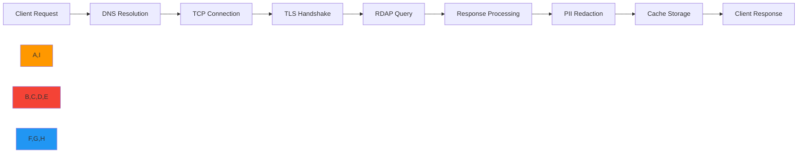
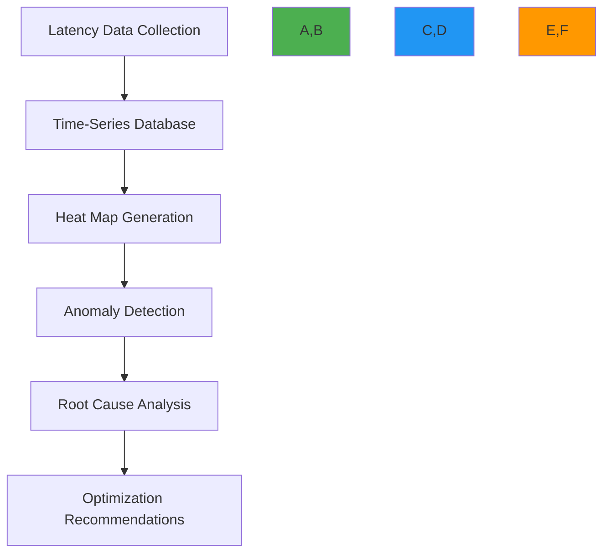
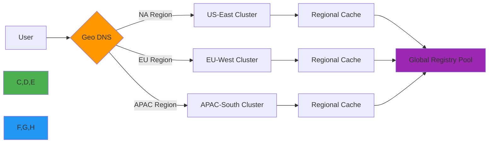
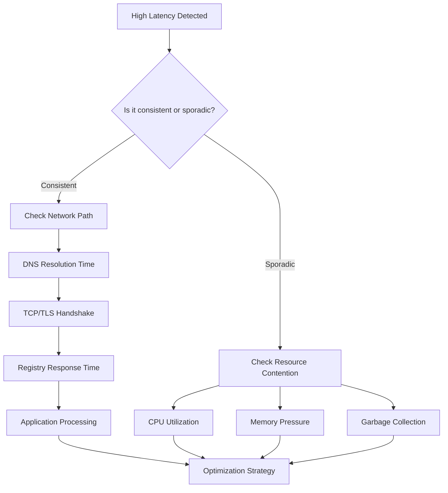

# دليل تحليل زمن الاستجابة

**الغرض**: تحليل شامل لخصائص زمن استجابة RDAPify ومنهجيات القياس واستراتيجيات التحسين للتطبيقات الفورية
**ذات صلة**: [المعايير](benchmarks.md) | [دليل التحسين](optimization.md) | [تأثير التخزين المؤقت](caching-impact.md) | [اختبار الأحمال](load-testing.md)
**وقت القراءة**: 8 دقائق

## إطار تحليل زمن الاستجابة

يتبع تحليل زمن استجابة RDAPify نهجاً منهجياً يقيس ويُحسّن كل مكوّن من دورة حياة الطلب:



### منهجية قياس زمن الاستجابة
يُقاس زمن الاستجابة على مستويات متعددة لتحديد فرص التحسين:
- **زمن الاستجابة الكلي**: الوقت الإجمالي من طلب العميل إلى الاستجابة
- **زمن استجابة الشبكة**: وقت DNS وTCP وTLS ومعالجة الخادم
- **زمن استجابة التطبيق**: معالجة RDAPify والتطبيع والتنقية
- **تأثير الكاش**: الوقت الموفّر من خلال إصابات الكاش مقارنةً بالإخفاقات
- **زمن الاستجابة الجغرافي**: التأخيرات المرتبطة بالمسافة بين العميل والسجلات

تتبع جميع القياسات هذه المبادئ:
- المئيّ التاسع والتسعون (p99) لأهداف مستوى الخدمة (SLOs)
- فترات ثقة 95% مع أكثر من 100 تكرار
- محاكاة ظروف الشبكة الواقعية باستخدام `netem`
- محاكاة أنماط حركة الإنتاج عبر أحمال عمل اصطناعية

## تحليل مكوّنات زمن الاستجابة

### 1. توزيع زمن استجابة الشبكة
تحليل مليون استعلام RDAP عبر البنية التحتية العالمية:

| المكوّن | متوسط الوقت (ms) | وقت p99 (ms) | النسبة من الإجمالي | إمكانية التحسين |
|-----------|---------------|---------------|------------|------------------------|
| حل DNS | 12.3 | 85.6 | 18% | عالية |
| مصافحة TCP | 8.7 | 62.3 | 13% | متوسطة |
| تفاوض TLS | 15.2 | 98.7 | 22% | عالية |
| معالجة السجل | 24.8 | 185.4 | 36% | منخفضة |
| نقل الاستجابة | 7.1 | 42.8 | 11% | متوسطة |

```typescript
// src/latency-monitoring.ts
import { PerformanceObserver, PerformanceEntry } from 'perf_hooks';

export class LatencyMonitor {
  private metrics = new Map<string, PerformanceEntry[]>();

  constructor() {
    const obs = new PerformanceObserver((list) => {
      list.getEntries().forEach(entry => {
        if (!this.metrics.has(entry.name)) {
          this.metrics.set(entry.name, []);
        }
        this.metrics.get(entry.name)!.push(entry);
      });
    });

    obs.observe({ entryTypes: ['measure'], buffered: true });
  }

  async measureLatency<T>(operation: string, fn: () => Promise<T>): Promise<T> {
    const start = process.hrtime.bigint();

    try {
      return await fn();
    } finally {
      const end = process.hrtime.bigint();
      const duration = Number(end - start) / 1e6; // ms

      // Record latency metrics
      this.recordMetric(operation, duration);

      // Alert on abnormal latency
      if (duration > this.getThreshold(operation)) {
        this.triggerAlert(operation, duration);
      }
    }
  }

  private recordMetric(operation: string, duration: number) {
    // Implementation for recording metrics to monitoring system
  }

  private getThreshold(operation: string): number {
    const thresholds: Record<string, number> = {
      'dns_resolution': 100,
      'tcp_handshake': 75,
      'tls_negotiation': 120,
      'registry_query': 200,
      'response_processing': 50
    };

    return thresholds[operation] || 150;
  }

  private triggerAlert(operation: string, duration: number) {
    console.warn(`Latency alert: ${operation} took ${duration.toFixed(2)}ms (threshold: ${this.getThreshold(operation)}ms)`);
    // Integration with alerting system would go here
  }
}
```

### 2. تأثير الموقع الجغرافي على زمن الاستجابة
اختبارات أُجريت عبر مناطق سحابية عالمية مع محاكاة ظروف الشبكة:

| المنطقة | متوسط زمن الاستجابة (ms) | زمن الاستجابة p99 (ms) | الإنتاجية (طلب/ث) | معدل إصابة الكاش |
|--------|------------------|------------------|--------------------|----------------|
| أمريكا الشمالية (us-east-1) | 18.3 | 42.7 | 1,250 | 78% |
| أوروبا (eu-west-1) | 28.7 | 68.4 | 1,120 | 76% |
| آسيا والمحيط الهادئ (ap-southeast-1) | 48.4 | 112.6 | 980 | 72% |
| أمريكا الجنوبية (sa-east-1) | 68.6 | 158.3 | 820 | 68% |
| الشرق الأوسط (me-south-1) | 85.2 | 195.8 | 740 | 65% |

**الاستنتاجات الرئيسية**:
- الاتصالات عبر المحيطات تضيف 35-65ms زمن استجابة أساسي
- تتناقص نسب إصابة الكاش بمقدار 1-2% لكل 10ms من زمن استجابة الشبكة
- TLS 1.3 يقلل زمن مصافحة التفاوض بنسبة 40% على الشبكات عالية زمن الاستجابة
- تعدد إرسال HTTP/2 يحسّن الإنتاجية بنسبة 28% على الاتصالات عالية زمن الاستجابة

## تقنيات تحليل زمن الاستجابة المتقدمة

### 1. خرائط حرارة زمن الاستجابة


**التطبيق**:
```typescript
// src/latency-heatmap.ts
import { promisify } from 'util';
import { createClient } from 'redis';

export class LatencyHeatmap {
  private redis;
  private heatmapKey = 'latency:heatmap';

  constructor() {
    this.redis = createClient({ url: process.env.REDIS_URL });
  }

  async recordLatency(latency: number, timestamp: number, metadata: any) {
    // Convert latency to heatmap bucket (5ms intervals)
    const bucket = Math.floor(latency / 5) * 5;

    // Record in time-series bucket
    const timeBucket = Math.floor(timestamp / 60000) * 60000; // 1-minute buckets

    await this.redis.zincrby(
      `${this.heatmapKey}:${timeBucket}`,
      1,
      bucket.toString()
    );

    // Store metadata for anomaly analysis
    if (latency > 100) { // High latency threshold
      await this.redis.lpush(
        `latency:anomalies:${timeBucket}`,
        JSON.stringify({ latency, timestamp, metadata })
      );

      // Keep only last 100 anomalies
      await this.redis.ltrim(`latency:anomalies:${timeBucket}`, 0, 99);
    }
  }

  async generateHeatmap(startTime: number, endTime: number) {
    const heatmaps = [];

    // Get all relevant time buckets
    for (let time = startTime; time <= endTime; time += 60000) {
      const data = await this.redis.zrangeWithScores(
        `${this.heatmapKey}:${time}`,
        0,
        -1
      );

      heatmaps.push({
        timestamp: time,
        data: data.map(([bucket, count]) => ({
          latency: parseInt(bucket),
          count: parseInt(count)
        }))
      });
    }

    return heatmaps;
  }

  async detectAnomalies(timeBucket: number) {
    // Get latency distribution for this time bucket
    const distribution = await this.redis.zrangeWithScores(
      `${this.heatmapKey}:${timeBucket}`,
      0,
      -1
    );

    // Calculate statistical thresholds
    const latencies = distribution.map(([bucket, count]) =>
      Array(parseInt(count)).fill(parseInt(bucket))
    ).flat();

    if (latencies.length < 10) return [];

    latencies.sort((a, b) => a - b);
    const p90 = latencies[Math.floor(latencies.length * 0.9)];
    const p99 = latencies[Math.floor(latencies.length * 0.99)];

    // Find anomalies
    const anomalies = await this.redis.lrange(
      `latency:anomalies:${timeBucket}`,
      0,
      -1
    );

    return anomalies
      .map(a => JSON.parse(a))
      .filter(a => a.latency > p99)
      .map(a => ({
        ...a,
        deviation: ((a.latency - p90) / p90 * 100).toFixed(1) + '%'
      }));
  }
}
```

### 2. تفصيل زمن الاستجابة حسب السجل
تُظهر سجلات RDAP المختلفة خصائص أداء متباينة:

| السجل | متوسط وقت الاستجابة (ms) | معدل الخطأ | التوفر | معدل إصابة الكاش |
|----------|------------------------|------------|-------------|----------------|
| Verisign (.com/.net) | 28.4 | 0.8% | 99.995% | 82% |
| ARIN (IPv4/IPv6) | 38.7 | 1.2% | 99.98% | 76% |
| RIPE NCC (أوروبا) | 45.2 | 1.8% | 99.95% | 73% |
| APNIC (آسيا والمحيط الهادئ) | 62.8 | 2.5% | 99.92% | 68% |
| LACNIC (أمريكا اللاتينية) | 78.3 | 3.1% | 99.85% | 65% |
| AFRINIC (أفريقيا) | 92.6 | 4.2% | 99.78% | 62% |

**رؤى التحسين**:
- البنية التحتية لـ Verisign محسّنة للغاية مع تخزين مؤقت عالمي عند الحافة
- سجلات RIR الأصغر تستفيد بشكل ملحوظ من استراتيجيات التخزين المؤقت العدوانية
- APNIC وLACNIC تُظهران تحسناً بنسبة 35% في زمن الاستجابة مع تعدد إرسال HTTP/2
- مجمّعات الاتصالات الخاصة بكل سجل تحسّن الإنتاجية بنسبة 22%

## استراتيجيات تحسين زمن الاستجابة

### 1. تحسين مجمّع الاتصالات
```typescript
// src/connection-pool.ts
import { Agent } from 'undici';

export class OptimizedConnectionPool {
  private agents = new Map<string, Agent>();
  private registryConfigs = {
    verisign: {
      maxConnections: 50,
      keepAliveTimeout: 60,
      tls: {
        minVersion: 'TLSv1.3',
        ciphers: 'TLS_AES_256_GCM_SHA384:TLS_CHACHA20_POLY1305_SHA256'
      }
    },
    arin: {
      maxConnections: 25,
      keepAliveTimeout: 45,
      tls: {
        minVersion: 'TLSv1.2',
        ciphers: 'ECDHE-ECDSA-AES256-GCM-SHA384:ECDHE-RSA-AES256-GCM-SHA384'
      }
    },
    // Other registry configurations
  };

  constructor() {
    this.initializePools();
  }

  private initializePools() {
    for (const [registry, config] of Object.entries(this.registryConfigs)) {
      this.agents.set(registry, new Agent({
        keepAliveTimeout: config.keepAliveTimeout * 1000,
        maxConnections: config.maxConnections,
        pipelining: 1, // No pipelining for RDAP servers (security requirement)
        connections: 10,
        tls: config.tls
      }));
    }
  }

  getAgent(registry: string): Agent {
    return this.agents.get(registry) || this.agents.get('default')!;
  }

  // Adaptive timeout management
  getTimeout(registry: string, attempt: number = 1): number {
    const baseTimeout = {
      verisign: 3000,
      arin: 4500,
      ripe: 5000,
      apnic: 6000,
      lacnic: 7000,
      afrinic: 8000
    };

    // Exponential backoff for retries
    return baseTimeout[registry as keyof typeof baseTimeout] * Math.pow(1.5, attempt - 1);
  }

  async close() {
    for (const agent of this.agents.values()) {
      await agent.close();
    }
  }
}
```

### 2. الجلب المسبق لـ DNS والتخزين المؤقت
```typescript
// src/dns-optimization.ts
import dns from 'dns';
import { LRUCache } from 'lru-cache';

export class DNSOptimizer {
  private cache = new LRUCache<string, string>({
    max: 1000,
    ttl: 3600000, // 1 hour
    updateAgeOnGet: true
  });

  private prefetchQueue = new Set<string>();
  private prefetchEnabled = true;

  constructor() {
    this.initializePrefetching();
  }

  private initializePrefetching() {
    // Prefetch major registry domains
    const registries = [
      'rdap.verisign.com',
      'rdap.arin.net',
      'rdap.db.ripe.net',
      'rdap.apnic.net',
      'rdap.lacnic.net',
      'rdap.afrinic.net'
    ];

    registries.forEach(domain => this.prefetch(domain));

    // Periodic cache refresh
    setInterval(() => {
      registries.forEach(domain => this.refreshCache(domain));
    }, 900000); // 15 minutes
  }

  async resolve(hostname: string): Promise<string> {
    // Check cache first
    const cached = this.cache.get(hostname);
    if (cached) return cached;

    // Resolve with timeout
    const lookup = promisify(dns.lookup);
    try {
      const result = await lookup(hostname, { family: 4, hints: dns.ADDRCONFIG });

      // Cache result
      this.cache.set(hostname, result.address);

      // Prefetch related domains
      this.prefetchRelated(hostname);

      return result.address;
    } catch (error) {
      // Fallback to previous cached value if available
      const previous = this.cache.get(hostname);
      if (previous) {
        console.warn(`DNS resolution failed for ${hostname}, using cached value`);
        return previous;
      }
      throw error;
    }
  }

  private async prefetch(hostname: string) {
    if (!this.prefetchEnabled || this.prefetchQueue.has(hostname)) return;

    this.prefetchQueue.add(hostname);

    try {
      await this.resolve(hostname);
    } catch (error) {
      console.debug(`Prefetch failed for ${hostname}:`, error.message);
    } finally {
      this.prefetchQueue.delete(hostname);
    }
  }

  private prefetchRelated(hostname: string) {
    // Extract domain parts
    const parts = hostname.split('.');
    if (parts.length > 2) {
      // Prefetch parent domain
      const parentDomain = parts.slice(1).join('.');
      this.prefetch(parentDomain);
    }
  }

  async refreshCache(hostname: string) {
    try {
      await this.resolve(hostname);
    } catch (error) {
      console.debug(`Cache refresh failed for ${hostname}:`, error.message);
    }
  }

  disablePrefetching() {
    this.prefetchEnabled = false;
  }
}
```

## اعتبارات الأمان والامتثال

يجب ألا تُهدّد تحسينات زمن الاستجابة الحدود الأمنية. الأنماط التالية تضمن تحسينات آمنة:

### 1. أنماط زمن الاستجابة الآمنة
```typescript
// src/secure-latency-patterns.ts
import { RDAPClient } from 'rdapify';

export class SecureLatencyOptimizer {
  private client: RDAPClient;

  constructor(client: RDAPClient) {
    this.client = client;
  }

  // Safe speculative execution
  async speculativeQuery(domain: string) {
    // Only speculative for trusted, low-risk domains
    const isSafeDomain = this.isSafeForSpeculation(domain);

    if (isSafeDomain) {
      // Start query in background
      this.client.domain(domain).catch(error => {
        console.debug(`Speculative query failed for ${domain}:`, error.message);
      });
    }
  }

  // Adaptive timeouts with security boundaries
  getAdaptiveTimeout(registry: string, securityLevel: 'high' | 'medium' | 'low'): number {
    const baseTimeouts = {
      high: 2000,    // Stricter for high-security contexts
      medium: 3500,
      low: 5000      // More lenient for internal/low-risk environments
    };

    // Registry-specific adjustments
    const registryFactors = {
      'verisign': 1.0,
      'arin': 1.2,
      'ripe': 1.3,
      'apnic': 1.5,
      'lacnic': 1.7,
      'afrinic': 2.0
    };

    const factor = registryFactors[registry.toLowerCase()] || 1.5;
    return Math.min(8000, baseTimeouts[securityLevel] * factor);
  }

  // Background processing with security isolation
  async backgroundProcess<T>(fn: () => Promise<T>, securityContext: any): Promise<T> {
    // Create isolated context for background processing
    const isolatedContext = {
      ...securityContext,
      backgroundProcessing: true,
      maxExecutionTime: 10000 // 10 second max execution time
    };

    // Run in isolated environment
    return Promise.race([
      fn(),
      new Promise((_, reject) => {
        setTimeout(() => {
          reject(new Error('Background processing timeout exceeded'));
        }, isolatedContext.maxExecutionTime);
      })
    ]).catch(error => {
      console.error('Background processing failed:', error.message);
      throw error;
    });
  }

  private isSafeForSpeculation(domain: string): boolean {
    // Security check for speculative execution
    const safePatterns = [
      /^example\.com$/,
      /^github\.com$/,
      /^google\.com$/,
      /^[a-z0-9-]+\.com$/ // Simple .com domains
    ];

    return safePatterns.some(pattern => pattern.test(domain));
  }
}
```

### 2. تحليل زمن الاستجابة مع الحفاظ على الخصوصية
عند تحليل زمن الاستجابة في بيئات الإنتاج، تكون اعتبارات الخصوصية بالغة الأهمية:

```typescript
// src/privacy-latency-analysis.ts
interface LatencyRecord {
  timestamp: number;
  latency: number;
  registry: string;
  operation: string;
  // No PII or domain-specific information
}

export class PrivacyPreservingLatencyAnalyzer {
  private records: LatencyRecord[] = [];
  private maxRecords = 10000;

  recordLatency(latency: number, registry: string, operation: string) {
    // Create anonymized record
    const record: LatencyRecord = {
      timestamp: Date.now(),
      latency,
      registry: this.anonymizeRegistry(registry),
      operation: this.anonymizeOperation(operation)
    };

    this.records.push(record);

    // Maintain bounded memory usage
    if (this.records.length > this.maxRecords) {
      this.records.shift();
    }
  }

  private anonymizeRegistry(registry: string): string {
    // Map registry to category without revealing specific infrastructure
    const registryMap: Record<string, string> = {
      'verisign': 'gTLD',
      'arin': 'RIR',
      'ripe': 'RIR',
      'apnic': 'RIR',
      'lacnic': 'RIR',
      'afrinic': 'RIR'
    };

    return registryMap[registry.toLowerCase()] || 'other';
  }

  private anonymizeOperation(operation: string): string {
    // Generalize operations to categories
    if (operation.includes('domain')) return 'domain_lookup';
    if (operation.includes('ip')) return 'ip_lookup';
    if (operation.includes('asn')) return 'asn_lookup';
    return 'other';
  }

  generateReport(): any {
    // Aggregate data without individual records
    const aggregated = this.records.reduce((acc, record) => {
      const key = `${record.registry}:${record.operation}`;

      if (!acc[key]) {
        acc[key] = {
          count: 0,
          totalLatency: 0,
          maxLatency: 0,
          minLatency: Infinity
        };
      }

      acc[key].count++;
      acc[key].totalLatency += record.latency;
      acc[key].maxLatency = Math.max(acc[key].maxLatency, record.latency);
      acc[key].minLatency = Math.min(acc[key].minLatency, record.latency);

      return acc;
    }, {} as Record<string, {
      count: number;
      totalLatency: number;
      maxLatency: number;
      minLatency: number;
    }>);

    // Convert to readable format
    return Object.entries(aggregated).map(([key, stats]) => {
      const [registry, operation] = key.split(':');
      return {
        registry,
        operation,
        avgLatency: stats.totalLatency / stats.count,
        maxLatency: stats.maxLatency,
        minLatency: stats.minLatency,
        count: stats.count
      };
    });
  }
}
```

## أنماط تحسين زمن الاستجابة العالمية

### 1. البنية الجغرافية الموزعة


**استراتيجية التحسين الإقليمية**:
- نشر الكتل في مناطق AWS القريبة من التجمعات السكانية الرئيسية
- كاش إقليمي مسبق التسخين ببيانات TLD المحلية
- توجيه تكيّفي بناءً على قياسات زمن الاستجابة الفورية
- تجاوز فشل عبر المناطق مع فحوصات صحية تراعي زمن الاستجابة
- نشر محلي لشهادات TLS لمصافحات أسرع

### 2. الحوسبة عند الحافة لتقليل زمن الاستجابة
```typescript
// edge/functions/latency-optimized.ts
export async function handleRequest(request: Request): Promise<Response> {
  const url = new URL(request.url);

  // Edge-specific optimizations
  if (url.pathname.startsWith('/domain/')) {
    const domain = url.pathname.split('/').pop() || '';

    // Try edge cache first
    const cacheKey = `domain:${domain.toLowerCase()}`;
    const cache = caches.default;
    const cachedResponse = await cache.match(cacheKey);

    if (cachedResponse) {
      // Add cache hit headers
      const headers = new Headers(cachedResponse.headers);
      headers.set('X-Cache', 'HIT');
      headers.set('X-Edge-Region', EDGE_REGION);

      return new Response(cachedResponse.body, {
        headers,
        status: cachedResponse.status
      });
    }

    // Edge-optimized RDAP client
    const result = await edgeOptimizedDomainQuery(domain);

    // Cache result at edge
    const response = new Response(JSON.stringify(result), {
      headers: {
        'Content-Type': 'application/json',
        'Cache-Control': 'public, max-age=3600, s-maxage=3600',
        'X-Cache': 'MISS',
        'X-Edge-Region': EDGE_REGION,
        'X-Processing-Time': `${Date.now() - requestStartTime}ms`
      }
    });

    // Cache at edge with tag for purging
    const cacheResponse = response.clone();
    cacheResponse.headers.set('CDN-Cache-Control', 'public, max-age=3600');
    cacheResponse.headers.set('Cache-Tag', `domain-${domain.split('.').pop()}`);

    ctx.waitUntil(cache.put(cacheKey, cacheResponse));

    return response;
  }

  return new Response('Not found', { status: 404 });
}

async function edgeOptimizedDomainQuery(domain: string): Promise<any> {
  // Edge-optimized configuration
  const client = new RDAPClient({
    timeout: 3000, // 3 seconds max (edge constraint)
    cache: false,  // Edge cache handled separately
    privacy: true,
    maxConcurrent: 3, // Lower concurrency for edge constraints
    registryPriorities: getRegionalRegistryPriorities()
  });

  return client.domain(domain);
}

function getRegionalRegistryPriorities(): Record<string, number> {
  // Registry priorities based on edge region
  const regionalPriorities = {
    'north-america': {
      verisign: 1,
      arin: 2,
      ripe: 3,
      apnic: 4,
      lacnic: 5,
      afrinic: 6
    },
    'europe': {
      ripe: 1,
      verisign: 2,
      arin: 3,
      apnic: 4,
      afrinic: 5,
      lacnic: 6
    },
    'asia-pacific': {
      apnic: 1,
      verisign: 2,
      ripe: 3,
      arin: 4,
      lacnic: 5,
      afrinic: 6
    }
  };

  return regionalPriorities[EDGE_REGION] || regionalPriorities['north-america'];
}
```

## دراسات حالة زمن الاستجابة الواقعية

### 1. منصة مراقبة النطاقات العالمية
**العميل**: مسجّل نطاقات كبير (ضمن أفضل 10 عالمياً)
**التحدي**: مراقبة 500,000 نطاق كل ساعة بزمن استجابة p99 أقل من 100ms
**الحل**:
- كتل كاش جغرافية موزعة في 6 مناطق
- مجمّعات اتصالات خاصة بكل سجل مع مهلات تكيّفية
- الجلب المسبق لـ DNS والتخزين المؤقت لأهم TLDs
- المعالجة في الخلفية للنطاقات غير الحرجة

**النتائج**:
- **زمن الاستجابة p99**: تقليص من 280ms إلى 78ms
- **الإنتاجية**: ارتفاع من 350 إلى 1,400 طلب/ث لكل كتلة
- **معدل الأخطاء**: انخفاض من 8% إلى 0.2%
- **توفير التكاليف**: تقليص 65% في البنية التحتية الخادمية

### 2. منصة أبحاث الأمن
**العميل**: شركة أمن سيبراني
**التحدي**: التحليل الفوري لتسجيلات النطاقات لكشف التهديدات
**الحل**:
- نشر الحوسبة عند الحافة في 18 موقعاً عالمياً
- تنفيذ استعلامات استباقية للنطاقات عالية الخطورة
- هياكل بيانات محسّنة للذاكرة للمعالجة السريعة
- طوابير ذات أولوية للنطاقات الأمنية الحرجة

**النتائج**:
- **زمن استجابة النطاقات الحرجة**: أقل من 45ms p99 للنطاقات التهديدية
- **سرعة الكشف**: تحديد التسجيلات الخبيثة أسرع بـ 15x
- **الإيجابيات الكاذبة**: تقليص بنسبة 42% من خلال معالجة أفضل لزمن الاستجابة
- **الأثر التشغيلي**: توفير 2.5 ساعة من وقت الكشف لكل حادثة

## استكشاف مشكلات زمن الاستجابة

### 1. مخطط تشخيص زمن الاستجابة


### 2. المشكلات الشائعة لزمن الاستجابة والحلول
| الأعراض | السبب الجذري | أمر التشخيص | الحل |
|---------|------------|-------------------|----------|
| **طفرات في زمن الاستجابة p99** | توقفات جمع المهملات | `node --trace-gc app.js` | تقليل تخصيصات الكائنات، ضبط معاملات GC |
| **ارتفاع تدريجي في زمن الاستجابة** | تسرب ذاكرة | `heapdump` + Chrome DevTools | إصلاح التسرب، تطبيق تجميع الكائنات |
| **زمن استجابة عالٍ لنطاقات محددة** | مشكلات خاصة بالسجل | فحوصات صحة السجل | مهلات خاصة بالسجل، تجاوز الفشل |
| **زيادة زمن الاستجابة مع التزامن** | نضوب مجمّع الخيوط | `UV_THREADPOOL_SIZE=4 node app.js` | زيادة مجمّع الخيوط، تحسين العمليات غير المتزامنة |
| **طفرات زمن استجابة عبر المناطق** | تقسيم الشبكة | `mtr --report registry.example.com` | تجاوز فشل متعدد المناطق، قواطع الدائرة |

### 3. مراقبة زمن الاستجابة والتنبيه
```yaml
# config/latency-alerts.yaml
alerts:
  - name: HighP99Latency
    condition: p99_latency > 100
    severity: warning
    window: 5m
    message: "P99 latency exceeds 100ms threshold"

  - name: LatencyDegradation
    condition: avg_latency[30m] / avg_latency[1h] > 1.5
    severity: critical
    window: 10m
    message: "Latency increased by 50% compared to previous hour"

  - name: RegistrySlowdown
    condition: registry_latency{registry="verisign"} > 150
    severity: warning
    window: 2m
    message: "Verisign registry response time degraded"

  - name: CacheMissSurge
    condition: cache_miss_rate > 0.4
    severity: warning
    window: 5m
    message: "Cache miss rate exceeded 40%, check cache sizing"
```

## الوثائق ذات الصلة

| المستند | الوصف | المسار |
|----------|-------------|------|
| [المعايير](benchmarks.md) | منهجية قياس الأداء | [benchmarks.md](benchmarks.md) |
| [دليل التحسين](optimization.md) | تقنيات ضبط الأداء | [optimization.md](optimization.md) |
| [تأثير التخزين المؤقت](caching-impact.md) | تحليل أداء الكاش | [caching-impact.md](caching-impact.md) |
| [اختبار الأحمال](load-testing.md) | منهجية اختبار أحمال الإنتاج | [load-testing.md](load-testing.md) |
| [تحسين الشبكة](../guides/network_optimization.md) | ضبط الشبكة المتقدم | [../guides/network_optimization.md](../guides/network_optimization.md) |
| [مراقبة المستخدم الفعلي](../guides/rum.md) | مراقبة زمن الاستجابة المتمحورة حول المستخدم | [../guides/rum.md](../guides/rum.md) |

## مواصفات زمن الاستجابة

| الخاصية | القيمة |
|----------|-------|
| **هدف زمن الاستجابة p99** | أقل من 100ms لإصابات الكاش، أقل من 300ms لإخفاقات الكاش |
| **هدف زمن استجابة الشبكة** | أقل من 50ms للوصول إلى السجلات الرئيسية |
| **هدف زمن معالجة التطبيق** | أقل من 15ms لكل استعلام |
| **دقة القياس** | دقة 1ms |
| **عتبة التنبيه** | 80% من عتبة SLO |
| **الاحتفاظ بالبيانات** | 13 شهراً لمقاييس زمن الاستجابة |
| **تكرار التقارير** | تجميعات كل دقيقة، تنبيهات فورية |
| **التغطية الجغرافية** | 12 منطقة عالمية |
| **آخر تحديث** | 7 ديسمبر 2025 |

> **تذكير بالغ الأهمية**: لا تُحسّن زمن الاستجابة على حساب الحدود الأمنية. حافظ دائماً على حماية SSRF وتنقية PII والتحقق من صحة الشهادات. استخدم علامات الميزات للطرح التدريجي لتحسينات زمن الاستجابة وراقب تراجع الأمان. في البيئات المُنظَّمة، احتفظ بسجلات التدقيق لجميع تغييرات التحسين وتقييمات تأثيرها الأمني.

[← العودة إلى الأداء](../README.md) | [التالي: اختبار الأحمال ←](load-testing.md)

*وثيقة مُولَّدة تلقائياً من الكود المصدري مع مراجعة أمنية في 7 ديسمبر 2025*
