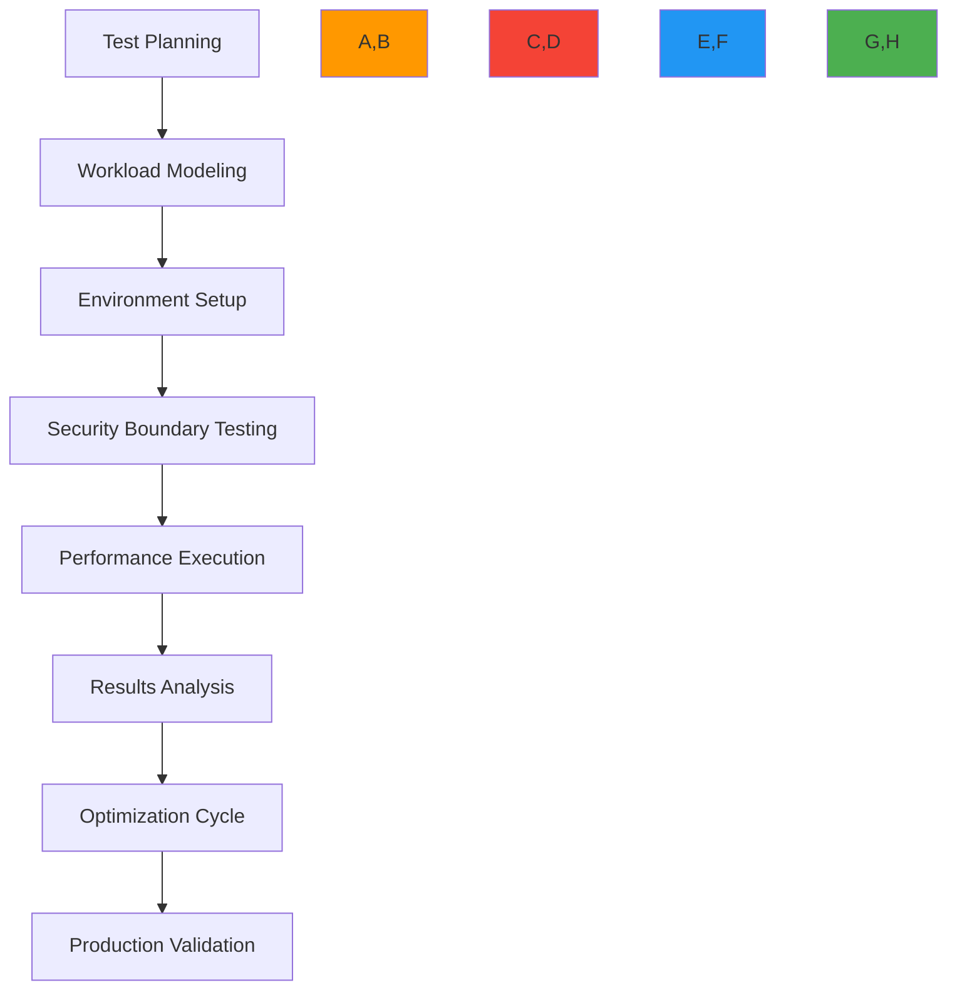
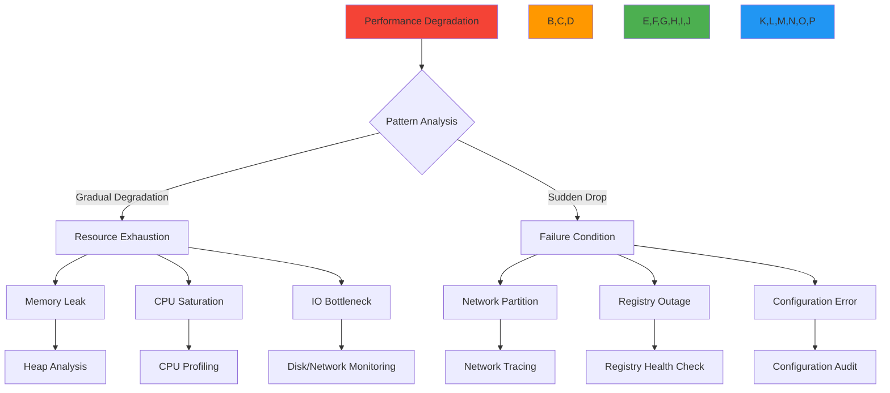

# دليل اختبار الأحمال

**الغرض**: دليل شامل لاختبار أحمال نشر RDAPify للتحقق من الأداء في ظروف الإنتاج الواقعية مع الحفاظ على الحدود الأمنية ومتطلبات الامتثال
**ذات صلة**: [المعايير](benchmarks.md) | [دليل التحسين](optimization.md) | [تحليل زمن الاستجابة](latency-analysis.md) | [تأثير التخزين المؤقت](caching-impact.md)
**وقت القراءة**: 9 دقائق

## إطار منهجية اختبار الأحمال

يتبع اختبار أحمال RDAPify نهجاً منظماً يتحقق من الأداء في ظروف واقعية مع الحفاظ على الحدود الأمنية:



### مبادئ الاختبار
- **أحمال عمل واقعية**: محاكاة أنماط سلوك المستخدم الفعلية، وليس الإنتاجية القصوى فقط
- **الحدود الأمنية**: اختبار حماية SSRF وتنقية PII تحت الأحمال
- **الامتثال التنظيمي**: التحقق من الأداء مع تفعيل ضوابط الامتثال
- **التوسع التدريجي**: الزيادة التدريجية للحمل لتحديد نقاط الانهيار
- **اختبار أوضاع الفشل**: استحداث أحوال الفشل عمداً للتحقق من الاسترداد
- **تكامل قابلية الرصد**: ربط مقاييس الأداء بتلقائيات النظام

## أدوات الاختبار والبنية التحتية

### 1. حزمة اختبار الأحمال الموصى بها
| الأداة | الغرض | مثال على الإعداد |
|------|---------|-----------------------|
| **k6** | اختبار الأحمال الأساسي | تنفيذ سحابي مع أكثر من 1000 VU |
| **Artillery** | التحقق من صحة API تحت الأحمال | مشغّلو اختبارات موزعون |
| **Gatling** | اختبار الحجم الكبير | نشر كتلة Kubernetes |
| **wrk2** | معايير HTTP منخفضة المستوى | اختبار الخادم المعدني |
| **Autocannon** | اختبار خاص بـ Node.js | تنفيذ في حاويات |

```yaml
# config/load-testing-stack.yml
primary_tool: k6
secondary_tools:
  - artillery
  - wrk2

execution_environments:
  local:
    max_vus: 50
    duration: 5m
  cloud:
    max_vus: 10000
    duration: 1h
    regions: [us-east-1, eu-west-1, ap-southeast-1]
  distributed:
    node_count: 24
    max_vus: 50000
    coordination: locust

monitoring:
  apm: datadog
  metrics: prometheus
  tracing: jaeger
  logging: loki
  alerting: pagerduty
```

### 2. تحديد حجم بيئة الاختبار
لاختبارات دقيقة، يجب أن تعكس البيئات الإنتاج:

| حجم الإنتاج | بيئة الاختبار | متطلبات الموارد | نطاق التحقق |
|-----------------|------------------|------------------------|------------------|
| صغير (1-10 QPS) | Docker محلي | 2 vCPU، 4GB RAM | الوظيفية الأساسية |
| متوسط (10-100 QPS) | نسخة سحابية | 8 vCPU، 32GB RAM | خصائص الأداء |
| كبير (100-1000 QPS) | كتلة Kubernetes | 32 vCPU، 128GB RAM | سلوك التوسع |
| مؤسسي (1000+ QPS) | إعداد متعدد المناطق | 128+ vCPU، 512GB+ RAM | التوزيع العالمي |

```bash
# Environment setup script
#!/bin/bash
set -e

# Determine test scale based on target throughput
TARGET_QPS=${1:-100}
ENVIRONMENT=""

if [ "$TARGET_QPS" -le 10 ]; then
  ENVIRONMENT="local"
elif [ "$TARGET_QPS" -le 100 ]; then
  ENVIRONMENT="single-cloud"
elif [ "$TARGET_QPS" -le 1000 ]; then
  ENVIRONMENT="kubernetes-cluster"
else
  ENVIRONMENT="multi-region"
fi

echo "Setting up $ENVIRONMENT environment for $TARGET_QPS QPS target"

case $ENVIRONMENT in
  "local")
    docker-compose -f docker-compose.loadtest.yml up -d --scale rdapify=2
    ;;
  "single-cloud")
    terraform apply -var="instance_type=m5.2xlarge" -var="node_count=4"
    ;;
  "kubernetes-cluster")
    kubectl apply -f k8s/load-test-cluster.yaml
    ;;
  "multi-region")
    terragrunt apply-all --terragrunt-working-dir multi-region
    ;;
esac

echo "Environment setup complete"
echo "Run validation tests before proceeding"
```

## سيناريوهات الاختبار الواقعية

### 1. أنماط أحمال العمل القياسية
```typescript
// test/workload-patterns.js
import { check, sleep } from 'k6';
import http from 'k6/http';

export const options = {
  stages: [
    { duration: '1m', target: 50 },    // Warm-up
    { duration: '5m', target: 500 },   // Baseline
    { duration: '2m', target: 1000 },  // Spike
    { duration: '2m', target: 2000 },  // Peak
    { duration: '5m', target: 500 },   // Recovery
    { duration: '1m', target: 0 }      // Cooldown
  ],
  thresholds: {
    'http_req_duration': ['p(95)<500', 'p(99)<1200'],
    'http_req_failed': ['rate<0.01'],
    'checks': ['rate>0.99']
  }
};

const registryEndpoints = [
  'https://rdap.verisign.com/com/v1/domain/',
  'https://rdap.arin.net/registry/ip/',
  'https://rdap.db.ripe.net/entity/'
];

export default function() {
  // Random domain selection for realism
  const domains = ['example.com', 'google.com', 'microsoft.com', 'facebook.com', 'amazon.com'];
  const domain = domains[Math.floor(Math.random() * domains.length)];

  // Random endpoint selection
  const endpoint = registryEndpoints[Math.floor(Math.random() * registryEndpoints.length)];

  // Mixed query types
  const queryType = Math.random() > 0.7 ? 'ip' : 'domain';
  const query = queryType === 'domain' ? domain : '8.8.8.8';

  const params = {
    headers: {
      'User-Agent': 'RDAPify-LoadTest/1.0',
      'Accept': 'application/rdap+json'
    },
    tags: { queryType, endpoint }
  };

  const res = http.get(`${endpoint}${query}`, params);

  // Validate response structure
  check(res, {
    'status is 200': (r) => r.status === 200,
    'response has domain field': (r) => {
      try {
        const body = JSON.parse(r.body);
        return body.domain && typeof body.domain === 'string';
      } catch (e) {
        return false;
      }
    },
    'PII redaction enforced': (r) => {
      try {
        const body = JSON.parse(r.body);
        return !body.entities?.some(e => e.vcardArray || e.email || e.tel);
      } catch (e) {
        return true; // Skip validation on parse errors
      }
    }
  });

  // Realistic think time between requests
  sleep(1 + Math.random() * 2);
}
```

### 2. اختبار الحدود الأمنية
```typescript
// test/security-boundary.js
import { check } from 'k6/http';
import { fail } from 'k6';

export const options = {
  vus: 50,
  duration: '10m',
  thresholds: {
    'http_req_duration': ['p(99)<1000'],
    'http_req_failed': ['rate<0.01'],
    'security_checks_passed': ['rate==1.0']
  }
};

export default function() {
  // SSRF attack pattern testing
  const maliciousQueries = [
    'localhost',
    '127.0.0.1',
    '192.168.1.1',
    '10.0.0.1',
    '172.16.0.1',
    'file:///etc/passwd',
    'http://internal.registry.local'
  ];

  const endpoint = 'https://your-rdapify-instance.com/domain/';

  maliciousQueries.forEach(maliciousQuery => {
    const res = http.get(`${endpoint}${maliciousQuery}`, {
      headers: { 'X-Test-Mode': 'security-validation' },
      tags: { testType: 'ssrf-protection', query: maliciousQuery }
    });

    // Security checks - should block or redact responses
    check(res, {
      'SSRF blocked or safe response': (r) => {
        // Should block with error or return safe, redacted response
        return r.status === 403 ||
               (r.status === 200 && !containsInternalData(r.body));
      }
    }) || fail(`SSRF protection failed for ${maliciousQuery}`);
  });

  // PII redaction under load testing
  const sensitiveDomains = ['sensitive-domain.com', 'private-data.net'];
  sensitiveDomains.forEach(domain => {
    const res = http.get(`${endpoint}${domain}`, {
      headers: { 'X-Force-PII': 'true' }, // Force inclusion of PII test data
      tags: { testType: 'pii-redaction', domain }
    });

    check(res, {
      'PII redacted under load': (r) => {
        try {
          const body = JSON.parse(r.body);
          return !containsPIIData(body);
        } catch (e) {
          return true; // Skip validation on parse errors
        }
      }
    }) || fail(`PII redaction failed for ${domain} under load`);
  });
});

function containsInternalData(body) {
  try {
    const data = JSON.parse(body);
    // Check for indicators of internal network exposure
    return JSON.stringify(data).match(/(192\.168|10\.|172\.1[6-9]|172\.2[0-9]|172\.3[0-1]|127\.0\.0)/);
  } catch (e) {
    return false;
  }
}

function containsPIIData(data) {
  // Check for PII fields that should be redacted
  const piiFields = ['vcardArray', 'email', 'tel', 'adr', 'remarks'];
  return piiFields.some(field => JSON.stringify(data).includes(field));
}
```

## مقاييس الأداء ومؤشرات الأداء الرئيسية

### 1. مؤشرات الأداء الرئيسية
| فئة KPI | المقياس | الهدف | العتبة الحرجة | تكرار المراقبة |
|--------------|--------|--------|-------------------|---------------------|
| **الإنتاجية** | الاستعلامات في الثانية (QPS) | أكثر من 500 | أقل من 100 | فوري |
| **زمن الاستجابة** | وقت استجابة p95 | أقل من 200ms | أكثر من 500ms | فوري |
| **زمن الاستجابة** | وقت استجابة p99 | أقل من 500ms | أكثر من 1200ms | فوري |
| **الأخطاء** | معدل الأخطاء | أقل من 0.5% | أكثر من 2% | فوري |
| **استخدام الموارد** | استخدام المعالج | أقل من 70% | أكثر من 90% | كل دقيقة |
| **استخدام الموارد** | استخدام الذاكرة | أقل من 80% | أكثر من 95% | كل دقيقة |
| **كفاءة الكاش** | معدل إصابة الكاش | أكثر من 75% | أقل من 50% | كل 5 دقائق |
| **تأثير السجل** | أخطاء حدود المعدل | 0 | أكثر من 0 | فوري |

### 2. تحليل نتائج اختبار الأحمال
```typescript
// src/result-analysis.ts
import { parse } from 'json2csv';
import { writeFileSync } from 'fs';

export class LoadTestAnalyzer {
  constructor(private results: any[]) {}

  generateExecutiveSummary() {
    const summary = {
      testDuration: this.calculateDuration(),
      peakQPS: this.calculatePeakQPS(),
      avgLatency: this.calculateAvgLatency(),
      p95Latency: this.calculatePercentileLatency(95),
      p99Latency: this.calculatePercentileLatency(99),
      errorRate: this.calculateErrorRate(),
      resourceUtilization: this.calculateResourceUtilization()
    };

    return summary;
  }

  identifyBottlenecks() {
    const bottlenecks = [];

    // Check latency degradation under load
    if (this.latencyDegradesUnderLoad()) {
      bottlenecks.push({
        component: 'Application Processing',
        severity: 'high',
        recommendation: 'Optimize CPU-intensive operations or scale horizontally'
      });
    }

    // Check error rate patterns
    if (this.errorRateSpikesAtHighLoad()) {
      bottlenecks.push({
        component: 'Registry Rate Limiting',
        severity: 'critical',
        recommendation: 'Implement adaptive backoff and circuit breakers'
      });
    }

    // Check cache efficiency
    if (this.cacheHitRateDropsUnderLoad()) {
      bottlenecks.push({
        component: 'Cache Layer',
        severity: 'medium',
        recommendation: 'Increase cache size or implement multi-level caching'
      });
    }

    return bottlenecks;
  }

  generateComplianceReport() {
    // Validate security and compliance under load
    const complianceChecks = {
      ssrfProtectionMaintained: this.verifySSRFProtection(),
      piiRedactionConsistent: this.verifyPIIRedaction(),
      dataRetentionCompliant: this.verifyDataRetention(),
      auditLogCompleteness: this.verifyAuditLogs()
    };

    return complianceChecks;
  }

  exportCSVReport(filename: string) {
    const csv = parse(this.results.map(result => ({
      timestamp: result.timestamp,
      qps: result.qps,
      latencyP95: result.latency.p95,
      latencyP99: result.latency.p99,
      errorRate: result.errors.rate,
      cpuUsage: result.resources.cpu,
      memoryUsage: result.resources.memory,
      cacheHitRate: result.cache.hitRate
    })));

    writeFileSync(filename, csv);
  }

  // Implementation of analysis methods
  private calculateDuration() { /* implementation */ }
  private calculatePeakQPS() { /* implementation */ }
  private calculateAvgLatency() { /* implementation */ }
  private calculatePercentileLatency(percentile: number) { /* implementation */ }
  private calculateErrorRate() { /* implementation */ }
  private calculateResourceUtilization() { /* implementation */ }
  private latencyDegradesUnderLoad() { /* implementation */ }
  private errorRateSpikesAtHighLoad() { /* implementation */ }
  private cacheHitRateDropsUnderLoad() { /* implementation */ }
  private verifySSRFProtection() { /* implementation */ }
  private verifyPIIRedaction() { /* implementation */ }
  private verifyDataRetention() { /* implementation */ }
  private verifyAuditLogs() { /* implementation */ }
}
```

## الأمان والامتثال خلال اختبار الأحمال

### 1. إطار حماية البيانات
```yaml
# config/compliance-testing.yml
data_protection:
  test_data_generation:
    strategy: synthetic
    pii_redaction: enforced
    data_retention: 24h

  audit_requirements:
    log_all_queries: true
    include_test_metadata: true
    retention_period: 90d

  regulatory_frameworks:
    gdpr:
      enabled: true
      data_minimization: enforced
      right_to_erasure_testing: enabled
    ccpa:
      enabled: true
      do_not_sell_testing: enabled
    pdpl:
      enabled: true
      consent_management_testing: enabled

security_boundaries:
  ssrf_protection:
    test_malicious_domains: true
    test_internal_networks: true
    test_protocol_hijacking: true

  rate_limiting:
    test_burst_patterns: true
    test_sustained_load: true
    test_adaptive_throttling: true

compliance_validation:
  pre_test_checklist:
    - legal_basis_verified
    - data_processing_agreement_signed
    - dpo_approval_obtained
    - security_assessment_completed
```

### 2. إرشادات الاختبار الأخلاقي
- **احترام السجلات**: لا تتجاوز أبداً حدود معدلات السجلات؛ طبّق استراتيجيات تراجع محترمة
- **تقليص البيانات**: استعلم فقط عن النطاقات الضرورية للاختبار؛ تجنب النطاقات الحساسة
- **الشفافية**: حدّد حركة مرور اختبار الأحمال بوضوح باستخدام رؤوس User-Agent مناسبة
- **تأطير زمني**: جدوّل الاختبارات عالية الحجم في أوقات انخفاض الاستخدام للسجلات
- **الإفصاح التدريجي**: ابدأ بحجم منخفض وازده تدريجياً بعد رصد التأثير
- **إيقاف طارئ**: طبّق إنهاءً تلقائياً للاختبار عند تجاوز نسبة أخطاء السجل 5%

```typescript
// src/ethical-testing.ts
export class EthicalLoadTester {
  private registryImpact = new Map<string, number>();
  private maxErrorRate = 0.05; // 5% error rate threshold

  constructor(private testConfig: any) {}

  async executeWithEthicalControls(testFunction: () => Promise<any>) {
    try {
      // Pre-test registry validation
      await this.validateRegistryHealth();

      // Execute test with monitoring
      const result = await Promise.race([
        testFunction(),
        this.monitorRegistryImpact()
      ]);

      return result;
    } catch (error) {
      console.error('Ethical test violation detected:', error.message);
      throw new Error(`Test terminated: ${error.message}`);
    } finally {
      // Post-test cleanup
      await this.resetRegistryState();
    }
  }

  private async validateRegistryHealth() {
    const registries = ['verisign', 'arin', 'ripe', 'apnic', 'lacnic'];

    for (const registry of registries) {
      const health = await this.checkRegistryHealth(registry);

      if (health.errorRate > 0.1 || health.responseTime > 2000) {
        throw new Error(`Registry ${registry} is unhealthy - aborting test`);
      }

      this.registryImpact.set(registry, 0);
    }
  }

  private async monitorRegistryImpact() {
    while (true) {
      await new Promise(resolve => setTimeout(resolve, 5000)); // Check every 5s

      for (const [registry, impact] of this.registryImpact) {
        const currentImpact = await this.measureRegistryImpact(registry);

        // Calculate error rate increase
        const errorRateIncrease = currentImpact.errorRate - (this.registryImpact.get(registry) || 0);

        if (errorRateIncrease > this.maxErrorRate) {
          throw new Error(`Registry ${registry} error rate exceeded ${this.maxErrorRate * 100}%`);
        }

        this.registryImpact.set(registry, currentImpact.errorRate);
      }
    }
  }

  private async checkRegistryHealth(registry: string) {
    // Implementation to check registry health
  }

  private async measureRegistryImpact(registry: string) {
    // Implementation to measure registry impact
  }

  private async resetRegistryState() {
    // Implementation to reset registry state
  }
}
```

## أنماط اختبار الأحمال المتقدمة

### 1. تكامل هندسة الفوضى
```typescript
// test/chaos-testing.js
import { sleep } from 'k6';
import http from 'k6/http';
import { check } from 'k6';

// Chaos testing parameters
const chaosConfig = {
  networkFailures: {
    probability: 0.1, // 10% chance of network failure
    duration: 3000,   // 3 second outage
    endpoints: ['verisign', 'arin', 'ripe']
  },
  cacheFailures: {
    probability: 0.05, // 5% chance of cache failure
    duration: 5000    // 5 second cache unavailability
  },
  registryFailures: {
    probability: 0.02, // 2% chance of registry failure
    duration: 10000   // 10 second registry downtime
  }
};

export const options = {
  scenarios: {
    chaos_testing: {
      executor: 'constant-arrival-rate',
      rate: 100, // 100 requests per second
      timeUnit: '1s',
      duration: '10m',
      preAllocatedVUs: 50,
      maxVUs: 200
    }
  },
  thresholds: {
    'http_req_duration': ['p(99)<1000'],
    'http_req_failed': ['rate<0.05'], // Allow 5% failure during chaos
    'system_availability': ['value>0.95'] // 95% availability
  }
};

export default function() {
  // Determine if chaos event should occur
  const networkChaos = Math.random() < chaosConfig.networkFailures.probability;
  const cacheChaos = Math.random() < chaosConfig.cacheFailures.probability;
  const registryChaos = Math.random() < chaosConfig.registryFailures.probability;

  const params = {
    headers: {
      'User-Agent': 'RDAPify-ChaosTest/1.0',
      'X-Chaos-Testing': 'true'
    },
    tags: {
      networkChaos: networkChaos.toString(),
      cacheChaos: cacheChaos.toString(),
      registryChaos: registryChaos.toString()
    }
  };

  try {
    // Apply chaos conditions
    if (networkChaos) {
      params.timeout = chaosConfig.networkFailures.duration;
    }

    if (cacheChaos) {
      params.headers['X-Bypass-Cache'] = 'true';
    }

    if (registryChaos) {
      params.headers['X-Force-Registry-Failure'] = 'true';
    }

    const res = http.get('https://your-rdapify-instance.com/domain/example.com', params);

    // Check resilience under chaos
    check(res, {
      'service degraded gracefully': (r) => {
        // Should either succeed or fail with proper error
        return (r.status === 200) || (r.status >= 400 && r.status < 500);
      },
      'recovery time acceptable': (r) => {
        // If failure occurred, recovery should be fast
        if (r.status >= 400 && r.status < 500) {
          return r.timings.duration < 2000; // < 2 seconds recovery
        }
        return true;
      }
    });
  } catch (error) {
    // Handle chaos-induced failures gracefully
    console.warn('Chaos-induced failure handled:', error.message);
  }

  // Realistic think time
  sleep(0.5 + Math.random());
}
```

### 2. توزيع الأحمال متعدد المناطق
```typescript
// test/multi-region-testing.js
import { check } from 'k6/http';
import { SharedArray } from 'k6/data';

// Load region-specific configurations
const regions = new SharedArray('regions', function() {
  return [
    { name: 'us-east', endpoint: 'https://us-east.rdapify.com', weight: 0.4 },
    { name: 'eu-west', endpoint: 'https://eu-west.rdapify.com', weight: 0.3 },
    { name: 'ap-south', endpoint: 'https://ap-south.rdapify.com', weight: 0.3 }
  ];
});

// Calculate regional distribution
const regionalWeights = regions.map(r => r.weight);
const cumulativeWeights = [];
let sum = 0;
regionalWeights.forEach(weight => {
  sum += weight;
  cumulativeWeights.push(sum);
});

export const options = {
  scenarios: {
    regional_load: {
      executor: 'ramping-arrival-rate',
      startRate: 50,
      timeUnit: '1s',
      preAllocatedVUs: 20,
      stages: [
        { target: 500, duration: '2m' },
        { target: 1000, duration: '2m' },
        { target: 500, duration: '2m' }
      ],
      exec: 'regionalRequest'
    }
  },
  thresholds: {
    'http_req_duration{region:us-east}': ['p(95)<300'],
    'http_req_duration{region:eu-west}': ['p(95)<400'],
    'http_req_duration{region:ap-south}': ['p(95)<500'],
    'http_req_failed': ['rate<0.01']
  }
};

export function regionalRequest() {
  // Select region based on weight
  const random = Math.random();
  let selectedRegion;

  for (let i = 0; i < cumulativeWeights.length; i++) {
    if (random <= cumulativeWeights[i]) {
      selectedRegion = regions[i];
      break;
    }
  }

  const res = http.get(`${selectedRegion.endpoint}/domain/example.com`, {
    tags: { region: selectedRegion.name }
  });

  check(res, {
    [`successful request in ${selectedRegion.name}`]: (r) => r.status === 200
  });
}
```

## إجراءات اختبار أحمال الإنتاج

### 1. قائمة تحقق ما قبل الإنتاج
قبل تنفيذ اختبارات الأحمال في بيئات الإنتاج:

- [ ] **مراجعة الامتثال القانوني**: تأكيد توافق الاختبار مع شروط خدمة السجل
- [ ] **إخطار أصحاب المصلحة**: إبلاغ مشغّلي السجل بجدول الاختبار
- [ ] **موافقة الأمان**: الحصول على موافقة فريق الأمان على منهجية الاختبار
- [ ] **خطة التراجع**: تحديد إجراءات التراجع الواضحة إذا أثّرت الاختبارات على الإنتاج
- [ ] **إعداد المراقبة**: تهيئة مراقبة فورية مع عتبات تنبيه
- [ ] **حماية البيانات**: ضمان توافق بيانات الاختبار مع لوائح الخصوصية
- [ ] **قواطع الدائرة**: تطبيق إنهاء تلقائي للاختبار عند عتبات الفشل
- [ ] **زيادة تدريجية**: ابدأ بـ 10% من الحمل المستهدف وزده تدريجياً

```bash
#!/bin/bash
# pre-production-checklist.sh

set -e

echo "Running pre-production load testing checklist..."

# Check 1: Legal compliance
if [ ! -f "LEGAL_APPROVAL.txt" ]; then
  echo "Missing legal approval for load testing"
  exit 1
fi

# Check 2: Security approval
if [ ! -f "SECURITY_APPROVAL.txt" ]; then
  echo "Missing security team approval"
  exit 1
fi

# Check 3: Monitoring setup
if ! curl -s http://monitoring-system/health | grep -q "ok"; then
  echo "Monitoring system not healthy"
  exit 1
fi

# Check 4: Circuit breakers configured
if ! grep -q "circuitBreaker" load-test-config.js; then
  echo "Circuit breakers not configured"
  exit 1
fi

# Check 5: Registry notification
REGISTRY_RESPONSE=$(curl -s https://registry-notification-status/api/status)
if ! echo "$REGISTRY_RESPONSE" | grep -q "acknowledged"; then
  echo "Registry operators not notified"
  exit 1
fi

echo "All pre-production checks passed"
echo "Ready to proceed with load testing"
exit 0
```

### 2. نهج الاختبار المتدرج
```typescript
// src/graduated-testing.ts
export interface TestPhase {
  name: string;
  duration: string;
  targetQPS: number;
  successCriteria: {
    errorRate: number;
    latencyP95: number;
    latencyP99: number;
  };
  canProceed: boolean;
  results?: any;
}

export class GraduatedLoadTest {
  private phases: TestPhase[] = [
    {
      name: 'baseline',
      duration: '5m',
      targetQPS: 50,
      successCriteria: { errorRate: 0.005, latencyP95: 100, latencyP99: 250 },
      canProceed: false
    },
    {
      name: 'low_load',
      duration: '10m',
      targetQPS: 200,
      successCriteria: { errorRate: 0.01, latencyP95: 150, latencyP99: 350 },
      canProceed: false
    },
    {
      name: 'medium_load',
      duration: '15m',
      targetQPS: 500,
      successCriteria: { errorRate: 0.02, latencyP95: 200, latencyP99: 500 },
      canProceed: false
    },
    {
      name: 'high_load',
      duration: '20m',
      targetQPS: 1000,
      successCriteria: { errorRate: 0.03, latencyP95: 300, latencyP99: 750 },
      canProceed: false
    },
    {
      name: 'peak_load',
      duration: '10m',
      targetQPS: 1500,
      successCriteria: { errorRate: 0.05, latencyP95: 400, latencyP99: 1000 },
      canProceed: false
    }
  ];

  async execute() {
    for (const phase of this.phases) {
      console.log(`Starting phase: ${phase.name} (${phase.targetQPS} QPS)`);

      try {
        // Execute test phase
        phase.results = await this.executePhase(phase);

        // Evaluate results
        phase.canProceed = this.evaluatePhase(phase);

        if (phase.canProceed) {
          console.log(`Phase ${phase.name} successful - proceeding to next phase`);
        } else {
          console.log(`Phase ${phase.name} failed - stopping test sequence`);
          this.generateReport();
          return false;
        }
      } catch (error) {
        console.error(`Phase ${phase.name} failed with error: ${error.message}`);
        this.generateReport();
        return false;
      }
    }

    console.log('All test phases completed successfully');
    this.generateReport();
    return true;
  }

  private async executePhase(phase: TestPhase): Promise<any> {
    // Implementation to execute test phase
  }

  private evaluatePhase(phase: TestPhase): boolean {
    // Implementation to evaluate phase results
    const results = phase.results;

    return (
      results.errorRate <= phase.successCriteria.errorRate &&
      results.latencyP95 <= phase.successCriteria.latencyP95 &&
      results.latencyP99 <= phase.successCriteria.latencyP99
    );
  }

  private generateReport() {
    // Implementation to generate comprehensive report
  }
}
```

## استكشاف مشكلات اختبار الأحمال الشائعة

### 1. نهج التشخيص المنهجي


### 2. المشكلات الشائعة والحلول
| الأعراض | السبب الجذري | أمر التشخيص | الحل |
|---------|------------|-------------------|----------|
| **ارتفاع تدريجي في زمن الاستجابة** | تسرب ذاكرة | `heapdump` + Chrome DevTools | تطبيق تجميع الكائنات، إصلاح تسرب الكاش |
| **انخفاض مفاجئ في الإنتاجية** | تقييد معدل السجل | `grep "429" logs/application.log` | تطبيق تراجع تكيّفي، قواطع الدائرة |
| **معدل خطأ عالٍ عند الذروة** | نضوب مجمّع الاتصالات | `netstat -an \| grep ESTABLISHED \| wc -l` | زيادة حجم مجمّع الاتصالات، تحسين المهلات |
| **أداء غير منتظم** | ضغط جمع المهملات | `node --trace-gc app.js` | ضبط معاملات GC، تقليل تخصيصات الكائنات |
| **إخفاقات حماية SSRF** | تجاوز في حالات الحافة | اختبار أمني مع نطاقات خبيثة | تعزيز التحقق، إضافة فحوصات إضافية |
| **تسرب PII تحت الأحمال** | تنافس في التنقية | سجلات تدقيق بأنماط PII | جعل التنقية ذرية، إضافة تحقق إضافي |

### 3. بروتوكول الاستجابة للطوارئ
```bash
#!/bin/bash
# emergency-response.sh

set -e

echo "EMERGENCY RESPONSE ACTIVATED"
echo "Timestamp: $(date)"

# Step 1: Immediate load reduction
echo "REDUCING LOAD IMMEDIATELY"
curl -X POST http://load-balancer/api/reduce-capacity \
  -H "Authorization: Bearer $EMERGENCY_TOKEN" \
  -d '{"reduction_percent": 50}'

# Step 2: Isolate failing components
echo "ISOLATING FAILING COMPONENTS"
failing_components=$(curl -s http://monitoring/api/alerts | jq -r '.[].component')
echo "Failing components: $failing_components"

# Step 3: Activate circuit breakers
echo "ACTIVATING CIRCUIT BREAKERS"
for component in $failing_components; do
  curl -X POST http://circuit-breaker/api/activate \
    -H "Authorization: Bearer $EMERGENCY_TOKEN" \
    -d "{\"component\": \"$component\"}"
done

# Step 4: Alert response team
echo "ALERTING RESPONSE TEAM"
curl -X POST https://pagerduty/api/v1/incidents \
  -H "Authorization: Token token=$PD_API_KEY" \
  -d '{"service_key": "rdapify-emergency", "incident_key": "load-testing-failure", "event_type": "trigger", "description": "Emergency load testing failure"}'

# Step 5: Preserve forensic data
echo "PRESERVING FORENSIC DATA"
timestamp=$(date +%Y%m%d_%H%M%S)
mkdir -p /var/log/emergency/$timestamp
cp /var/log/application.log /var/log/emergency/$timestamp/
cp /var/log/nginx/access.log /var/log/emergency/$timestamp/
docker ps -a > /var/log/emergency/$timestamp/containers.txt
docker stats --no-stream > /var/log/emergency/$timestamp/stats.txt

# Step 6: Initiate rollback
echo "INITIATING ROLLBACK"
curl -X POST http://deployment/api/rollback \
  -H "Authorization: Bearer $EMERGENCY_TOKEN" \
  -d '{"reason": "Emergency load testing failure"}'

echo "EMERGENCY RESPONSE COMPLETE"
echo "Forensic data preserved at /var/log/emergency/$timestamp"
echo "Response team notified - awaiting action"
```

## الوثائق ذات الصلة

| المستند | الوصف | المسار |
|----------|-------------|------|
| [المعايير](benchmarks.md) | منهجية قياس الأداء | [benchmarks.md](benchmarks.md) |
| [دليل التحسين](optimization.md) | تقنيات ضبط الأداء | [optimization.md](optimization.md) |
| [تحليل زمن الاستجابة](latency-analysis.md) | تعمق في أنماط زمن الاستجابة | [latency-analysis.md](latency-analysis.md) |
| [تأثير التخزين المؤقت](caching-impact.md) | تحليل أداء الكاش | [caching-impact.md](caching-impact.md) |
| [هندسة الفوضى](../guides/chaos_engineering.md) | منهجيات اختبار المرونة | [../guides/chaos_engineering.md](../guides/chaos_engineering.md) |
| [اختبار الأمان](../../security/testing.md) | التحقق من الأمان تحت الأحمال | [../../security/testing.md](../../security/testing.md) |

## مواصفات اختبار الأحمال

| الخاصية | القيمة |
|----------|-------|
| **مدة الاختبار** | 30 دقيقة على الأقل لاختبارات الإنتاج |
| **فترة الإحماء** | 5 دقائق على الأقل |
| **فترة التبريد** | دقيقتان على الأقل |
| **معايير النجاح** | معدل خطأ أقل من 1%، زمن استجابة p99 أقل من 500ms |
| **نمط الحمل** | سلوك مستخدم واقعي مع أوقات تفكير |
| **التوزيع الجغرافي** | 3 مناطق أو أكثر للنشر العالمي |
| **التحقق الأمني** | اختبار حماية SSRF وتنقية PII |
| **التحقق من الامتثال** | التحقق من متطلبات GDPR/CCPA |
| **الاحتفاظ بالبيانات** | الاحتفاظ ببيانات الاختبار لمدة 30 يوماً كحد أقصى |
| **آخر تحديث** | 7 ديسمبر 2025 |

> **تذكير بالغ الأهمية**: لا تختبر أبداً ببيانات مستخدمين حقيقية أو نطاقات حساسة دون تفويض صريح. احترم دائماً حدود معدلات السجلات وساعات التشغيل. طبّق إنهاءً تلقائياً للاختبار عند تجاوز معدلات الأخطاء 5% أو زمن الاستجابة ثانيتين. في البيئات المُنظَّمة، احصل على موافقة مسؤول حماية البيانات قبل أي اختبار أحمال يعالج بيانات التسجيل.

[← العودة إلى الأداء](../README.md) | [التالي: تأثير التخزين المؤقت ←](caching-impact.md)

*وثيقة مُولَّدة تلقائياً من الكود المصدري مع مراجعة أمنية في 7 ديسمبر 2025*
