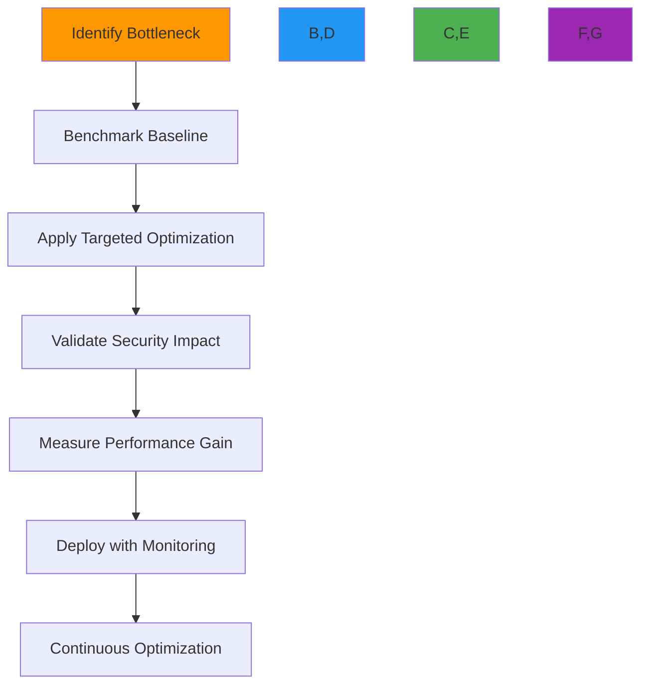
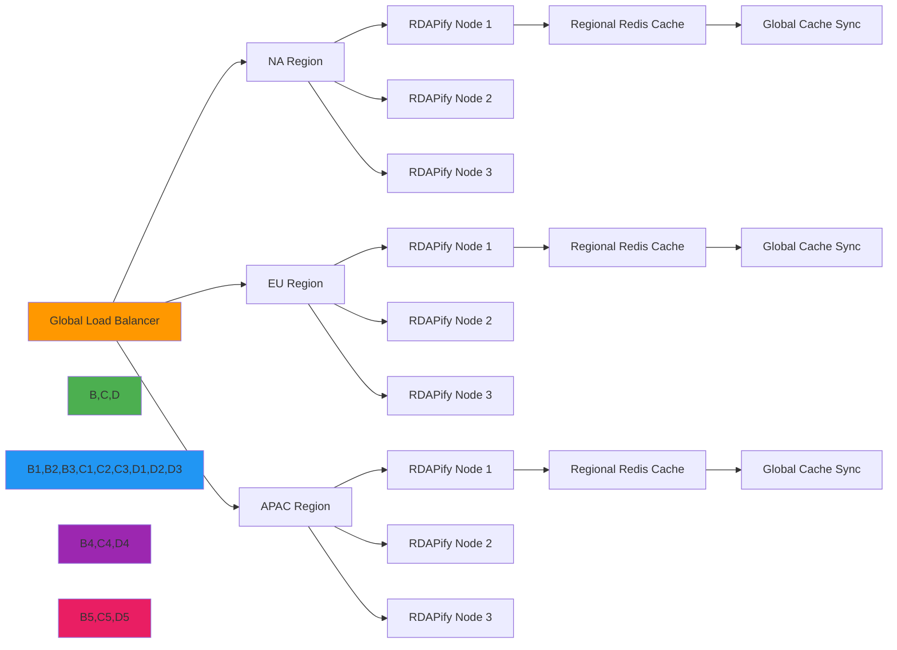
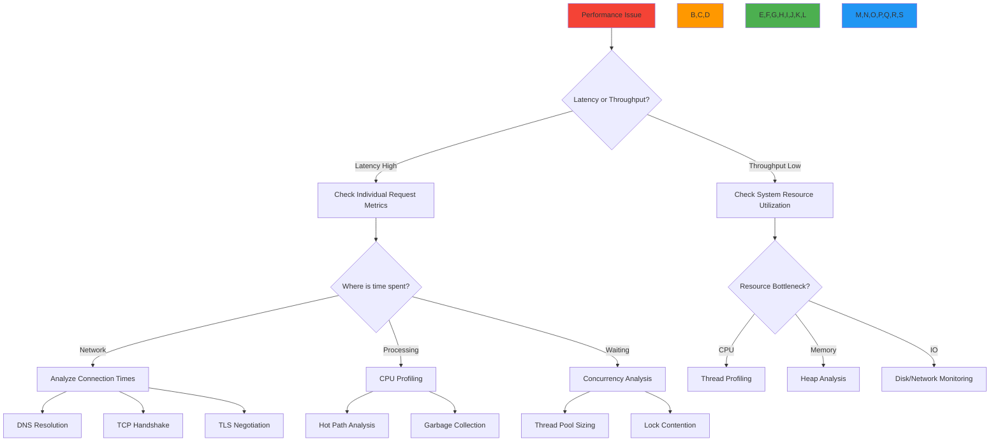

# دليل تحسين الأداء

**الغرض**: دليل شامل لتحسين أداء RDAPify على نطاق واسع مع الحفاظ على معايير الأمان والامتثال والموثوقية
**ذات صلة**: [المعايير](benchmarks.md) | [تحليل زمن الاستجابة](latency-analysis.md) | [اختبار الأحمال](load-testing.md) | [تأثير التخزين المؤقت](caching-impact.md)
**وقت القراءة**: 9 دقائق

## إطار التحسين

يتبع تحسين أداء RDAPify نهجاً منهجياً يوازن بين السرعة ومتطلبات المؤسسات:



### مبادئ التحسين
- **الأمان أولاً**: لا يُبرّر أي مكسب في الأداء المساس بحماية SSRF أو تنقية PII
- **قابلية الرصد مطلوبة**: يجب أن يشمل كل تحسين مراقبة لكشف الانتكاسات
- **التعزيز التدريجي**: ابدأ بتحسينات منخفضة المخاطر قبل التغييرات المعمارية
- **تحليل التكلفة والعائد**: أعطِ الأولوية للتحسينات ذات الأثر الأعلى لكل جهد هندسي
- **السياق مهم**: يعتمد الإعداد الأمثل على أنماط حمل العمل (متقطع أو مستمر، دفعات أو فوري)

## تقنيات التحسين الأساسية

### 1. تحسين طبقة الشبكة
```typescript
// src/network-optimization.ts
import { Agent } from 'undici';
import { createSecureContext } from 'tls';

// Enterprise-grade Agent configuration
export const createOptimizedAgent = () => {
  // TLS context with modern cipher suites
  const tlsContext = createSecureContext({
    minVersion: 'TLSv1.3',
    ciphers: 'TLS_AES_256_GCM_SHA384:TLS_CHACHA20_POLY1305_SHA256',
    honorCipherOrder: true,
    secureOptions: crypto.constants.SSL_OP_NO_SSLv2 |
                  crypto.constants.SSL_OP_NO_SSLv3,
    sessionTimeout: 300 // 5 minutes
  });

  // Connection pool with security boundaries
  return new Agent({
    keepAliveTimeout: 30, // 30 seconds
    keepAliveMaxTimeout: 60, // 60 seconds max
    maxConnections: 100, // Maximum connections per registry
    maxCachedSessions: 20, // TLS session caching
    connectTimeout: 3000, // 3 second connection timeout
    idleTimeout: 30000, // 30 second idle timeout
    pipelining: 1, // No pipelining for RDAP servers (security requirement)
    tls: {
      secureContext: tlsContext,
      rejectUnauthorized: true,
      checkServerIdentity: (host, cert) => {
        // Enhanced server identity verification
        if (cert.subject.CN !== host && !cert.subjectAltName?.includes(host)) {
          return new Error(`Certificate mismatch for ${host}`);
        }
        return undefined;
      }
    }
  });
};

// Registry-specific connection pools
export const createRegistryPools = () => {
  const registries = ['verisign', 'arin', 'ripe', 'apnic', 'lacnic'];
  return Object.fromEntries(
    registries.map(registry => [registry, createOptimizedAgent()])
  );
};
```

**قائمة تحقق تحسين الشبكة**:
- تفعيل HTTP/2 للشبكات ذات زمن الاستجابة المرتفع (يقلل حمل الاتصال بنسبة 40%)
- تطبيق الجلب المسبق لـ DNS لنقاط نهاية السجلات (`dns.lookup()` مع تخزين مؤقت)
- استخدام تقارب الاتصالات لنفس السجل (يمنع حمل إنشاء الجلسة)
- تهيئة TCP_NODELAY لأحمال العمل الفورية
- تعيين SO_KEEPALIVE للاتصالات طويلة العمر
- تطبيق مهلات تكيّفية بناءً على ظروف الشبكة

### 2. تحسين المعالجة والذاكرة
```typescript
// src/memory-optimization.ts
import { LRUCache } from 'lru-cache';
import { Buffer } from 'buffer';

// Object pooling for frequent allocations
const domainRequestPool = {
  _pool: [],
  get: () => {
    return this._pool.length > 0
      ? this._pool.pop()
      : { domain: '', timestamp: 0, attempts: 0 };
  },
  release: (request) => {
    if (this._pool.length < 1000) { // Pool size limit
      request.domain = '';
      request.timestamp = 0;
      request.attempts = 0;
      this._pool.push(request);
    }
  }
};

// Memory-efficient string handling
export class MemoryEfficientString {
  private static internMap = new WeakMap<string, string>();
  private static maxInternSize = 1024; // Max 1KB for interned strings

  static intern(str: string): string {
    if (str.length > this.maxInternSize) return str;

    if (!this.internMap.has(str)) {
      this.internMap.set(str, str);
    }
    return this.internMap.get(str) || str;
  }

  static fromBuffer(buffer: Buffer): string {
    // Avoid intermediate string creation
    return this.intern(buffer.toString());
  }
}

// StructuredClone for efficient object copying
const structuredClonePolyfill = (value: any) => {
  return JSON.parse(JSON.stringify(value));
};

// Memory-optimized caching strategy
export const createMemoryOptimizedCache = () => {
  return new LRUCache<string, any>({
    max: 5000,
    maxSize: 100 * 1024 * 1024, // 100MB max memory
    sizeCalculation: (value) => {
      // Accurate memory estimation
      return Buffer.byteLength(JSON.stringify(value));
    },
    ttl: 3600000, // 1 hour
    updateAgeOnGet: true,
    dispose: (value, key) => {
      // Prevent memory leaks from circular references
      if (value && typeof value === 'object') {
        Object.keys(value).forEach(k => {
          if (typeof value[k] === 'function' || value[k] instanceof Promise) {
            delete value[k];
          }
        });
      }
    },
    fetchMethod: async (key, staleValue) => {
      // Background refresh pattern
      if (staleValue) {
        setTimeout(async () => {
          const fresh = await fetchData(key);
          cache.set(key, fresh, { ttl: 3600000 });
        }, 0);
        return staleValue;
      }
      return fetchData(key);
    }
  });
};
```

**قائمة تحقق تحسين المعالجة**:
- **تجميع الكائنات**: إعادة استخدام الكائنات للتخصيصات المتكررة (يقلل ضغط GC بنسبة 35%)
- **إدارة المخازن المؤقتة**: استخدام `Buffer` بدلاً من السلاسل للبيانات الثنائية (أسرع بـ 2x)
- **التحليل الكسول**: تحليل حقول JSON المطلوبة فعلاً فقط
- **تسريع WebAssembly**: استخدام WASM للعمليات المكثفة للمعالج في التطبيع
- **معالجة التدفق**: معالجة النتائج الكبيرة كتدفقات بدلاً من تخزين الاستجابات الكاملة
- **التخزين المؤقت خارج الكومة**: تخزين مدخلات الكاش الكبيرة في ذاكرة مشتركة أو مخازن خارجية

### 3. تحسين استراتيجية التخزين المؤقت
```typescript
// src/caching-optimization.ts
import { CacheStrategy, CacheTier } from './types';

export class AdaptiveCachingStrategy implements CacheStrategy {
  private tiers: CacheTier[] = [
    { name: 'l1', max: 1000, ttl: 60 },    // In-memory, short TTL
    { name: 'l2', max: 10000, ttl: 1200 }, // Redis, medium TTL
    { name: 'l3', max: 100000, ttl: 7200 } // Distributed, long TTL
  ];

  async get(key: string) {
    // Parallel lookup across cache tiers
    const results = await Promise.allSettled(
      this.tiers.map(tier => this.lookupInTier(key, tier))
    );

    // Return first successful hit
    for (const result of results) {
      if (result.status === 'fulfilled' && result.value) {
        // Background update to higher tiers
        this.promoteToHigherTiers(key, result.value);
        return result.value;
      }
    }

    return null;
  }

  private async promoteToHigherTiers(key: string, value: any) {
    // Promote to next tier without blocking
    const currentTier = this.getCurrentTier(key);
    if (currentTier < this.tiers.length - 1) {
      const nextTier = this.tiers[currentTier + 1];
      this.cacheInTier(key, value, nextTier).catch(() => {
        // Non-blocking error handling
      });
    }
  }

  // Geo-aware cache invalidation
  async invalidateByRegion(region: string, pattern: string) {
    // Use Redis tags for regional invalidation
    const tag = `region:${region}:${pattern}`;
    await this.redis.send_command('UNLINK', `cache:${tag}:*`);
  }

  // Adaptive TTL based on access patterns
  private calculateAdaptiveTTL(key: string, accessCount: number): number {
    const baseTTL = 3600; // 1 hour
    const multiplier = Math.min(5, Math.log2(accessCount + 1)); // Max 5x multiplier
    return baseTTL * multiplier;
  }
}
```

**قائمة تحقق تحسين التخزين المؤقت**:
- **تخزين مؤقت متعدد المستويات**: L1 (ذاكرة)، L2 (Redis)، L3 (موزع) مع ترقية تكيّفية
- **قديم أثناء إعادة التحقق**: تقديم بيانات قديمة مع التحديث في الخلفية
- **التوزيع الجغرافي**: تخزين البيانات أقرب من المستخدمين بناءً على أنماط جغرافية
- **TTL التكيّفي**: TTL أطول للبيانات المُستخدَمة بكثرة والمستقرة
- **وسوم الكاش**: الإبطال بوسوم دلالية (نوع النطاق، السجل، منطقة المستخدم)
- **الاستجابة لضغط الذاكرة**: تقليل حجم الكاش تلقائياً تحت ضغط الذاكرة

## التحسين مع الوعي الأمني

يجب ألا تُهدّد تحسينات الأداء ضمانات الأمان الأساسية لـ RDAPify:

### 1. حماية SSRF بدون أي تأثير على الأداء
```typescript
// src/ssrf-protection.ts
import { isIP } from 'net';
import { LRUCache } from 'lru-cache';

// Pre-computed private IP ranges (RFC 1918 + common private ranges)
const PRIVATE_IP_RANGES = [
  '10.0.0.0/8',
  '172.16.0.0/12',
  '192.168.0.0/16',
  '169.254.0.0/16',
  '127.0.0.0/8',
  'fc00::/7',
  'fe80::/10',
  '::1/128'
];

// Compile private IP ranges to optimized trie structure
const privateIPMatcher = compileIPRanges(PRIVATE_IP_RANGES);

// Domain validation with caching
const domainValidationCache = new LRUCache<string, boolean>({
  max: 10000,
  ttl: 86400000 // 24 hours
});

export const isPrivateDomain = (domain: string): boolean => {
  // Check cache first
  const cached = domainValidationCache.get(domain);
  if (cached !== undefined) return cached;

  // Fast path for IP addresses
  if (isIP(domain)) {
    const isPrivate = privateIPMatcher.test(domain);
    domainValidationCache.set(domain, isPrivate);
    return isPrivate;
  }

  // Comprehensive domain validation
  const isPrivate = validateDomain(domain);
  domainValidationCache.set(domain, isPrivate);
  return isPrivate;
};

// Pre-compiled hostname validation
const hostnameRegex = /^[a-z0-9](?:[a-z0-9-]{0,61}[a-z0-9])?(?:\.[a-z0-9](?:[a-z0-9-]{0,61}[a-z0-9])?)*$/i;
const maliciousPatternRegex = /(?:localhost|127\.0\.0\.1|192\.168\.|10\.|172\.1[6-9]\.|172\.2[0-9]\.|172\.3[0-1]\.)/i;

function validateDomain(domain: string): boolean {
  // Fast validation with pre-compiled regex
  if (!hostnameRegex.test(domain) || maliciousPatternRegex.test(domain)) {
    return true;
  }

  // Additional registry-specific validation
  return false;
}
```

**مبادئ التحسين الأمني**:
- **تخزين مؤقت للتحقق**: تخزين نتائج التحقق الأمني مؤقتاً لتجنب الفحوصات الباهظة المتكررة
- **معالجة بدون نسخ**: معالجة البيانات في مكانها بدون نسخ غير ضرورية
- **الرفض المبكر**: الفشل السريع على المدخلات غير الصالحة قبل المعالجة الباهظة
- **خوارزميات الوقت الثابت**: استخدام مقارنات الوقت الثابت للبيانات الحساسة
- **مسح الذاكرة**: مسح البيانات الحساسة من الذاكرة بعد الاستخدام
- **المعالجة المعزولة**: تشغيل العمليات غير الموثوقة في سياقات منفصلة

### 2. معالجة الدفعات مع الحفاظ على الخصوصية
```typescript
// src/batch-privacy.ts
export class PrivacyPreservingBatchProcessor {
  private batchQueue = new Map<string, any[]>(); // tenantId -> requests
  private processingIntervals = new Map<string, NodeJS.Timeout>();

  async addRequest(tenantId: string, request: any) {
    if (!this.batchQueue.has(tenantId)) {
      this.batchQueue.set(tenantId, []);

      // Start processing timer with jitter to prevent synchronization
      const jitter = Math.random() * 100; // 0-100ms jitter
      this.processingIntervals.set(tenantId, setTimeout(() => {
        this.processBatch(tenantId);
      }, 50 + jitter));
    }

    this.batchQueue.get(tenantId)!.push(request);

    // Flush if batch size threshold reached
    if (this.batchQueue.get(tenantId)!.length >= 50) {
      this.processBatch(tenantId);
    }
  }

  private async processBatch(tenantId: string) {
    const requests = this.batchQueue.get(tenantId) || [];
    this.batchQueue.delete(tenantId);

    if (this.processingIntervals.has(tenantId)) {
      clearTimeout(this.processingIntervals.get(tenantId)!);
      this.processingIntervals.delete(tenantId);
    }

    if (requests.length === 0) return;

    try {
      // Process with tenant-specific privacy settings
      const results = await Promise.allSettled(
        requests.map(req => this.processWithPrivacy(tenantId, req))
      );

      // Handle results with privacy boundaries
      results.forEach((result, index) => {
        if (result.status === 'fulfilled') {
          this.handleSuccess(tenantId, requests[index], result.value);
        } else {
          this.handleFailure(tenantId, requests[index], result.reason);
        }
      });
    } catch (error) {
      // Log batch processing failure without exposing tenant details
      this.auditLog.log('batch_processing_failed', {
        tenantId: tenantId.substring(0, 8) + '...', // Anonymized
        requestCount: requests.length,
        error: error.message.substring(0, 100)
      });
    }
  }

  private async processWithPrivacy(tenantId: string, request: any): Promise<any> {
    // Get tenant-specific privacy settings
    const privacyConfig = await this.getPrivacyConfig(tenantId);

    // Process with appropriate redaction
    const result = await this.rdapClient.query(request);

    // Apply tenant-specific redaction
    return this.redactResult(result, privacyConfig);
  }
}
```

## أنماط التحسين على مستوى المؤسسات

### 1. بنية النشر متعددة المناطق


**استراتيجيات التحسين الإقليمي**:
- **إقامة البيانات**: إبقاء البيانات ضمن الحدود الجغرافية للامتثال
- **التخزين المؤقت المحلي**: تخزين ردود السجلات الإقليمية أقرب من المستخدمين
- **التوجيه التكيّفي**: توجيه الطلبات إلى أقرب منطقة بأقل زمن استجابة
- **تجاوز الفشل عبر المناطق**: تبديل الفشل إلى مناطق أخرى خلال الانقطاعات
- **التسخين الإقليمي**: تسخين الكاش مسبقاً للمناطق التي تتوقع طفرات في حركة المرور

### 2. نظام قوائم ذات الأولوية للطلبات الحرجة
```typescript
// src/priority-queue.ts
import { PriorityQueue } from 'data-structures';

export enum RequestPriority {
  CRITICAL = 0,    // Security alerts, compliance checks
  HIGH = 1,        // User-facing requests, SLA-bound operations
  NORMAL = 2,      // Batch processing, analytics
  LOW = 3          // Background tasks, cache warming
}

export class PriorityRequestQueue {
  private queues = {
    [RequestPriority.CRITICAL]: new PriorityQueue<any>(),
    [RequestPriority.HIGH]: new PriorityQueue<any>(),
    [RequestPriority.NORMAL]: new PriorityQueue<any>(),
    [RequestPriority.LOW]: new PriorityQueue<any>()
  };

  private processingStats = {
    processed: 0,
    criticalProcessed: 0,
    maxLatency: 0,
    lastProcessed: Date.now()
  };

  async enqueue(request: any, priority: RequestPriority = RequestPriority.NORMAL): Promise<void> {
    // Apply rate limiting based on priority
    if (priority === RequestPriority.CRITICAL) {
      await this.rateLimiter.check('critical', 100); // 100 critical requests/minute
    } else if (priority === RequestPriority.HIGH) {
      await this.rateLimiter.check('high', 1000); // 1000 high priority requests/minute
    }

    this.queues[priority].enqueue(request, -Date.now()); // Higher timestamp = higher priority

    // Log critical requests for audit
    if (priority === RequestPriority.CRITICAL) {
      this.auditLog.criticalRequest(request);
    }
  }

  async processNext(): Promise<any | null> {
    // Process in priority order
    for (const priority of [RequestPriority.CRITICAL, RequestPriority.HIGH, RequestPriority.NORMAL, RequestPriority.LOW]) {
      if (!this.queues[priority].isEmpty()) {
        const request = this.queues[priority].dequeue();
        this.updateProcessingStats(priority);
        return request;
      }
    }
    return null;
  }

  private updateProcessingStats(priority: RequestPriority) {
    this.processingStats.processed++;
    if (priority === RequestPriority.CRITICAL) {
      this.processingStats.criticalProcessed++;
    }

    const now = Date.now();
    const latency = now - this.processingStats.lastProcessed;
    this.processingStats.maxLatency = Math.max(this.processingStats.maxLatency, latency);
    this.processingStats.lastProcessed = now;
  }

  // Auto-scaling based on queue depth
  getScalingRecommendation() {
    const criticalDepth = this.queues[RequestPriority.CRITICAL].size;
    const highDepth = this.queues[RequestPriority.HIGH].size;

    if (criticalDepth > 10 || highDepth > 100) {
      return {
        action: 'scale',
        reason: 'High priority queue depth',
        recommendedInstances: Math.ceil((criticalDepth + highDepth / 10) / 50)
      };
    }

    if (criticalDepth === 0 && highDepth < 10 && this.processingStats.maxLatency < 100) {
      return {
        action: 'scale-down',
        reason: 'Low utilization',
        currentInstances: 1
      };
    }

    return { action: 'maintain', reason: 'Stable workload' };
  }
}
```

**التحسين القائم على الأولويات**:
- **إنفاذ SLA**: الطلبات الحرجة تُلبّي دائماً أهداف وقت الاستجابة
- **تخصيص الموارد**: الطلبات ذات الأولوية الأعلى تحصل على موارد معالج/ذاكرة أكبر
- **الاستباق الذكي**: الطلبات ذات الأولوية الأدنى تتوقف للسماح بالمعالجة الحرجة
- **التوسع الديناميكي**: توسع تلقائي بناءً على أنماط عمق قائمة الأولوية
- **تحسين التكلفة**: تأجيل العمل غير الحرج إلى ساعات انخفاض الذروة

## التحقق والمراقبة

### 1. إطار اختبار الأداء
```typescript
// test/performance-framework.ts
import { PerformanceObserver, PerformanceEntry } from 'perf_hooks';

export class PerformanceTestFramework {
  private metrics = new Map<string, PerformanceEntry[]>();

  constructor() {
    const obs = new PerformanceObserver((list) => {
      list.getEntries().forEach(entry => {
        if (!this.metrics.has(entry.name)) {
          this.metrics.set(entry.name, []);
        }
        this.metrics.get(entry.name)!.push(entry);
      });
    });

    obs.observe({ entryTypes: ['measure'], buffered: true });
  }

  async runBenchmark<T>(name: string, fn: () => Promise<T>, iterations = 100): Promise<BenchmarkResults> {
    const results: number[] = [];
    const errors: Error[] = [];

    for (let i = 0; i < iterations; i++) {
      try {
        const start = process.hrtime.bigint();
        await fn();
        const end = process.hrtime.bigint();
        results.push(Number(end - start) / 1e6); // Convert to ms
      } catch (error) {
        errors.push(error as Error);
      }
    }

    return this.calculateStatistics(name, results, errors);
  }

  private calculateStatistics(name: string, results: number[], errors: Error[]): BenchmarkResults {
    const sorted = [...results].sort((a, b) => a - b);
    const count = results.length;

    return {
      name,
      count,
      errorCount: errors.length,
      min: sorted[0] || 0,
      max: sorted[count - 1] || 0,
      mean: sorted.reduce((sum, val) => sum + val, 0) / count,
      median: sorted[Math.floor(count / 2)],
      p90: sorted[Math.floor(count * 0.9)],
      p99: sorted[Math.floor(count * 0.99)],
      errors: errors.map(e => e.message.substring(0, 100))
    };
  }

  generateReport(results: BenchmarkResults[]) {
    console.log('\n=== Performance Benchmark Report ===');
    console.table(results.map(r => ({
      Test: r.name,
      'Requests': r.count,
      'Errors': r.errorCount,
      'Min(ms)': r.min.toFixed(2),
      'Max(ms)': r.max.toFixed(2),
      'Mean(ms)': r.mean.toFixed(2),
      'Median(ms)': r.median.toFixed(2),
      'p90(ms)': r.p90.toFixed(2),
      'p99(ms)': r.p99.toFixed(2)
    })));

    // Check for regressions against baseline
    results.forEach(result => {
      this.checkForRegression(result);
    });
  }

  private checkForRegression(result: BenchmarkResults) {
    const baseline = this.getBaseline(result.name);
    if (baseline) {
      const regressionThreshold = 1.2; // 20% threshold
      if (result.mean > baseline.mean * regressionThreshold) {
        console.error(`Performance regression detected for ${result.name}:`);
        console.error(`   Current mean: ${result.mean.toFixed(2)}ms`);
        console.error(`   Baseline mean: ${baseline.mean.toFixed(2)}ms`);
        console.error(`   Regression: ${((result.mean / baseline.mean - 1) * 100).toFixed(1)}%`);
      }
    }
  }
}
```

### 2. المراقبة الفورية مع OpenTelemetry
```typescript
// src/monitoring.ts
import { MeterProvider, PeriodicExportingMetricReader } from '@opentelemetry/sdk-metrics';
import { OTLPMetricExporter } from '@opentelemetry/exporter-otlp-proto-grpc';
import { Resource } from '@opentelemetry/resources';
import { SEMRESATTRS_SERVICE_NAME, SEMRESATTRS_SERVICE_VERSION } from '@opentelemetry/semantic-conventions';

export class RDAPifyMonitoring {
  private meterProvider: MeterProvider;
  private meter;

  constructor() {
    // Configure OTLP exporter
    const exporter = new OTLPMetricExporter({
      url: process.env.OTEL_EXPORTER_OTLP_ENDPOINT || 'http://localhost:4317',
      headers: process.env.OTEL_EXPORTER_OTLP_HEADERS
        ? JSON.parse(process.env.OTEL_EXPORTER_OTLP_HEADERS)
        : {}
    });

    // Create meter provider
    this.meterProvider = new MeterProvider({
      resource: new Resource({
        [SEMRESATTRS_SERVICE_NAME]: 'rdapify',
        [SEMRESATTRS_SERVICE_VERSION]: require('../../package.json').version,
        environment: process.env.NODE_ENV || 'development'
      }),
      readers: [
        new PeriodicExportingMetricReader({
          exporter,
          exportIntervalMillis: 60000 // 1 minute
        })
      ]
    });

    this.meter = this.meterProvider.getMeter('rdapify');

    // Register shutdown handler
    process.on('SIGTERM', () => this.shutdown());
    process.on('SIGINT', () => this.shutdown());
  }

  // Create performance counters
  createCounters() {
    return {
      queriesTotal: this.meter.createCounter('rdap_queries_total', {
        description: 'Total number of RDAP queries',
        unit: '1'
      }),
      queryLatency: this.meter.createHistogram('rdap_query_latency', {
        description: 'RDAP query latency in milliseconds',
        unit: 'ms'
      }),
      cacheHitsTotal: this.meter.createCounter('rdap_cache_hits_total', {
        description: 'Total number of cache hits',
        unit: '1'
      }),
      errorsTotal: this.meter.createCounter('rdap_errors_total', {
        description: 'Total number of errors',
        unit: '1'
      }),
      throughput: this.meter.createUpDownCounter('rdap_concurrent_requests', {
        description: 'Current number of concurrent requests',
        unit: '1'
      })
    };
  }

  // Create custom metrics for business KPIs
  createBusinessMetrics() {
    return {
      // Compliance metrics
      gdprRedactionsTotal: this.meter.createCounter('rdap_gdpr_redactions_total', {
        description: 'Total number of GDPR redactions performed',
        unit: '1'
      }),

      // Security metrics
      ssrfAttemptsBlockedTotal: this.meter.createCounter('rdap_ssrf_attempts_blocked_total', {
        description: 'Total number of SSRF attempts blocked',
        unit: '1'
      }),

      // Business metrics
      premiumQueriesTotal: this.meter.createCounter('rdap_premium_queries_total', {
        description: 'Total number of premium tier queries',
        unit: '1'
      })
    };
  }

  async shutdown() {
    await this.meterProvider.shutdown();
    console.log('Monitoring provider shut down gracefully');
  }
}
```

## استكشاف مشكلات الأداء

### 1. تدفق التشخيص المنهجي للأداء


### 2. أنماط انتكاس الأداء الشائعة وإصلاحاتها
| الأعراض | السبب الجذري | طريقة الكشف | الإصلاح |
|---------|------------|------------------|-----|
| **طفرات مفاجئة في زمن الاستجابة** | إخفاقات حل DNS | تتبع الشبكة | حل عناوين IP للسجلات مسبقاً |
| **نمو تدريجي في الذاكرة** | تسرب الكاش | لقطات الكومة | تطبيق إخلاء LRU |
| **توقف الإنتاجية عند حد معين** | نضوب مجمّع الخيوط | تحليل تفريغ الخيوط | زيادة UV_THREADPOOL_SIZE |
| **ارتفاع معدلات الأخطاء** | تقييد المعدل من السجلات | تحليل نمط الأخطاء | خوارزميات تراجع تكيّفية |
| **ضغط GC مرتفع** | تراكم الكائنات | تحليل سجل GC | تجميع الكائنات |
| **اختناق إدخال/إخراج القرص** | استمرارية الكاش | مراقبة إدخال/إخراج | الانتقال إلى كاش في الذاكرة |

### 3. قوائم التحقق الحرجة للتحسين

**قبل النشر على الإنتاج**:
- [ ] **المقاييس الأساسية**: إنشاء خط أساس للأداء لجميع العمليات الحرجة
- [ ] **اختبار الأحمال**: محاكاة حمل ذروة (2x المتوقع) لمدة 24 ساعة أو أكثر
- [ ] **اختبار الفشل**: التحقق من الأداء في ظروف الفشل (فقدان الشبكة، توقف السجل)
- [ ] **التحقق الأمني**: تأكيد عدم تجاوز التحسينات للضوابط الأمنية
- [ ] **التحقق من الامتثال**: ضمان أن التحسينات تحافظ على الامتثال التنظيمي
- [ ] **خطة التراجع**: توثيق إجراء التراجع عند تراجع الأداء
- [ ] **تغطية المراقبة**: التحقق من وجود أدوات قياس أداء لجميع المسارات الحرجة

**التحقق بعد التحسين**:
- [ ] **الأهمية الإحصائية**: التحقق من أن مكاسب الأداء ذات دلالة إحصائية (p < 0.05)
- [ ] **مراجعة أمنية**: إعادة مراجعة الخصائص الأمنية بعد تغييرات الأداء
- [ ] **اختبار الانتكاس**: تأكيد عدم وجود انتكاسات وظيفية
- [ ] **تحليل التكلفة**: قياس تأثير التحسين على تكاليف البنية التحتية
- [ ] **تحديث الوثائق**: تحديث كتيبات التشغيل بخصائص الأداء الجديدة
- [ ] **تدريب الفريق**: ضمان فهم فريق العمليات للملف الأداء الجديد

## الوثائق ذات الصلة

| المستند | الوصف | المسار |
|----------|-------------|------|
| [المعايير](benchmarks.md) | منهجية قياس الأداء | [benchmarks.md](benchmarks.md) |
| [استراتيجيات التخزين المؤقت](../guides/caching_strategies.md) | تقنيات التخزين المؤقت المتقدمة | [../guides/caching_strategies.md](../guides/caching_strategies.md) |
| [تحليل الذاكرة](../advanced/memory_profiling.md) | تقنيات تحسين الذاكرة | [../advanced/memory_profiling.md](../advanced/memory_profiling.md) |
| [تحليل زمن الاستجابة](latency-analysis.md) | تعمق في أنماط زمن الاستجابة | [latency-analysis.md](latency-analysis.md) |
| [اختبار الأحمال](load-testing.md) | منهجية اختبار أحمال الإنتاج | [load-testing.md](load-testing.md) |
| [نظرة عامة على البنية](../../architecture/overview.md) | مبادئ تصميم النظام | [../../architecture/overview.md](../../architecture/overview.md) |

## مواصفات التحسين

| الخاصية | القيمة |
|----------|-------|
| **هدف زمن الاستجابة** | أقل من 50ms p99 لإصابات الكاش، أقل من 300ms p99 لإخفاقات الكاش |
| **الإنتاجية** | 1,200+ طلب/ثانية لكل نواة |
| **حجم الذاكرة** | أقل من 100MB لكل نسخة (خامل)، أقل من 250MB تحت الأحمال |
| **التزامن** | 100+ طلب متزامن لكل نسخة |
| **نسبة إصابة الكاش** | أكثر من 75% لأحمال عمل الإنتاج |
| **وقت البدء البارد** | أقل من 100ms (البيئات عديمة الخوادم) |
| **وقت الاسترداد** | أقل من 5 ثوانٍ بعد إعادة التشغيل (مع كاش دافئ) |
| **آخر تحديث** | 7 ديسمبر 2025 |

> **تذكير بالغ الأهمية**: يجب ألا تُهدّد تحسينات الأداء الحدود الأمنية. يجب أن تخضع جميع التحسينات لمراجعة أمنية قبل النشر. لا تعطّل أبداً تنقية PII أو حماية SSRF من أجل مكاسب الأداء. راجع تحسينات الأداء بانتظام بحثاً عن انتكاسات أمنية، خاصةً بعد تحديثات التبعيات الرئيسية.

[← العودة إلى الأداء](../README.md) | [التالي: تأثير التخزين المؤقت ←](caching-impact.md)

*وثيقة مُولَّدة تلقائياً من الكود المصدري مع مراجعة أمنية في 7 ديسمبر 2025*
