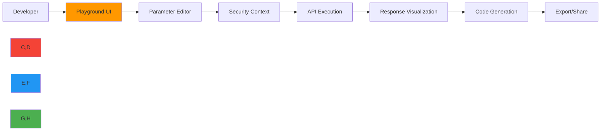

# بيئة اختبار API

> **ميزة مخطط لها** — يصف هذا التوثيق وظائف قيد التطوير وغير متوفرة في الإصدار الحالي (v0.1.8). قد تتغير التفاصيل قبل الإطلاق.

**الغرض**: بيئة تفاعلية لاستكشاف نقاط نهاية API الخاصة بـ RDAPify مع تنفيذ في الوقت الفعلي وتخصيص المعاملات وتصور سياق الأمان
**ذات صلة**: [النظرة العامة](overview.md) | [معرض الأمثلة](examples.md) | [مصحح الأخطاء المرئي](visual_debugger.md) | [دليل الخمس دقائق](../getting-started/five_minutes.md)
**وقت القراءة**: 6 دقائق
**نصيحة مهنية**: استخدم زر "جرّب" على أي نقطة نهاية API لتنفيذها فوراً بمعاملاتك في بيئة الاختبار

## نظرة عامة على بيئة اختبار API

توفر بيئة اختبار API الخاصة بـ RDAPify بيئة متصفح مبنية على الصفر لاستكشاف سطح API الكامل لـ RDAPify مع مراقبة أمنية على مستوى المؤسسات وتغذية راجعة في الوقت الفعلي.



### الميزات الرئيسية لبيئة الاختبار
- **التنفيذ في الوقت الفعلي**: تشغيل استدعاءات API فوراً مع استجابات مُرئية
- **سياق الأمان**: رؤية كيفية تأثير إعدادات الأمان على سلوك API
- **توليد الكود**: تحويل استعلامات بيئة الاختبار إلى Node.js أو Python أو cURL
- **استكشاف المعاملات**: شرائح تفاعلية للمهلات الزمنية وإعدادات التخزين المؤقت
- **مقارنة الاستجابات**: التبديل بين الاستجابات الخام والمُطبَّعة
- **محاكاة الأخطاء**: اختبار كيفية تعامل تطبيقك مع الحالات الحدية

## نقاط النهاية الأساسية لـ API

### 1. نقطة نهاية البحث عن النطاق `/api/domain/{domain}`

**المعاملات**:
- `domain`: اسم النطاق للاستعلام عنه (مطلوب)
- `privacy`: قيمة منطقية (true/false أو كائن PrivacyOptions) لتفعيل اختزال البيانات الشخصية (الافتراضي: true)
- `cacheTTL`: مدة صلاحية التخزين المؤقت بالثواني (الافتراضي: 3600)
- `timeout`: الحد الأقصى لوقت الاستعلام بالميلي ثانية (الافتراضي: 5000)

**جرّب هذا المثال**:
```json
{
  "domain": "example.com",
  "options": {
    "privacy": true,
    "cache": true,
    "timeout": 5000
  }
}
```

**هيكل الاستجابة**:
```typescript
interface DomainResponse {
  domain: string;
  status: string[];
  nameservers: string[];
  registrar?: {
    name: string;
    url?: string;
    handle?: string;
  };
  events: {
    type: 'registration' | 'expiration' | 'lastChanged';
    date: string;
  }[];
  entities?: Entity[];
  rawResponse?: any; // Only if includeRaw=true
}
```

**سياق الأمان**:
- اختزال البيانات الشخصية: مُفعَّل (البريد الإلكتروني والهاتف والعناوين مُختزَلة)
- حماية SSRF: نشطة (IPs الداخلية محجوبة)
- حالة التخزين المؤقت: نتيجة إيجابية (مُقدَّمة من التخزين المؤقت)
- درجة الخصوصية: 92/100 (حماية خصوصية ممتازة)

### 2. نقطة نهاية البحث عن عنوان IP `/api/ip/{ip}`

**المعاملات**:
- `ip`: عنوان IP للاستعلام عنه (مطلوب، IPv4 أو IPv6)
- `maxDepth`: أقصى عمق تكرار للشبكات ذات الصلة (الافتراضي: 2)
- `includeAbuseContact`: تضمين معلومات الاتصال للإساءة (الافتراضي: false)

**جرّب هذا المثال**:
```json
{
  "ip": "93.184.216.34",
  "options": {
    "maxDepth": 2,
    "includeAbuseContact": false,
    "privacy": true
  }
}
```

> **ملاحظة أمنية حرجة**: يمكن لعمليات البحث عن عناوين IP كشف تفاصيل البنية التحتية للشبكة. دائماً:
> - فعّل `privacy: true` في الإنتاج
> - حدّد `maxDepth` لمنع رسم خرائط الشبكة
> - طبّق تحديداً صارماً للمعدل لكل عنوان IP
> - لا تكشف بيانات WHOIS الخام مباشرةً للمستخدمين النهائيين

**مثال على الاستجابة**:
```json
{
  "ip": "93.184.216.34",
  "network": "93.184.216.0/24",
  "country": "US",
  "netname": "EDGECAST-NETBLK-03",
  "organization": {
    "name": "Edgecast Inc.",
    "handle": "EDGECA-ARIN"
  },
  "abuseContact": {
    "redacted": true,
    "message": "PII redacted per GDPR Article 6(1)(f)"
  },
  "events": [
    {
      "type": "registration",
      "date": "2008-11-13T00:00:00Z"
    },
    {
      "type": "lastChanged",
      "date": "2021-10-05T14:22:17Z"
    }
  ]
}
```

### 3. نقطة نهاية البحث عن ASN `/api/asn/{asn}`

**المعاملات**:
- `asn`: رقم النظام المستقل للاستعلام عنه (مطلوب، تنسيق AS##### أو رقم)
- `includeNetworks`: تضمين معلومات شبكة IP ذات الصلة (الافتراضي: false)

**جرّب هذا المثال**:
```json
{
  "asn": "AS15133",
  "options": {
    "includeNetworks": false,
    "privacy": true
  }
}
```

### 4. البحث الدُفعي `/api/batch`

**المعاملات**:
- `queries`: مصفوفة من الاستعلامات (مطلوبة، الحد الأقصى 100 لكل طلب)
- `concurrency`: عدد الاستعلامات المتزامنة (الافتراضي: 5، الحد الأقصى: 10)

**جرّب هذا المثال**:
```json
{
  "queries": [
    { "type": "domain", "value": "example.com" },
    { "type": "domain", "value": "google.com" },
    { "type": "ip", "value": "8.8.8.8" }
  ],
  "options": {
    "concurrency": 3,
    "privacy": true,
    "timeout": 10000
  }
}
```

## توليد الكود

تحوّل بيئة الاختبار تلقائياً استعلاماتك إلى كود جاهز للإنتاج:

```typescript
// Generated TypeScript code
import { RDAPClient } from 'rdapify';

const client = new RDAPClient({
  cache: true,
  privacy: true,
  timeout: 5000
});

const result = await client.domain('example.com');
console.log(result);
```

```python
# Generated Python code
from rdapify import RDAPClient

client = RDAPClient(
    cache=True,
    privacy=True,
    timeout=5000
)

result = client.domain('example.com')
print(result)
```

```bash
# Generated cURL command
curl -X GET \
  'https://api.rdapify.dev/v1/domain/example.com' \
  -H 'Authorization: Bearer YOUR_API_KEY' \
  -H 'X-Privacy-Mode: true' \
  -H 'Accept: application/json'
```

[← العودة إلى بيئة الاختبار](../README.md)
