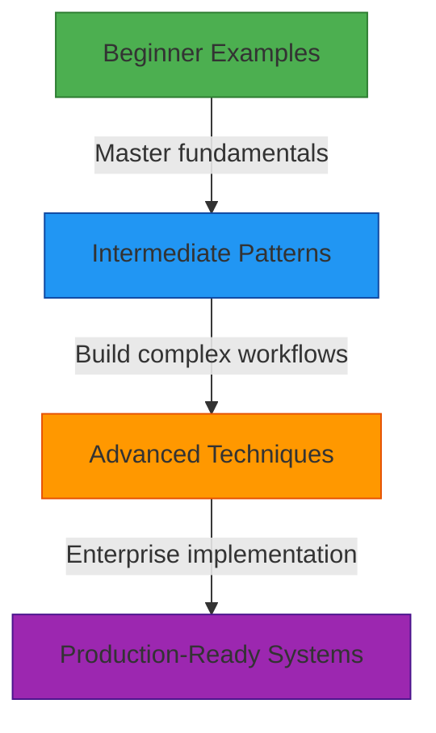

# معرض أمثلة بيئة الاختبار

> **ميزة مخطط لها** — يصف هذا التوثيق وظائف قيد التطوير وغير متوفرة في الإصدار الحالي (v0.1.8). قد تتغير التفاصيل قبل الإطلاق.

**الغرض**: مجموعة تفاعلية من الأمثلة العملية لـ RDAPify توضح المفاهيم الجوهرية من خلال التجريب العملي في بيئة الاختبار
**ذات صلة**: [بيئة اختبار API](api_playground.md) | [النظرة العامة](overview.md) | [مصحح الأخطاء المرئي](visual_debugger.md) | [دليل الخمس دقائق](../getting-started/five_minutes.md)
**وقت القراءة**: 5 دقائق
**نصيحة مهنية**: انقر زر "تشغيل المثال" بجانب أي كتلة كود لتنفيذها فوراً في بيئة الاختبار

## فئات الأمثلة

تُنظَّم أمثلة بيئة الاختبار في مسارات تعلم تدريجية:



## أمثلة للمبتدئين

### 1. البحث الأساسي عن نطاق
```typescript
// Query a single domain with default settings
const result = await client.domain('example.com');

console.log({
  domain: result.domain,
  registrar: result.registrar?.name,
  status: result.status,
  nameservers: result.nameservers
});
```

**المخرجات المتوقعة**:
```json
{
  "domain": "example.com",
  "registrar": "Internet Assigned Numbers Authority",
  "status": ["clientDeleteProhibited", "clientTransferProhibited", "clientUpdateProhibited"],
  "nameservers": ["a.iana-servers.net", "b.iana-servers.net"]
}
```

### 2. التحقيق في عنوان IP
```typescript
// Look up IP registration details
const result = await client.ip('93.184.216.34');

console.log({
  ip: result.ip,
  country: result.country,
  netname: result.netname,
  organization: result.organization?.name,
  abuseContact: result.abuseContact?.email
});
```

### 3. استرجاع معلومات رقم ASN
```typescript
// Get Autonomous System Number details
const result = await client.asn('AS15133');

console.log({
  asn: result.asn,
  name: result.name,
  country: result.country,
  description: result.description,
  registrationDate: result.events.find(e => e.type === 'registration')?.date
});
```

## الأنماط المتوسطة

### 1. معالجة النطاقات الدُفعية
```typescript
// Process multiple domains with error handling
const domains = ['example.com', 'google.com', 'github.com', 'nonexistent-domain.xyz'];

const results = await Promise.allSettled(
  domains.map(async (domain) => {
    try {
      return {
        domain,
        result: await client.domain(domain, {
          privacy: true, // GDPR compliance
          timeout: 3000   // 3 second timeout
        })
      };
    } catch (error) {
      return {
        domain,
        error: {
          message: error.message,
          code: error.code || 'UNKNOWN_ERROR'
        }
      };
    }
  })
);

// Visualize success/error rate
const successCount = results.filter(r => r.status === 'fulfilled').length;
const errorCount = results.length - successCount;

console.log(`Success: ${successCount}, Errors: ${errorCount}`);
console.log('Results:', results);
```

### 2. رسم خرائط علاقات البيانات
```typescript
// Visualize relationships between domains
const targetDomain = 'google.com';
const result = await client.domain(targetDomain);

// Extract all related domains
const relatedDomains = new Set<string>();

// Add nameservers
result.nameservers.forEach(ns => {
  const domain = ns.split('.').slice(-2).join('.');
  relatedDomains.add(domain);
});

// Add registrar's website
if (result.registrar?.url) {
  const domain = new URL(result.registrar.url).hostname;
  relatedDomains.add(domain);
}

console.log('Related domains:', Array.from(relatedDomains));
```

### 3. مراقبة انتهاء صلاحية النطاق
```typescript
// Monitor domain expiration dates
const portfolio = ['example.com', 'mycompany.com', 'product.io'];

const expirationReport = await Promise.all(
  portfolio.map(async (domain) => {
    const result = await client.domain(domain, { privacy: true });
    const expiration = result.events.find(e => e.type === 'expiration');

    if (!expiration) {
      return { domain, status: 'unknown', daysLeft: null };
    }

    const expirationDate = new Date(expiration.date);
    const daysLeft = Math.floor((expirationDate.getTime() - Date.now()) / (1000 * 60 * 60 * 24));

    return {
      domain,
      expirationDate: expiration.date,
      daysLeft,
      status: daysLeft < 30 ? 'critical' : daysLeft < 90 ? 'warning' : 'ok'
    };
  })
);

// Sort by urgency
expirationReport.sort((a, b) => (a.daysLeft ?? Infinity) - (b.daysLeft ?? Infinity));
console.log('Expiration Report:', expirationReport);
```

## التقنيات المتقدمة

### 1. مراقبة التغييرات في بيانات تسجيل النطاق
```typescript
// Monitor for changes in registration data
async function detectChanges(domain: string, previousSnapshot: any): Promise<ChangeReport> {
  const currentData = await client.domain(domain, { privacy: true });

  const changes: Change[] = [];

  // Check registrar change
  if (previousSnapshot.registrar?.name !== currentData.registrar?.name) {
    changes.push({
      field: 'registrar',
      oldValue: previousSnapshot.registrar?.name,
      newValue: currentData.registrar?.name,
      severity: 'high'
    });
  }

  // Check nameserver changes
  const oldNS = new Set(previousSnapshot.nameservers || []);
  const newNS = new Set(currentData.nameservers || []);
  const nsChanges = [...newNS].filter(ns => !oldNS.has(ns));

  if (nsChanges.length > 0) {
    changes.push({
      field: 'nameservers',
      oldValue: previousSnapshot.nameservers,
      newValue: currentData.nameservers,
      severity: 'critical'
    });
  }

  // Check status changes
  const oldStatus = new Set(previousSnapshot.status || []);
  const newStatus = new Set(currentData.status || []);
  const statusChanges = [...newStatus].filter(s => !oldStatus.has(s));

  if (statusChanges.length > 0) {
    changes.push({
      field: 'status',
      additions: statusChanges,
      removals: [...oldStatus].filter(s => !newStatus.has(s)),
      severity: 'medium'
    });
  }

  return {
    domain,
    timestamp: new Date().toISOString(),
    hasChanges: changes.length > 0,
    changes,
    currentSnapshot: currentData
  };
}
```

### 2. التحليل الأمني عبر مجموعة النطاقات
```typescript
// Security analysis across a domain portfolio
async function performSecurityAnalysis(domains: string[]): Promise<SecurityReport> {
  const results = await Promise.all(
    domains.map(domain => client.domain(domain, { privacy: true }))
  );

  const securityIssues: SecurityIssue[] = [];

  for (const [index, result] of results.entries()) {
    const domain = domains[index];

    // Check for suspicious status combinations
    const hasTransferLock = result.status?.includes('clientTransferProhibited');
    const hasDeleteLock = result.status?.includes('clientDeleteProhibited');

    if (!hasTransferLock) {
      securityIssues.push({
        domain,
        type: 'missing_transfer_lock',
        severity: 'high',
        recommendation: 'Enable clientTransferProhibited to prevent unauthorized transfers'
      });
    }

    // Check for recent registrar changes
    const registrarChangeEvent = result.events?.find(e =>
      e.type === 'registrar change' &&
      new Date(e.date) > new Date(Date.now() - 30 * 24 * 60 * 60 * 1000)
    );

    if (registrarChangeEvent) {
      securityIssues.push({
        domain,
        type: 'recent_registrar_change',
        severity: 'critical',
        date: registrarChangeEvent.date,
        recommendation: 'Investigate recent registrar change for unauthorized transfer'
      });
    }
  }

  return {
    analyzedDomains: domains.length,
    issuesFound: securityIssues.length,
    criticalIssues: securityIssues.filter(i => i.severity === 'critical').length,
    issues: securityIssues.sort((a, b) => {
      const severityOrder = { critical: 0, high: 1, medium: 2, low: 3 };
      return severityOrder[a.severity] - severityOrder[b.severity];
    }),
    timestamp: new Date().toISOString()
  };
}
```

## الأنظمة الجاهزة للإنتاج

### مثال: نظام مراقبة محفظة النطاقات
```typescript
// Production-ready domain monitoring system
import { RDAPClient } from 'rdapify';

class DomainPortfolioMonitor {
  private client: RDAPClient;
  private snapshots = new Map<string, any>();

  constructor() {
    this.client = new RDAPClient({
      cache: true,
      privacy: true,
      timeout: 5000,
      retry: { maxAttempts: 3, backoff: 'exponential' }
    });
  }

  async monitorPortfolio(domains: string[], alertCallback: (alert: Alert) => void): Promise<void> {
    for (const domain of domains) {
      try {
        const currentData = await this.client.domain(domain, { privacy: true });
        const previousSnapshot = this.snapshots.get(domain);

        if (previousSnapshot) {
          const changes = await this.detectChanges(domain, previousSnapshot, currentData);
          if (changes.length > 0) {
            alertCallback({
              domain,
              changes,
              timestamp: new Date().toISOString(),
              severity: this.calculateMaxSeverity(changes)
            });
          }
        }

        this.snapshots.set(domain, currentData);
      } catch (error) {
        alertCallback({
          domain,
          error: error.message,
          timestamp: new Date().toISOString(),
          severity: 'medium'
        });
      }
    }
  }

  private calculateMaxSeverity(changes: Change[]): AlertSeverity {
    const severities = changes.map(c => c.severity);
    if (severities.includes('critical')) return 'critical';
    if (severities.includes('high')) return 'high';
    if (severities.includes('medium')) return 'medium';
    return 'low';
  }
}
```

[← العودة إلى بيئة الاختبار](../README.md)
