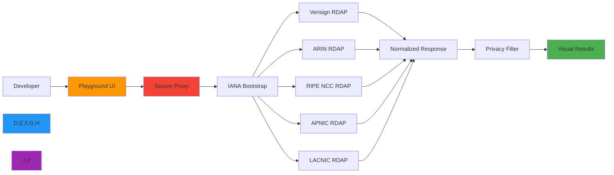
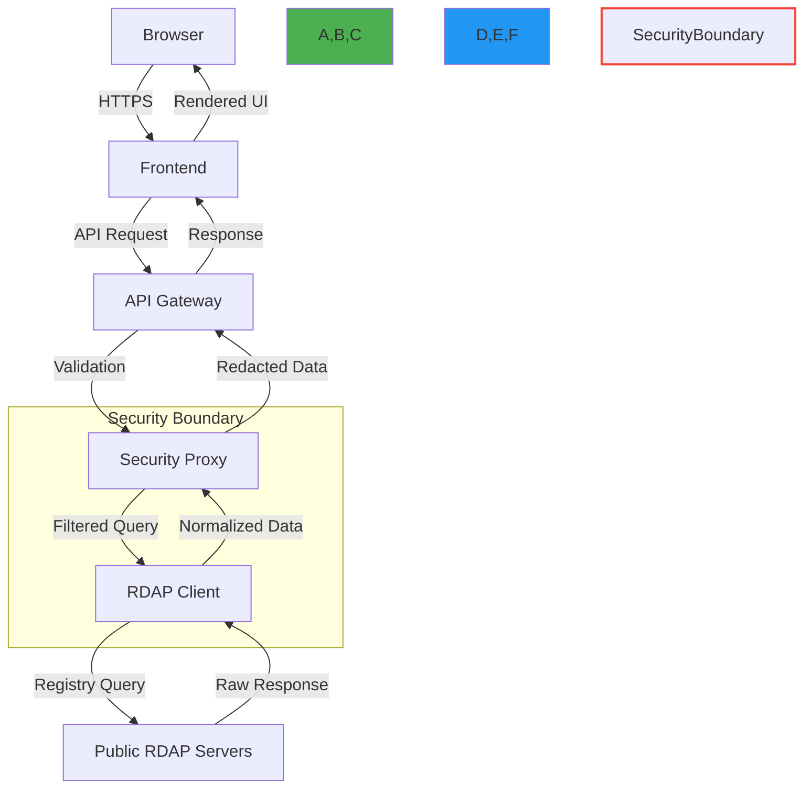

# نظرة عامة على بيئة الاختبار التفاعلية

> **ميزة مخطط لها** — يصف هذا التوثيق وظائف قيد التطوير وغير متوفرة في الإصدار الحالي (v0.1.8). قد تتغير التفاصيل قبل الإطلاق.

**الغرض**: بيئة تفاعلية لاستكشاف قدرات RDAPify دون الحاجة إلى تثبيت، تتميز بتنفيذ الاستعلامات في الوقت الفعلي وأدوات التصور ومرافق تصحيح الأخطاء
**ذات صلة**: [بيئة اختبار API](api_playground.md) | [معرض الأمثلة](examples.md) | [مصحح الأخطاء المرئي](visual_debugger.md) | [البدء السريع](../getting-started/five_minutes.md)
**وقت القراءة**: 4 دقائق
**نصيحة مهنية**: استخدم اختصارات لوحة المفاتيح (`Ctrl+Enter` أو `Cmd+Enter`) لتنفيذ الاستعلامات فوراً في أي لوحة من بيئة الاختبار

## لماذا تستخدم بيئة الاختبار؟

توفر بيئة اختبار RDAPify بيئة متصفح مبنية على الصفر لاستكشاف بروتوكولات بيانات التسجيل مع حماية أمنية وخصوصية على مستوى المؤسسات. وهي مثالية لـ:

- **التحقق السريع**: اختبار استعلامات RDAP قبل التطبيق في تطبيقاتك
- **أداة التعلم**: فهم هياكل استجابة RDAP وسلوك التطبيع
- **مساعد في تصحيح الأخطاء**: تصور مسارات الاستعلام وعمليات اكتشاف السجل
- **اختبار الأمان**: التحقق من سلوك حماية SSRF واختزال البيانات الشخصية
- **التعاون بين الفريق**: مشاركة نتائج الاستعلام مع الزملاء عبر روابط مباشرة
- **التحقق من الامتثال**: تأكيد ممارسات التعامل مع البيانات قبل النشر



## الميزات الأساسية لبيئة الاختبار

### 1. منشئ الاستعلامات التفاعلي
```typescript
// Playground query example - automatically executed
{
  domain: "example.com",
  options: {
    privacy: true,
    includeRaw: false,
    timeout: 5000,
    cache: true
  }
}
```
- **الإكمال التلقائي الذكي**: اقتراحات حقول خاصة بالسجل
- **مكتبة القوالب**: استعلامات مبنية مسبقاً لحالات الاستخدام الشائعة
- **تاريخ الاستعلامات**: الوصول إلى استعلاماتك السابقة عبر الجلسات
- **شرائح المعاملات**: ضبط المهلات الزمنية وTTL للتخزين المؤقت وإعدادات الأمان بصرياً

### 2. تصور متعدد النطاقات
- **الرسوم البيانية للشبكة**: تصور العلاقات بين النطاقات والمسجلين وجهات الاتصال
- **طرق العرض الزمنية**: تتبع تاريخ التسجيل وتغييرات الملكية
- **رسم الخرائط الجغرافي**: رؤية مواقع السجل ومسارات تدفق البيانات
- **وضع المقارنة**: تحليل جانبي لنطاقات متعددة

### 3. ضوابط الأمان والخصوصية
تُنفَّذ جميع استعلامات بيئة الاختبار عبر وكيل أمان مُقوَّى مع:
- **اختزال تلقائي للبيانات الشخصية**: التعامل مع البيانات المتوافق مع GDPR/CCPA
- **حماية SSRF**: لا وصول إلى الشبكات الداخلية أو نطاقات IP الخاصة
- **تحديد معدل الطلبات**: سياسات الاستخدام العادل لمنع إساءة استخدام السجل
- **تسجيل التدقيق**: بيانات تعريف الاستعلام مُخزَّنة لمدة 24 ساعة فقط (لا بيانات شخصية)
- **تقليل البيانات**: يُحتفظ فقط بالحقول الأساسية في سجلات الاستعلام

> **إشعار الخصوصية**: استعلامات بيئة الاختبار مُجهَّلة ولا ترتبط أبداً بهويتك. لا يوجد تخزين دائم لنتائج الاستعلام. راجع [سياسة الخصوصية](../../PRIVACY.md) للتفاصيل.

## معمارية بيئة الاختبار

تُنفِّذ بيئة الاختبار معمارية آمنة وموزعة مصممة للسلامة والأداء:

### تصميم حدود الأمان


### إدارة الموارد
- **مهلات الاستعلام**: الحد الأقصى لوقت التنفيذ 5 ثوانٍ
- **الحدود المتزامنة**: 3 استعلامات متزامنة لكل جلسة
- **حجم النتيجة**: الاستجابات محدودة بـ 1 ميجابايت لمنع الإساءة
- **عزل الجلسة**: يعمل كل مستخدم في سياق تنفيذ معزول
- **تحسين البدء البارد**: حاويات مُسخَّنة مسبقاً لتنفيذ الاستعلامات فوراً

## البدء مع بيئة الاختبار

### 1. استعلام نطاق أساسي
1. انتقل إلى [playground.rdapify.dev](https://playground.rdapify.dev)
2. اكتب `example.com` في شريط البحث
3. انقر "تنفيذ" أو اضغط `Ctrl+Enter`
4. اعرض النتائج المُطبَّعة مع اختزال تلقائي للبيانات الشخصية

### 2. استكشاف الاستعلامات المتقدمة
```json
{
  "query": "google.com",
  "options": {
    "includeRaw": true,
    "cacheBuster": true,
    "bootstrap": {
      "ianaUrl": "https://data.iana.org/rdap/dns.json"
    }
  }
}
```
- تفعيل الوضع الخبير للخيارات المتقدمة
- مقارنة الاستجابات الخام مقابل المُطبَّعة
- تصور عملية اكتشاف السجل
- تصدير النتائج بصيغة JSON أو CSV

### 3. ميزات التعاون
- **روابط المشاركة**: إنشاء روابط دائمة لاستعلامات محددة
- **طرق العرض المُضمَّنة**: نسخ كود iframe لتضمين نتائج بيئة الاختبار في التوثيق
- **تصدير API**: تحويل استعلامات بيئة الاختبار إلى كود Node.js أو Python أو cURL
- **مساحات العمل الجماعية**: (للمؤسسات) إنشاء مجموعات استعلام مشتركة مع ضوابط الوصول

## الوثائق ذات الصلة

| المستند | الوصف | المسار |
|---------|-------|--------|
| [بيئة اختبار API](api_playground.md) | استكشاف تفاعلي لنقاط نهاية API | [api_playground.md](api_playground.md) |
| [معرض الأمثلة](examples.md) | أمثلة عملية ومتقدمة | [examples.md](examples.md) |
| [مصحح الأخطاء المرئي](visual_debugger.md) | تصحيح أخطاء التنفيذ المرئي | [visual_debugger.md](visual_debugger.md) |
| [البدء في خمس دقائق](../getting-started/five_minutes.md) | دليل البدء السريع | [../getting-started/five_minutes.md](../getting-started/five_minutes.md) |

[← العودة إلى بيئة الاختبار](../README.md)
