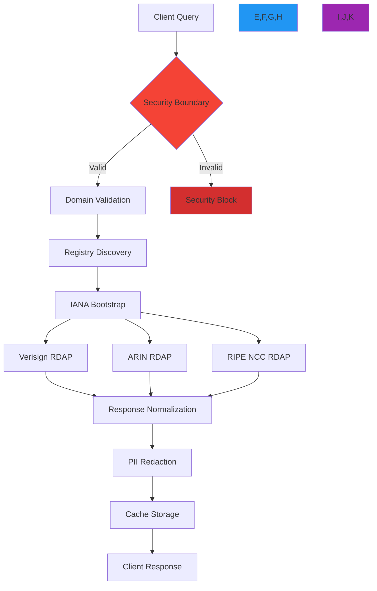
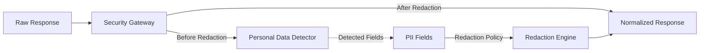

# مصحح الأخطاء المرئي

> **ميزة مخطط لها** — يصف هذا التوثيق وظائف قيد التطوير وغير متوفرة في الإصدار الحالي (v0.1.8). قد تتغير التفاصيل قبل الإطلاق.

**الغرض**: بيئة تصحيح أخطاء تفاعلية لتصور تنفيذ استعلامات RDAP وتدفقات البيانات وحدود الأمان في الوقت الفعلي مع تشخيصات على مستوى المؤسسات
**ذات صلة**: [بيئة اختبار API](api_playground.md) | [معرض الأمثلة](examples.md) | [النظرة العامة](overview.md) | [دليل معالجة الأخطاء](../guides/error_handling.md)
**وقت القراءة**: 7 دقائق
**نصيحة مهنية**: استخدم زر `Debug` في أي استعلام في بيئة الاختبار لتشغيل مصحح الأخطاء المرئي فوراً مع آثار التنفيذ وتصور سياق الأمان

## لماذا يُعدّ تصحيح الأخطاء المرئي مهماً لتطبيقات RDAP

تتضمن استعلامات RDAP عمليات متعددة الخطوات المعقدة عبر الأنظمة الموزعة مع حدود أمنية حرجة. تفشل طرق تصحيح الأخطاء التقليدية في الكشف عن السياق الكامل المطلوب لاستكشاف الأخطاء وتحسينها:



### قيمة مصحح الأخطاء المرئي
- **الشفافية الأمنية**: رؤية كيفية تحويل حماية SSRF واختزال البيانات الشخصية للبيانات في كل خطوة
- **رؤى الأداء**: تحديد الاختناقات في خطوط أنابيب اكتشاف السجل والتطبيع
- **سياق الأخطاء**: فهم نقاط الفشل مع انتقالات آلة الحالة للخطأ المرئية
- **سلالة البيانات**: تتبع مسار البيانات الحساسة عبر النظام مع علامات امتثال GDPR
- **تصور متعدد السجلات**: مقارنة السلوك عبر تطبيقات خوادم RDAP المختلفة

## الميزات الأساسية لمصحح الأخطاء

### 1. تصور الجدول الزمني للتنفيذ

يوفر مصحح الأخطاء عرضاً زمنياً لتنفيذ الاستعلام مع قياسات توقيت دقيقة:

```typescript
// Timeline data structure
interface ExecutionTimeline {
  queryId: string;
  timestamp: string;
  duration: number;
  steps: Array<{
    name: string;
    type: 'security' | 'network' | 'processing' | 'cache';
    startTime: number;
    duration: number;
    status: 'success' | 'warning' | 'error';
    metadata: Record<string, any>;
    children?: Array<any>;
  }>;
}

// Sample timeline for a domain query
const timeline = {
  queryId: 'dbg_5f8a9c',
  timestamp: '2025-12-07T14:32:18Z',
  duration: 128.6,
  steps: [
    {
      name: 'Security Validation',
      type: 'security',
      startTime: 0,
      duration: 4.2,
      status: 'success',
      metadata: {
        domain: 'example.com',
        ssrfCheck: 'passed',
        piiRedaction: 'enabled'
      }
    },
    {
      name: 'Registry Discovery',
      type: 'network',
      startTime: 4.2,
      duration: 38.7,
      status: 'success',
      metadata: {
        bootstrapUrl: 'https://data.iana.org/rdap/dns.json',
        registry: 'verisign'
      }
    },
    {
      name: 'Data Normalization',
      type: 'processing',
      startTime: 42.9,
      duration: 67.3,
      status: 'success',
      metadata: {
        rawFields: 24,
        normalizedFields: 14,
        transformations: 10
      }
    },
    {
      name: 'Cache Update',
      type: 'cache',
      startTime: 110.2,
      duration: 18.4,
      status: 'success',
      metadata: {
        cacheType: 'lru',
        ttl: 3600,
        key: 'domain:example.com'
      }
    }
  ]
};
```

### 2. تصور حدود الأمان
يُظهر مصحح الأخطاء بالضبط أين وكيف تُعدِّل ضوابط الأمان تدفقات البيانات:



**الحقول المُكتشَفة في هذا المثال**:
- `registrant.email` → `REDACTED (GDPR Art. 6(1)(f))`
- `registrant.phone` → `REDACTED (GDPR Art. 6(1)(f))`
- `admin.email` → `REDACTED (GDPR Art. 6(1)(f))`

### 3. تشخيص أخطاء الشبكة
```typescript
// Network error diagnostic interface
interface NetworkDiagnostics {
  registryEndpoint: string;
  connectionAttempts: ConnectionAttempt[];
  tlsCertificateInfo: {
    issuer: string;
    validFrom: string;
    validUntil: string;
    fingerprintSHA256: string;
    pinningStatus: 'matched' | 'failed' | 'not_configured';
  };
  dnsResolution: {
    hostname: string;
    resolvedIPs: string[];
    resolutionTimeMs: number;
    ssrfCheckResults: SSRFCheckResult[];
  };
}

interface SSRFCheckResult {
  ip: string;
  isPrivate: boolean;
  isLoopback: boolean;
  isLinkLocal: boolean;
  blocked: boolean;
  reason?: string;
}
```

### 4. مقارنة الاستجابات متعددة السجلات
```typescript
// Multi-registry comparison view
async function compareRegistryResponses(domain: string): Promise<ComparisonResult> {
  // Get responses from multiple potential registries
  const [verisignResponse, rdapOrgResponse] = await Promise.allSettled([
    client.domain(domain, { bootstrap: 'verisign' }),
    client.domain(domain, { bootstrap: 'rdap.org' })
  ]);

  return {
    domain,
    timestamp: new Date().toISOString(),
    registries: [
      {
        name: 'Verisign',
        status: verisignResponse.status,
        data: verisignResponse.status === 'fulfilled' ? verisignResponse.value : null,
        error: verisignResponse.status === 'rejected' ? verisignResponse.reason.message : null,
        responseTimeMs: 0 // Would be measured in real implementation
      },
      {
        name: 'RDAP.org',
        status: rdapOrgResponse.status,
        data: rdapOrgResponse.status === 'fulfilled' ? rdapOrgResponse.value : null,
        error: rdapOrgResponse.status === 'rejected' ? rdapOrgResponse.reason.message : null,
        responseTimeMs: 0
      }
    ],
    discrepancies: this.findDiscrepancies(verisignResponse, rdapOrgResponse)
  };
}
```

## لوحة المقاييس في الوقت الفعلي

يعرض مصحح الأخطاء المقاييس المباشرة لكل جلسة:

| المقياس | القيمة | الحالة |
|---------|-------|-------|
| متوسط الكمون | 128.6 مللي ثانية | جيد |
| معدل إصابة التخزين المؤقت | 78% | ممتاز |
| حالة حماية SSRF | نشطة | محمي |
| معدل اختزال البيانات الشخصية | 100% | متوافق |
| معدل الأخطاء (آخر 5 دقائق) | 0.2% | طبيعي |
| استعلامات ناجحة (الجلسة) | 47 | - |

## دليل سريع لتصحيح الأخطاء الشائعة

| الخطأ | السبب المحتمل | كيف يساعد مصحح الأخطاء |
|-------|-------------|----------------------|
| `SSRFProtectionError` | IP مستهدف محجوب | يُظهر نتائج فحص IP وسبب الحجب |
| `RegistryNotFound` | فشل IANA bootstrap | يصور خطوات اكتشاف السجل والفشل |
| `TimeoutError` | استجابة بطيئة من السجل | يُحدد الخطوات البطيئة في الجدول الزمني |
| `CertificateError` | مشكلة TLS/SSL | يعرض تفاصيل الشهادة وفشل التحقق |
| `RateLimitError` | كثرة الطلبات | يُظهر حالة تحديد المعدل وتوقيت الاستعادة |

[← العودة إلى بيئة الاختبار](../README.md)
