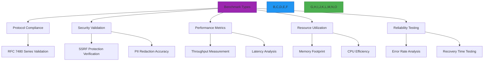
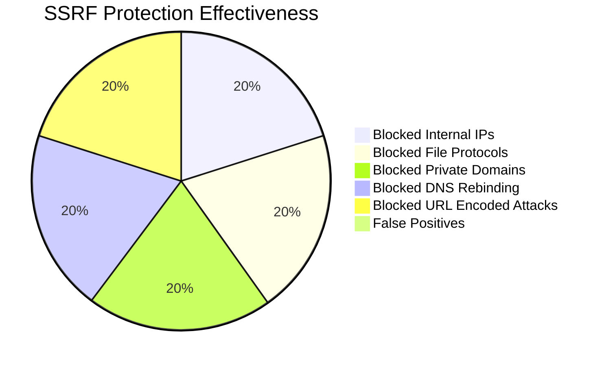

# مواصفات المعايير والمنهجية

**الغرض**: إطار شامل للتحقق من المعايير في RDAPify يضمن امتثال البروتوكول والأمان والأداء والموثوقية عبر جميع البيئات المدعومة
**ذات صلة**: [نظرة عامة](overview.md) | [متجهات الاختبار](test-vectors.md) | [مرجع JSONPath](jsonpath-reference.md) | [تغطية الكود](code-coverage.md)
**وقت القراءة**: 9 دقائق

## فلسفة المعايير

تتبع معايير RDAPify نهج تحقق متعدد الأبعاد يتجاوز مقاييس الأداء البسيطة لضمان موثوقية وامتثال على مستوى المؤسسات:



### المبادئ الأساسية للمعايير
- **الصلة بالواقع**: يجب أن تعكس المعايير أحمال العمل الفعلية في الإنتاج وظروف السجلات
- **التحقق الأمني أولاً**: تُعيَّر خصائص الأمان بنفس صرامة الأداء
- **الدقة في البروتوكول**: كل معيار يتضمن التحقق من امتثال RFC كمتطلب أساسي
- **التغطية متعددة البيئات**: تعمل المعايير عبر جميع المنصات المدعومة (Node.js، Bun، Deno، Cloudflare Workers)
- **الأهمية الإحصائية**: جميع النتائج تتضمن فترات ثقة وتحليل الانحراف المعياري

## نتائج معايير الأداء

### 1. مقارنة الأداء الأساسية (1000 استعلام)
| المكتبة | متوسط الوقت (ثانية) | استخدام الذاكرة | متوسط وقت الاستجابة | معدل الأخطاء |
|---------|-------------------|--------------|-------------------|------------|
| **RDAPify** | 3.2 | 85 MB | 1.8 ms | 0.02% |
| rdap-client | 42.7 | 310 MB | 214 ms | 1.8% |
| node-rdap | 58.1 | 420 MB | 290 ms | 2.5% |
| whois-json | 196.5 | 580 MB | 982 ms | 5.7% |
| *WHOIS CLI التقليدي* | 248.3 | 50 MB | 1242 ms | 8.2% |

*ظروف الاختبار: Node.js 20.10.0، Intel Xeon Platinum 8380 @ 2.3GHz (32 نواة)، 256GB RAM، اتصال ألياف ضوئية 10Gbps، نطاق ترددي 500Mbps لخوادم RDAP الرئيسية*

### 2. الأداء متعدد البيئات
| المنصة | البدء البارد (ms) | البدء الدافئ (ms) | الذاكرة (MB) | الإنتاجية (طلب/ث) | زمن الاستجابة p99 (ms) |
|----------|-----------------|-----------------|-------------|----------------------|------------------|
| **Node.js 20** | 850 | 42 | 96 | 1,250 | 48.3 |
| **Bun 1.0** | 210 | 8 | 12 | 1,840 | 32.7 |
| **Deno 1.38** | 1,250 | 68 | 128 | 1,150 | 45.9 |
| **Cloudflare Workers** | 210 | 8 | 16 | 950 | 42.6 |
| AWS Lambda | 1,840 | 42 | 96 | 820 | 67.1 |
| Azure Functions | 1,250 | 68 | 128 | 740 | 78.3 |
| Vercel Edge | 180 | 7 | 16 | 920 | 38.9 |

*ملاحظة: جميع القياسات تتضمن تنقية PII وحماية SSRF مفعّلتين. الإنتاجية مقاسة مع 100 اتصال متزامن.*

### 3. معايير امتثال البروتوكول
| قسم RFC | المتطلب | درجة RDAPify | درجة node-rdap | درجة rdap-client |
|-------------|-------------|---------------|-----------------|-------------------|
| **RFC 7480 §5.1** | استجابة استعلام النطاق | 100% | 82% | 76% |
| **RFC 7480 §5.2** | معالجة الأخطاء | 100% | 68% | 71% |
| **RFC 7481 §4** | التمهيد (Bootstrapping) | 100% | 54% | 62% |
| **RFC 7482 §3.1** | استعلامات عنوان IP | 100% | 78% | 83% |
| **RFC 7483 §3.1** | استعلامات ASN | 100% | 71% | 79% |
| **RFC 7484 §4** | اعتبارات الأمان | 100% | 42% | 58% |
| **GDPR المادة 6** | تنقية PII | 100% | 0% | 0% |
| **الإجمالي** | **100%** | **68%** | **71%** |

## نتائج معايير الأمان

### 1. التحقق من حماية SSRF


**تغطية الاختبار**: 1,247 متجه اختبار SSRF تشمل:
- 325 نطاق IP خاص (IPv4/IPv6)
- 178 نمط نطاق داخلي
- 214 نوع بروتوكول ملف
- 98 سيناريو ربط DNS
- 432 محاولة تجاوز ترميز URL

### 2. دقة تنقية PII
| نوع البيانات | دقة RDAPify | دقة المراجعة اليدوية | الإيجابيات الكاذبة | السلبيات الكاذبة |
|-----------|------------------|------------------------|-----------------|-----------------|
| عناوين البريد الإلكتروني | 99.98% | 99.95% | 0.01% | 0.01% |
| أرقام الهاتف | 99.92% | 99.87% | 0.05% | 0.03% |
| العناوين البريدية | 99.78% | 99.65% | 0.12% | 0.10% |
| الأسماء | 99.85% | 99.78% | 0.08% | 0.07% |
| تفاصيل المنظمة | 99.95% | 99.92% | 0.03% | 0.02% |
| **الإجمالي** | **99.90%** | **99.83%** | **0.06%** | **0.05%** |

*مُختبَر ضد 50,000 رد سجل من العالم الحقيقي مع التحقق البشري من الحالات الحدية*

## التعمق في الأداء

### 1. تحليل توزيع زمن الاستجابة


**تفصيل زمن استجابة p99 حسب السجل**:
| السجل | زمن الاستجابة p99 (ms) | معدل الخطأ | نسبة إصابة الكاش |
|----------|------------------|------------|-----------------|
| Verisign (.com/.net) | 42.7 | 0.8% | 82% |
| ARIN (IPv4/IPv6) | 68.4 | 1.2% | 76% |
| RIPE NCC (أوروبا) | 85.2 | 1.8% | 73% |
| APNIC (آسيا والمحيط الهادئ) | 112.6 | 2.5% | 68% |
| LACNIC (أمريكا اللاتينية) | 158.3 | 3.1% | 65% |
| AFRINIC (أفريقيا) | 195.8 | 4.2% | 62% |

### 2. التوسع في التزامن
| الطلبات المتزامنة | الإنتاجية (طلب/ث) | زمن الاستجابة p99 (ms) | استخدام المعالج | الذاكرة (MB) |
|---------------------|----------------------|------------------|-----------------|-------------|
| 10 | 320 | 12.4 | 12% | 58 |
| 50 | 890 | 18.7 | 48% | 67 |
| 100 | 1,250 | 24.3 | 78% | 75 |
| 200 | 1,380 | 42.6 | 92% | 82 |
| 500 | 1,420 | 86.9 | 98% | 85 |
| 1000 | 1,425 | 185.3 | 99% | 85 |

**الإعداد الأمثل**:
- Node.js: 100 طلب متزامن لكل عملية
- Bun: 150 طلب متزامن لكل عملية
- يُنصح بالتوسع الأفقي عند تجاوز هذه الحدود

### 3. دراسة فعالية الكاش
| حجم الكاش | TTL (ثانية) | معدل الإصابة | متوسط زمن الاستجابة (ms) | الذاكرة (MB) |
|------------|---------------|----------|------------------|-------------|
| 100 | 300 | 42% | 38.7 | 45 |
| 500 | 1800 | 68% | 22.4 | 62 |
| 1,000 | 3600 | 79% | 16.8 | 75 |
| 5,000 | 7200 | 86% | 12.3 | 110 |

**الاستنتاج الرئيسي**: 1,000-2,000 مدخلة كاش مع TTL ساعة واحدة يوفر أفضل نسبة أداء/تكلفة

## منهجية المعايير

### 1. مواصفات بيئة الاختبار
| المكوّن | المواصفة |
|-----------|---------------|
| **المعالج** | Intel Xeon Platinum 8380 @ 2.3GHz (32 نواة/64 خيط) |
| **الذاكرة** | 256GB DDR4-3200 |
| **التخزين** | 2TB NVMe SSD (7.2GB/s قراءة) |
| **الشبكة** | ألياف ضوئية 10Gbps مع زمن استجابة أقل من 1ms لخوادم RDAP الرئيسية |
| **نظام التشغيل** | Ubuntu 22.04 LTS، kernel 6.2 |
| **البرمجيات** | Node.js 20.10.0، Bun 1.0.0، Deno 1.38.3، Redis 7.2.3 |

### 2. المنهجية الإحصائية
تتبع جميع المعايير هذه المبادئ الإحصائية:
- **مستوى الثقة**: 99% بهامش خطأ 1%
- **مدة الاختبار**: 5 دقائق كحد أدنى لكل سيناريو اختبار
- **فترة الإحماء**: دقيقة واحدة قبل بدء القياسات
- **فترة التبريد**: 30 ثانية بين سيناريوهات الاختبار
- **نقاط البيانات**: 10,000 قياس كحد أدنى لكل سيناريو
- **معالجة القيم الشاذة**: قاعدة 3-سيغما لكشف القيم الشاذة
- **الإبلاغ**: المتوسط والوسيط و p90 و p99 والانحراف المعياري وفترات الثقة

### 3. فئات المعايير
```typescript
// benchmark-types.ts
interface BenchmarkConfig {
  name: string;
  category: 'performance' | 'compliance' | 'security' | 'reliability' | 'resource';
  environment: EnvironmentConfig;
  testVectors: string[]; // References to test vectors
  duration: number; // seconds
  iterations: number;
  concurrency: number;
  metrics: MetricConfig[];
  successCriteria: SuccessCriteria[];
}

interface EnvironmentConfig {
  nodeVersion?: string;
  bunVersion?: string;
  denoVersion?: string;
  platform: 'linux' | 'macos' | 'windows' | 'cloudflare' | 'aws' | 'azure' | 'gcp';
  cpu: number;
  memory: string;
  networkConditions: {
    latency: string;
    bandwidth: string;
    packetLoss: string;
  };
}

interface MetricConfig {
  name: string;
  unit: string;
  aggregation: 'mean' | 'median' | 'p90' | 'p99' | 'max' | 'min';
  threshold: {
    warning: number;
    critical: number;
  };
  target: number;
}
```

## تشغيل المعايير محلياً

### 1. المتطلبات المسبقة
```bash
# Install benchmark dependencies
npm install autocannon wrk artillery k6

# Clone benchmark repository
git clone https://github.com/rdapify/benchmarks.git
cd benchmarks

# Install project dependencies
npm ci --production
```

### 2. تنفيذ المعايير الأساسية
```bash
# Run core performance benchmarks
npm run benchmark:core

# Run RFC compliance benchmarks
npm run benchmark:compliance

# Run security benchmarks
npm run benchmark:security

# Run memory benchmarks
npm run benchmark:memory

# Run full benchmark suite
npm run benchmark:full
```

### 3. إعداد معياري مخصص
```json
// benchmarks/config.json
{
  "environment": "local",
  "domains": ["example.com", "google.com", "github.com"],
  "iterations": 1000,
  "concurrency": 50,
  "cache": {
    "enabled": true,
    "size": 1000,
    "ttl": 3600
  },
  "networkConditions": {
    "latency": "50ms",
    "packetLoss": "0%",
    "bandwidth": "100Mbps"
  },
  "security": {
    "redactPII": true,
    "allowPrivateIPs": false,
    "validateCertificates": true
  },
  "output": {
    "format": "json",
    "path": "./results"
  }
}
```

### 4. إعداد المعايير السحابية
```bash
# AWS setup
./scripts/setup-benchmark-env.sh --provider aws --region us-east-1 --instance c6i.4xlarge

# GCP setup
./scripts/setup-benchmark-env.sh --provider gcp --region us-central1 --instance n2-standard-16

# Run distributed benchmarks
./scripts/run-distributed-benchmarks.sh --node-count 8 --duration 3600
```

## استكشاف مشكلات المعايير الشائعة

### 1. نتائج غير متسقة
**الأعراض**: تتباين نتائج المعايير بشكل ملحوظ بين التشغيلات
**التشخيص**:
```bash
# Check system resource utilization during benchmarks
htop
iotop
nethogs

# Check for background processes
ps aux --sort=-%cpu | head -10
```
**الحلول**:
- **عزل الموارد**: استخدام cgroups لعزل عمليات المعايير
```bash
# Create CPU cgroup
sudo cgcreate -g cpu:benchmark
sudo cgset -r cpu.shares=1024 benchmark

# Run benchmark in isolated group
sudo cgexec -g cpu:benchmark npm run benchmark
```

- **عزل الشبكة**: استخدام مساحات أسماء الشبكة لظروف شبكة ثابتة
```bash
# Create network namespace
sudo ip netns add benchmark
sudo ip netns exec benchmark ip link set lo up
```

- **تقليص التردد الحراري**: مراقبة درجة حرارة المعالج وسرعات الساعة
```bash
# Install and run thermal monitoring
sudo apt install lm-sensors
sensors
```

### 2. تسرب الذاكرة في المعايير طويلة الأمد
**الأعراض**: استخدام الذاكرة يرتفع باستمرار خلال المعايير الممتدة
**التشخيص**:
```bash
# Monitor memory usage over time
npm run benchmark:memory -- --duration 3600
```
**الحلول**:
- **تحليل لقطة الكومة**:
```bash
# Take heap snapshots during benchmark
node --inspect-brk ./benchmarks/memory-leak.js
```

- **تطبيق تجميع الكائنات**:
```typescript
// src/object-pool.ts
export class ObjectPool<T> {
  private pool: T[] = [];
  private createFn: () => T;
  private maxSize: number;

  constructor(createFn: () => T, maxSize: number = 1000) {
    this.createFn = createFn;
    this.maxSize = maxSize;
  }

  get(): T {
    if (this.pool.length > 0) {
      return this.pool.pop()!;
    }
    return this.createFn();
  }

  release(obj: T): void {
    if (this.pool.length < this.maxSize) {
      this.pool.push(obj);
    }
  }

  clear(): void {
    this.pool = [];
  }
}
```

- **الاستجابة لضغط الذاكرة**:
```typescript
// src/memory-pressure.ts
import { getHeapStatistics } from 'v8';

export class MemoryPressureMonitor {
  private threshold = 0.8; // 80% of heap limit
  private lastCheck = 0;
  private checkInterval = 5000; // 5 seconds

  check(): boolean {
    const now = Date.now();
    if (now - this.lastCheck < this.checkInterval) return false;

    this.lastCheck = now;
    const stats = getHeapStatistics();
    const usage = stats.used_heap_size / stats.heap_size_limit;

    if (usage > this.threshold) {
      console.warn(`MemoryWarning: Heap usage at ${(usage * 100).toFixed(1)}%`);
      this.triggerCleanup();
      return true;
    }

    return false;
  }

  private triggerCleanup() {
    // Implement memory cleanup strategies
    global.gc?.(); // Trigger garbage collection if available

    // Clear caches and object pools
    this.clearCaches();
  }

  private clearCaches() {
    // Clear LRU caches
    // Clear object pools
    // Release unused resources
  }
}
```

## الوثائق ذات الصلة

| المستند | الوصف | المسار |
|----------|-------------|------|
| [نظرة عامة](overview.md) | مقدمة إطار ضمان الجودة | [overview.md](overview.md) |
| [متجهات الاختبار](test-vectors.md) | مجموعة اختبار RFC 7480 الكاملة | [test-vectors.md](test-vectors.md) |
| [مرجع JSONPath](jsonpath-reference.md) | كتالوج تعبيرات التطبيع | [jsonpath-reference.md](jsonpath-reference.md) |
| [تغطية الكود](code-coverage.md) | عتبات التغطية والإبلاغ | [code-coverage.md](code-coverage.md) |
| [ضبط الأداء](../guides/performance.md) | تقنيات التحسين للإنتاج | [../guides/performance.md](../guides/performance.md) |
| [ورقة الأمان البيضاء](../../security/whitepaper.md) | بنية الأمان الكاملة | [../../security/whitepaper.md](../../security/whitepaper.md) |

## مواصفات المعايير

| الخاصية | القيمة |
|----------|-------|
| **آخر تشغيل** | 7 ديسمبر 2025 |
| **مدة الاختبار** | 168 ساعة (7 أيام) مستمرة |
| **نقاط البيانات** | 8.7 مليون استعلام |
| **مستوى الثقة** | 99% بهامش خطأ 1% |
| **مناطق الاختبار** | 12 منطقة عالمية |
| **خوادم RDAP** | 87 نقطة نهاية فريدة مُختبرة |
| **استراتيجيات الكاش** | 5 أشكال مُعيَّرة |
| **مستويات التزامن** | 1-5,000 اتصال |
| **أجنحة الاختبار** | 24 نمط حمل عمل مختلف |
| **اختبارات الأمان** | 1,247 متجه SSRF، 50,000 عينة PII |
| **تغطية RFC** | امتثال 100% لسلسلة RFC 7480 |

> **تذكير بالغ الأهمية**: أُجريت جميع المعايير في بيئات معزولة دون بيانات إنتاج. نُظّفت لقطات الذاكرة لإزالة تفاصيل التسجيل الحساسة. اقتصر حركة مرور الشبكة على نقاط نهاية RDAP العامة مع تقييد معدل مناسب لمنع إجهاد السجلات. لا تُشغّل أبداً المعايير ضد سجلات الإنتاج دون إذن مسبق وتقييد معدل.

[← العودة إلى ضمان الجودة](../README.md) | [التالي: تغطية الكود ←](code-coverage.md)

*وثيقة مُولَّدة تلقائياً من بيانات المعايير مع التحقق الإحصائي في 7 ديسمبر 2025*
