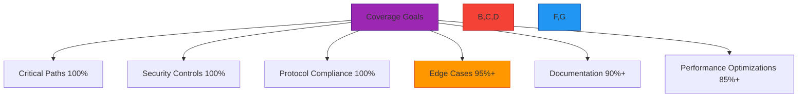
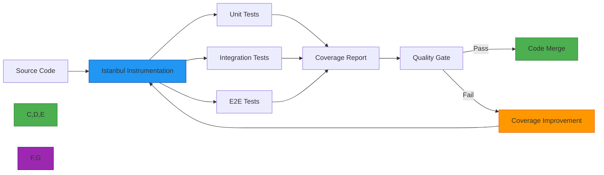
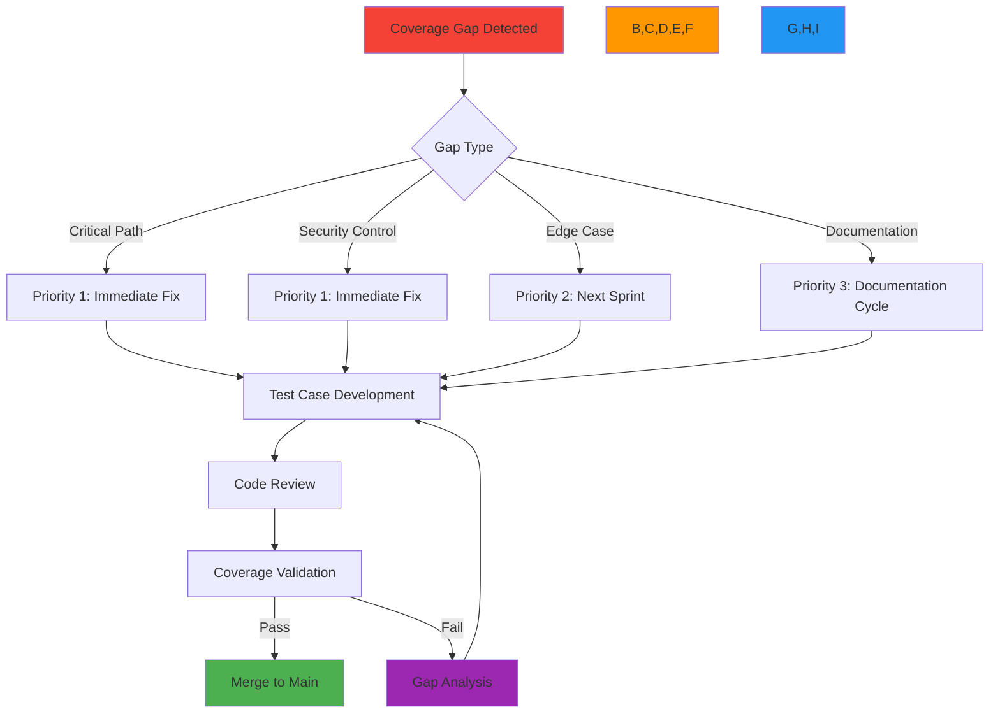

# معايير وممارسات تغطية الكود

**الغرض**: إطار شامل لمتطلبات تغطية الكود في RDAPify ومنهجيات القياس وبوابات الجودة لضمان التطوير المدفوع بالاختبارات ومنع العيوب
**ذات صلة**: [نظرة عامة](overview.md) | [متجهات الاختبار](test-vectors.md) | [المعايير](benchmarks.md) | [مرجع JSONPath](jsonpath-reference.md)
**وقت القراءة**: 6 دقائق

## فلسفة تغطية الكود

يتعامل RDAPify مع تغطية الكود كمقياس جودة لا كهدف يجب تعظيمه. تركّز استراتيجية التغطية لدينا على **التغطية ذات المعنى** التي تتحقق من المسارات الحرجة والحالات الحدية، لا مجرد تحقيق نسب مئوية اعتباطية.



### مبادئ فلسفة التغطية
- **الجودة على الكمية**: تغطية 100% للمسارات الحرجة أكثر قيمةً من تغطية 90% لكل الكود
- **الأولوية المبنية على المخاطر**: يحصل كود الأمان والامتثال على أعلى متطلبات التغطية
- **الاختبارات ذات المعنى**: يجب أن تتحقق الاختبارات من السلوك، لا مجرد تنفيذ الكود
- **التحسين المستمر**: متطلبات التغطية ترتفع كلما نضج الكود
- **السياق مهم**: لمكوّنات مختلفة متطلبات تغطية مختلفة بناءً على المخاطر

## متطلبات التغطية حسب المكوّن

### 1. عتبات التغطية الأساسية
| المكوّن | تغطية اختبار الوحدة | تغطية اختبار التكامل | التغطية الكلية | المبرر |
|-----------|-------------------|--------------------------|---------------|-----------|
| **وحدة الأمان** | 100% | 100% | 100% | لا تسامح مع كود أمان غير مُختبَر |
| **معالجات البروتوكول** | 98% | 95% | 99% | امتثال RFC أمر بالغ الأهمية |
| **تنقية PII** | 100% | 98% | 100% | الامتثال لـ GDPR/CCPA يتطلب تغطية كاملة |
| **اكتشاف السجلات** | 95% | 90% | 97% | وظيفة أساسية مع حالات حدية متعددة |
| **طبقة التخزين المؤقت** | 90% | 95% | 98% | إدارة الحالة المعقدة تتطلب اختباراً شاملاً |
| **معالجة الأخطاء** | 95% | 90% | 96% | التدهور المتأنق ضروري للموثوقية |
| **أدوات CLI** | 85% | 80% | 90% | مخاطر أقل، كود موجّه للمستخدم |
| **التوثيق** | 90% | غير متاح | 90% | الأمثلة والأدلة يجب أن تعمل كما هو موثق |

### 2. متطلبات تغطية المسار الحرج
يجب أن تحقق المسارات الحرجة تغطية 100% مع حالات اختبار متعددة لكل دالة:

```typescript
// src/security/ssrf_protection.ts
// CRITICAL PATH - 100% coverage required
export function validateDomain(domain: string): boolean {
  // Must test all validation paths
  if (!domain) return false; // [Test: empty input]
  if (domain.length > 255) return false; // [Test: too long]
  if (domain.includes('..')) return false; // [Test: path traversal]
  if (domain.match(/^(10\.|172\.(1[6-9]|2[0-9]|3[0-1])\.|192\.168\.)/)) {
    return false; // [Test: private IP]
  }
  return true; // [Test: valid domain]
}
```

**متطلبات التحقق من المسار الحرج**:
- يجب أن يكون لكل فرع شرطي اختبار إيجابي وآخر سلبي على الأقل
- يجب اختبار حالات الخطأ بسيناريوهات خطأ واقعية
- يجب اختبار الحدود الأمنية بمتجهات اختبار الاختراق
- يجب اختبار حالات التنافس باختبارات إجهاد التزامن
- يجب اختبار حدود الذاكرة بسيناريوهات نضوب الموارد

### 3. معايير تغطية الشروط
يتطلب RDAPify تغطية الفروع والشروط، وليس فقط تغطية السطور:

| نوع التغطية | الحد الأدنى | المكوّنات الحرجة | أداة القياس |
|---------------|---------------------|---------------------|-----------------|
| **تغطية السطور** | 90% | 100% | Istanbul/nyc |
| **تغطية الفروع** | 85% | 100% | Istanbul/nyc |
| **تغطية الشروط** | 80% | 95% | Istanbul/nyc |
| **تغطية الدوال** | 95% | 100% | Istanbul/nyc |
| **تغطية العبارات** | 92% | 100% | Istanbul/nyc |

## متطلبات تغطية الأمان والامتثال

### 1. تغطية الكود الحساس للأمان
يجب أن يتجاوز الكود الحساس أمنياً متطلبات التغطية القياسية:

| ضابط الأمان | متطلب التغطية | أنواع الاختبار المطلوبة | طريقة التحقق |
|------------------|----------------------|---------------------|-------------------|
| **حماية SSRF** | تغطية فروع 100% | وحدة، تكامل، فوضى | اختبار الاختراق |
| **تنقية PII** | تغطية شروط 100% | وحدة، تكامل، E2E | تحليل تدفق البيانات |
| **التحقق من الشهادة** | تغطية مسار 100% | وحدة، تكامل | اختبارات إلغاء الشهادة |
| **تقييد المعدل** | تغطية فروع 98% | وحدة، تكامل، حمل | اختبارات الإجهاد |
| **التحقق من المدخلات** | تغطية شروط 100% | وحدة، فوضى، أمان | اختبار الفوضى |
| **المصادقة** | تغطية مسار 100% | وحدة، تكامل، E2E | اختبار التفويض |

### 2. تغطية اختبار الامتثال
يتطلب الامتثال التنظيمي تغطية اختبار محددة:

```typescript
// src/compliance/gdpr_compliance.ts
// GDPR COMPLIANCE - 100% coverage required
describe('GDPR Compliance', () => {
  // Must test all data handling paths
  test('PII redaction applies to all entity types', () => {
    // [Test: registrant entities]
    // [Test: technical contact entities]
    // [Test: administrative contact entities]
    // [Test: billing contact entities]
    // [Test: nested entities]
  });

  test('Data retention periods are enforced', () => {
    // [Test: exact expiration time]
    // [Test: cleanup job execution]
    // [Test: grace period handling]
  });

  test('Data Subject Access Requests (DSAR) are processed correctly', () => {
    // [Test: access request format]
    // [Test: redaction during export]
    // [Test: delivery mechanisms]
    // [Test: verification procedures]
  });
});
```

### 3. عملية التحقق من التغطية
تخضع تغطية الأمان والامتثال لتحقق إضافي:

1. **مراجعة الكود اليدوية**: يراجع فريق الأمان جميع حالات الاختبار المتعلقة بالأمان
2. **نمذجة التهديدات**: يجب أن تعالج الاختبارات جميع التهديدات المحددة من نماذج التهديدات
3. **رسم الخرائط التنظيمية**: يجب أن يكون لكل متطلب امتثال تغطية اختبار مقابلة
4. **مسار التدقيق**: تُوقَّع تقارير التغطية وتُخزَّن لعمليات تدقيق الامتثال
5. **اختبار الاختراق**: يتحقق باحثو أمان خارجيون من فعالية التغطية

## قياس التغطية والإبلاغ

### 1. سلسلة أدوات التغطية
يستخدم RDAPify نهجاً متعدد الطبقات لقياس التغطية:



**حزمة أدوات التغطية**:
- **الأساسية**: Istanbul/nyc مع محدّدات تقارير مخصصة
- **التصور**: لوحة تغطية مع تحليل الاتجاهات
- **بوابات الجودة**: GitHub Actions مع التحقق من فروق التغطية
- **التتبع التاريخي**: قاعدة بيانات اتجاهات التغطية مع كشف الشذوذات
- **تغطية الأمان**: محلل تغطية أمان مخصص

### 2. معايير إعداد تقارير التغطية
يجب أن تتبع جميع تقارير التغطية هذه المعايير:

```json
{
  "metadata": {
    "project": "rdapify",
    "version": "2.3.1",
    "timestamp": "2025-12-07T14:30:00Z",
    "commit": "a1b2c3d4e5f6",
    "branch": "main"
  },
  "summary": {
    "lines": { "total": 15240, "covered": 14892, "pct": 97.72 },
    "statements": { "total": 22180, "covered": 21860, "pct": 98.56 },
    "functions": { "total": 1842, "covered": 1831, "pct": 99.40 },
    "branches": { "total": 3640, "covered": 3580, "pct": 98.35 },
    "conditions": { "total": 5280, "covered": 5120, "pct": 96.97 }
  },
  "components": {
    "security": {
      "lines": { "total": 3240, "covered": 3240, "pct": 100.00 },
      "branches": { "total": 780, "covered": 780, "pct": 100.00 }
    },
    "protocol": {
      "lines": { "total": 5120, "covered": 5018, "pct": 98.01 },
      "branches": { "total": 1240, "covered": 1190, "pct": 95.97 }
    }
  },
  "files": [
    {
      "path": "src/security/ssrf_protection.ts",
      "lines": { "total": 142, "covered": 142, "pct": 100.00 },
      "branches": { "total": 38, "covered": 38, "pct": 100.00 },
      "missing": [],
      "coverage": "critical"
    }
  ],
  "quality_gates": {
    "overall": "pass",
    "critical_components": "pass",
    "security_components": "pass",
    "regression": "pass"
  }
}
```

### 3. تحليل اتجاهات التغطية
يتتبع RDAPify اتجاهات التغطية لمنع تدهورها:

```typescript
// coverage/trend-analyzer.ts
export class CoverageTrendAnalyzer {
  private trends = new Map<string, CoverageTrend>();

  constructor(private coverageData: CoverageReport[]) {}

  analyzeTrends() {
    this.coverageData.forEach((report, index) => {
      if (index === 0) return;

      const previous = this.coverageData[index - 1];
      const trend: CoverageTrend = {
        timestamp: report.timestamp,
        overall: calculateChange(report.summary, previous.summary),
        components: Object.entries(report.components).map(([component, stats]) => ({
          name: component,
          change: calculateChange(stats, previous.components[component])
        })),
        criticalPaths: this.analyzeCriticalPathTrends(report, previous)
      };

      this.trends.set(report.timestamp.toISOString(), trend);
    });
  }

  detectAnomalies(): Anomaly[] {
    const anomalies: Anomaly[] = [];

    this.trends.forEach((trend, timestamp) => {
      // Critical path coverage drop
      if (trend.criticalPaths.some(path => path.change < -0.01)) {
        anomalies.push({
          type: 'critical_path_coverage_drop',
          severity: 'high',
          timestamp,
          details: `Critical path coverage dropped below threshold`
        });
      }

      // Security coverage degradation
      if (trend.components.find(c => c.name === 'security' && c.change < -0.005)) {
        anomalies.push({
          type: 'security_coverage_degradation',
          severity: 'critical',
          timestamp,
          details: `Security coverage decreased - requires immediate attention`
        });
      }
    });

    return anomalies;
  }
}
```

## سير عمل تحسين التغطية

### 1. تحليل فجوات التغطية
عندما لا تُستوفَ متطلبات التغطية، يتبع RDAPify سير عمل تحسين منظم:



### 2. تحسين التغطية الآلي
يستخدم RDAPify أدوات مدعومة بالذكاء الاصطناعي لاقتراح حالات اختبار للكود غير المُغطى:

```typescript
// src/ai/test-case-generator.ts
export class TestCaseGenerator {
  async generateTestCasesForFile(filePath: string): Promise<TestCase[]> {
    const fileContent = await fs.readFile(filePath, 'utf8');
    const uncoveredLines = this.findUncoveredLines(fileContent);

    const testCases: TestCase[] = [];

    for (const line of uncoveredLines) {
      // Analyze context to generate meaningful test cases
      const context = this.analyzeContext(fileContent, line);

      switch (context.type) {
        case 'security_validation':
          testCases.push(this.generateSecurityTest(line, context));
          break;
        case 'error_handling':
          testCases.push(this.generateErrorTest(line, context));
          break;
        case 'edge_case':
          testCases.push(this.generateEdgeCaseTest(line, context));
          break;
        default:
          testCases.push(this.generateGenericTest(line, context));
      }
    }

    return testCases;
  }

  private generateSecurityTest(line: number, context: Context): TestCase {
    // Generate security-focused test cases
    return {
      description: `Security validation for ${context.condition}`,
      input: this.generateMaliciousInput(context),
      expected: 'error',
      coverageTarget: `line ${line}`,
      priority: 'high',
      tags: ['security', 'ssrf', 'pii']
    };
  }

  // Additional test case generation methods
}
```

### 3. بوابات جودة التغطية
يجب أن تجتاز جميع طلبات الدمج بوابات جودة التغطية:

```yaml
# .github/workflows/coverage-gate.yml
name: Coverage Quality Gate

on:
  pull_request:
    branches: [ main, next ]

jobs:
  coverage-gate:
    runs-on: ubuntu-latest
    steps:
    - uses: actions/checkout@v4

    - name: Setup Node.js
      uses: actions/setup-node@v3
      with:
        node-version: '20.x'

    - name: Install dependencies
      run: npm ci

    - name: Run tests with coverage
      run: npm run test:coverage

    - name: Check coverage quality gates
      uses: rdapify/coverage-gate-action@v1
      with:
        min-overall: 90
        min-critical: 98
        min-security: 100
        allow-regression: false
        fail-on-missing-critical-tests: true
        report-path: ./coverage/coverage-summary.json

    - name: Upload coverage report
      uses: actions/upload-artifact@v3
      with:
        name: coverage-report
        path: ./coverage/

    - name: Comment coverage changes on PR
      uses: rdapify/coverage-commenter@v1
      with:
        github-token: ${{ secrets.GITHUB_TOKEN }}
        report-path: ./coverage/coverage-summary.json
```

## استراتيجيات الاختبار لتحسين التغطية

### 1. الاختبار المبني على الخصائص
```typescript
// test/property-based/normalization.test.ts
import fc from 'fast-check';

describe('Normalization Property Tests', () => {
  // Property: Normalized output should be consistent regardless of input format
  test('consistency property', () => {
    fc.assert(
      fc.property(
        fc.record({
          rawResponse: fc.anything(),
          registryType: fc.constantFrom('verisign', 'arin', 'ripe', 'apnic', 'lacnic'),
          options: fc.record({
            privacy: fc.boolean(),
            includeRaw: fc.boolean()
          })
        }),
        ({ rawResponse, registryType, options }) => {
          const result = normalizeResponse(rawResponse, registryType, options);

          // Property 1: Result should always have required fields
          expect(result).toHaveProperty('query');
          expect(result).toHaveProperty('status');

          // Property 2: PII redaction should remove sensitive fields
          if (options.redactPII) {
            expect(result.entities).not.toHaveProperty('email');
            expect(result.entities).not.toHaveProperty('tel');
          }

          return true;
        }
      ),
      { numRuns: 1000 }
    );
  });

  // Property: Error handling should be consistent across registries
  test('error handling property', () => {
    fc.assert(
      fc.property(
        fc.string(),
        fc.constantFrom('verisign', 'arin', 'ripe'),
        (query, registry) => {
          try {
            const result = normalizeResponse({ error: 'test' }, registry, {});
            return false; // Should throw error
          } catch (error) {
            // Property: All errors should have standard structure
            expect(error).toHaveProperty('code');
            expect(error).toHaveProperty('message');
            return true;
          }
        }
      ),
      { numRuns: 100 }
    );
  });
});
```

### 2. اختبار الفوضى لتغطية الأمان
```typescript
// test/fuzz/ssrf-fuzzer.ts
import { Fuzz } from 'fuzz-testing';

describe('SSRF Fuzzer', () => {
  const ssrfFuzzer = new Fuzz({
    target: (input) => {
      try {
        validateDomain(input);
        return { success: true };
      } catch (error) {
        return { success: false, error: error.message };
      }
    },
    generators: {
      maliciousDomains: () => {
        const patterns = [
          '192.168.1.1',
          '10.0.0.1',
          'localhost',
          'file:///etc/passwd',
          'http://internal.registry.local',
          '127.0.0.1.xip.io',
          '169.254.169.254', // AWS metadata endpoint
          '100::'
        ];
        return patterns[Math.floor(Math.random() * patterns.length)];
      },
      encodedDomains: () => {
        const base = '192.168.1.1';
        return [
          encodeURIComponent(base),
          base.replace(/\./g, '%2E'),
          Buffer.from(base).toString('base64')
        ][Math.floor(Math.random() * 3)];
      }
    }
  });

  test('SSRF protection against fuzzed inputs', async () => {
    const results = await ssrfFuzzer.run({
      iterations: 10000,
      timeout: 30000, // 30 seconds
      stopOnFailure: true
    });

    // Property: No malicious domains should be allowed
    expect(results.failures).toBe(0);
    expect(results.total).toBe(10000);

    // Save failure cases for analysis
    if (results.failures > 0) {
      await fs.writeFile(
        `fuzz-failures-${Date.now()}.json`,
        JSON.stringify(results.failureCases, null, 2)
      );
    }
  });
});
```

### 3. تغطية اختبار التكامل للامتثال بالبروتوكول
```typescript
// test/integration/protocol-compliance.test.ts
describe('RFC 7480 Compliance', () => {
  const testVectors = loadTestVectors('rfc7480');

  testVectors.forEach(vector => {
    test(`Compliance test: ${vector.id}`, async () => {
      // Setup test environment
      const client = createTestClient(vector.options);

      // Execute test against real registry
      const result = await client.query(vector.input);

      // Validate against RFC requirements
      for (const requirement of vector.requirements) {
        switch (requirement.type) {
          case 'required_field':
            expect(result).toHaveProperty(requirement.field);
            break;
          case 'format_validation':
            expect(result[requirement.field]).toMatch(requirement.pattern);
            break;
          case 'security_control':
            expect(result).not.toContain(requirement.forbiddenPattern);
            break;
          case 'error_handling':
            if (vector.input.invalid) {
              expect(result).toHaveProperty('error');
              expect(result.error.code).toBe(requirement.expectedErrorCode);
            }
            break;
        }
      }

      // Validate coverage of RFC sections
      vector.rfcSections.forEach(section => {
        expect(result.coverage).toContain(section);
      });
    });
  });
});
```

## مقاييس التغطية والإبلاغ

### 1. لوحة التغطية
يحتفظ RDAPify بلوحة تغطية فورية مع هذه المقاييس الرئيسية:

| المقياس | الهدف | العتبة الحرجة | التصور |
|--------|--------|-------------------|--------------|
| **التغطية الكلية** | أكثر من 95% | أقل من 90% | مخطط اتجاه مع تنبيهات |
| **تغطية الأمان** | 100% | أقل من 100% | مؤشر حالة أحمر/أخضر |
| **تغطية المسار الحرج** | 100% | أقل من 98% | خريطة حرارية حسب المكوّن |
| **انتكاس التغطية** | 0% | أكثر من 0.5% | عرض الفروق مع التغييرات |
| **كثافة الاختبار** | 2 اختبار/سطر أو أكثر | أقل من 1 اختبار/سطر | مخطط مبعثر حسب الملف |
| **معدل عدم الاستقرار** | أقل من 0.1% | أكثر من 1% | جدول زمني تاريخي |

### 2. جدول إعداد تقارير التغطية
| نوع التقرير | التكرار | الجمهور | الاحتفاظ |
|-------------|-----------|----------|-----------|
| **لقطة يومية للتغطية** | يومياً | فريق الهندسة | 30 يوماً |
| **تقرير التغطية الأسبوعي** | أسبوعياً | قيادة الهندسة | سنة واحدة |
| **تقرير الامتثال الشهري** | شهرياً | فريق الأمان/الامتثال | 7 سنوات |
| **مراجعة الجودة الربع سنوية** | ربع سنوي | الفريق التنفيذي | دائم |
| **تقرير تغطية الإصدار** | لكل إصدار | جميع أصحاب المصلحة | دائم |
| **مسار التدقيق** | مستمر | المدققون | 7 سنوات |

### 3. نظام تنبيه التغطية
```typescript
// src/alerting/coverage-alerts.ts
export class CoverageAlertingSystem {
  private alertThresholds = {
    criticalPathDrop: 0.01, // 1% drop in critical path coverage
    securityCoverageBelow: 100, // Must be 100%
    overallCoverageBelow: 90,
    regressionAbove: 0.5 // 0.5% regression
  };

  async checkAlerts(coverageReport: CoverageReport): Promise<Alert[]> {
    const alerts: Alert[] = [];

    // Critical path coverage check
    const criticalPathCoverage = this.getCriticalPathCoverage(coverageReport);
    if (criticalPathCoverage < 98) {
      alerts.push({
        type: 'CRITICAL_PATH_COVERAGE_LOW',
        severity: 'high',
        message: `Critical path coverage is ${criticalPathCoverage}% (below 98% threshold)`,
        details: this.getCriticalPathDetails(coverageReport)
      });
    }

    // Security coverage check
    const securityCoverage = this.getSecurityCoverage(coverageReport);
    if (securityCoverage < this.alertThresholds.securityCoverageBelow) {
      alerts.push({
        type: 'SECURITY_COVERAGE_INSUFFICIENT',
        severity: 'critical',
        message: `Security coverage is ${securityCoverage}% (below 100% threshold)`,
        details: this.getSecurityCoverageDetails(coverageReport)
      });
    }

    // Regression check
    const regression = await this.calculateRegression(coverageReport);
    if (regression > this.alertThresholds.regressionAbove) {
      alerts.push({
        type: 'COVERAGE_REGRESSION',
        severity: 'medium',
        message: `Coverage regression of ${regression}% detected`,
        details: await this.getRegressionDetails(coverageReport)
      });
    }

    // Send alerts
    if (alerts.length > 0) {
      await this.sendAlerts(alerts);
    }

    return alerts;
  }

  private async sendAlerts(alerts: Alert[]) {
    // Send to multiple channels
    await Promise.all([
      this.sendToSlack(alerts),
      this.sendToPagerDuty(alerts.filter(a => a.severity === 'critical')),
      this.sendToEmail(alerts),
      this.createJiraTickets(alerts.filter(a => a.severity === 'high'))
    ]);
  }
}
```

## الوثائق ذات الصلة

| المستند | الوصف | المسار |
|----------|-------------|------|
| [نظرة عامة](overview.md) | مقدمة إطار ضمان الجودة | [overview.md](overview.md) |
| [متجهات الاختبار](test-vectors.md) | مجموعة اختبار RFC 7480 الكاملة | [test-vectors.md](test-vectors.md) |
| [المعايير](benchmarks.md) | منهجية التحقق من الأداء | [benchmarks.md](benchmarks.md) |
| [مرجع JSONPath](jsonpath-reference.md) | كتالوج تعبيرات التطبيع | [jsonpath-reference.md](jsonpath-reference.md) |
| [ورقة الأمان البيضاء](../../security/whitepaper.md) | بنية الأمان الكاملة | [../../security/whitepaper.md](../../security/whitepaper.md) |
| [مواصفات RFC 7480](../../specifications/rdap-rfc.md) | وثائق RFC الكاملة | [../../specifications/rdap-rfc.md](../../specifications/rdap-rfc.md) |

## مواصفات التغطية

| الخاصية | القيمة |
|----------|-------|
| **هدف التغطية الكلية** | 95% كحد أدنى |
| **هدف تغطية الأمان** | 100% إلزامي |
| **تغطية المسار الحرج** | 100% إلزامي |
| **أداة القياس** | Istanbul/nyc مع محدّدات مخصصة |
| **تنسيق تقرير التغطية** | LCOV + JSON مع مخطط مخصص |
| **إنفاذ بوابة الجودة** | كل PR يتطلب موافقة التغطية |
| **الحد الأدنى لحالات الاختبار لكل دالة** | حرجة: 3+، قياسية: 1+ |
| **الاحتفاظ باتجاهات التغطية** | سنتان من البيانات التاريخية |
| **عتبة عدم استقرار الاختبار** | معدل فشل أقل من 0.1% |
| **آخر تحديث** | 7 ديسمبر 2025 |

> **تذكير بالغ الأهمية**: تغطية الكود أداة لتحسين الجودة، وليست خانة للتحقق من الامتثال. يجب أن يحتوي الكود الحساس أمنياً دائماً على تغطية 100% مع حالات اختبار متعددة لكل مسار. لا تدمج أبداً كوداً يقلل تغطية الأمان أو المسار الحرج دون موافقة استثناء موثقة من فريق الاستجابة للأمان. يجب توقيع جميع تقارير التغطية وتخزينها لعمليات تدقيق الامتثال.

[← العودة إلى ضمان الجودة](../README.md) | [التالي: مصفوفة التوافق ←](compatibility-matrix.md)

*وثيقة مُولَّدة تلقائياً من الكود المصدري مع مراجعة ضمان الجودة في 7 ديسمبر 2025*
