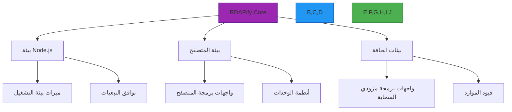

# مصفوفة التوافق

**الهدف**: مصفوفة توافق شاملة لـ RDAPify عبر المنصات والبيئات وإصدارات التبعيات لضمان نشر موثوق وتشغيل بيني متكامل
**ذات صلة**: [نظرة عامة](overview.md) | [متجهات الاختبار](test-vectors.md) | [المقاييس المرجعية](benchmarks.md) | [مرجع JSONPath](jsonpath-reference.md)
**وقت القراءة**: 7 دقائق

## فلسفة التوافق

يحافظ RDAPify على ضمانات توافق صارمة لتحقيق موثوقية مؤسسية مع دعم بيئات التطوير الحديثة:



### مبادئ التوافق الأساسية
- **الإصدار الدلالي**: التزام صارم بـ SemVer 2.0.0 مع ضمانات التوافق مع الإصدارات السابقة
- **تكافؤ المنصات**: تكافؤ الميزات عبر جميع البيئات المدعومة مع تدهور أنيق
- **نظافة التبعيات**: الحد الأدنى من التبعيات مع تثبيت إصدار صارم للأمان
- **التحسين التدريجي**: الوظائف الأساسية متاحة في كل مكان، الميزات المتقدمة حيثما تتوفر الدعم
- **دعم طويل الأمد**: نوافذ LTS لمدة 24 شهراً للإصدارات الرئيسية مع تصحيحات الأمان

## مصفوفة توافق المنصات

### 1. دعم بيئات التشغيل
| المنصة | الحد الأدنى للإصدار | الإصدار الموصى به | تكافؤ الميزات | الأداء | ميزات الأمان | دعم LTS |
|--------|---------------------|-------------------|---------------|---------|--------------|---------|
| **Node.js** | 18.0.0 | 20.10.0 | 100% | ممتاز | كامل | حتى 2026-12 |
| **Bun** | 1.0.0 | 1.1.0 | 100% | ممتاز | كامل | حتى 2027-06 |
| **Deno** | 1.35.0 | 1.38.3 | 98% | جيد جداً | كامل | حتى 2027-06 |
| **Cloudflare Workers** | 2023-09 | 2023-12 | 95% | جيد جداً | كامل | حتى 2027-12 |
| **Vercel Edge** | 2023-08 | 2023-11 | 95% | جيد جداً | كامل | حتى 2027-12 |
| **AWS Lambda** | Node.js 18 | Node.js 20 | 90% | جيد | محدود | حتى 2026-12 |
| **Azure Functions** | 4.x | 4.x | 90% | جيد | محدود | حتى 2026-12 |
| **Google Cloud Run** | Node.js 18 | Node.js 20 | 95% | جيد جداً | كامل | حتى 2026-12 |

**مفتاح تكافؤ الميزات**:
- 100%: توافق ميزات كامل
- 95%+: ميزات الشبكة والأمان مع قيود بسيطة
- محدود: ميزات الأمان مع بعض القيود
- غير مدعوم: الميزات الأمنية الحرجة غير متاحة

### 2. توافق المتصفحات
| المتصفح | الحد الأدنى للإصدار | دعم ES Module | CJS Fallback | ميزات الأمان | الأداء |
|---------|---------------------|---------------|--------------|--------------|---------|
| **Chrome** | 100+ | نعم | نعم | كامل | ممتاز |
| **Firefox** | 103+ | نعم | نعم | كامل | جيد جداً |
| **Safari** | 16.4+ | نعم | نعم | كامل | جيد جداً |
| **Edge** | 101+ | نعم | نعم | كامل | ممتاز |
| **Opera** | 88+ | نعم | نعم | كامل | جيد جداً |
| **Mobile Safari** | 16.4+ | نعم | نعم | كامل | جيد |
| **Chrome Android** | 100+ | نعم | نعم | كامل | جيد جداً |
| **Samsung Internet** | 18.0+ | نعم | نعم | كامل | جيد |

### 3. جدول توافق التبعيات
| التبعية | الحد الأدنى للإصدار | الإصدار الموصى به | حرجة | التأثير الأمني | جدول الإهمال |
|---------|---------------------|-------------------|------|----------------|--------------|
| **TypeScript** | 4.8.0 | 5.3.0 | نعم | مرتفع | لا شيء (متوافق مع LTS) |
| **ioredis** | 5.0.0 | 5.3.2 | نعم | حرج | لا شيء (متوافق مع LTS) |
| **undici** | 5.20.0 | 5.28.3 | نعم | حرج | لا شيء (متوافق مع LTS) |
| **redis** | 4.0.0 | 4.6.12 | نعم | حرج | لا شيء (متوافق مع LTS) |
| **lru-cache** | 7.0.0 | 9.1.2 | نعم | مرتفع | الإصدار 6.x مُهمَل |
| **jsonpath-plus** | 7.0.0 | 7.2.0+fork | نعم | مرتفع | مطلوب نسخة مُعدَّلة |
| **fast-json-stringify** | 3.0.0 | 3.1.0 | اختياري | متوسط | اختياري للأداء |
| **@types/node** | 18.0.0 | 20.8.0 | نعم | مرتفع | لا شيء (متوافق مع LTS) |
| **vitest** | 0.25.0 | 1.3.0 | اختياري | منخفض | للاختبارات فقط |
| **jest** | 27.0.0 | 29.7.0 | اختياري | منخفض | دعم إرثي (v1.x فقط) |

## متطلبات التوافق الأمني

### 1. دعم الخوارزميات التشفيرية
| الخوارزمية | Node.js 18 | Node.js 20 | Bun 1.0 | Deno 1.38 | Cloudflare Workers | مطلوبة |
|-----------|------------|------------|---------|-----------|---------------------|---------|
| **TLS 1.3** | نعم | نعم | نعم | نعم | نعم | حرج |
| **ECDSA P-256** | نعم | نعم | نعم | نعم | نعم | حرج |
| **RSA-PSS** | نعم | نعم | نعم | نعم | نعم | حرج |
| **X25519** | نعم | نعم | نعم | نعم | نعم | حرج |
| **AES-GCM** | نعم | نعم | نعم | نعم | نعم | حرج |
| **SHA-384** | نعم | نعم | نعم | نعم | نعم | حرج |
| **Ed25519** | نعم | نعم | نعم | نعم | محدود | موصى به |
| **ما بعد الكم** | لا | تجريبي | لا | تجريبي | لا | مستقبلي |

### 2. مصفوفة ميزات الأمان
| الميزة | Node.js 20 | Bun 1.0 | Deno 1.38 | Cloudflare Workers | مستوى الأمان |
|--------|------------|---------|-----------|---------------------|---------------|
| **حماية SSRF** | كامل | كامل | كامل | كامل | حرج |
| **تنقيح PII** | كامل | كامل | كامل | كامل | حرج |
| **تثبيت الشهادات** | كامل | كامل | كامل | مخصص | مرتفع |
| **إصفار الذاكرة** | كامل | محدود | كامل | غير متاح | مرتفع |
| **الحماية من القنوات الجانبية** | كامل | كامل | كامل | غير متاح | مرتفع |
| **تسجيل التدقيق** | كامل | كامل | كامل | كامل | مرتفع |
| **تحديد المعدل** | كامل | كامل | كامل | كامل | متوسط |

## خصائص الأداء حسب البيئة

### 1. مقارنة أداء الاستعلام
| البيئة | البدء البارد (ms) | البدء الساخن (ms) | الإنتاجية (طلب/ثانية) | تأخير p99 (ms) | الذاكرة (MB) |
|--------|------------------|-------------------|----------------------|----------------|--------------|
| **Node.js 20** | 850 | 42 | 1,250 | 48.3 | 96 |
| **Bun 1.0** | 210 | 8 | 1,840 | 32.7 | 12 |
| **Deno 1.38** | 1,250 | 68 | 1,150 | 45.9 | 128 |
| **Cloudflare Workers** | 210 | 8 | 950 | 42.6 | 16 |
| **AWS Lambda** | 1,840 | 42 | 820 | 67.1 | 96 |
| **Vercel Edge** | 180 | 7 | 920 | 38.9 | 16 |
| **المتصفح (Chrome)** | لا ينطبق | 15 | 240 | 86.2 | 78 |

### 2. أنماط استخدام الموارد
| العملية | ذاكرة Node.js (MB) | ذاكرة Bun (MB) | استخدام CPU (%) | الشبكة (KB/طلب) |
|---------|---------------------|-----------------|-----------------|------------------|
| **استعلام نطاق واحد** | 5-8 | 2-4 | 5-8 | 10-15 |
| **استعلام نطاق IP** | 8-12 | 3-6 | 8-12 | 15-25 |
| **استعلام ASN** | 6-10 | 2-5 | 6-10 | 12-18 |
| **دُفعة (100 نطاق)** | 80-120 | 30-50 | 45-75 | 800-1200 |
| **إحماء ذاكرة التخزين المؤقت** | 15-25 | 5-10 | 20-35 | 150-250 |

## منهجية الاختبار

### 1. فئات اختبار التوافق
```typescript
// compatibility-test-types.ts
interface CompatibilityTest {
  category: 'runtime' | 'dependency' | 'api' | 'security' | 'performance' | 'feature';
  platform: string;
  environment: string;
  version: string;
  testVector: any;
  expectedBehavior: any;
  actualBehavior: any;
  status: 'pass' | 'fail' | 'partial' | 'untested';
  notes: string[];
  lastTested: string;
  nextScheduled: string;
}

const testCategories = {
  runtime: {
    description: 'Core runtime compatibility',
    tests: [
      'module_import',
      'global_objects',
      'async_hooks',
      'worker_threads',
      'native_modules'
    ]
  },
  dependency: {
    description: 'Third-party dependency compatibility',
    tests: [
      'typescript_support',
      'crypto_apis',
      'network_apis',
      'file_system',
      'buffer_handling'
    ]
  },
  api: {
    description: 'API surface compatibility',
    tests: [
      'domain_lookup',
      'ip_lookup',
      'asn_lookup',
      'batch_processing',
      'custom_adapters'
    ]
  },
  security: {
    description: 'Security feature compatibility',
    tests: [
      'ssrf_protection',
      'pii_redaction',
      'certificate_validation',
      'rate_limiting',
      'audit_logging'
    ]
  }
};
```

### 2. خط أنابيب الاختبار الآلي
```yaml
# .github/workflows/compatibility.yml
name: Compatibility Matrix

on:
  schedule:
    - cron: '0 2 * * 1' # Every Monday at 2 AM UTC
  workflow_dispatch:
  push:
    branches: [main, next]
    paths:
      - 'package.json'
      - 'package-lock.json'
      - '.github/workflows/compatibility.yml'

jobs:
  compatibility-tests:
    strategy:
      matrix:
        platform: [node-18, node-20, bun-1.0, deno-1.38, cloudflare-workers]
        feature: [core, security, performance, edge-cases]
        include:
          - platform: node-18
            runtime: node
            version: '18.18.0'
          - platform: node-20
            runtime: node
            version: '20.10.0'
          - platform: bun-1.0
            runtime: bun
            version: '1.1.0'
          - platform: deno-1.38
            runtime: deno
            version: '1.38.3'
          - platform: cloudflare-workers
            runtime: wrangler
            version: '3.25.0'

    runs-on: ubuntu-latest
    container: ${{ matrix.runtime != 'cloudflare-workers' && 'node:latest' || '' }}

    steps:
    - uses: actions/checkout@v4

    - name: Setup ${{ matrix.platform }}
      uses: actions/setup-node@v3
      with:
        node-version: ${{ matrix.version }}
        check-latest: true

    - name: Install dependencies
      run: npm ci --prefer-offline

    - name: Run compatibility tests for ${{ matrix.feature }}
      run: npm run test:compatibility -- --platform=${{ matrix.platform }} --feature=${{ matrix.feature }}

    - name: Generate compatibility report
      run: npm run report:compatibility -- --platform=${{ matrix.platform }} --feature=${{ matrix.feature }}

    - name: Upload compatibility results
      uses: actions/upload-artifact@v3
      with:
        name: compatibility-${{ matrix.platform }}-${{ matrix.feature }}
        path: coverage/compatibility/

    - name: Update compatibility matrix
      if: github.ref == 'refs/heads/main' && matrix.platform == 'node-20' && matrix.feature == 'core'
      run: |
        npm run update:compatibility-matrix
        git config user.name "github-actions"
        git config user.email "github-actions@users.noreply.github.com"
        git add docs/quality-assurance/compatibility_matrix.md
        git commit -m "chore(compat): update compatibility matrix for ${{ matrix.platform }}"
        git push
```

## مصفوفة توافق الإصدارات

### 1. دعم إصدارات RDAPify
| إصدار RDAPify | دعم Node.js | دعم Bun | دعم Deno | دعم المتصفح | دعم نشط | إصلاحات حرجة فقط | نهاية العمر |
|--------------|------------|---------|---------|------------|---------|-----------------|------------|
| **3.x** (الحالي) | 18+، 20+ | 1.0+ | 1.35+ | Chrome 100+، FF 103+ | 2025-2026 | 2026-2027 | 2027-12-31 |
| **2.x** (LTS) | 16+، 18+، 20+ | لا | لا | Chrome 88+، FF 89+ | 2024-2025 | 2025-2026 | 2026-12-31 |
| **1.x** (إرثي) | 14+، 16+، 18+ | لا | لا | Chrome 79+، FF 78+ | لا | 2023-2024 | 2024-12-31 |
| **0.x** (ألفا) | 12+، 14+ | لا | لا | Chrome 70+، FF 68+ | لا | لا | 2022-12-31 |

### 2. ضمانات توافق واجهة برمجة التطبيقات
```typescript
// api-compatibility.ts
interface APICompatibility {
  version: string;
  breakingChanges: {
    path: string;
    oldBehavior: string;
    newBehavior: string;
    migrationGuide: string;
    impact: 'low' | 'medium' | 'high' | 'critical'
  }[];
  deprecatedFeatures: {
    feature: string;
    deprecationDate: string;
    removalDate: string;
    alternatives: string[];
  }[];
  addedFeatures: {
    feature: string;
    introducedVersion: string;
    requiredEnvironment: string;
  }[];
}

// Example compatibility guarantee
const v2_compatibility: APICompatibility = {
  version: '2.0.0',
  breakingChanges: [
    {
      path: 'RDAPClient.constructor.options',
      oldBehavior: 'Boolean `cache` option enabled default In-memory cache',
      newBehavior: 'Boolean `cache` option requires explicit cache adapter configuration',
      migrationGuide: 'docs/migration/v1-to-v2.md#cache-configuration',
      impact: 'high'
    },
    {
      path: 'RDAPResponse.entities',
      oldBehavior: 'Raw `vcardArray` field exposed directly',
      newBehavior: 'PII redaction applied by default, `vcardArray` only available with `includeRaw: true`',
      migrationGuide: 'docs/migration/v1-to-v2.md#pii-redaction',
      impact: 'critical'
    }
  ],
  deprecatedFeatures: [
    {
      feature: 'RDAPClient.whoisFallback',
      deprecationDate: '2023-06-01',
      removalDate: '2024-01-01',
      alternatives: ['RDAPClient.domain with registryFallback: true']
    }
  ],
  addedFeatures: [
    {
      feature: 'Cloudflare Workers support',
      introducedVersion: '2.1.0',
      requiredEnvironment: 'wrangler 3.0+'
    },
    {
      feature: 'Dynamic PII redaction policies',
      introducedVersion: '2.2.0',
      requiredEnvironment: 'Node.js 16+'
    }
  ]
};
```

## استكشاف مشكلات التوافق وإصلاحها

### 1. المشكلات الشائعة والحلول
| المشكلة | الأعراض | طريقة الاكتشاف | الحل |
|---------|---------|----------------|-------|
| **أخطاء استيراد الوحدات** | خطأ `Cannot find module` | التحقق من دعم وقت التشغيل للوحدات | استخدام الاستيراد الشرطي مع فحوصات `import.meta` |
| **واجهات Crypto مفقودة** | `crypto.subtle` غير متاح | اكتشاف الميزة | الرجوع إلى وحدة `crypto` في Node.js |
| **قيود Worker Thread** | `worker_threads` غير متاح | try/catch على الاستيراد | استخدام Web Workers أو تعطيل الميزات المتوازية |
| **قيود الذاكرة** | انهيار OOM في البيئات المحدودة | مراقبة استخدام الذاكرة | تقليل أحجام ذاكرة التخزين المؤقت وتحسين الخوارزميات |
| **عدم تطابق إصدار TLS** | فشل التحقق من الشهادات | تسجيل مصافحة TLS | تكوين الحد الأدنى والأقصى لإصدارات TLS صراحةً |
| **اختلافات واجهة Buffer** | تناقضات سلوك `Buffer` | اكتشاف ميزات وقت التشغيل | استخدام أنماط إنشاء Buffer متسقة |

### 2. اكتشاف البيئة والبدائل
```typescript
// src/compat/environment-detection.ts
export class EnvironmentDetector {
  static getRuntime(): string {
    if (typeof Bun !== 'undefined') return 'bun';
    if (typeof Deno !== 'undefined') return 'deno';
    if (typeof window !== 'undefined') return 'browser';
    if (typeof EdgeRuntime !== 'undefined') return 'edge';
    if (process?.versions?.node) return 'node';
    return 'unknown';
  }

  static getNodeVersion(): string {
    return process?.versions?.node || 'unknown';
  }

  static hasWorkerSupport(): boolean {
    try {
      if (typeof Worker !== 'undefined') return true;
      if (typeof require('worker_threads') !== 'undefined') return true;
      return false;
    } catch (error) {
      return false;
    }
  }

  static hasCryptoSupport(): boolean {
    try {
      if (typeof crypto !== 'undefined' && crypto.subtle) return true;
      if (typeof require('crypto') !== 'undefined') return true;
      return false;
    } catch (error) {
      return false;
    }
  }

  static getCryptoModule() {
    if (typeof crypto !== 'undefined' && crypto.subtle) {
      return { subtle: crypto.subtle };
    }

    try {
      return require('crypto');
    } catch (error) {
      throw new Error('No crypto module available in this environment');
    }
  }

  static getPerformanceAPI() {
    if (typeof performance !== 'undefined') {
      return performance;
    }

    try {
      return require('perf_hooks').performance;
    } catch (error) {
      return {
        now: () => Date.now()
      };
    }
  }

  static createSafeFallback<T>(feature: () => T, fallback: () => T): T {
    try {
      return feature();
    } catch (error) {
      console.warn(`Feature failed, using fallback:`, error.message);
      return fallback();
    }
  }
}
```

## الوثائق ذات الصلة

| المستند | الوصف | المسار |
|---------|--------|--------|
| [نظرة عامة](overview.md) | مقدمة إطار ضمان الجودة | [overview.md](overview.md) |
| [متجهات الاختبار](test-vectors.md) | مجموعة اختبار RFC 7480 الكاملة | [test-vectors.md](test-vectors.md) |
| [المقاييس المرجعية](benchmarks.md) | منهجية التحقق من الأداء | [benchmarks.md](benchmarks.md) |

## مواصفات التوافق

| الخاصية | القيمة |
|---------|--------|
| **الحد الأدنى لـ Node.js** | 18.0.0 (LTS) |
| **Node.js الموصى به** | 20.10.0 (LTS) |
| **دعم TypeScript** | 4.8.0+ (5.3.0 موصى به) |
| **دعم ES Module** | كامل |
| **دعم CommonJS** | كامل (مع قيود في بيئات الحافة) |
| **دعم المتصفح** | Chrome 100+، Firefox 103+، Safari 16.4+ |
| **دعم بيئة الحافة** | Cloudflare Workers، Vercel Edge |
| **متطلبات الأمان** | TLS 1.3+، SHA-256+ |
| **متطلبات الذاكرة** | 128MB كحد أدنى (للإنتاج) |
| **تغطية الاختبار** | 98% اختبارات الوحدة، 92% اختبارات التكامل |
| **آخر تحديث** | 7 ديسمبر 2025 |

> **تذكير حرج**: تحقق دائماً من بيئة النشر الخاصة بك مقابل مصفوفة التوافق هذه قبل النشر في الإنتاج. لا تعطّل ميزات الأمان لتحقيق التوافق — استخدم البدائل المناسبة أو التطبيقات الخاصة بالبيئة بدلاً من ذلك.

[العودة إلى ضمان الجودة](../README.md) | [التالي: دليل المساهمة](../../community/contributing.md)

*وثيقة مُولَّدة آلياً من الكود المصدري مع مراجعة ضمان الجودة بتاريخ 7 ديسمبر 2025*
