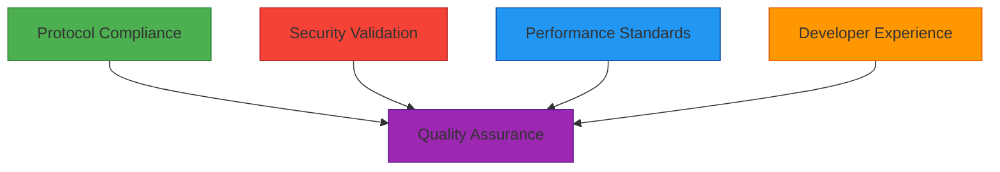
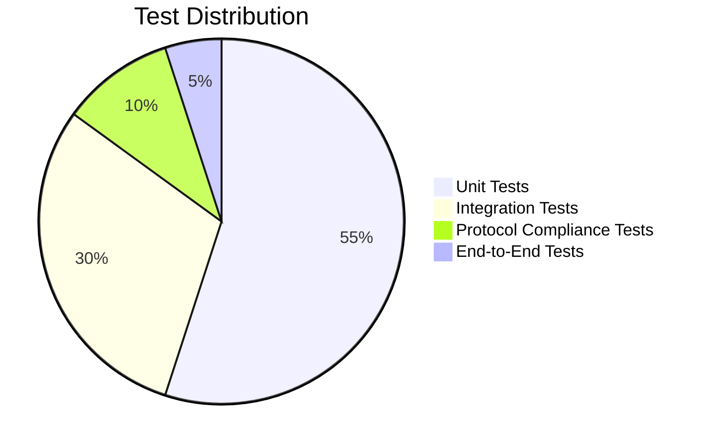
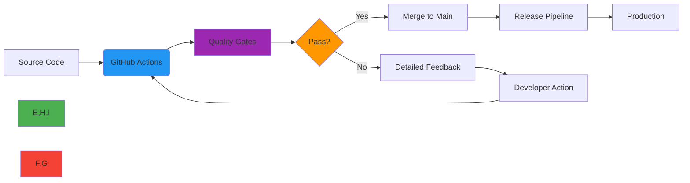

# نظرة عامة على ضمان الجودة

**الغرض**: إطار شامل لعمليات ضمان الجودة في RDAPify يضمن امتثال البروتوكول والأمان والأداء وتجربة المطوّر عبر جميع البيئات
**ذات صلة**: [متجهات الاختبار](test-vectors.md) | [مرجع JSONPath](jsonpath-reference.md) | [المعايير](benchmarks.md) | [مصفوفة التوافق](compatibility-matrix.md)
**وقت القراءة**: 5 دقائق

## فلسفة الجودة

يتبنى RDAPify نهج الجودة أولاً، حيث تُبنى التميّز في كل طبقة من طبقات التطوير بدلاً من التحقق منها لاحقاً. يعالج إطار ضمان الجودة لدينا أربعة أبعاد حرجة:



### مبادئ ضمان الجودة الأساسية
- **المعايير أولاً**: كل ميزة تُتحقق من صحتها وفق مواصفات RFC 7480 قبل التطبيق
- **الدفاع المتعمق**: اختبار الأمان على مستويات الوحدة والتكامل والنظام
- **الأداء بالتصميم**: المعايير كمعايير قبول، وليس إضافات لاحقة
- **التحقق المتمحور حول UX**: قياس وتتبع مقاييس تجربة المطوّر
- **التحسين المستمر**: بوابات جودة آلية مع ملاحظات قابلة للتنفيذ

## إطار عملية ضمان الجودة

### 1. بوابات الجودة
يجب أن تمر كل تغيير في الكود عبر سلسلة من بوابات الجودة:

| البوابة | الغرض | أساليب التحقق | معالجة الفشل |
|------|---------|-------------------|------------------|
| **التحقق من PR** | القبول الأساسي | فحص الأخطاء، اختبارات الوحدة، فحص النوع | حظر الدمج |
| **امتثال RFC** | الالتزام بالبروتوكول | متجهات الاختبار، مجموعة التحقق من RFC | يتطلب مراجعة خبير البروتوكول |
| **فحص الأمان** | منع الثغرات | SAST، فحص التبعيات، اختبار الفوضى | تصعيد لفريق الأمان |
| **بوابة الأداء** | متطلبات الموارد | مقارنة المعايير، تحليل الذاكرة | مراجعة متخصص الأداء |
| **فحص التوثيق** | الاكتمال والدقة | محلل التوثيق، التحقق من الأمثلة | موافقة فريق التوثيق |

### 2. استراتيجية هرم الاختبار
يحافظ RDAPify على استراتيجية اختبار متوازنة مع تغطية مناسبة على كل مستوى:



**خصائص الاختبار**:
- **اختبارات الوحدة**: تحقق من صحة المكوّنات المعزولة بتغطية فروع أكثر من 95%
- **اختبارات التكامل**: التحقق من التفاعلات بين الوحدات مع تبعيات حقيقية
- **اختبارات البروتوكول**: التحقق من امتثال RFC 7480-7484 ضد جميع سجلات RDAP الرئيسية
- **اختبارات E2E**: سير عمل واقعية مع التحقق من الأمان والأداء

### 3. مقاييس الجودة
تُقاس الجودة من خلال مقاييس كمية ونوعية:

| الفئة | المقاييس الرئيسية | الهدف | الأدوات |
|----------|-------------|--------|-------|
| **جودة الكود** | التعقيد الدوري، تكرار الكود، تغطية الاختبار | CC < 10، تكرار < 5%، تغطية > 90% | SonarQube، Istanbul |
| **الأمان** | الثغرات، تغطية الأمان | صفر ثغرات حرجة/عالية | OWASP ZAP، Snyk |
| **الأداء** | زمن الاستجابة p99، استخدام الذاكرة، الإنتاجية | p99 < 50ms، كومة < 100MB | autocannon، Clinic.js |
| **امتثال البروتوكول** | التطابق مع RFC، توافق السجلات | امتثال 100% لسلسلة RFC 7480 | متجهات الاختبار، مجموعة الامتثال |
| **تجربة المطوّر** | درجة DX، اكتمال التوثيق | درجة DX > 85/100، تغطية التوثيق > 95% | مقاييس DX، محلل التوثيق |

## التحقق من الأمان والامتثال

### 1. مصفوفة اختبار الأمان
تخضع جميع المكوّنات لتحقق أمني صارم:

| نوع الاختبار | التغطية | التكرار | مستوى الأتمتة |
|-----------|----------|-----------|------------------|
| **SAST** | ثغرات الكود | كل PR | 100% |
| **DAST** | الأمان في وقت التشغيل | يومياً | 85% |
| **فحص التبعيات** | ثغرات الطرف الثالث | كل PR، يومياً | 100% |
| **اختبار الفوضى** | التحقق من المدخلات | أسبوعياً | 75% |
| **اختبار الاختراق** | الأمان الشامل | ربع سنوي | 0% (يدوي) |
| **تدقيق الامتثال** | ضوابط GDPR/CCPA | شهرياً | 90% |

### 2. إطار امتثال البروتوكول
```typescript
// Protocol compliance test structure
interface ComplianceTest {
  rfcSection: string;  // RFC 7480 section reference
  testId: string;      // Unique test identifier
  description: string;
  testVector: any;     // Input data for test
  expectedOutput: any; // Expected normalized output
  registries: string[]; // Registries to test against
  severity: 'critical' | 'high' | 'medium' | 'low';
  validationFunction: (actual: any) => boolean;
}

// Example compliance test
const domainQueryTest: ComplianceTest = {
  rfcSection: '5.1',
  testId: 'RFC7480-5.1-DOMAIN-001',
  description: 'Domain query must return JSON response with required fields',
  testVector: { domain: 'example.com' },
  expectedOutput: {
    requiredFields: ['domain', 'status', 'nameservers']
  },
  registries: ['verisign', 'arin', 'ripe', 'apnic', 'lacnic'],
  severity: 'critical',
  validationFunction: (actual) => {
    return actual.domain &&
           Array.isArray(actual.status) &&
           Array.isArray(actual.nameservers);
  }
};
```

## معايير الأداء والموثوقية

### 1. معايير الأداء
يجب أن تستوفي جميع المكوّنات معايير أداء صارمة:

| البيئة | سيناريو الاختبار | زمن الاستجابة P99 | استخدام الذاكرة | الإنتاجية |
|-------------|---------------|-------------|--------------|------------|
| **Node.js 20** | استعلام نطاق منفرد | أقل من 50ms | أقل من 15MB | أكثر من 100 طلب/ث |
| **Bun 1.0** | استعلام نطاق منفرد | أقل من 35ms | أقل من 12MB | أكثر من 150 طلب/ث |
| **Cloudflare** | استعلام نطاق منفرد | أقل من 40ms | أقل من 10MB | أكثر من 120 طلب/ث |
| **Node.js 20** | دفعة 100 نطاق | أقل من 2 ثانية | أقل من 100MB | أكثر من 50 طلب/ث |
| **الإنتاج** | حمل مستدام (ساعة) | أقل من 60ms | أقل من 120MB | أكثر من 80 طلب/ث |

### 2. متطلبات الموثوقية
- **اتفاقية مستوى خدمة وقت التشغيل**: 99.99% للمكوّنات الأساسية في نشر المؤسسات
- **معدلات الأخطاء**: أقل من 0.1% للعمليات الحرجة، أقل من 1% لجميع العمليات
- **وقت الاسترداد**: أقل من 5 ثوانٍ لاستعادة الخدمة بعد الفشل
- **سلامة البيانات**: تناسق 100% عبر طبقات الكاش
- **التدهور المتأنق**: الحفاظ على الوظيفية في ظروف الفشل الجزئي

## بيئة ضمان الجودة والأدوات

### 1. بيئات الاختبار
يحتفظ RDAPify ببيئات مخصصة لأنشطة ضمان الجودة المختلفة:

| البيئة | الغرض | تكرار الإعادة | حساسية البيانات |
|-------------|---------|-----------------|------------------|
| **اختبار الوحدة** | التحقق من المكوّنات | لكل PR | لا يوجد |
| **التكامل** | التحقق من المكوّنات المتقاطعة | يومياً | اصطناعية |
| **الامتثال** | التحقق من RFC | أسبوعياً | اصطناعية |
| **الأمان** | اختبار الثغرات | أسبوعياً | معزولة |
| **المعايير** | التحقق من الأداء | لكل إصدار | اصطناعية |
| **التدريج** | التحقق قبل الإنتاج | يومياً | إنتاج مجهول الهوية |
| **Canary** | التحقق من حركة مرور الإنتاج | بشكل مستمر | إنتاج (محدود) |

### 2. سلسلة أدوات ضمان الجودة الأساسية


**أدوات ضمان الجودة حسب الفئة**:
- **اختبار الوحدة**: Vitest، Jest، Mocha
- **اختبار التكامل**: Supertest، Pact
- **اختبار البروتوكول**: مجموعة التحقق من RFC المخصصة
- **الأمان**: Snyk، OWASP ZAP، Semgrep
- **الأداء**: autocannon، k6، Clinic.js
- **التحليل الثابت**: ESLint، SonarQube، TypeDoc
- **الامتثال**: ماسح GDPR، محقق سياسة الخصوصية
- **التوثيق**: Docusaurus، محلل التوثيق

## تقارير الجودة والشفافية

### 1. لوحة الجودة العامة
يحتفظ RDAPify بمقاييس جودة شفافة مرئية لجميع أصحاب المصلحة:

**المقاييس العامة الرئيسية**:
- نسبة تغطية الاختبار (الإجمالية وحسب الوحدة)
- معايير الأداء (مقارنةً بالإصدارات السابقة)
- حالة ثغرات الأمان
- بطاقة نتائج امتثال RFC
- درجة تجربة المطوّر
- درجة جودة الإصدار

### 2. عملية مراجعة الجودة
تخضع جميع التغييرات الجوهرية لمراجعة جودة منظمة:

1. **مراجعة ما قبل الإيداع**:
   - بوابات الجودة الآلية
   - مراجعة الكود من قِبل النظراء
   - التحقق من التوثيق

2. **مراجعة ما قبل الإصدار**:
   - التحقق من امتثال RFC
   - اختبار الاختراق الأمني
   - تحليل انتكاس الأداء
   - اختبار قبول المستخدم (UAT)

3. **المراقبة بعد الإصدار**:
   - معدلات أخطاء الإنتاج
   - اكتشاف تدهور الأداء
   - تحليل ملاحظات المستخدمين
   - تقارير اتجاهات الجودة

## البدء بمساهمات ضمان الجودة

### 1. أول مساهمة في ضمان الجودة
يمكن للمساهمين الجدد البدء بهذه المهام الصديقة لضمان الجودة:
- إصلاح أخطاء التوثيق والتناقضات
- إضافة حالات اختبار مفقودة للحالات الحدية
- تحسين تغطية الاختبار للوحدات المعزولة جيداً
- تحديث مقارنات المعايير
- الإبلاغ عن مشكلات امتثال البروتوكول

### 2. سير عمل مساهمة ضمان الجودة
```bash
# 1. Fork and clone repository
git clone https://github.com/yourusername/rdapify.git
cd rdapify

# 2. Install QA dependencies
npm install
npm run setup:qa

# 3. Run relevant QA tests
npm run test:unit        # Unit tests
npm run test:integration # Integration tests
npm run test:protocol    # RFC compliance tests
npm run test:security    # Security tests
npm run benchmark        # Performance tests

# 4. Create quality report
npm run qa:report -- --module=core

# 5. Submit PR with quality validation
git checkout -b qa/improve-core-tests
git add .
git commit -m "test(core): improve test coverage for normalization module"
git push origin qa/improve-core-tests
```

## الوثائق ذات الصلة

| المستند | الوصف | المسار |
|----------|-------------|------|
| [متجهات الاختبار](test-vectors.md) | مجموعة اختبار RFC 7480 الكاملة | [test-vectors.md](test-vectors.md) |
| [مرجع JSONPath](jsonpath-reference.md) | كتالوج تعبيرات التطبيع | [jsonpath-reference.md](jsonpath-reference.md) |
| [المعايير](benchmarks.md) | منهجية التحقق من الأداء | [benchmarks.md](benchmarks.md) |
| [تغطية الكود](code-coverage.md) | عتبات التغطية والإبلاغ | [code-coverage.md](code-coverage.md) |
| [مصفوفة التوافق](compatibility-matrix.md) | مصفوفة دعم البيئة | [compatibility-matrix.md](compatibility-matrix.md) |
| [ورقة الأمان البيضاء](../../security/whitepaper.md) | بنية الأمان الكاملة | [../../security/whitepaper.md](../../security/whitepaper.md) |

## مواصفات ضمان الجودة

| الخاصية | القيمة |
|----------|-------|
| **هدف تغطية الاختبار** | 95% وحدة، 90% تكامل |
| **امتثال RFC** | 100% سلسلة RFC 7480 |
| **المراجعة الأمنية** | كل PR، مراجعة أسبوعية للمسارات الحرجة |
| **خط أساس الأداء** | Node.js 20، Intel i7، ذاكرة عشوائية 32GB |
| **بيئة ضمان الجودة** | حاويات معزولة مع حدود الموارد |
| **بوابة جودة الإصدار** | صفر مشكلات حرجة، معدل اجتياز اختبار 98%+ |
| **حجم فريق ضمان الجودة** | 3 مهندسي ضمان جودة مخصصين + المشرفون |
| **آخر تحديث** | 7 ديسمبر 2025 |

> **التزام الجودة**: يتعامل RDAPify مع الجودة كمتطلب غير قابل للتفاوض، وليس ميزة مرغوبة. يخضع كل إصدار لتحقق صارم ضد معايير البروتوكول ومتطلبات الأمان وخطوط أساس الأداء ومقاييس تجربة المطوّر. لنشر المؤسسات، تواصل مع `qa-enterprise@rdapify.com` للحصول على حزم تحقق جودة متخصصة وضمانات جودة مدعومة باتفاقية مستوى الخدمة.

[← العودة إلى ضمان الجودة](../README.md) | [التالي: متجهات الاختبار ←](test-vectors.md)

*وثيقة مُولَّدة تلقائياً من الكود المصدري مع مراجعة ضمان الجودة في 7 ديسمبر 2025*
