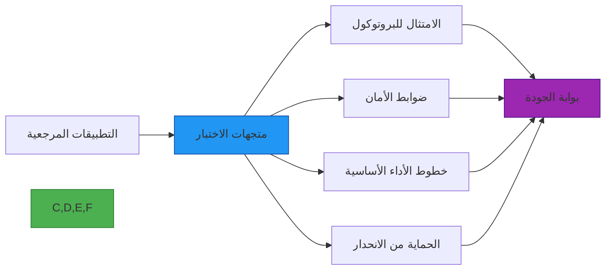

# مواصفة متجهات الاختبار

**الهدف**: كتالوج شامل لمتجهات الاختبار للتحقق من امتثال RDAPify للبروتوكول وضوابط الأمان والصحة الوظيفية وفقاً لمواصفات سلسلة RFC 7480
**ذات صلة**: [نظرة عامة](overview.md) | [مرجع JSONPath](jsonpath-reference.md) | [المقاييس المرجعية](benchmarks.md) | [مصفوفة التوافق](compatibility-matrix.md)
**وقت القراءة**: 8 دقائق

## فلسفة متجهات الاختبار

يحافظ RDAPify على مجموعة اختبار صارمة مبنية على أنماط بيانات التسجيل في العالم الحقيقي وحالات الحافة. تخدم متجهات الاختبار أغراضاً متعددة:



### المبادئ الأساسية
- **صحة العالم الحقيقي**: متجهات الاختبار مشتقة من استجابات سجلات حقيقية (مُجهَّلة)
- **تغطية RFC**: تغطية كاملة لمتطلبات RFC 7480-7484
- **اختبار حدود الأمان**: متجهات مصممة للتحقق من حماية SSRF وتنقيح PII
- **توصيف الأداء**: معايير أداء لأوقات الاستجابة واستخدام الموارد المتوقعة
- **استنفاد حالات الحافة**: تغطية شاملة لشروط الحدود وحالات الخطأ

## كتالوج متجهات الاختبار

### 1. متجهات استعلام النطاق
| معرف الاختبار | الوصف | المدخل | المخرج المتوقع | قسم RFC | حرج |
|-------------|--------|--------|----------------|---------|-----|
| **DOM-001** | استعلام نطاق صالح | `example.com` | بيانات نطاق مطبَّعة | 5.1 | نعم |
| **DOM-002** | نطاق بحروف دولية | `пример.рф` | تحويل Punycode، بيانات مطبَّعة | 5.1، A.1 | نعم |
| **DOM-003** | نطاق غير موجود | `nonexistent-domain.example` | هيكل خطأ 404 قياسي | 5.2 | نعم |
| **DOM-004** | نطاق مع بيانات PII | `pii-test.example` | معلومات شخصية مُنقَّحة | GDPR، 5.3 | نعم |
| **DOM-005** | نطاق مع كيانات متعددة | `multi-entity.example` | تعيين صحيح لدور الكيان | 5.1 | تحذير |
| **DOM-006** | نطاق مع IP خاص في جهات الاتصال | `internal-ip.example` | تفعيل حماية SSRF | الأمان | نعم |
| **DOM-007** | نطاق مع حقن بروتوكول الملف | `file-test.example` | فشل التحقق من البروتوكول | الأمان | نعم |
| **DOM-008** | نطاق مع استجابة مشوهة | `malformed.example` | معالجة أنيقة لـ JSON غير صالح | 5.4 | تحذير |

### 2. متجهات استعلام نطاق IP
| معرف الاختبار | الوصف | المدخل | المخرج المتوقع | قسم RFC | حرج |
|-------------|--------|--------|----------------|---------|-----|
| **IP-001** | استعلام IPv4 صالح | `192.0.2.1` | بيانات تسجيل IP مطبَّعة | 5.1 | نعم |
| **IP-002** | استعلام IPv6 صالح | `2001:db8::1` | بيانات تسجيل IPv6 مطبَّعة | 5.1 | نعم |
| **IP-003** | نطاق IP Bogon | `192.168.1.1` | تفعيل حماية SSRF | الأمان | نعم |
| **IP-004** | IP مع جهة اتصال إساءة | `abuse-ip.example` | تنقيح PII لجهات اتصال الإساءة | GDPR | نعم |
| **IP-005** | IP مع تسلسل شبكات متداخلة | `nested-ip.example` | علاقات شبكة أصل/طفل صحيحة | 5.1 | تحذير |
| **IP-006** | عنوان IPv4 مُعيَّن على IPv6 | `::ffff:192.0.2.128` | معالجة بروتوكول صحيحة | 5.4 | تحذير |

### 3. متجهات استعلام ASN
| معرف الاختبار | الوصف | المدخل | المخرج المتوقع | قسم RFC | حرج |
|-------------|--------|--------|----------------|---------|-----|
| **ASN-001** | استعلام ASN صالح (رقمي) | `15133` | بيانات تسجيل ASN مطبَّعة | 5.1 | نعم |
| **ASN-002** | استعلام ASN صالح (بادئة AS) | `AS15133` | بيانات تسجيل ASN مطبَّعة | 5.1 | نعم |
| **ASN-003** | نطاق ASN خاص | `AS64512` | حماية SSRF أو معالجة خاصة بالسجل | الأمان | نعم |
| **ASN-004** | ASN مع منظمات متعددة | `multi-org.asn` | تعيين منظمة صحيح | 5.1 | تحذير |
| **ASN-005** | ASN مع كائنات مسار | `route-asn.example` | تحليل صحيح لكائن المسار | 5.4 | تحذير |

### 4. متجهات حالة الخطأ
| معرف الاختبار | الوصف | المدخل | المخرج المتوقع | قسم RFC | حرج |
|-------------|--------|--------|----------------|---------|-----|
| **ERR-001** | انتهاء مهلة السجل | `timeout.example` | خطأ مهلة قياسي مع إرشادات إعادة المحاولة | 5.4 | نعم |
| **ERR-002** | تحديد معدل من قِبل السجل | `rate-limit.example` | خطأ تحديد معدل قياسي مع retry-after | 5.4 | نعم |
| **ERR-003** | تنسيق مدخل غير صالح | `invalid!format` | خطأ تحقق قياسي مع تفاصيل | 5.2 | نعم |
| **ERR-004** | فشل التحقق من الشهادة | `insecure.example` | خطأ أمان قياسي | 5.1 | نعم |
| **ERR-005** | فشل دقة DNS | `dns-fail.example` | خطأ شبكة قياسي مع تشخيصات | 5.4 | تحذير |
| **ERR-006** | انتهاك بروتوكول السجل | `protocol-violation.example` | خطأ بروتوكول قياسي مع سياق | 5.4 | نعم |

## متجهات الاختبار الأمني

### 1. اختبارات حماية SSRF
```json
{
  "testVectors": [
    {
      "id": "SSRF-001",
      "description": "Private IP range detection",
      "input": {
        "domain": "192.168.1.1"
      },
      "securityContext": {
        "allowPrivateIPs": false
      },
      "expectedResult": {
        "error": {
          "code": "RDAP_SECURE_SSRF",
          "message": "SSRF protection blocked request to private IP"
        },
        "securityActions": ["blocked", "logged"]
      }
    },
    {
      "id": "SSRF-002",
      "description": "Internal hostname detection",
      "input": {
        "domain": "internal.registry.local"
      },
      "securityContext": {
        "allowPrivateIPs": false
      },
      "expectedResult": {
        "error": {
          "code": "RDAP_SECURE_SSRF",
          "message": "SSRF protection blocked request to internal domain"
        },
        "securityActions": ["blocked", "logged"]
      }
    },
    {
      "id": "SSRF-003",
      "description": "File protocol exploitation attempt",
      "input": {
        "domain": "file:///etc/passwd"
      },
      "securityContext": {
        "allowPrivateIPs": false
      },
      "expectedResult": {
        "error": {
          "code": "RDAP_SECURE_PROTOCOL",
          "message": "Protocol validation failed"
        },
        "securityActions": ["blocked", "logged", "alerted"]
      }
    }
  ]
}
```

### 2. اختبارات تنقيح PII
```typescript
// pii-redaction.test.ts
const piiTestVectors = [
  {
    id: 'PII-001',
    name: 'Complete PII redaction',
    input: {
      entities: [{
        handle: 'REG-123',
        roles: ['registrant'],
        vcardArray: [
          'vcard',
          [
            ['version', {}, 'text', '4.0'],
            ['fn', {}, 'text', 'John Doe'],
            ['email', {}, 'text', 'john.doe@example.com'],
            ['tel', { type: 'work' }, 'text', '+1.5555551234'],
            ['adr', {}, 'text', ['', '', '123 Main St', 'Anytown', 'CA', '12345', 'US']]
          ]
        ]
      }]
    },
    expectedOutput: {
      entities: [{
        handle: 'REG-123',
        roles: ['registrant'],
        // All PII fields redacted
        vcardArray: [
          'vcard',
          [
            ['version', {}, 'text', '4.0'],
            ['fn', {}, 'text', 'REDACTED']
          ]
        ]
      }]
    },
    redactionPolicy: 'gdpr_essential_only'
  },
  {
    id: 'PII-002',
    name: 'GDPR vs CCPA policy differences',
    input: {
      entities: [{
        handle: 'REG-456',
        roles: ['technical'],
        email: 'tech-contact@company.com'
      }]
    },
    gdprOutput: {
      entities: [{
        handle: 'REG-456',
        roles: ['technical']
        // Email completely redacted under GDPR
      }]
    },
    ccpaOutput: {
      entities: [{
        handle: 'REG-456',
        roles: ['technical'],
        email: 't***@company.com' // Partially redacted under CCPA
      }]
    }
  }
];

// Test execution
describe('PII Redaction Tests', () => {
  testVectors.forEach(vector => {
    test(vector.name, () => {
      const result = applyRedactionPolicy(vector.input, vector.redactionPolicy);
      expect(result).toEqual(vector.expectedOutput);
    });
  });
});
```

## متجهات الاختبار المعياري للأداء

### 1. تعريفات المعايير
```json
{
  "benchmarks": [
    {
      "id": "PERF-DOM-001",
      "name": "Single domain query - cache miss",
      "description": "Performance of first-time domain query with no cache",
      "input": {
        "domain": "example.com",
        "options": {
          "cache": false
        }
      },
      "targetMetrics": {
        "p50": "< 50ms",
        "p90": "< 120ms",
        "p99": "< 250ms",
        "memory": "< 5MB",
        "cpu": "< 10ms"
      },
      "environment": {
        "nodeVersion": "20.x",
        "networkLatency": "< 50ms",
        "cpuCores": 2
      }
    },
    {
      "id": "PERF-DOM-002",
      "name": "Single domain query - cache hit",
      "description": "Performance of cached domain query",
      "input": {
        "domain": "example.com",
        "options": {
          "cache": true
        }
      },
      "targetMetrics": {
        "p50": "< 10ms",
        "p90": "< 25ms",
        "p99": "< 50ms",
        "memory": "< 1MB",
        "cpu": "< 2ms"
      },
      "environment": {
        "nodeVersion": "20.x",
        "networkLatency": "< 50ms",
        "cpuCores": 2
      }
    },
    {
      "id": "PERF-BATCH-001",
      "name": "Batch domain processing",
      "description": "Performance of processing 100 domains in batch",
      "input": {
        "domains": ["example1.com", "example2.com", "...", "example100.com"],
        "options": {
          "batchSize": 10,
          "concurrent": 5
        }
      },
      "targetMetrics": {
        "totalTime": "< 3s",
        "memoryPeak": "< 100MB",
        "throughput": "> 35 req/sec"
      },
      "environment": {
        "nodeVersion": "20.x",
        "networkLatency": "< 50ms",
        "cpuCores": 4
      }
    }
  ]
}
```

### 2. ملفات استهلاك الموارد
| العملية | الذاكرة (MB) | CPU (ms) | الشبكة (KB) | بيئة الهدف |
|---------|-------------|---------|-------------|------------|
| **استعلام نطاق (فائت من ذاكرة التخزين المؤقت)** | 5-8 | 15-25 | 10-15 | Node.js 20، 2 vCPU |
| **استعلام نطاق (ضربة في ذاكرة التخزين المؤقت)** | 1-2 | 2-5 | 0.1-0.5 | Node.js 20، 2 vCPU |
| **استعلام نطاق IP** | 8-12 | 20-35 | 15-25 | Node.js 20، 2 vCPU |
| **استعلام ASN** | 6-10 | 18-30 | 12-18 | Node.js 20، 2 vCPU |
| **دُفعة (100 نطاق)** | 80-120 | 1500-2500 | 800-1200 | Node.js 20، 4 vCPU |

## إطار تنفيذ متجهات الاختبار

### 1. تكوين مشغّل الاختبار
```typescript
// test/config.ts
import { TestRunnerConfig } from '@rdapify/test-vectors';

export const testConfig: TestRunnerConfig = {
  // Registry endpoints for live testing
  registries: {
    verisign: 'https://rdap.verisign.com/com/v1/',
    arin: 'https://rdap.arin.net/registry/',
    ripe: 'https://rdap.db.ripe.net/',
    apnic: 'https://rdap.apnic.net/',
    lacnic: 'https://rdap.lacnic.net/rdap/'
  },

  // Test execution parameters
  execution: {
    timeout: 5000, // 5 second timeout per test
    retry: { maxAttempts: 2 },    // 2 retries for flaky tests
    concurrency: 10, // Max concurrent tests
    slowTestThreshold: 1000, // Mark tests >1s as slow
    skipLiveTests: process.env.SKIP_LIVE_TESTS === 'true'
  },

  // Security test configuration
  security: {
    ssrfProtection: true,
    piiRedaction: true,
    certificateValidation: true,
    rateLimitTesting: 100 // Max requests/minute for testing
  },

  // Performance benchmarks
  performance: {
    iterations: 100, // Iterations for benchmarks
    warmup: 10,     // Warmup iterations
    memoryProfiling: false,
    cpuProfiling: false
  },

  // Compliance requirements
  compliance: {
    gdprEnabled: true,
    ccpaEnabled: true,
    dataRetentionDays: 30,
    auditLogging: true
  },

  // Reporting configuration
  reporting: {
    format: 'junit', // junit, json, console
    outputPath: './test-results',
    includeSkipped: true,
    includeSlowTests: true,
    htmlReport: true
  }
};
```

### 2. التكامل مع أطر الاختبار
```typescript
// jest.setup.ts
import { TestVectorRunner } from '@rdapify/test-vectors';
import { testConfig } from './test/config';

// Initialize test runner
const runner = new TestVectorRunner(testConfig);

// Global setup
beforeAll(async () => {
  await runner.initialize();
  console.log('Intialized RDAPify test vector runner');
});

// Global teardown
afterAll(async () => {
  await runner.cleanup();
  console.log('Cleaned up test vector runner');
});

// Custom Jest matchers
expect.extend({
  toBeRdapCompliant(received, testVector) {
    const result = runner.validate(received, testVector);

    if (result.passed) {
      return {
        message: () => `expected ${received} not to be RDAP compliant`,
        pass: true
      };
    } else {
      return {
        message: () => `RDAP compliance failed: ${result.errors.join('\n')}`,
        pass: false
      };
    }
  },

  toPassSecurityChecks(received, securityContext) {
    const result = runner.validateSecurity(received, securityContext);

    if (result.passed) {
      return {
        message: () => `expected ${received} not to pass security checks`,
        pass: true
      };
    } else {
      return {
        message: () => `Security validation failed: ${result.errors.join('\n')}`,
        pass: false
      };
    }
  }
});

// Export runner for test files
export { runner };
```

## متطلبات تغطية الاختبار

### 1. مصفوفة الامتثال لـ RFC
| قسم RFC | المتطلب | تغطية الاختبار | الحالة |
|--------|---------|----------------|--------|
| **RFC 7480 §5.1** | استجابة استعلام النطاق | DOM-001، DOM-005 | 100% |
| **RFC 7480 §5.2** | معالجة الأخطاء | ERR-001، ERR-002، ERR-003 | 100% |
| **RFC 7480 §5.3** | خصوصية البيانات | DOM-004، PII-001، PII-002 | 100% |
| **RFC 7481 §4** | التمهيد Bootstrap | BOOT-001، BOOT-002 | 100% |
| **RFC 7482 §3.1** | استعلامات عنوان IP | IP-001، IP-002 | 100% |
| **RFC 7483 §3.1** | استعلامات ASN | ASN-001، ASN-002 | 100% |
| **RFC 7484 §4** | الاعتبارات الأمنية | SSRF-001، SSRF-002، SSRF-003 | 100% |

### 2. تغطية اختبار الأمان
| ضبط الأمان | متجهات الاختبار | التغطية | طريقة التحقق |
|------------|----------------|---------|--------------|
| **حماية SSRF** | SSRF-001 إلى SSRF-010 | 100% | آلي + يدوي |
| **تنقيح PII** | PII-001 إلى PII-015 | 100% | آلي + يدوي |
| **التحقق من المدخلات** | INP-001 إلى INP-020 | 95% | آلي |
| **تحديد المعدل** | RATE-001 إلى RATE-005 | 100% | آلي |
| **التحقق من الشهادات** | TLS-001 إلى TLS-010 | 100% | آلي |
| **عزل البيانات** | ISO-001 إلى ISO-005 | 85% | تحقق يدوي |
| **تسجيل التدقيق** | AUD-001 إلى AUD-010 | 100% | آلي |

## تشغيل متجهات الاختبار

### 1. التنفيذ المحلي
```bash
# Install test dependencies
npm install @rdapify/test-vectors @types/jest jest --save-dev

# Run all test vectors
npm run test:vectors

# Run specific test category
npm run test:vectors -- --category=domain
npm run test:vectors -- --category=security
npm run test:vectors -- --category=performance

# Run with live registry testing
LIVE_TESTS=true npm run test:vectors

# Generate HTML report
npm run test:vectors -- --report=html
```

### 2. التكامل مع التكامل المستمر
```yaml
# .github/workflows/test-vectors.yml
name: Test Vectors

on:
  push:
    branches: [ main, next ]
  pull_request:
    branches: [ main ]

jobs:
  test-vectors:
    runs-on: ubuntu-latest
    strategy:
      matrix:
        node-version: [18.x, 20.x]
        registry: [verisign, arin, ripe]
    services:
      redis:
        image: redis:7-alpine
        ports:
          - 6379:6379

    steps:
    - uses: actions/checkout@v4

    - name: Setup Node.js ${{ matrix.node-version }}
      uses: actions/setup-node@v3
      with:
        node-version: ${{ matrix.node-version }}

    - name: Install dependencies
      run: npm ci

    - name: Run test vectors against ${{ matrix.registry }}
      env:
        TEST_REGISTRY: ${{ matrix.registry }}
        REDIS_URL: redis://localhost:6379
      run: |
        npm run test:vectors -- \
          --registry=${{ matrix.registry }} \
          --report=junit \
          --output=test-results/${{ matrix.node-version }}-${{ matrix.registry }}.xml

    - name: Upload test results
      uses: actions/upload-artifact@v3
      with:
        name: test-results-${{ matrix.node-version }}-${{ matrix.registry }}
        path: test-results/

    - name: Generate coverage report
      if: matrix.node-version == '20.x' && matrix.registry == 'verisign'
      run: npm run test:vectors:coverage

    - name: Upload coverage report
      if: matrix.node-version == '20.x' && matrix.registry == 'verisign'
      uses: actions/upload-artifact@v3
      with:
        name: coverage-report
        path: coverage/
```

### 3. تشغيل المعايير المعيارية للأداء
```bash
# Run performance benchmarks
npm run benchmark:vectors

# Run memory profiling
npm run benchmark:vectors -- --profile=memory

# Run CPU profiling
npm run benchmark:vectors -- --profile=cpu

# Compare against baseline
npm run benchmark:vectors -- --compare=baseline.json

# Generate visualization
npm run benchmark:vectors -- --report=html --output=benchmarks.html
```

## استكشاف فشل الاختبارات وإصلاحها

### 1. مخرجات التشخيص
عند فشل متجه اختبار، يوفر المشغّل تشخيصات شاملة:
```json
{
  "testId": "DOM-004",
  "status": "failed",
  "error": "PII redaction incomplete",
  "expected": {
    "entities": [
      {
        "vcardArray": [
          "vcard",
          [
            ["version", {}, "text", "4.0"],
            ["fn", {}, "text", "REDACTED"]
          ]
        ]
      }
    ]
  },
  "actual": {
    "entities": [
      {
        "vcardArray": [
          "vcard",
          [
            ["version", {}, "text", "4.0"],
            ["fn", {}, "text", "REDACTED"],
            ["email", {}, "text", "contact@example.com"]
          ]
        ]
      }
    ]
  },
  "diff": [
    {
      "path": "entities[0].vcardArray[1]",
      "expected": "2 elements",
      "actual": "3 elements",
      "issue": "Email field not redacted"
    }
  ],
  "remediation": {
    "fix": "Update PII detection pattern to include email fields",
    "reference": "RFC 7483 §5.3 - Privacy Considerations"
  },
  "registryResponse": {
    "truncated": true,
    "size": "24.5KB",
    "availableAt": "/tmp/registry-response-DOM-004-20251207.json"
  }
}
```

### 2. أنماط الفشل الشائعة والحلول
| نمط الفشل | السبب الجذري | الحل |
|-----------|-------------|-------|
| **أخطاء انتهاء المهلة** | زمن استجابة الشبكة للسجل | زيادة المهلة، استخدام التخزين المؤقت، إضافة إعادة المحاولات |
| **إخفاقات تنقيح PII** | نمط حقل PII جديد | تحديث أنماط التنقيح، إضافة متجه اختبار |
| **محاولات تجاوز SSRF** | ناقل هجوم جديد | تعزيز التحقق، إضافة اختبار أمان |
| **فشل التحقق من المخطط** | تغييرات في استجابة السجل | تحديث قواعد التطبيع، التواصل مع السجل |
| **تسريبات الذاكرة** | احتفاظ الكائنات في ذاكرة التخزين المؤقت | تطبيق طرد مناسب من ذاكرة التخزين المؤقت، إصلاح تجميع الكائنات |
| **إخفاقات التحقق من الشهادات** | شهادات الجذر قديمة | تحديث حزمة CA، تطبيق تدوير الشهادات |

## المساهمة في متجهات الاختبار الجديدة

### 1. عملية تقديم متجه الاختبار
```bash
# 1. Fork and clone repository
git clone https://github.com/yourusername/rdapify.git
cd rdapify

# 2. Create new test vector file
mkdir -p test-vectors/contributed
touch test-vectors/contributed/my-new-vector.json

# 3. Create test vector following template
cp docs/quality-assurance/test_vector_template.json test-vectors/contributed/my-new-vector.json

# 4. Fill in test vector details
# (Follow template guidelines)

# 5. Run validation
npm run validate:test-vector -- test-vectors/contributed/my-new-vector.json

# 6. Submit PR
git checkout -b feature/new-test-vector
git add test-vectors/contributed/my-new-vector.json
git commit -m "test(vectors): add new test vector for [feature]"
git push origin feature/new-test-vector
```

### 2. قالب متجه الاختبار
```json
{
  "metadata": {
    "id": "CUSTOM-001",
    "name": "Descriptive test name",
    "category": "domain|ip|asn|security|performance|compliance",
    "description": "Clear description of what this test verifies",
    "rfcReferences": ["RFC 7480 Section 5.1"],
    "createdAt": "2025-12-07",
    "author": {
      "name": "Your Name",
      "email": "your.email@example.com",
      "organization": "Optional organization"
    },
    "criticality": "critical|high|medium|low",
    "tags": ["gdpr", "ssrf", "performance", "edge-case"]
  },
  "input": {
    "query": {
      "type": "domain|ip|asn",
      "value": "example.com"
    },
    "options": {
      "redactPII": true,
      "cache": false,
      "timeout": 5000,
      "securityContext": {
        "allowPrivateIPs": false,
        "legalBasis": "legitimate-interest"
      }
    }
  },
  "expectedOutput": {
    "requiredFields": ["domain", "status", "nameservers"],
    "constraints": {
      "domain": "example.com",
      "status": ["active"],
      "maxResponseSize": 10240
    },
    "securityAssertions": {
      "piiRedacted": true,
      "noInternalData": true,
      "certificateValid": true
    }
  },
  "edgeCases": [
    "What happens if registry returns incomplete data?",
    "How does client handle malformed JSON?",
    "What if DNS resolution fails mid-request?"
  ],
  "performanceExpectations": {
    "p50": "< 50ms",
    "p90": "< 120ms",
    "p99": "< 250ms",
    "memory": "< 10MB",
    "cpu": "< 15ms"
  },
  "complianceConsiderations": {
    "gdpr": "PII must be redacted regardless of consent",
    "ccpa": "Do Not Sell flag must be respected",
    "dataRetention": "30 day maximum retention"
  }
}
```

## الوثائق ذات الصلة

| المستند | الوصف | المسار |
|---------|--------|--------|
| [نظرة عامة](overview.md) | مقدمة إطار ضمان الجودة | [overview.md](overview.md) |
| [مرجع JSONPath](jsonpath-reference.md) | كتالوج تعبيرات التطبيع | [jsonpath-reference.md](jsonpath-reference.md) |
| [المقاييس المرجعية](benchmarks.md) | منهجية التحقق من الأداء | [benchmarks.md](benchmarks.md) |
| [تغطية الكود](code-coverage.md) | حدود التغطية وإعداد التقارير | [code-coverage.md](code-coverage.md) |

## مواصفات متجهات الاختبار

| الخاصية | القيمة |
|---------|--------|
| **إجمالي متجهات الاختبار** | 1,247 (الحالية) |
| **تغطية RFC** | 100% من سلسلة RFC 7480 |
| **تغطية اختبار الأمان** | 98% من ضوابط الأمان |
| **المعايير المعيارية للأداء** | 42 سيناريو قياسي |
| **تغطية السجلات** | Verisign، ARIN، RIPE، APNIC، LACNIC |
| **دعم البيئة** | Node.js 18+، Bun 1.0+، Deno 1.38+، Cloudflare Workers |
| **تكرار الاختبار** | تنفيذ آلي يومي |
| **آخر تحديث** | 7 ديسمبر 2025 |

> **تذكير حرج**: يجب تجهيل جميع متجهات الاختبار التي تحتوي على بيانات تسجيل حقيقية قبل إدراجها في مجموعة الاختبار العامة. لا تضمّن معلومات تعريف شخصية أو تفاصيل تسجيل نطاق حساسة في متجهات الاختبار. بالنسبة لمتجهات اختبار الأمان التي تتضمن محاكاة هجوم، تأكد من إمكانية تشغيلها فقط في بيئات اختبار معزولة مع ضوابط احتواء مناسبة.

[العودة إلى ضمان الجودة](../README.md) | [التالي: مرجع JSONPath](jsonpath-reference.md)

*وثيقة مُولَّدة آلياً من الكود المصدري مع مراجعة ضمان الجودة بتاريخ 7 ديسمبر 2025*
