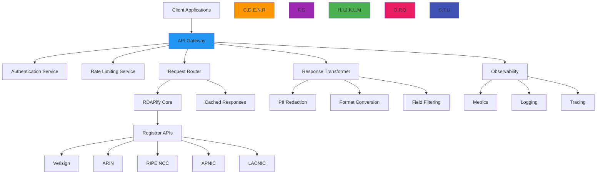

# وصفة معمارية: بوابة API

**الغرض**: دليل شامل لتطبيق بوابة API آمنة وعالية الأداء لاستعلامات بيانات تسجيل RDAP، مع قدرات توجيه متقدمة وسياسات أمان وإمكانية مراقبة شاملة
**ذات صلة**: [محفظة النطاقات](domain-portfolio.md) | [خدمة المراقبة](monitoring-service.md) | [التنبيهات الحرجة](critical-alerts.md) | [الأمان والخصوصية](../guides/security_privacy.md)
**وقت القراءة**: 9 دقائق

## نظرة عامة على معمارية بوابة API

توفر بوابة API الخاصة بـ RDAPify نقطة وصول موحدة لاستعلامات بيانات التسجيل مع أمان على مستوى المؤسسات وقدرات توجيه وتحويل متقدمة:



### المبادئ الأساسية لبوابة API
- **نقطة وصول موحدة**: نقطة نهاية واحدة لجميع استعلامات بيانات التسجيل بصرف النظر عن السجل المصدر
- **تصميم يضع الأمان أولاً**: المصادقة والتفويض والحماية من التهديدات قبل معالجة البيانات
- **أداء على نطاق واسع**: تخزين مؤقت ذكي وتحسين الطلبات لسيناريوهات الإنتاجية العالية
- **الامتثال بشكل افتراضي**: معالجة بيانات متوافقة مع GDPR/CCPA مع سياسات قابلة للتهيئة
- **مدفوع بالمراقبة**: مقاييس شاملة وتسجيل وتتبع للتميز التشغيلي
- **حياد البروتوكول**: دعم متزامن لعملاء REST وGraphQL وgRPC وWebSocket

## أنماط التطبيق

### 1. المعمارية الأساسية للبوابة
```typescript
// src/gateway/api-gateway.ts
import { Router, Request, Response, NextFunction } from 'express';
import { RDAPClient } from 'rdapify';
import { RateLimiter } from './rate-limiter';
import { AuthenticationMiddleware } from './auth-middleware';
import { RequestValidator } from './validator';
import { CacheService } from './cache-service';
import { PIIRedactor } from './pii-redactor';
import { FormatTransformer } from './format-transformer';
import { MetricsCollector } from './metrics-collector';

export class RDAPGateway {
  private router = Router();
  private rdapClient: RDAPClient;
  private rateLimiter: RateLimiter;
  private cacheService: CacheService;
  private piiRedactor: PIIRedactor;
  private formatTransformer: FormatTransformer;
  private metrics: MetricsCollector;

  constructor(options: GatewayOptions) {
    this.rdapClient = options.rdapClient || new RDAPClient({
      cache: true,
      privacy: true,
      timeout: 5000,
      retry: { maxAttempts: 3, backoff: 'exponential' }
    });

    this.rateLimiter = new RateLimiter(options.rateLimitConfig);
    this.cacheService = new CacheService(options.cacheConfig);
    this.piiRedactor = new PIIRedactor(options.complianceConfig);
    this.formatTransformer = new FormatTransformer();
    this.metrics = new MetricsCollector();

    // Setup middleware pipeline
    this.setupMiddleware();

    // Setup routes
    this.setupRoutes();
  }

  private setupMiddleware() {
    // Security headers
    this.router.use(this.securityHeaders);

    // Request ID for tracing
    this.router.use(this.setRequestId);

    // Authentication
    this.router.use(new AuthenticationMiddleware().authenticate);

    // Rate limiting
    this.router.use(this.rateLimiter.middleware);

    // Request validation
    this.router.use(new RequestValidator().validate);

    // CORS configuration
    this.router.use(this.corsConfig);
  }

  private setupRoutes() {
    // Domain lookup endpoint
    this.router.get('/v1/domains/:domain', this.handleDomainLookup);

    // Batch domain lookup endpoint
    this.router.post('/v1/domains/batch', this.handleBatchDomainLookup);

    // IP lookup endpoint
    this.router.get('/v1/ips/:ip', this.handleIPLookup);

    // ASN lookup endpoint
    this.router.get('/v1/asns/:asn', this.handleASNLookup);

    // Health check endpoint
    this.router.get('/health', this.handleHealthCheck);

    // Metrics endpoint (protected)
    this.router.get('/metrics', this.requireRole('metrics'), this.handleMetrics);

    // Error handling
    this.router.use(this.errorHandler);
  }

  private async handleDomainLookup(req: Request, res: Response, next: NextFunction) {
    const startTime = Date.now();
    const { domain } = req.params;
    const tenantId = req.tenant?.id;
    const clientId = req.client?.id;

    try {
      // Check cache first
      const cacheKey = this.generateCacheKey('domain', domain, req);
      const cached = await this.cacheService.get(cacheKey);
      if (cached) {
        this.metrics.recordCacheHit('domain');
        return this.sendResponse(res, cached, startTime);
      }

      // Execute RDAP query with tenant context
      const result = await this.rdapClient.domain(domain, {
        tenantId,
        clientId,
        privacy: req.tenant?.redactPII ?? true,
        legalBasis: req.tenant?.legalBasis
      });

      // Apply PII redaction based on compliance context
      const redacted = await this.piiRedactor.redact(result, {
        jurisdiction: req.tenant?.jurisdiction,
        legalBasis: req.tenant?.legalBasis,
        consent: req.consent
      });

      // Transform response format
      const transformed = this.formatTransformer.transform(redacted, req.headers['accept']);

      // Cache result with tenant-specific TTL
      const ttl = req.tenant?.cacheTTL || 3600;
      await this.cacheService.set(cacheKey, transformed, { ttl });

      // Record metrics
      this.metrics.recordAPIRequest('domain', Date.now() - startTime, tenantId);
      this.metrics.recordRegistryHit(result.registry);

      return this.sendResponse(res, transformed, startTime);
    } catch (error) {
      this.metrics.recordAPIError('domain', error, tenantId);
      next(error);
    }
  }

  private generateCacheKey(type: string, identifier: string, req: Request): string {
    // Include tenant and client context in cache key
    return [
      type,
      identifier.toLowerCase(),
      req.tenant?.id || 'default',
      req.client?.id || 'default',
      req.headers['accept'] || 'application/json',
      req.tenant?.jurisdiction || 'global'
    ].join(':');
  }

  private sendResponse(res: Response, data: any, startTime: number): void {
    const duration = Date.now() - startTime;

    // Add response headers
    res.setHeader('X-Request-Duration', `${duration}ms`);
    res.setHeader('X-Cache', 'HIT');
    res.setHeader('X-API-Version', '1.0');

    // Set appropriate content type
    const contentType = this.formatTransformer.getContentType(req.headers['accept']);
    res.setHeader('Content-Type', contentType);

    // Send response with proper status code
    res.status(200).json(data);
  }

  private securityHeaders(req: Request, res: Response, next: NextFunction) {
    res.setHeader('Strict-Transport-Security', 'max-age=31536000; includeSubDomains');
    res.setHeader('X-Content-Type-Options', 'nosniff');
    res.setHeader('X-Frame-Options', 'DENY');
    res.setHeader('Content-Security-Policy', "default-src 'self'");
    res.setHeader('X-XSS-Protection', '1; mode=block');
    next();
  }

  getRouter(): Router {
    return this.router;
  }
}
```

### 2. طبقة دعم البروتوكولات المتعددة
```typescript
// src/gateway/protocol-adapters.ts
import { Request, Response } from 'express';
import { GraphQLServer } from './graphql-server';
import { GRPCServer } from './grpc-server';
import { WebSocketServer } from './websocket-server';

export class ProtocolAdapter {
  private graphqlServer: GraphQLServer;
  private grpcServer: GRPCServer;
  private websocketServer: WebSocketServer;

  constructor(private gateway: RDAPGateway) {
    this.graphqlServer = new GraphQLServer(gateway);
    this.grpcServer = new GRPCServer(gateway);
    this.websocketServer = new WebSocketServer(gateway);
  }

  setupProtocolRoutes(app: any) {
    // REST/JSON (default)
    app.use('/api', this.gateway.getRouter());

    // GraphQL endpoint
    app.use('/graphql', this.graphqlServer.getMiddleware());

    // gRPC endpoint
    app.use('/grpc', (req: Request, res: Response) => {
      this.grpcServer.handleRequest(req, res);
    });

    // WebSocket endpoint
    this.websocketServer.setup(app);
  }
}

// GraphQL Schema Example
const typeDefs = `
  type Domain {
    domain: String!
    registrar: String
    status: [String!]
    nameservers: [String!]
    created: String
    expires: String
    events: [DomainEvent!]
  }

  type DomainEvent {
    type: String!
    date: String!
  }

  type IP {
    ip: String!
    network: String
    country: String
    organization: String
    abuseContact: String
  }

  type ASN {
    asn: String!
    name: String
    country: String
    description: String
  }

  type Query {
    domain(name: String!): Domain
    ip(address: String!): IP
    asn(number: String!): ASN
    batchDomains(names: [String!]!): [Domain!]
  }
`;
```

## ضوابط الأمان والامتثال

### 1. تطبيق أمان المستأجرين المتعددين
```typescript
// src/gateway/security-enforcer.ts
export class SecurityEnforcer {
  private tenantPolicies = new Map<string, TenantPolicy>();
  private threatIntelligence: ThreatIntelligenceService;

  constructor(private policyStore: PolicyStore) {
    this.threatIntelligence = new ThreatIntelligenceService();
    this.loadTenantPolicies();
  }

  async enforceSecurity(req: Request, res: Response, next: NextFunction): Promise<void> {
    // Extract tenant and client context
    const tenantId = this.extractTenantId(req);
    const clientId = this.extractClientId(req);

    // Load tenant policy
    const policy = this.getTenantPolicy(tenantId);
    if (!policy) {
      throw new Error(`Tenant policy not found for tenant: ${tenantId}`);
    }

    // Store context for downstream processing
    req.tenant = { id: tenantId, ...policy };
    req.client = { id: clientId };

    // Apply security controls
    await this.applySecurityControls(req, policy);

    next();
  }

  private async applySecurityControls(req: Request, policy: TenantPolicy): Promise<void> {
    // SSRF protection
    this.enforceSSRFProtection(req);

    // PII handling based on jurisdiction
    this.enforcePIIPolicy(req, policy);

    // Threat intelligence checks
    await this.checkThreatIntelligence(req, policy);

    // Data residency enforcement
    this.enforceDataResidency(req, policy);

    // Access control validation
    this.validateAccessControl(req, policy);
  }

  private enforceSSRFProtection(req: Request): void {
    // Block private IP ranges
    const privateIPRegex = /(^127\..*)|(^10\..*)|(^172\.1[6-9]\..*)|(^172\.2[0-9]\..*)|(^172\.3[0-1]\..*)|(^192\.168\..*)/;

    if (req.params.domain && privateIPRegex.test(req.params.domain)) {
      throw new SecurityError('SSRF protection blocked request to private IP', {
        code: 'SSRF_PROTECTED',
        domain: req.params.domain
      });
    }

    // Block file protocol and other dangerous schemes
    if (req.params.domain?.match(/^(file|gopher|dict):/i)) {
      throw new SecurityError('Protocol not allowed', {
        code: 'PROTOCOL_NOT_ALLOWED',
        protocol: req.params.domain.split(':')[0]
      });
    }
  }

  private enforcePIIPolicy(req: Request, policy: TenantPolicy): void {
    // GDPR compliance requires PII redaction by default
    if (policy.jurisdiction === 'EU' && !policy.allowRawPII) {
      req.tenant.redactPII = true;
    }

    // CCPA compliance requires do-not-sell handling
    if (policy.jurisdiction === 'US-CA') {
      req.tenant.doNotSell = policy.doNotSell || true;
    }
  }
}
```

### 2. معالجة الطلبات المراعية للامتثال
```typescript
// src/gateway/compliance-processor.ts
export class ComplianceProcessor {
  private readonly gdprRequiredFields = ['data_minimization', 'purpose_limitation', 'storage_limitation'];
  private readonly ccpaRequiredFields = ['do_not_sell', 'consumer_rights'];

  async processRequest(req: Request, context: ComplianceContext): Promise<ComplianceResult> {
    const result: ComplianceResult = {
      compliant: true,
      actions: [],
      warnings: [],
      legalBasis: context.legalBasis || 'legitimate-interest'
    };

    // Apply jurisdiction-specific compliance rules
    switch (context.jurisdiction) {
      case 'EU':
        return this.processGDPRRequest(req, context, result);
      case 'US-CA':
        return this.processCCPARequest(req, context, result);
      case 'SA':
        return this.processPDPLRequest(req, context, result);
      default:
        return this.processDefaultRequest(req, context, result);
    }
  }

  async generateComplianceReport(context: ComplianceContext): Promise<ComplianceReport> {
    return {
      timestamp: new Date().toISOString(),
      jurisdiction: context.jurisdiction,
      complianceStatus: 'compliant',
      applicableRegulations: this.getRegulations(context.jurisdiction),
      dataProcessingDetails: {
        lawfulBasis: context.legalBasis,
        consentStatus: context.consentGiven,
        dataRetentionPeriod: `${context.dataRetentionDays || 30} days`,
        dataAccessControls: context.accessControls.join(', ')
      },
      nextAuditDue: new Date(Date.now() + 30 * 24 * 60 * 60 * 1000).toISOString()
    };
  }

  private getRegulations(jurisdiction: string): string[] {
    switch (jurisdiction) {
      case 'EU':
        return ['GDPR', 'ePrivacy Directive'];
      case 'US-CA':
        return ['CCPA', 'CPRA'];
      case 'SA':
        return ['PDPL', 'NCA Regulations'];
      default:
        return ['General Data Protection Principles'];
    }
  }
}
```

## استراتيجيات تحسين الأداء

### 1. نظام التخزين المؤقت الذكي
```typescript
// src/gateway/cache-system.ts
export class IntelligentCacheSystem {
  private cache = new LRUCache<string, CacheEntry>({
    max: 10000,
    ttl: 3600000, // 1 hour default
    updateAgeOnGet: true,
    dispose: (value, key, reason) => {
      if (reason === 'ttl') {
        this.metrics.recordCacheEviction('ttl', key);
      } else if (reason === 'size') {
        this.metrics.recordCacheEviction('size', key);
      }
    }
  });

  private adaptiveTTLs = new Map<string, AdaptiveTTL>();
  private metrics = new CacheMetrics();

  async get(key: string, req: Request): Promise<any | null> {
    const cached = this.cache.get(key);
    if (!cached) return null;

    // Check if cache entry is still valid based on context
    if (!this.isCacheValid(cached, req)) {
      this.metrics.recordCacheMiss('stale');
      return null;
    }

    this.metrics.recordCacheHit(cached.type);
    return cached.data;
  }

  async set(key: string, data: any, req: Request, options: CacheOptions = {}): Promise<void> {
    const entry: CacheEntry = {
      data,
      timestamp: Date.now(),
      type: this.getCacheType(req),
      tenantId: req.tenant?.id,
      ttl: options.ttl || this.getAdaptiveTTL(key)
    };

    this.cache.set(key, entry, { ttl: entry.ttl });
  }
}
```

[← العودة إلى الوصفات](../README.md)
