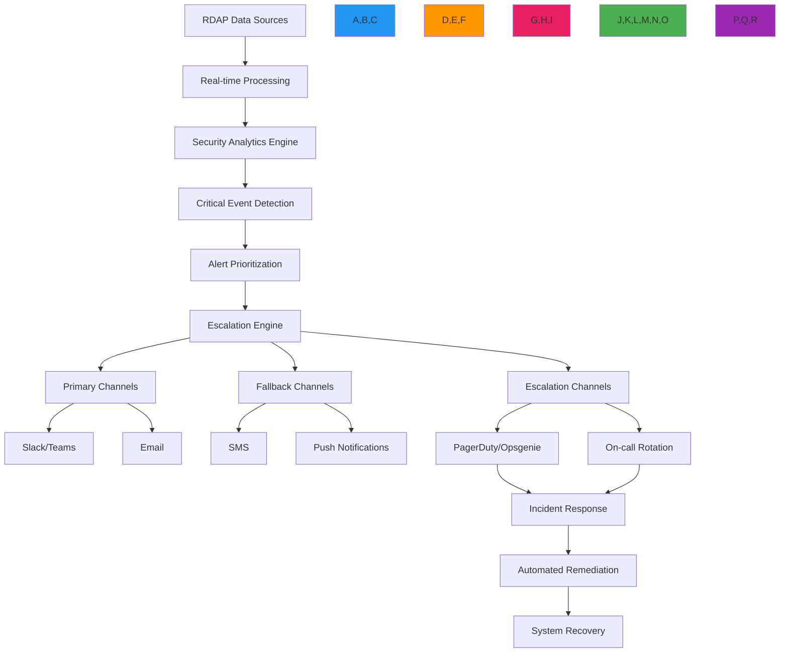

# وصفة التنبيهات الحرجة

**الغرض**: دليل شامل لتطبيق أنظمة تنبيه عالية الأولوية مع RDAPify للإخطار الفوري بالتغييرات الأمنية الحرجة في تسجيل النطاقات وانتهاكات الامتثال
**ذات صلة**: [خدمة المراقبة](monitoring-service.md) | [محفظة النطاقات](domain-portfolio.md) | [بوابة API](api-gateway.md) | [الأمان والخصوصية](../guides/security_privacy.md)
**وقت القراءة**: 7 دقائق

## نظرة عامة على معمارية التنبيهات الحرجة

يوفر نظام التنبيهات الحرجة الخاص بـ RDAPify قدرات إخطار بزمن انتقال صفري لأحداث التسجيل الحساسة أمنياً مع تصعيد متعدد القنوات وامتثال تنظيمي:



### المبادئ الأساسية للتنبيهات
- **صفر حالات فائتة**: إعطاء الأولوية لحساسية الكشف على تقليل الإيجابيات الكاذبة للأحداث الأمنية الحرجة
- **تصعيد متدرج**: مسارات تصعيد متعددة المستويات مع تحويل تلقائي للتنبيهات غير المُعترف بها
- **الامتثال التنظيمي**: معالجة تنبيهات متوافقة مع GDPR/CCPA مع مسارات تدقيق وتقليل البيانات
- **إشعارات غنية بالسياق**: تتضمن التنبيهات سياقاً تجارياً وليس فقط تفاصيل تقنية
- **استجابة آلية**: تكامل مع أنظمة الاستجابة للحوادث للتخفيف الفوري
- **تكرار عبر القنوات**: قنوات تسليم متعددة تضمن وصول التنبيهات خلال حالات التوقف

## أنماط التطبيق

### 1. محرك اكتشاف التنبيهات الحرجة
```typescript
// src/alerts/detection-engine.ts
import { DomainMonitor, DomainChangeEvent, SecurityContext } from '../monitoring';
import { ThreatIntelligenceService } from '../security/threat-intelligence';
import { ComplianceEngine } from '../security/compliance';

export class CriticalAlertEngine {
  private domainMonitor: DomainMonitor;
  private threatIntelligence: ThreatIntelligenceService;
  private complianceEngine: ComplianceEngine;
  private escalationPolicies = new Map<string, EscalationPolicy>();

  constructor(options: {
    domainMonitor?: DomainMonitor;
    threatIntelligence?: ThreatIntelligenceService;
    complianceEngine?: ComplianceEngine;
    escalationPolicies?: Record<string, EscalationPolicy>;
  } = {}) {
    this.domainMonitor = options.domainMonitor || new DomainMonitor();
    this.threatIntelligence = options.threatIntelligence || new ThreatIntelligenceService();
    this.complianceEngine = options.complianceEngine || new ComplianceEngine();

    // Load default escalation policies
    this.loadDefaultPolicies(options.escalationPolicies || {});
  }

  private loadDefaultPolicies(policies: Record<string, EscalationPolicy>) {
    // Critical security policy
    this.escalationPolicies.set('critical_security', {
      id: 'critical_security',
      severity: 'critical',
      responseTime: 300, // seconds
      channels: ['pagerduty', 'sms', 'email'],
      fallbackChannels: ['voice', 'push'],
      repeatInterval: 120, // seconds
      maxEscalationLevel: 3,
      autoCreateIncident: true
    });

    // High security policy
    this.escalationPolicies.set('high_security', {
      id: 'high_security',
      severity: 'high',
      responseTime: 900, // 15 minutes
      channels: ['slack', 'email'],
      fallbackChannels: ['sms'],
      repeatInterval: 300, // 5 minutes
      maxEscalationLevel: 2,
      autoCreateIncident: true
    });

    // Compliance policy
    this.escalationPolicies.set('compliance_violation', {
      id: 'compliance_violation',
      severity: 'high',
      responseTime: 3600, // 1 hour
      channels: ['email', 'compliance-portal'],
      fallbackChannels: ['slack'],
      repeatInterval: 1800, // 30 minutes
      maxEscalationLevel: 1,
      requireDpoNotification: true,
      autoCreateIncident: false
    });

    // Apply custom policies
    Object.entries(policies).forEach(([id, policy]) => {
      this.escalationPolicies.set(id, policy);
    });
  }

  async startMonitoringCriticalDomains(domains: string[], context: SecurityContext): Promise<void> {
    // Start monitoring with critical alert callback
    this.domainMonitor.startMonitoring(domains, {
      ...context,
      onCriticalChange: async (event: DomainChangeEvent) => {
        await this.processCriticalEvent(event, context);
      },
      criticalDomains: domains
    });

    // Pre-warm threat intelligence for critical domains
    await this.preWarmThreatIntelligence(domains);
  }

  private async processCriticalEvent(event: DomainChangeEvent, context: SecurityContext): Promise<void> {
    // Calculate threat score
    const threatScore = await this.threatIntelligence.calculateThreatScore(event, context);

    // Determine if event requires critical alert
    if (this.requiresCriticalAlert(event, threatScore, context)) {
      await this.triggerCriticalAlert(event, threatScore, context);
    }
  }

  private requiresCriticalAlert(event: DomainChangeEvent, threatScore: number, context: SecurityContext): boolean {
    // Security-critical changes always require alerts
    const securityCriticalChanges = [
      'registrar_change',
      'nameserver_change',
      'status_change',
      'contact_change'
    ];

    if (securityCriticalChanges.includes(event.changeType) && threatScore > 0.7) {
      return true;
    }

    // Expiration-related alerts for critical domains
    if (event.changeType === 'expiration_change' &&
        event.newValue &&
        this.daysUntilExpiration(event.newValue) < 7) {
      return true;
    }

    // Compliance-triggered alerts
    if (await this.complianceEngine.requiresAlert(event, context)) {
      return true;
    }

    return false;
  }

  private async triggerCriticalAlert(event: DomainChangeEvent, threatScore: number, context: SecurityContext): Promise<void> {
    // Determine escalation policy
    const policy = this.getEscalationPolicy(event, threatScore, context);

    // Create alert payload
    const alert: CriticalAlert = {
      id: `alert_${Date.now()}_${Math.random().toString(36).slice(2, 8)}`,
      timestamp: new Date().toISOString(),
      domain: event.domain,
      eventType: event.changeType,
      severity: threatScore > 0.9 ? 'critical' : 'high',
      threatScore,
      policyId: policy.id,
      context,
      details: {
        oldValue: event.oldValue,
        newValue: event.newValue,
        detectionMethod: 'real-time-monitoring',
        businessImpact: this.calculateBusinessImpact(event, context)
      },
      compliance: {
        jurisdiction: context.jurisdiction,
        legalBasis: context.legalBasis,
        dataMinimized: true
      }
    };

    // Create compliance-aware payload
    const compliantAlert = await this.complianceEngine.applyComplianceTransformations(alert, context);

    // Deliver alert through escalation path
    await this.deliverAlert(compliantAlert, policy);

    // Record alert for audit
    await this.recordAuditLog(compliantAlert, policy);

    // Auto-create incident if required
    if (policy.autoCreateIncident) {
      await this.autoCreateIncident(compliantAlert, policy);
    }
  }
}
```

### 2. نظام تسليم التنبيهات متعدد القنوات
```typescript
// src/alerts/alert-delivery.ts
export class MultiChannelAlertDelivery {
  private channels = new Map<string, AlertChannel>();
  private rateLimiters = new Map<string, RateLimiter>();

  constructor(private options: AlertDeliveryOptions = {}) {
    this.initializeChannels();
    this.initializeRateLimiters();
  }

  private initializeChannels() {
    // Initialize all alert channels
    this.channels.set('pagerduty', new PagerDutyChannel(this.options.pagerDutyConfig));
    this.channels.set('sms', new SMSChannel(this.options.smsConfig));
    this.channels.set('email', new EmailChannel(this.options.emailConfig));
    this.channels.set('slack', new SlackChannel(this.options.slackConfig));
    this.channels.set('voice', new VoiceChannel(this.options.voiceConfig));
    this.channels.set('push', new PushChannel(this.options.pushConfig));
    this.channels.set('compliance-portal', new CompliancePortalChannel(this.options.complianceConfig));
  }

  private initializeRateLimiters() {
    // Initialize rate limiters for each channel
    const channelLimits: Record<string, { max: number; window: number }> = {
      'pagerduty': { max: 5, window: 300000 }, // 5 alerts/5 minutes
      'sms': { max: 10, window: 600000 }, // 10 alerts/10 minutes
      'email': { max: 50, window: 3600000 }, // 50 alerts/hour
      'slack': { max: 100, window: 3600000 }, // 100 alerts/hour
      'voice': { max: 3, window: 900000 }, // 3 calls/15 minutes
      'push': { max: 20, window: 3600000 }, // 20 pushes/hour
      'compliance-portal': { max: 10, window: 86400000 } // 10/day
    };

    Object.entries(channelLimits).forEach(([channel, config]) => {
      this.rateLimiters.set(channel, new RateLimiter({
        max: config.max,
        window: config.window,
        storage: this.options.rateLimitStorage
      }));
    });
  }

  async deliver(alert: CriticalAlert, channel: string, escalationLevel: number): Promise<DeliveryResult> {
    const channelHandler = this.channels.get(channel);
    if (!channelHandler) {
      throw new Error(`Channel not found: ${channel}`);
    }

    const rateLimiter = this.rateLimiters.get(channel);
    if (!rateLimiter) {
      throw new Error(`Rate limiter not found for channel: ${channel}`);
    }

    // Apply rate limiting
    const { success, reset } = await rateLimiter.consume(alert.context.tenantId || 'default');
    if (!success) {
      throw new Error(`Rate limit exceeded for channel ${channel}, reset in ${Math.ceil(reset / 1000)} seconds`);
    }

    try {
      // Apply compliance transformations based on channel
      const compliantAlert = await this.applyChannelCompliance(alert, channel, escalationLevel);

      // Deliver with channel-specific context
      return await channelHandler.deliver(compliantAlert, escalationLevel);
    } catch (error) {
      this.logDeliveryFailure(alert, channel, error);
      throw error;
    }
  }
}

// Channel implementation example - PagerDuty
class PagerDutyChannel implements AlertChannel {
  constructor(private config: PagerDutyConfig) {}

  async deliver(alert: CriticalAlert, escalationLevel: number): Promise<DeliveryResult> {
    const payload = {
      routing_key: this.config.routingKey,
      event_action: 'trigger',
      dedup_key: `rdapify:${alert.domain}:${alert.eventType}`,
      payload: {
        summary: `[${alert.severity.toUpperCase()}] Critical domain change detected for ${alert.domain}`,
        source: 'rdapify-monitoring',
        severity: this.mapSeverity(alert.severity),
        timestamp: alert.timestamp,
        component: 'domain-monitoring',
        group: alert.context.tenantId,
        class: alert.eventType,
        custom_details: {
          domain: alert.domain,
          changeType: alert.eventType,
          oldValue: alert.details.oldValue,
          newValue: alert.details.newValue,
          threatScore: alert.threatScore,
          businessImpact: alert.details.businessImpact
        }
      }
    };

    const response = await fetch('https://events.pagerduty.com/v2/enqueue', {
      method: 'POST',
      headers: { 'Content-Type': 'application/json' },
      body: JSON.stringify(payload)
    });

    if (!response.ok) {
      const errorBody = await response.text();
      throw new Error(`PagerDuty API error (${response.status}): ${errorBody.substring(0, 100)}`);
    }

    const result = await response.json();
    return {
      success: true,
      channel: 'pagerduty',
      incidentKey: result.dedup_key,
      timestamp: new Date().toISOString()
    };
  }
}
```

## ضوابط الأمان والامتثال

### 1. معالجة التنبيهات المتوافقة مع GDPR
```typescript
// src/alerts/gdpr-compliance.ts
export class GDPRCompliantAlertProcessor {
  private dpoContact: string;
  private retentionPeriodDays: number;
  private dataMinimizationRules: DataMinimizationRule[];

  constructor(options: {
    dpoContact: string;
    retentionPeriodDays?: number;
    dataMinimizationRules?: DataMinimizationRule[];
  }) {
    this.dpoContact = options.dpoContact;
    this.retentionPeriodDays = options.retentionPeriodDays || 30;
    this.dataMinimizationRules = options.dataMinimizationRules || this.getDefaultRules();
  }

  async processAlert(alert: CriticalAlert, context: GDPRContext): Promise<GDPRAlert> {
    // Verify legal basis
    const legalBasis = this.verifyLegalBasis(context);
    if (!legalBasis.valid) {
      throw new ComplianceError('No valid legal basis for processing', {
        alertId: alert.id,
        context,
        violations: legalBasis.violations
      });
    }

    // Apply data minimization
    const minimizedAlert = this.applyDataMinimization(alert, context);

    // Apply PII redaction
    const redactedAlert = await this.applyPIIRedaction(minimizedAlert, context);

    // Add GDPR metadata
    const gdprAlert: GDPRAlert = {
      ...redactedAlert,
      gdprMetadata: {
        legalBasis: legalBasis.basis,
        dataMinimizationApplied: true,
        retentionPeriod: `${this.retentionPeriodDays} days`,
        dpoContact: this.dpoContact,
        dataSubjectRights: context.dataSubjectRights,
        processingPurpose: context.purposes.join(', '),
        consentObtained: context.consent?.given,
        consentTimestamp: context.consent?.timestamp,
        lawfulBasisDocumentation: legalBasis.documentation
      }
    };

    // Record processing activity
    await this.recordProcessingActivity(gdprAlert, context, legalBasis);

    return gdprAlert;
  }

  private verifyLegalBasis(context: GDPRContext): LegalBasisResult {
    // GDPR Article 6 lawful bases
    const lawfulBases = [
      {
        basis: 'consent',
        valid: context.consent?.given && context.consent.documented,
        documentation: 'Explicit consent obtained and documented'
      },
      {
        basis: 'contract',
        valid: context.contract?.exists,
        documentation: 'Processing necessary for contract performance'
      },
      {
        basis: 'legal-obligation',
        valid: context.legalObligation?.exists,
        documentation: 'Processing required by law'
      },
      {
        basis: 'legitimate-interest',
        valid: this.validateLegitimateInterest(context),
        documentation: 'Legitimate interest assessment performed'
      }
    ];

    const validBasis = lawfulBases.find(b => b.valid);
    if (validBasis) {
      return {
        valid: true,
        basis: validBasis.basis,
        documentation: validBasis.documentation
      };
    }

    return {
      valid: false,
      violations: [
        'No valid lawful basis under GDPR Article 6',
        'Consider obtaining explicit consent or establishing contractual necessity',
        'Data processing without legal basis violates GDPR Article 6(1)'
      ]
    };
  }
}
```

[← العودة إلى الوصفات](../README.md)
