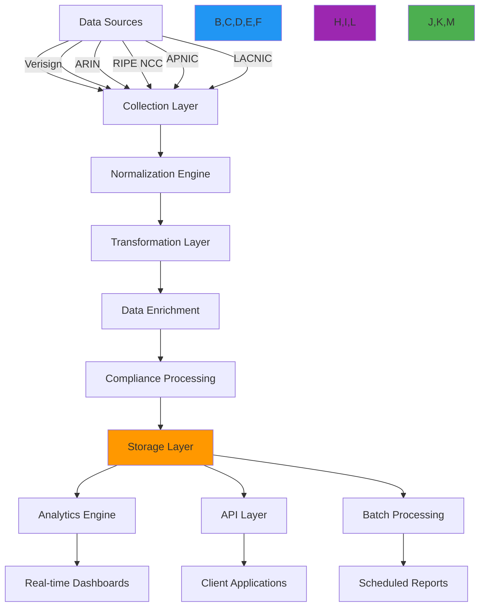

# وصفة أنماط تجميع البيانات

**الغرض**: دليل شامل لتطبيق أنظمة تجميع بيانات قابلة للتوسع وآمنة لبيانات تسجيل RDAP مع معالجة في الوقت الفعلي وضوابط الامتثال وقدرات تحليل متقدمة
**ذات صلة**: [محفظة النطاقات](domain-portfolio.md) | [بوابة API](api-gateway.md) | [خدمة المراقبة](monitoring-service.md) | [مكونات لوحة التحكم](../analytics/dashboard-components.md)
**وقت القراءة**: 8 دقائق

## نظرة عامة على معمارية تجميع البيانات

يوفر نظام تجميع البيانات الخاص بـ RDAPify رؤية موحدة لبيانات التسجيل عبر سجلات متعددة مع الحفاظ على سلامة البيانات وحدود الأمان وخصائص الأداء:



### المبادئ الأساسية لتجميع البيانات
- **أصل البيانات**: تتبع سجل المصدر وتاريخ التحويل لكل نقطة بيانات
- **حدود الامتثال**: تطبيق سياسات الاختزال والاحتفاظ الخاصة بالولاية القضائية أثناء التجميع
- **الدقة الزمنية**: الحفاظ على طوابع زمنية دقيقة وإصدارات تاريخية لتحليل الاتجاهات
- **معمارية قابلة للتوسع**: معالجة ملايين السجلات مع توسع خطي للأداء
- **المعالجة في الوقت الفعلي**: دعم أنماط التجميع الدفعي والتدفقي
- **سياق الأمان**: الحفاظ على سياق الأمان طوال خط أنابيب التجميع

## أنماط التطبيق

### 1. إطار جمع البيانات الموحد
```typescript
// src/aggregation/data-collector.ts
import { RDAPClient, DomainResponse, IPResponse } from 'rdapify';
import { RegistryConfig } from '../types';
import { ComplianceEngine } from '../security/compliance';

export class UnifiedDataCollector {
  private rdapClient: RDAPClient;
  private registryConfigs = new Map<string, RegistryConfig>();
  private complianceEngine: ComplianceEngine;

  constructor(options: {
    rdapClient?: RDAPClient;
    registryConfigs?: Record<string, RegistryConfig>;
    complianceEngine?: ComplianceEngine;
  } = {}) {
    this.rdapClient = options.rdapClient || new RDAPClient({
      cache: true,
      privacy: true,
      timeout: 5000,
      retry: { maxAttempts: 3, backoff: 'exponential' },
      maxConcurrent: 50
    });

    this.complianceEngine = options.complianceEngine || new ComplianceEngine();

    // Load registry configurations
    Object.entries(options.registryConfigs || this.getDefaultRegistries()).forEach(([id, config]) => {
      this.registryConfigs.set(id, config);
    });
  }

  private getDefaultRegistries(): Record<string, RegistryConfig> {
    return {
      'verisign': {
        id: 'verisign',
        bootstrapUrl: 'https://data.iana.org/rdap/dns.json',
        urlTemplate: 'https://rdap.verisign.com/com/v1/{type}/{query}',
        maxRequestsPerMinute: 100,
        supportsBatch: true
      },
      'arin': {
        id: 'arin',
        bootstrapUrl: 'https://data.iana.org/rdap/ipv4.json',
        urlTemplate: 'https://rdap.arin.net/registry/{type}/{query}',
        maxRequestsPerMinute: 50,
        supportsBatch: false
      },
      'ripe': {
        id: 'ripe',
        bootstrapUrl: 'https://data.iana.org/rdap/ipv4.json',
        urlTemplate: 'https://rdap.db.ripe.net/{type}/{query}',
        maxRequestsPerMinute: 40,
        supportsBatch: true
      },
      'apnic': {
        id: 'apnic',
        bootstrapUrl: 'https://data.iana.org/rdap/ipv4.json',
        urlTemplate: 'https://rdap.apnic.net/{type}/{query}',
        maxRequestsPerMinute: 30,
        supportsBatch: false
      },
      'lacnic': {
        id: 'lacnic',
        bootstrapUrl: 'https://data.iana.org/rdap/ipv4.json',
        urlTemplate: 'https://rdap.lacnic.net/rdap/{type}/{query}',
        maxRequestsPerMinute: 25,
        supportsBatch: true
      }
    };
  }

  async collectDomains(domains: string[], context: CollectionContext): Promise<AggregationResult> {
    // Apply compliance filtering before collection
    const complianceContext = await this.complianceEngine.getComplianceContext(context);

    // Determine optimal collection strategy
    const strategy = this.getCollectionStrategy(domains, complianceContext);

    // Execute collection with security context
    return this.executeCollectionStrategy(strategy, complianceContext);
  }

  private getCollectionStrategy(domains: string[], context: ComplianceContext): CollectionStrategy {
    // Batch processing for large sets with rate limiting
    if (domains.length > 50) {
      // Group domains by registry for efficient batch processing
      const registryGroups = this.groupDomainsByRegistry(domains);

      return {
        type: 'batch',
        registryGroups,
        concurrency: context.tenant?.maxConcurrent || 10,
        rateLimit: this.calculateRateLimits(registryGroups, context),
        timeoutPerRequest: context.timeout || 5000
      };
    }

    // Parallel processing for smaller sets
    if (domains.length > 5) {
      return {
        type: 'parallel',
        domains,
        concurrency: Math.min(domains.length, context.tenant?.maxConcurrent || 25),
        timeoutPerRequest: context.timeout || 3000
      };
    }

    // Sequential processing for tiny sets or debugging
    return {
      type: 'sequential',
      domains,
      timeoutPerRequest: context.timeout || 2000
    };
  }

  private async executeCollectionStrategy(strategy: CollectionStrategy, context: ComplianceContext): Promise<AggregationResult> {
    const results: AggregationItem[] = [];
    const errors: CollectionError[] = [];
    const startTime = Date.now();

    try {
      switch (strategy.type) {
        case 'batch':
          await this.processBatchStrategy(strategy, context, results, errors);
          break;
        case 'parallel':
          await this.processParallelStrategy(strategy, context, results, errors);
          break;
        case 'sequential':
          await this.processSequentialStrategy(strategy, context, results, errors);
          break;
      }

      // Apply compliance transformations
      const compliantResults = await this.complianceEngine.applyComplianceTransformations(results, context);

      return {
        items: compliantResults,
        errors,
        metadata: {
          startTime,
          endTime: Date.now(),
          duration: Date.now() - startTime,
          strategy: strategy.type,
          itemCount: results.length,
          errorCount: errors.length,
          complianceLevel: context.complianceLevel
        }
      };
    } catch (error) {
      throw new AggregationError('Collection strategy execution failed', {
        strategy: strategy.type,
        error: error.message
      });
    }
  }
}
```

### 2. محرك تطبيع البيانات
```typescript
// src/aggregation/normalization-engine.ts
export class DataNormalizationEngine {
  private registryAdapters = new Map<string, RegistryAdapter>();
  private complianceEngine: ComplianceEngine;

  constructor(options: {
    registryAdapters?: Record<string, RegistryAdapter>;
    complianceEngine?: ComplianceEngine;
  } = {}) {
    this.complianceEngine = options.complianceEngine || new ComplianceEngine();
    this.loadRegistryAdapters(options.registryAdapters || {});
  }

  async normalizeData(rawData: RawRegistryData, context: NormalizationContext): Promise<NormalizedData> {
    // Get registry-specific adapter
    const adapter = this.getAdapter(rawData.registry);

    // Apply registry-specific normalization
    const registryNormalized = await adapter.normalize(rawData, context);

    // Apply cross-registry normalization
    const crossNormalized = this.applyCrossRegistryNormalization(registryNormalized);

    // Apply compliance transformations
    const compliant = await this.complianceEngine.applyComplianceTransformations(crossNormalized, context);

    return {
      ...compliant,
      metadata: {
        registry: rawData.registry,
        normalizedAt: new Date().toISOString(),
        normalizationVersion: '2.0',
        complianceLevel: context.complianceLevel
      }
    };
  }

  private applyCrossRegistryNormalization(data: any): any {
    return {
      ...data,
      // Normalize date formats
      createdDate: this.normalizeDate(data.createdDate || data.registrationDate || data.created),
      updatedDate: this.normalizeDate(data.updatedDate || data.lastChanged || data.updated),
      expiryDate: this.normalizeDate(data.expiryDate || data.expiration || data.expires),
      // Normalize status codes
      status: this.normalizeStatusCodes(data.status || data.statuses || []),
      // Normalize nameserver format
      nameservers: this.normalizeNameservers(data.nameservers || data.nservers || [])
    };
  }

  private normalizeDate(dateStr: string | undefined): string | undefined {
    if (!dateStr) return undefined;
    try {
      return new Date(dateStr).toISOString();
    } catch {
      return dateStr;
    }
  }
}
```

### 3. خط أنابيب تجميع البيانات في الوقت الفعلي
```typescript
// src/aggregation/realtime-pipeline.ts
export class RealtimeAggregationPipeline {
  private eventStream: EventStream;
  private processingQueue: ProcessingQueue;
  private outputHandlers = new Map<string, OutputHandler>();

  constructor(options: {
    eventStream?: EventStream;
    processingQueue?: ProcessingQueue;
    outputHandlers?: Record<string, OutputHandler>;
  } = {}) {
    this.eventStream = options.eventStream || new EventStream();
    this.processingQueue = options.processingQueue || new ProcessingQueue({
      concurrency: 10,
      maxQueueSize: 10000
    });

    // Initialize default output handlers
    this.initializeOutputHandlers(options.outputHandlers || {});
  }

  async processEvent(event: RegistryEvent, context: AggregationContext): Promise<void> {
    // Enqueue for processing
    await this.processingQueue.enqueue(async () => {
      // Process event
      const processed = await this.processRegistryEvent(event, context);

      // Route to appropriate output handlers
      for (const [handlerId, handler] of this.outputHandlers) {
        try {
          if (handler.matches(processed)) {
            await handler.handle(processed, context);
          }
        } catch (error) {
          console.error(`Output handler ${handlerId} failed:`, error.message);
        }
      }
    });
  }

  private async processRegistryEvent(event: RegistryEvent, context: AggregationContext): Promise<ProcessedEvent> {
    return {
      ...event,
      processedAt: new Date().toISOString(),
      complianceLevel: context.complianceLevel,
      tenantId: context.tenantId
    };
  }
}
```

[← العودة إلى الوصفات](../README.md)
