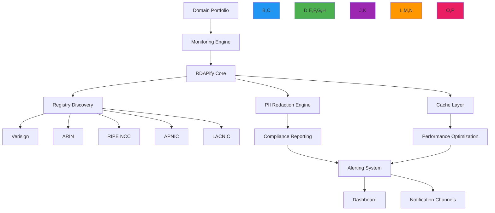

# وصفة إدارة محفظة النطاقات

**الغرض**: دليل شامل لتطبيق أنظمة مراقبة وإدارة محفظة النطاقات باستخدام RDAPify مع تصميم يضع الأمان أولاً ووعي بالامتثال وأداء جاهز للإنتاج
**ذات صلة**: [المعالجة الدفعية](../guides/batch_processing.md) | [اكتشاف الشذوذات](../guides/anomaly_detection.md) | [الأمان والخصوصية](../guides/security_privacy.md) | [التقارير المجدولة](scheduled-reports.md)
**وقت القراءة**: 8 دقائق

## معمارية إدارة محفظة النطاقات

يمكّن RDAPify إدارة محفظة نطاقات على مستوى المؤسسات من خلال معمارية موحدة تجمع بين الأمان والامتثال والأداء:



### المبادئ الأساسية لإدارة المحفظة
- **المراقبة القائمة على المخاطر**: تركيز الموارد على النطاقات الحرجة مع تحليل الأثر التجاري
- **الامتثال بالتصميم**: معالجة بيانات متوافقة مع GDPR/CCPA مع مسارات التدقيق
- **اكتشاف الشذوذات**: كشف التغييرات المدعوم بالتعلم الآلي للأحداث الأمنية
- **تحسين الموارد**: جدولة التخزين المؤقت الذكي والطلبات
- **رؤية موحدة**: مراقبة في لوحة واحدة عبر جميع فئات النطاقات والسجلات

## أنماط التطبيق

### 1. تعريف محفظة النطاقات
```typescript
// src/portfolio/domain-portfolio.ts
interface DomainPortfolio {
  id: string;
  name: string;
  description: string;
  domains: DomainEntry[];
  criticality: 'critical' | 'high' | 'medium' | 'low';
  monitoring: {
    frequency: number; // minutes
    checks: ('expiration' | 'registrar' | 'nameservers' | 'status' | 'contacts')[];
    alertThresholds: {
      daysBeforeExpiration: number;
      maxStatusChanges: number;
    };
  };
  compliance: {
    jurisdiction: string;
    legalBasis: 'consent' | 'contract' | 'legal-obligation' | 'legitimate-interest';
    dataRetentionDays: number;
    piiRedactionLevel: 'full' | 'partial' | 'none';
  };
  owners: {
    primary: string; // email
    secondary: string[]; // emails
  };
  metadata: Record<string, any>;
}

interface DomainEntry {
  domain: string;
  category: 'primary' | 'secondary' | 'brand-protection' | 'acquisition' | 'parked';
  criticalityOverride?: 'critical' | 'high' | 'medium' | 'low';
  notes?: string;
  lastChecked?: Date;
  expirationDate?: Date;
  riskScore?: number;
}

// Portfolio manager class
export class PortfolioManager {
  private portfolios = new Map<string, DomainPortfolio>();
  private rdapClient: RDAPClient;
  private cache: PortfolioCache;

  constructor(options: {
    rdapClient?: RDAPClient;
    cache?: PortfolioCache;
    storage?: PortfolioStorage;
  }) {
    this.rdapClient = options.rdapClient || new RDAPClient({
      cache: true,
      privacy: true,
      maxConcurrent: 10,
      timeout: 5000,
      retry: { maxAttempts: 3, backoff: 'exponential' }
    });

    this.cache = options.cache || new PortfolioCache();
    this.storage = options.storage || new PortfolioStorage();
  }

  async loadPortfolio(portfolioId: string): Promise<DomainPortfolio> {
    const cached = this.cache.getPortfolio(portfolioId);
    if (cached) return cached;

    const portfolio = await this.storage.getPortfolio(portfolioId);
    this.cache.setPortfolio(portfolioId, portfolio);
    return portfolio;
  }

  async addDomainToPortfolio(portfolioId: string, domain: DomainEntry): Promise<void> {
    const portfolio = await this.loadPortfolio(portfolioId);
    portfolio.domains.push(domain);
    await this.storage.updatePortfolio(portfolio);
    this.cache.invalidatePortfolio(portfolioId);
  }

  async removeDomainFromPortfolio(portfolioId: string, domain: string): Promise<void> {
    const portfolio = await this.loadPortfolio(portfolioId);
    portfolio.domains = portfolio.domains.filter(d => d.domain !== domain);
    await this.storage.updatePortfolio(portfolio);
    this.cache.invalidatePortfolio(portfolioId);
  }
}
```

### 2. نظام مراقبة النطاقات الدفعي
```typescript
// src/portfolio/monitoring-system.ts
export class PortfolioMonitoringSystem {
  private portfolioManager: PortfolioManager;
  private alertManager: AlertManager;
  private anomalyDetector: AnomalyDetector;

  constructor(
    portfolioManager: PortfolioManager,
    alertManager: AlertManager,
    anomalyDetector: AnomalyDetector
  ) {
    this.portfolioManager = portfolioManager;
    this.alertManager = alertManager;
    this.anomalyDetector = anomalyDetector;
  }

  async monitorPortfolio(portfolioId: string): Promise<MonitoringResults> {
    const portfolio = await this.portfolioManager.loadPortfolio(portfolioId);

    // Determine monitoring frequency based on criticality
    const frequencyMinutes = this.getMonitoringFrequency(portfolio);

    // Get domains that need checking based on last check time
    const domainsToCheck = this.getDomainsToCheck(portfolio, frequencyMinutes);

    if (domainsToCheck.length === 0) {
      return { processed: 0, alerts: 0, anomalies: 0 };
    }

    // Process domains in batches to avoid overwhelming registries
    const batchSize = 25;
    const results = {
      processed: 0,
      alerts: 0,
      anomalies: 0,
      errors: 0
    };

    for (let i = 0; i < domainsToCheck.length; i += batchSize) {
      const batch = domainsToCheck.slice(i, i + batchSize);

      try {
        // Process batch with concurrency control
        const batchResults = await Promise.allSettled(
          batch.map(async (domainEntry) => {
            try {
              return await this.checkDomain(domainEntry, portfolio);
            } catch (error) {
              results.errors++;
              return null;
            }
          })
        );

        // Process results
        for (const result of batchResults) {
          if (result.status === 'fulfilled' && result.value) {
            const { domain, alerts, anomalies } = result.value;
            results.processed++;
            results.alerts += alerts.length;
            results.anomalies += anomalies.length;
          }
        }
      } catch (error) {
        console.error(`Batch processing error:`, error.message);
      }
    }

    return results;
  }

  private getMonitoringFrequency(portfolio: DomainPortfolio): number {
    const frequencyMap = {
      'critical': 15,   // every 15 minutes
      'high': 60,       // every hour
      'medium': 360,    // every 6 hours
      'low': 1440       // daily
    };
    return portfolio.monitoring?.frequency || frequencyMap[portfolio.criticality] || 60;
  }

  private getDomainsToCheck(portfolio: DomainPortfolio, frequencyMinutes: number): DomainEntry[] {
    const threshold = new Date(Date.now() - frequencyMinutes * 60 * 1000);
    return portfolio.domains.filter(d =>
      !d.lastChecked || d.lastChecked < threshold
    );
  }
}
```

### 3. نظام تقييم مخاطر المحفظة
```typescript
// src/portfolio/risk-assessment.ts
export class PortfolioRiskAssessment {
  async assessPortfolioRisk(portfolio: DomainPortfolio, domainData: DomainResult[]): Promise<RiskAssessment> {
    const domainRisks = await Promise.all(
      domainData.map(async (data) => ({
        domain: data.domain,
        riskScore: await this.calculateDomainRisk(data),
        riskFactors: await this.identifyRiskFactors(data)
      }))
    );

    return {
      portfolioId: portfolio.id,
      overallRisk: this.calculateOverallRisk(domainRisks),
      domainRisks,
      timestamp: new Date().toISOString(),
      recommendations: this.generateRecommendations(domainRisks)
    };
  }

  private async calculateDomainRisk(data: DomainResult): Promise<number> {
    let riskScore = 0;

    // Check expiration proximity
    const daysToExpiry = this.getDaysToExpiry(data);
    if (daysToExpiry < 7) riskScore += 0.4;
    else if (daysToExpiry < 30) riskScore += 0.2;
    else if (daysToExpiry < 90) riskScore += 0.1;

    // Check status flags
    const criticalStatuses = ['pendingDelete', 'serverHold', 'clientHold'];
    if (data.status?.some(s => criticalStatuses.includes(s))) {
      riskScore += 0.3;
    }

    // Check for recent changes
    const recentChanges = this.getRecentChanges(data);
    if (recentChanges > 3) riskScore += 0.2;

    return Math.min(riskScore, 1.0);
  }

  private generateRecommendations(domainRisks: DomainRisk[]): Recommendation[] {
    const recommendations: Recommendation[] = [];

    const expiringDomains = domainRisks.filter(d => d.riskScore > 0.3);
    if (expiringDomains.length > 0) {
      recommendations.push({
        type: 'renewal',
        priority: 'high',
        domains: expiringDomains.map(d => d.domain),
        message: `${expiringDomains.length} domain(s) require immediate renewal action`
      });
    }

    return recommendations;
  }
}
```

[← العودة إلى الوصفات](../README.md)
