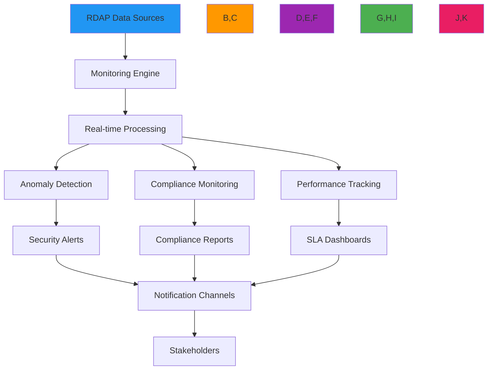

# وصفة خدمة المراقبة

> **يتطلب `@rdapify/pro`** — الميزات الموضحة في هذا الدليل مقدَّمة من الحزمة التجارية [`@rdapify/pro`](https://github.com/rdapify/RDAPify-Pro). ثبّتها جانباً مع `rdapify` لاستخدام هذه الوظائف.

**الغرض**: دليل شامل لتطبيق خدمات مراقبة RDAP في الوقت الفعلي مع اكتشاف الشذوذات وتنبيهات الأمان وقدرات تقارير الامتثال
**ذات صلة**: [محفظة النطاقات](domain-portfolio.md) | [لوحة التحكم التحليلية](../analytics/dashboard-components.md) | [تحليل الأنماط](../analytics/pattern-analysis.md) | [التنبيهات الحرجة](critical-alerts.md)
**وقت القراءة**: 8 دقائق

## نظرة عامة على معمارية المراقبة

يوفر نظام المراقبة الخاص بـ RDAPify رؤية متعددة الطبقات لتغييرات بيانات التسجيل مع اكتشاف الشذوذات المراعي للأمان:



### المبادئ الأساسية للمراقبة
- **الاكتشاف الاستباقي**: تحديد تغييرات التسجيل قبل أن تؤثر على وضع الأمان
- **التنبيهات الواعية بالسياق**: تقليل الضوضاء عن طريق ربط التغييرات بالسياق التجاري
- **أتمتة الامتثال**: توليد تقارير جاهزة للتدقيق للمتطلبات التنظيمية
- **تتبع مستوى خدمة الأداء**: مراقبة مستويات الخدمة مع تحليل الأثر التجاري
- **تكامل الأمان**: تغذية بيانات التسجيل في سير عمل أمان المؤسسة

## أنماط التطبيق

### 1. مراقبة التسجيل في الوقت الفعلي
```typescript
// src/monitoring/registration-monitor.ts
import { RDAPClient, DomainResponse, IPResponse } from 'rdapify';
import { AnomalyDetector } from '../analytics/anomaly-detector';
import { AlertManager } from './alert-manager';

export class RegistrationMonitor {
  private rdapClient: RDAPClient;
  private anomalyDetector: AnomalyDetector;
  private alertManager: AlertManager;
  private monitoringState = new Map<string, RegistrationState>();

  constructor(options: {
    rdapClient?: RDAPClient;
    anomalyDetector?: AnomalyDetector;
    alertManager?: AlertManager;
    pollingInterval?: number;
    batchSize?: number;
  } = {}) {
    this.rdapClient = options.rdapClient || new RDAPClient({
      cache: true,
      privacy: true,
      timeout: 5000,
      retry: { maxAttempts: 3, backoff: 'exponential' }
    });

    this.anomalyDetector = options.anomalyDetector || new AnomalyDetector();
    this.alertManager = options.alertManager || new AlertManager();
    this.pollingInterval = options.pollingInterval || 300000; // 5 minutes
    this.batchSize = options.batchSize || 50;
  }

  async startMonitoring(targets: MonitoringTarget[]): Promise<void> {
    // Initial scan
    await this.performInitialScan(targets);

    // Start continuous monitoring
    setInterval(() => this.performMonitoringCycle(targets), this.pollingInterval);
  }

  private async performInitialScan(targets: MonitoringTarget[]): Promise<void> {
    // Process in batches to avoid overwhelming registries
    for (let i = 0; i < targets.length; i += this.batchSize) {
      const batch = targets.slice(i, i + this.batchSize);
      await this.processBatch(batch, 'initial');

      // Small delay between batches
      if (i + this.batchSize < targets.length) {
        await new Promise(resolve => setTimeout(resolve, 1000));
      }
    }
  }

  private async performMonitoringCycle(targets: MonitoringTarget[]): Promise<void> {
    try {
      // Process targets in parallel batches
      const promises = [];

      for (let i = 0; i < targets.length; i += this.batchSize) {
        const batch = targets.slice(i, i + this.batchSize);
        promises.push(this.processBatch(batch, 'cycle'));
      }

      await Promise.all(promises);

      // Clean up stale state entries
      this.cleanupStaleState();
    } catch (error) {
      console.error(`Monitoring cycle failed: ${error.message}`);
      await this.alertManager.sendSystemAlert({
        type: 'monitoring_failure',
        severity: 'high',
        message: error.message,
        timestamp: new Date().toISOString()
      });
    }
  }

  private async processBatch(batch: MonitoringTarget[], cycleType: 'initial' | 'cycle'): Promise<void> {
    const results = await Promise.allSettled(
      batch.map(async (target) => {
        try {
          return await this.monitorTarget(target);
        } catch (error) {
          console.error(`Error monitoring ${target.identifier}:`, error.message);
          return {
            target,
            success: false,
            error: error.message
          };
        }
      })
    );

    // Process results
    for (const result of results) {
      if (result.status === 'fulfilled' && result.value.success) {
        await this.processTargetResult(result.value);
      }
    }
  }

  private async monitorTarget(target: MonitoringTarget): Promise<MonitoringResult> {
    let response: DomainResponse | IPResponse | ASNResponse;

    switch (target.type) {
      case 'domain':
        response = await this.rdapClient.domain(target.identifier);
        break;
      case 'ip':
        response = await this.rdapClient.ip(target.identifier);
        break;
      case 'asn':
        response = await this.rdapClient.asn(target.identifier);
        break;
      default:
        throw new Error(`Unsupported target type: ${target.type}`);
    }

    return {
      target,
      response,
      success: true,
      timestamp: new Date().toISOString()
    };
  }

  private async processTargetResult(result: TargetResult): Promise<void> {
    const { target, response } = result;
    const prevState = this.monitoringState.get(target.identifier);
    const newState = this.extractMonitoringState(response);

    // Detect changes
    const changes = this.detectChanges(prevState, newState);

    if (changes.length > 0) {
      // Detect anomalies
      const anomalies = await this.anomalyDetector.detectAnomalies(target, changes, prevState, newState);

      // Generate alerts if needed
      if (anomalies.length > 0 || this.requiresAlert(changes, target)) {
        await this.alertManager.sendRegistrationAlert({
          target,
          changes,
          anomalies,
          prevState,
          newState,
          timestamp: new Date().toISOString()
        });
      }
    }

    // Update state
    this.monitoringState.set(target.identifier, newState);
  }

  private detectChanges(prevState: RegistrationState | undefined, newState: RegistrationState): Change[] {
    if (!prevState) return []; // Initial scan, no changes

    const changes: Change[] = [];

    // Check registrar changes
    if (prevState.registrar !== newState.registrar) {
      changes.push({
        type: 'registrar_change',
        oldValue: prevState.registrar,
        newValue: newState.registrar,
        timestamp: new Date().toISOString()
      });
    }

    // Check nameserver changes
    const prevNameservers = new Set(prevState.nameservers || []);
    const newNameservers = new Set(newState.nameservers || []);

    if (prevNameservers.size !== newNameservers.size ||
        ![...prevNameservers].every(ns => newNameservers.has(ns)) ||
        ![...newNameservers].every(ns => prevNameservers.has(ns))) {
      changes.push({
        type: 'nameserver_change',
        oldValue: Array.from(prevNameservers),
        newValue: Array.from(newNameservers),
        timestamp: new Date().toISOString()
      });
    }

    // Check status changes
    const prevStatus = new Set(prevState.status || []);
    const newStatus = new Set(newState.status || []);

    if (prevStatus.size !== newStatus.size ||
        ![...prevStatus].every(s => newStatus.has(s)) ||
        ![...newStatus].every(s => prevStatus.has(s))) {
      changes.push({
        type: 'status_change',
        oldValue: Array.from(prevStatus),
        newValue: Array.from(newStatus),
        timestamp: new Date().toISOString()
      });
    }

    return changes;
  }

  private cleanupStaleState() {
    const now = Date.now();
    const staleThreshold = 24 * 60 * 60 * 1000; // 24 hours

    for (const [identifier, state] of this.monitoringState) {
      if (new Date(state.lastUpdated).getTime() < now - staleThreshold) {
        this.monitoringState.delete(identifier);
      }
    }
  }
}
```

### 2. محرك اكتشاف الشذوذات
```typescript
// src/monitoring/anomaly-detector.ts
export class AnomalyDetector {
  private patterns = new Map<string, ChangePattern[]>();
  private mlModel: AnomalyMLModel;

  constructor(options: {
    mlModel?: AnomalyMLModel;
    patterns?: Record<string, ChangePattern[]>;
  } = {}) {
    this.mlModel = options.mlModel || new DefaultAnomalyModel();
    this.loadPatterns(options.patterns || {});
  }

  async detectAnomalies(
    target: MonitoringTarget,
    changes: Change[],
    prevState: RegistrationState | undefined,
    newState: RegistrationState
  ): Promise<Anomaly[]> {
    const anomalies: Anomaly[] = [];

    // Rule-based detection
    for (const change of changes) {
      const patternAnomalies = this.detectPatternAnomalies(target, change, prevState, newState);
      anomalies.push(...patternAnomalies);
    }

    // ML-based detection
    if (changes.length > 0) {
      const mlAnomalies = await this.detectMLAnomalies(target, changes, prevState, newState);
      anomalies.push(...mlAnomalies);
    }

    // Prioritize anomalies
    return this.prioritizeAnomalies(anomalies, target);
  }

  private async detectMLAnomalies(
    target: MonitoringTarget,
    changes: Change[],
    prevState: RegistrationState | undefined,
    newState: RegistrationState
  ): Promise<Anomaly[]> {
    try {
      // Prepare features for ML model
      const features = this.extractFeatures(target, changes, prevState, newState);

      // Get anomaly score
      const score = await this.mlModel.predict(features);

      if (score > 0.85) { // High anomaly threshold
        return [{
          type: 'ml_anomaly',
          severity: 'high',
          confidence: score,
          description: 'Unusual pattern detected by machine learning model',
          details: {
            score,
            features,
            timestamp: new Date().toISOString()
          }
        }];
      }
    } catch (error) {
      console.warn(`ML anomaly detection failed: ${error.message}`);
    }

    return [];
  }

  private prioritizeAnomalies(anomalies: Anomaly[], target: MonitoringTarget): Anomaly[] {
    // Sort by severity and confidence
    return anomalies.sort((a, b) => {
      const severityOrder = {
        'critical': 4,
        'high': 3,
        'medium': 2,
        'low': 1
      };

      const severityDiff = severityOrder[b.severity] - severityOrder[a.severity];
      if (severityDiff !== 0) return severityDiff;

      return b.confidence - a.confidence;
    });
  }
}
```

## ضوابط الأمان والامتثال

### 1. المراقبة المتوافقة مع GDPR
```typescript
// src/monitoring/gdpr-compliance.ts
export class GDPRCompliantMonitoring {
  private dpoContact: string;
  private dataRetentionDays: number;

  constructor(options: {
    dpoContact: string;
    dataRetentionDays?: number;
  }) {
    this.dpoContact = options.dpoContact;
    this.dataRetentionDays = options.dataRetentionDays || 30;
  }

  async processMonitoringEvent(event: MonitoringEvent, context: ComplianceContext): Promise<ComplianceResult> {
    // Apply GDPR Article 6 lawful basis check
    const lawfulBasis = this.verifyLawfulBasis(context);
    if (!lawfulBasis.valid) {
      throw new ComplianceError('No valid lawful basis for processing', {
        context,
        violations: lawfulBasis.violations
      });
    }

    // Apply GDPR Article 5 data minimization
    const minimizedEvent = this.minimizeData(event, context);

    // Apply GDPR Article 32 security measures
    const securedEvent = this.applySecurityMeasures(minimizedEvent, context);

    // Record processing activity for GDPR Article 30
    await this.recordProcessingActivity(securedEvent, context, lawfulBasis.basis);

    return {
      compliant: true,
      event: securedEvent,
      lawfulBasis: lawfulBasis.basis,
      retentionPeriod: `${this.dataRetentionDays} days`
    };
  }
}
```

[← العودة إلى الوصفات](../README.md)
