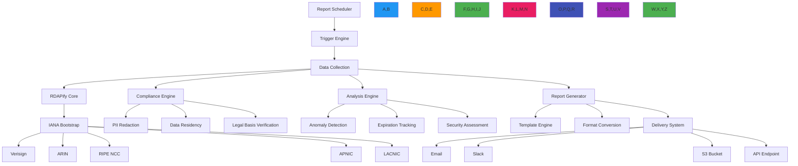

# وصفة التقارير المجدولة

> **يتطلب `@rdapify/pro`** — الميزات الموضحة في هذا الدليل مقدَّمة من الحزمة التجارية [`@rdapify/pro`](https://github.com/rdapify/RDAPify-Pro). ثبّتها جانباً مع `rdapify` لاستخدام هذه الوظائف.

**الغرض**: دليل شامل لتطبيق أنظمة إعداد تقارير مجدولة آلية ومراعية للامتثال مع RDAPify لمراقبة محفظة النطاقات وتنبيهات الأمان والامتثال التنظيمي
**ذات صلة**: [محفظة النطاقات](domain-portfolio.md) | [خدمة المراقبة](monitoring-service.md) | [بوابة API](api-gateway.md) | [تجميع البيانات](data-aggregation.md)
**وقت القراءة**: 7 دقائق

## نظرة عامة على معمارية التقارير المجدولة

يوفر نظام إعداد التقارير المجدولة في RDAPify إطاراً موحداً لاستخبارات النطاقات الآلية مع أمان على مستوى المؤسسات والامتثال والتميز التشغيلي:



### المبادئ الأساسية لإعداد التقارير
- **الامتثال بشكل افتراضي**: توليد تقارير متوافقة مع GDPR/CCPA مع اختزال تلقائي للبيانات الشخصية
- **الجدولة المدفوعة بالعمل**: جدولة مرنة تستند إلى الأهمية التجارية ومتطلبات الامتثال
- **التسليم متعدد القنوات**: دعم البريد الإلكتروني وSlack وS3 وواجهات برمجة التطبيقات وأنظمة الإخطار للمؤسسات
- **الاستخبارات السياقية**: تتضمن التقارير سياقاً تجارياً لا مجرد بيانات تسجيل خام
- **جاهزية للتدقيق**: مسارات تدقيق كاملة لجميع أنشطة توليد وتسليم التقارير
- **تحسين الموارد**: معالجة دفعية ذكية وتخزين مؤقت لتقليل تأثير السجل والتكاليف

## أنماط التطبيق

### 1. النواة الأساسية لمجدول التقارير
```typescript
// src/reports/scheduler.ts
import { CronJob } from 'cron';
import { ReportConfig, ReportTemplate, DeliveryChannel } from '../types';
import { ComplianceEngine } from '../security/compliance';
import { DataAggregator } from '../aggregation/aggregator';

export class ReportScheduler {
  private jobs = new Map<string, CronJob>();
  private reportConfigs = new Map<string, ReportConfig>();
  private complianceEngine: ComplianceEngine;
  private dataAggregator: DataAggregator;

  constructor(options: {
    complianceEngine?: ComplianceEngine;
    dataAggregator?: DataAggregator;
    storage?: ReportStorage;
  } = {}) {
    this.complianceEngine = options.complianceEngine || new ComplianceEngine();
    this.dataAggregator = options.dataAggregator || new DataAggregator();
    this.storage = options.storage || new ReportStorage();
  }

  async registerReport(config: ReportConfig): Promise<string> {
    // Validate report configuration
    this.validateReportConfig(config);

    // Generate unique report ID
    const reportId = `report_${Date.now()}_${Math.random().toString(36).slice(2, 10)}`;

    // Store configuration
    await this.storage.storeReportConfig(reportId, config);
    this.reportConfigs.set(reportId, config);

    // Create and start scheduler
    await this.createSchedule(reportId, config);

    return reportId;
  }

  private async createSchedule(reportId: string, config: ReportConfig): Promise<void> {
    // Parse schedule expression
    const cronExpression = this.parseSchedule(config.schedule);

    // Create scheduled job
    const job = new CronJob(cronExpression, async () => {
      try {
        await this.executeReport(reportId, config);
      } catch (error) {
        console.error(`Report execution failed for ${reportId}:`, error.message);
        await this.handleError(reportId, config, error);
      }
    }, null, true, 'UTC');

    this.jobs.set(reportId, job);
  }

  private async executeReport(reportId: string, config: ReportConfig): Promise<void> {
    const startTime = Date.now();
    const executionId = `exec_${Date.now()}_${Math.random().toString(36).slice(2, 8)}`;

    try {
      // Load data with compliance context
      const data = await this.loadData(config, executionId);

      // Generate report content
      const reportContent = await this.generateReportContent(data, config, executionId);

      // Apply compliance transformations
      const compliantContent = await this.complianceEngine.applyComplianceTransformations(
        reportContent,
        config.complianceContext
      );

      // Deliver report
      const deliveryResults = await this.deliverReport(compliantContent, config, executionId);

      // Record execution
      await this.recordExecution(reportId, executionId, {
        startTime,
        endTime: Date.now(),
        status: 'success',
        itemCount: data.items.length,
        deliveryResults
      });
    } catch (error) {
      // Record failed execution
      await this.recordExecution(reportId, executionId, {
        startTime,
        endTime: Date.now(),
        status: 'failed',
        error: error.message
      });

      throw error;
    }
  }

  private parseSchedule(schedule: string): string {
    // Support multiple schedule formats
    if (schedule.startsWith('cron:')) {
      return schedule.replace('cron:', '');
    }

    // Common schedule aliases
    const aliases: Record<string, string> = {
      'daily': '0 8 * * *', // 8 AM UTC daily
      'weekly': '0 8 * * 1', // 8 AM UTC Monday
      'monthly': '0 8 1 * *', // 8 AM UTC 1st of month
      'quarterly': '0 8 1 1,4,7,10 *', // Quarterly
      'yearly': '0 8 1 1 *' // Yearly
    };

    return aliases[schedule.toLowerCase()] || schedule;
  }

  private validateReportConfig(config: ReportConfig): void {
    if (!config.name) throw new Error('Report name is required');
    if (!config.schedule) throw new Error('Schedule is required');
    if (config.deliveryChannels.length === 0) throw new Error('At least one delivery channel is required');

    // Validate compliance context
    if (config.complianceContext.jurisdiction === 'EU' && !config.complianceContext.legalBasis) {
      throw new Error('Legal basis is required for EU jurisdiction (GDPR Article 6)');
    }

    // Validate security settings
    if (config.includeRaw && !config.complianceContext.legalBasis?.includes('consent')) {
      throw new Error('Raw data inclusion requires explicit consent under GDPR Article 6');
    }
  }

  async shutdown(): Promise<void> {
    // Stop all scheduled jobs
    for (const [reportId, job] of this.jobs) {
      job.stop();
    }
    this.jobs.clear();
  }
}
```

### 2. توليد التقارير المراعية للامتثال
```typescript
// src/reports/compliance-reports.ts
export class ComplianceReportGenerator {
  private dpoContact: string;
  private retentionPolicies = new Map<string, RetentionPolicy>();

  constructor(options: {
    dpoContact: string;
    retentionPolicies?: Record<string, RetentionPolicy>;
  } = { dpoContact: 'dpo@company.com' }) {
    this.dpoContact = options.dpoContact || 'dpo@company.com';
    this.loadRetentionPolicies(options.retentionPolicies || {});
  }

  private loadRetentionPolicies(policies: Record<string, RetentionPolicy>) {
    // Default retention policies
    this.retentionPolicies.set('GDPR_EU', {
      maxRetentionDays: 30,
      deletionMethod: 'secure-erase',
      auditRequired: true
    });

    this.retentionPolicies.set('CCPA_US_CA', {
      maxRetentionDays: 90,
      deletionMethod: 'anonymize',
      auditRequired: true
    });

    this.retentionPolicies.set('PDPL_SA', {
      maxRetentionDays: 180,
      deletionMethod: 'secure-erase',
      auditRequired: true
    });

    // Apply custom policies
    Object.entries(policies).forEach(([key, policy]) => {
      this.retentionPolicies.set(key, policy);
    });
  }

  async generateGDPRComplianceReport(domains: string[], context: ComplianceContext): Promise<ComplianceReport> {
    // Get retention policy for jurisdiction
    const retentionPolicy = this.retentionPolicies.get(`GDPR_${context.jurisdiction}`) ||
                           this.retentionPolicies.get('GDPR_EU');

    if (!retentionPolicy) {
      throw new Error(`No retention policy found for GDPR jurisdiction: ${context.jurisdiction}`);
    }

    // Collect domain data with GDPR-specific context
    const data = await this.collectDomainData(domains, {
      ...context,
      privacy: true,
      legalBasis: context.legalBasis || 'legitimate-interest',
      maxRetentionDays: retentionPolicy.maxRetentionDays
    });

    // Apply GDPR-specific transformations
    const gdprData = this.applyGDPRTransformations(data, context);

    // Generate compliance metadata
    const metadata = this.generateGDPRMetadata(gdprData, context, retentionPolicy);

    return {
      type: 'gdpr_compliance',
      timestamp: new Date().toISOString(),
      data: gdprData,
      metadata,
      complianceStatus: this.calculateComplianceStatus(gdprData, metadata)
    };
  }

  private generateGDPRMetadata(data: GDPRData, context: ComplianceContext, policy: RetentionPolicy): GDPRMetadata {
    return {
      // GDPR Article 6 - Lawful basis
      lawfulBasis: context.legalBasis || 'legitimate-interest',
      // GDPR Article 32 - Security measures
      securityMeasures: [
        'encryption',
        'access_controls',
        'audit_logging',
        'pseudonymization'
      ],
      // GDPR Article 5(1)(e) - Storage limitation
      retentionPeriod: `${policy.maxRetentionDays} days`,
      retentionPolicy: policy.deletionMethod,
      // GDPR Article 30(4) - DPO contact
      dpoContact: this.dpoContact
    };
  }
}
```

[← العودة إلى الوصفات](../README.md)
