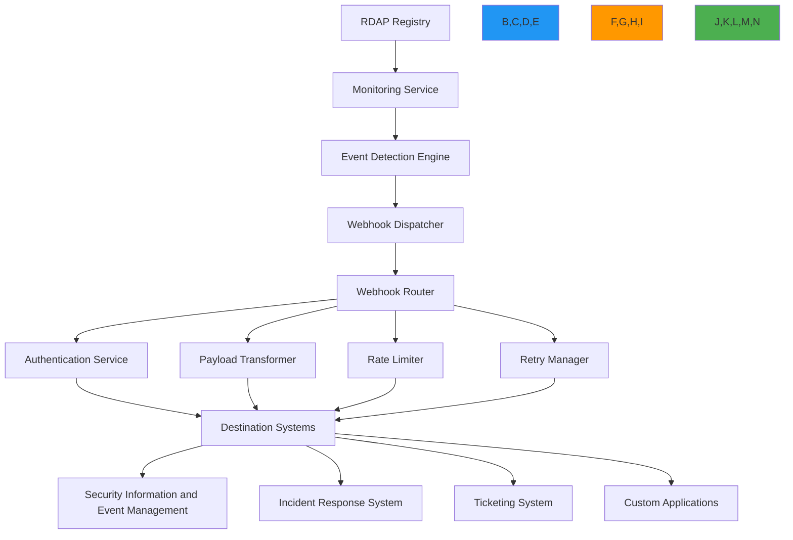

# وصفة تكامل Webhook

**الغرض**: دليل شامل لتطبيق تكاملات webhook آمنة وموثوقة ومتوافقة مع RDAPify لإشعارات بيانات التسجيل في الوقت الفعلي وسير العمل المدفوع بالأحداث
**ذات صلة**: [محفظة النطاقات](domain-portfolio.md) | [خدمة المراقبة](monitoring-service.md) | [التنبيهات الحرجة](critical-alerts.md) | [بوابة API](api-gateway.md)
**وقت القراءة**: 7 دقائق

## معمارية تكامل Webhook

يوفر RDAPify نظام تكامل webhook مرناً يتيح إشعارات الأحداث في الوقت الفعلي مع الحفاظ على حدود الأمان ومتطلبات الامتثال:



### المبادئ الأساسية لتكامل Webhook
- **معمارية مدفوعة بالأحداث**: إشعارات في الوقت الفعلي لتغييرات التسجيل والشذوذات
- **تصميم يضع الأمان أولاً**: المصادقة والتحقق من الحمولة والحماية من التهديدات لجميع الـ webhooks
- **الامتثال بشكل افتراضي**: معالجة بيانات متوافقة مع GDPR/CCPA مع سياسات قابلة للتهيئة
- **هندسة الموثوقية**: تسليم مضمون مع تراجع أسي وطوابير الرسائل الميتة
- **تكامل إمكانية المراقبة**: مقاييس شاملة وتسجيل وتتبع للرؤية التشغيلية
- **تجربة المطور**: إعداد بسيط مع خيارات تخصيص متقدمة

## أنماط التطبيق

### 1. إدارة وتهيئة Webhook
```typescript
// src/webhooks/webhook-manager.ts
import { WebhookConfig, WebhookEvent, WebhookDelivery } from '../types';
import { SignatureVerifier } from './signature-verifier';
import { PayloadTransformer } from './payload-transformer';
import { RateLimiter } from '../security/rate-limiter';
import { RetryManager } from './retry-manager';
import { ComplianceEngine } from '../security/compliance';

export class WebhookManager {
  private webhooks = new Map<string, WebhookConfig>();
  private signatureVerifier: SignatureVerifier;
  private payloadTransformer: PayloadTransformer;
  private rateLimiter: RateLimiter;
  private retryManager: RetryManager;

  constructor(options: {
    signatureVerifier?: SignatureVerifier;
    payloadTransformer?: PayloadTransformer;
    rateLimiter?: RateLimiter;
    retryManager?: RetryManager;
    complianceEngine?: ComplianceEngine;
  } = {}) {
    this.signatureVerifier = options.signatureVerifier || new SignatureVerifier();
    this.payloadTransformer = options.payloadTransformer || new PayloadTransformer();
    this.rateLimiter = options.rateLimiter || new RateLimiter({
      maxRequests: 100,
      windowSeconds: 60
    });
    this.retryManager = options.retryManager || new RetryManager({
      maxAttempts: 5,
      backoffStrategy: 'exponential'
    });
    this.complianceEngine = options.complianceEngine || new ComplianceEngine();
  }

  async registerWebhook(config: WebhookConfig): Promise<string> {
    // Validate webhook configuration
    this.validateWebhookConfig(config);

    // Generate unique webhook ID
    const webhookId = `wh_${Date.now()}_${Math.random().toString(36).slice(2, 10)}`;

    // Store webhook configuration
    const secureConfig = {
      ...config,
      secret: this.generateWebhookSecret(config),
      createdAt: new Date().toISOString(),
      lastModified: new Date().toISOString(),
      status: 'active'
    };

    this.webhooks.set(webhookId, secureConfig);
    await this.storage.storeWebhook(webhookId, secureConfig);

    return webhookId;
  }

  private validateWebhookConfig(config: WebhookConfig): void {
    // URL validation
    const url = new URL(config.url);
    if (url.protocol !== 'https:') {
      throw new Error('Webhook URL must use HTTPS protocol');
    }

    // IP address validation (prevent SSRF)
    if (this.isPrivateIP(url.hostname)) {
      throw new Error('Webhook URL cannot target private IP addresses');
    }

    // Domain validation
    if (!this.isValidDomain(url.hostname)) {
      throw new Error('Invalid domain in webhook URL');
    }

    // Event type validation
    const validEvents = [
      'domain_change', 'ip_change', 'asn_change',
      'expiration_warning', 'status_change',
      'security_alert', 'compliance_violation'
    ];

    if (!config.events.every(event => validEvents.includes(event))) {
      throw new Error(`Invalid event type in webhook configuration`);
    }
  }

  async dispatchEvent(event: WebhookEvent, context: EventContext): Promise<WebhookResult[]> {
    const results: WebhookResult[] = [];

    // Find matching webhooks for this event
    const matchingWebhooks = Array.from(this.webhooks.entries())
      .filter(([_, config]) =>
        config.events.includes(event.type) &&
        this.matchesFilters(event, config.filters)
      );

    // Dispatch to all matching webhooks
    for (const [webhookId, config] of matchingWebhooks) {
      try {
        // Apply compliance transformations
        const compliantEvent = await this.complianceEngine.applyComplianceTransformations(event, context);

        // Transform payload based on webhook configuration
        const payload = this.payloadTransformer.transform(compliantEvent, config.format);

        // Sign payload
        const signature = this.signatureVerifier.sign(payload, config.secret);

        // Prepare headers
        const headers = {
          'Content-Type': this.getContentType(config.format),
          'User-Agent': 'RDAPify-Webhook/1.0',
          'X-RDAPify-Event': event.type,
          'X-RDAPify-Signature': signature,
          'X-RDAPify-Timestamp': new Date().toISOString(),
          'X-RDAPify-Webhook-ID': webhookId
        };

        // Apply rate limiting
        if (!this.rateLimiter.allowRequest(config.id)) {
          results.push({
            webhookId,
            status: 'rate_limited',
            timestamp: new Date().toISOString(),
            error: 'Rate limit exceeded'
          });
          continue;
        }

        // Dispatch webhook
        const delivery = await this.dispatchWebhook(config, payload, headers);
        results.push(delivery);

        // Record successful delivery
        await this.recordDelivery(webhookId, delivery);

      } catch (error) {
        // Handle delivery failure
        const delivery: WebhookDelivery = {
          webhookId,
          status: 'failed',
          timestamp: new Date().toISOString(),
          error: error.message,
          attempts: 1
        };

        results.push(delivery);

        // Schedule retry
        await this.retryManager.scheduleRetry(webhookId, event, delivery);

        // Record failed delivery
        await this.recordDelivery(webhookId, delivery);
      }
    }

    return results;
  }

  private generateWebhookSecret(config: WebhookConfig): string {
    // Generate cryptographically secure secret
    return require('crypto').randomBytes(32).toString('hex');
  }
}
```

### 2. مدير إعادة المحاولة مع التراجع الأسي
```typescript
// src/webhooks/retry-manager.ts
export class RetryManager {
  private retryQueue = new Map<string, RetryItem>();
  private maxAttempts: number;
  private backoffStrategy: 'linear' | 'exponential';

  constructor(options: {
    maxAttempts?: number;
    backoffStrategy?: 'linear' | 'exponential';
  } = {}) {
    this.maxAttempts = options.maxAttempts || 5;
    this.backoffStrategy = options.backoffStrategy || 'exponential';
  }

  async scheduleRetry(webhookId: string, event: WebhookEvent, delivery: WebhookDelivery): Promise<void> {
    const attempts = delivery.attempts || 1;

    if (attempts >= this.maxAttempts) {
      // Move to dead letter queue
      await this.moveToDeadLetterQueue(webhookId, event, delivery);
      return;
    }

    const delay = this.calculateDelay(attempts);

    const retryItem: RetryItem = {
      webhookId,
      event,
      delivery,
      attempts,
      nextRetryAt: new Date(Date.now() + delay),
      createdAt: new Date().toISOString()
    };

    this.retryQueue.set(`${webhookId}:${event.id}`, retryItem);

    // Schedule retry after delay
    setTimeout(async () => {
      await this.executeRetry(retryItem);
    }, delay);
  }

  private calculateDelay(attempt: number): number {
    if (this.backoffStrategy === 'exponential') {
      // Exponential backoff: 1s, 2s, 4s, 8s, 16s
      return Math.min(1000 * Math.pow(2, attempt - 1), 60000); // Max 60 seconds
    } else {
      // Linear backoff: 5s, 10s, 15s, 20s, 25s
      return attempt * 5000;
    }
  }

  private async moveToDeadLetterQueue(webhookId: string, event: WebhookEvent, delivery: WebhookDelivery): Promise<void> {
    // Implementation would store failed deliveries for manual review
    console.error(`Webhook ${webhookId} delivery failed after ${this.maxAttempts} attempts for event ${event.id}`);
  }
}
```

### 3. التحقق من توقيع Webhook
```typescript
// src/webhooks/signature-verifier.ts
import { createHmac, timingSafeEqual } from 'crypto';

export class SignatureVerifier {
  sign(payload: string, secret: string): string {
    const hmac = createHmac('sha256', secret);
    hmac.update(payload);
    return `sha256=${hmac.digest('hex')}`;
  }

  verify(payload: string, signature: string, secret: string): boolean {
    const expectedSignature = this.sign(payload, secret);
    const expectedBuffer = Buffer.from(expectedSignature);
    const receivedBuffer = Buffer.from(signature);

    // Use timing-safe comparison to prevent timing attacks
    if (expectedBuffer.length !== receivedBuffer.length) {
      return false;
    }

    return timingSafeEqual(expectedBuffer, receivedBuffer);
  }

  verifyRequest(req: any, secret: string): boolean {
    const signature = req.headers['x-rdapify-signature'];
    if (!signature) return false;

    const payload = JSON.stringify(req.body);
    return this.verify(payload, signature, secret);
  }
}
```

[← العودة إلى الوصفات](../README.md)
