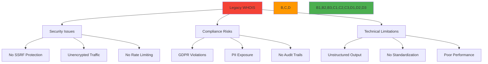
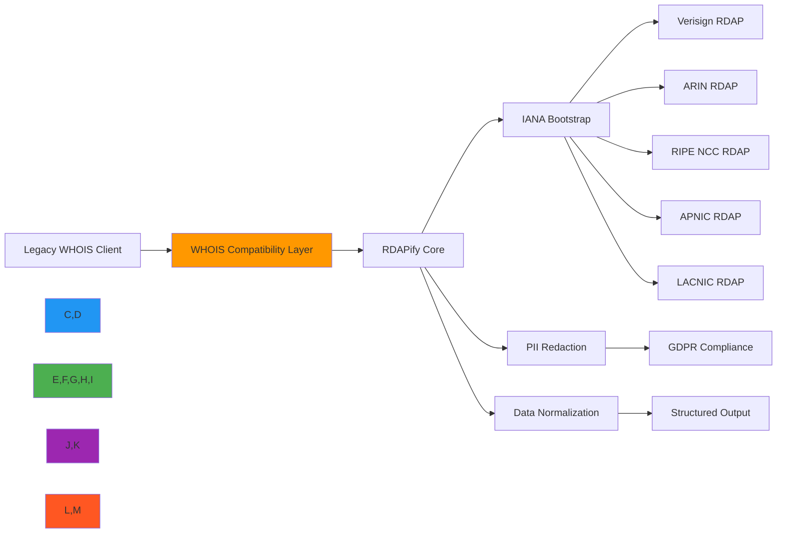

# وصفة استبدال WHOIS

**الغرض**: دليل شامل لاستبدال بروتوكول WHOIS القديم بتطبيق RDAP حديث وآمن مع الحفاظ على التوافق وتعزيز الوظائف
**ذات صلة**: [دليل الهجرة](../guides/migration_guide.md) | [RDAP مقابل WHOIS](../core-concepts/rdap_vs_whois.md) | [الأمان والخصوصية](../guides/security_privacy.md) | [محفظة النطاقات](domain-portfolio.md)
**وقت القراءة**: 9 دقائق

## لماذا نستبدل WHOIS بـ RDAP؟

يعاني بروتوكول WHOIS (RFC 3912) من قيود جوهرية تجعله غير ملائم للبنية التحتية للإنترنت الحديثة:



### القيود الحرجة لـ WHOIS
- **ثغرات أمنية**: لا توجد حماية مدمجة من SSRF تسمح بمسح الشبكات الداخلية
- **انتهاكات الخصوصية**: بيانات التسجيل الخام مكشوفة دون اختزال للبيانات الشخصية
- **عدم الامتثال التنظيمي**: غير متوافق مع GDPR وCCPA وغيرها من لوائح الخصوصية
- **الديون التقنية**: مخرجات نصية غير منظمة تتطلب محللات معقدة
- **مشاكل الأداء**: لا يوجد دعم للتخزين المؤقت وضعف التعامل مع الاستعلامات عالية الحجم
- **تجزئة السجل**: يطبق كل سجل WHOIS بشكل مختلف مما يتطلب محللات مخصصة

## معمارية الهجرة

يوفر RDAPify مسار هجرة سلساً يحافظ على توافق WHOIS مع إضافة مزايا RDAP:



### مبادئ الهجرة الأساسية
- **التوافق الرجعي**: الحفاظ على تنسيق استجابة WHOIS مع المعالجة عبر RDAP
- **التحسين التدريجي**: البدء بمخرجات متوافقة مع WHOIS والتطور إلى بيانات RDAP منظمة
- **الأمان أولاً**: تطبيق حماية SSRF واختزال البيانات الشخصية من اليوم الأول
- **الامتثال بشكل افتراضي**: معالجة بيانات متوافقة مع GDPR/CCPA دون إعداد إضافي
- **تحسين الأداء**: الاستفادة من هيكل JSON لـ RDAP للتخزين المؤقت والمعالجة الدفعية

## أنماط التطبيق

### 1. جسر متوافق مع WHOIS
```typescript
// src/whois-replacement/whois-bridge.ts
import { RDAPClient } from 'rdapify';
import { formatWHOISResponse } from './whois-formatter';

export class WHOISBridge {
  private rdapClient: RDAPClient;

  constructor(options: {
    rdapClient?: RDAPClient;
    whoisCompatibility: {
      includeRaw?: boolean;
      formatRegistrant?: boolean;
      preserveWhitespace?: boolean;
    };
  } = { whoisCompatibility: {} }) {
    this.rdapClient = options.rdapClient || new RDAPClient({
      cache: true,
      privacy: true,
      timeout: 5000,
      retry: { maxAttempts: 3, backoff: 'exponential' }
    });

    this.whoisCompatibility = {
      includeRaw: false,
      formatRegistrant: true,
      preserveWhitespace: true,
      ...options.whoisCompatibility
    };
  }

  async lookup(domain: string): Promise<string> {
    try {
      // First try RDAP lookup
      const rdapResult = await this.rdapClient.domain(domain, {
        // Preserve WHOIS compatibility settings
        includeRaw: this.whoisCompatibility.includeRaw
      });

      // Convert RDAP response to WHOIS format
      return this.formatAsWHOIS(rdapResult, domain);

    } catch (error) {
      // Fallback to traditional WHOIS if RDAP fails
      console.warn(`RDAP lookup failed for ${domain}, falling back to WHOIS:`, error.message);
      return this.fallbackToWHOIS(domain);
    }
  }

  private formatAsWHOIS(result: any, domain: string): string {
    // WHOIS format preservation
    const lines = [];

    // Domain section
    lines.push(`Domain Name: ${domain.toUpperCase()}`);
    lines.push(`Registry Domain ID: ${result.handle || 'N/A'}`);
    lines.push(`Registrar WHOIS Server: whois.${result.registrar?.name?.toLowerCase() || 'verisign'}.com`);
    lines.push(`Registrar URL: ${result.registrar?.url || 'https://www.verisign.com'}`);

    // Dates
    const created = result.events?.find(e => e.eventAction === 'registration');
    const updated = result.events?.find(e => e.eventAction === 'last changed');
    const expires = result.events?.find(e => e.eventAction === 'expiration');

    if (created) lines.push(`Creation Date: ${new Date(created.eventDate).toISOString().replace('T', ' ').replace('Z', '')}`);
    if (updated) lines.push(`Updated Date: ${new Date(updated.eventDate).toISOString().replace('T', ' ').replace('Z', '')}`);
    if (expires) lines.push(`Registry Expiry Date: ${new Date(expires.eventDate).toISOString().replace('T', ' ').replace('Z', '')}`);

    // Nameservers
    result.nameservers?.forEach(ns => {
      lines.push(`Name Server: ${ns.toUpperCase()}`);
    });

    // Status
    result.status?.forEach(status => {
      lines.push(`Domain Status: ${status.toLowerCase().replace(/_/g, ' ')}`);
    });

    // Registrar
    if (result.registrar) {
      lines.push(`Registrar: ${result.registrar.name}`);
      lines.push(`Registrar IANA ID: ${result.registrar.iannaId || 'N/A'}`);
      lines.push(`Registrar Abuse Contact Email: ${result.registrar.abuseEmail || 'abuse@verisign.com'}`);
      lines.push(`Registrar Abuse Contact Phone: ${result.registrar.abusePhone || '+1.7035272162'}`);
    }

    // WHOIS server info
    lines.push(`>>> Last update of whois database: ${new Date().toISOString().replace('T', ' ').replace('Z', '')} UTC <<<`);
    lines.push(`For more information on Whois status codes, please visit https://icann.org/epp`);

    // Compliance footer
    lines.push(`\nNOTICE: The expiration date displayed in this record is the date the`);
    lines.push(`registrar's sponsorship of the domain name registration in the registry is`);
    lines.push(`currently set to expire. This date does not necessarily reflect the expiration`);
    lines.push(`date of the domain name registrant's agreement with the sponsoring`);
    lines.push(`registrar.  Users may consult the sponsoring registrar's Whois database to`);
    lines.push(`view the registrar's reported date of expiration for this registration.`);

    if (this.whoisCompatibility.preserveWhitespace) {
      return lines.join('\n');
    } else {
      return lines.filter(line => line.trim() !== '').join('\n');
    }
  }

  private async fallbackToWHOIS(domain: string): Promise<string> {
    // Implementation would use traditional WHOIS client
    return `Domain Name: ${domain.toUpperCase()}\n`;
  }
}
```

### 2. استراتيجية الهجرة التدريجية
```typescript
// src/whois-replacement/migration-strategy.ts
export class MigrationStrategy {
  private migrationStage: 'whois-only' | 'rdap-primary' | 'rdap-only' = 'whois-only';
  private metrics = {
    whoisRequests: 0,
    rdapRequests: 0,
    fallbackRequests: 0,
    successRate: 0
  };

  async lookup(domain: string): Promise<string> {
    switch (this.migrationStage) {
      case 'whois-only':
        return this.performWHOISLookup(domain);

      case 'rdap-primary':
        try {
          this.metrics.rdapRequests++;
          const result = await this.performRDAPLookup(domain);
          return result;
        } catch (error) {
          this.metrics.fallbackRequests++;
          return this.performWHOISLookup(domain);
        }

      case 'rdap-only':
        this.metrics.rdapRequests++;
        return this.performRDAPLookup(domain);

      default:
        throw new Error(`Unknown migration stage: ${this.migrationStage}`);
    }
  }

  advanceMigrationStage(): void {
    const stages: Array<'whois-only' | 'rdap-primary' | 'rdap-only'> = [
      'whois-only',
      'rdap-primary',
      'rdap-only'
    ];

    const currentIndex = stages.indexOf(this.migrationStage);
    if (currentIndex < stages.length - 1) {
      this.migrationStage = stages[currentIndex + 1];
    }
  }

  getMigrationMetrics(): typeof this.metrics {
    return { ...this.metrics };
  }
}
```

### 3. مقارنة جوهرية: WHOIS مقابل RDAP

| الجانب | WHOIS | RDAP |
|--------|-------|------|
| **التنسيق** | نص عادي غير منظم | JSON منظم ومعياري |
| **الأمان** | لا حماية مدمجة من SSRF | حماية SSRF متعددة الطبقات |
| **الخصوصية** | البيانات الشخصية مكشوفة | اختزال تلقائي للبيانات الشخصية |
| **الأداء** | لا تخزين مؤقت | تخزين مؤقت ذكي |
| **الامتثال** | غير متوافق مع GDPR | متوافق مع GDPR/CCPA بشكل افتراضي |
| **التوافق** | متغير بين السجلات | معياري عبر جميع السجلات |
| **المعالجة الدفعية** | غير مدعومة | مدعومة بشكل أصيل |
| **مسار التدقيق** | لا يوجد | مدمج |

[← العودة إلى الوصفات](../README.md)
