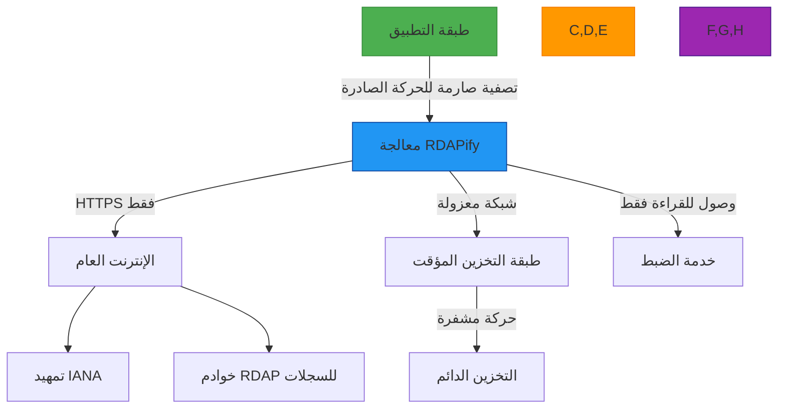

# أفضل ممارسات الأمان لـ RDAPify

**الهدف**: دليل شامل لتطبيق أفضل ممارسات الأمان عند استخدام RDAPify لمعالجة بيانات التسجيل، مع أمثلة تنفيذ عملية وإرشادات الامتثال
**ذات صلة**: [منع SSRF](ssrf-prevention.md) | [اكتشاف PII](pii-detection.md) | [امتثال GDPR](compliance.md) | [نموذج التهديدات](threat-model.md)
**وقت القراءة**: 8 دقائق

## الملخص التنفيذي

يعالج RDAPify بيانات تسجيل حساسة عبر البنية التحتية للإنترنت العالمية، مما يتطلب ضوابط أمنية متخصصة لمنع الكشف عن البيانات وهجمات SSRF وانتهاكات الامتثال. يقدم هذا الدليل ممارسات أمنية قابلة للتنفيذ مُتحقق منها من خلال اختبارات الاختراق من طرف ثالث وعمليات النشر الفعلية.

**مبادئ الأمان الحيوية**:
- **بنية Zero Trust**: لا تثق أبداً في حدود الشبكة أو بيانات المدخلات
- **الخصوصية بشكل افتراضي**: إخفاء PII مُمكّن دون ضبط صريح
- **الدفاع المتعمق**: ضوابط أمنية مستقلة متعددة للمتجهات الحرجة
- **أقل الصلاحيات**: أدنى الأذونات المطلوبة لعمليات معالجة RDAP
- **تدقيق كل شيء**: تسجيل شامل لجميع عمليات الوصول إلى البيانات وتعديلها

## إرشادات الضبط الآمن

### 1. قالب الضبط للإنتاج
```typescript
// config/security-config.ts
import { RDAPClient } from 'rdapify';

export const getProductionConfig = (environment: string) => ({
  // أمان الشبكة
  timeout: 5000,                  // أقصى مهلة 5 ثوانٍ
  httpsOnly: true,                // رفض اتصالات HTTP
  validateCertificates: true,    // تطبيق التحقق من الشهادة
  certificatePins: {              // تثبيت الشهادات للسجلات الحيوية
    'verisign': ['sha256/AAAAAAAAAAAAAAAAAAAAAAAAAAAAAAAAAAAAAAAAAAA='],
    'arin': ['sha256/BBBBBBBBBBBBBBBBBBBBBBBBBBBBBBBBBBBBBBBBBBB=']
  },

  // حماية SSRF
  allowPrivateIPs: false,         // حظر نطاقات IP الخاصة RFC 1918
  whitelistRDAPServers: true,     // استخدام خوادم تمهيد IANA فقط
  protocolRestrictions: ['https'], // السماح ببروتوكول HTTPS فقط

  // الخصوصية والامتثال
  privacy: true,                // إخفاء PII متوافق مع GDPR/CCPA
  includeRaw: false,              // عدم تخزين استجابات السجل الخام
  dataRetentionDays: environment === 'production' ? 30 : 7, // 30 يوماً للإنتاج
  legalBasis: 'legitimate-interest', // الأساس القانوني لـ GDPR المادة 6

  // حماية الموارد
  rateLimit: {
    max: environment === 'production' ? 100 : 50, // 100 طلب/دقيقة
    window: 60000,
    burst: 10
  },
  maxConcurrent: 10,              // أقصى طلبات متوازية
  cacheTTL: 3600,                 // أقصى وقت تخزين مؤقت ساعة واحدة

  // قابلية الرصد
  auditLogging: true,             // تفعيل تسجيل التدقيق الشامل
  metricsCollection: 'minimal',   // مقاييس دنيا للرؤية التشغيلية
  sensitiveDataLogging: false     // عدم تسجيل الحقول الحساسة أبداً
});

// إنشاء نسخة عميل آمنة
export const createSecureClient = (environment: string = 'production') => {
  return new RDAPClient(getProductionConfig(environment));
};
```

### 2. إعدادات الأمان الخاصة بالبيئة
| الإعداد | التطوير | الاختبار | الإنتاج |
|---------|---------|---------|---------|
| `redactPII` | false (مع إخفاء الهوية) | true | true |
| `dataRetentionDays` | 1 | 7 | 30 |
| `maxConcurrent` | 25 | 15 | 10 |
| `cacheTTL` | 60 | 300 | 3600 |
| `auditLogging` | مُصفّى | شامل | شامل + غير قابل للتغيير |
| `certificatePins` | معطّل | مُفعّل | مُفعّل + مُراقَب |
| `rateLimit.max` | 200 | 100 | 100 |

## ضوابط أمان الشبكة

### 1. تنفيذ حماية SSRF
```typescript
// src/security/ssrf-protection.ts
import { SSRFProtector } from 'rdapify';

export class EnhancedSSRFProtection extends SSRFProtector {
  constructor() {
    super({
      // حظر جميع نطاقات IP الخاصة (RFC 1918)
      blockPrivateIPs: true,

      // السماح بخوادم السجل المعتمدة من IANA فقط
      allowlistRegistries: true,

      // قائمة بيضاء للبروتوكول
      allowedProtocols: ['https'],

      // أمان حل DNS
      dnsSecurity: {
        validateDNSSEC: true,
        cacheTTL: 60, // دقيقة واحدة لذاكرة التخزين المؤقت لـ DNS
        blockReservedDomains: true
      },

      // أمان الاتصال
      connectionSecurity: {
        validateCertificates: true,
        enforceTLS13: true,
        timeout: 5000
      },

      // التحقق من صحة الطلب
      requestValidation: {
        maxLength: 255, // أقصى طول لاسم النطاق
        allowedCharacters: /^[a-z0-9\.\-]+$/,
        blockInternationalized: false, // السماح بـ IDN مع التحقق الصحيح
        blockKnownMaliciousPatterns: true
      }
    });
  }

  // تحقق إضافي خاص بالتطبيق
  validateDomain(domain: string, context: SecurityContext): ValidationResult {
    const baseResult = super.validateDomain(domain, context);

    if (!baseResult.valid) {
      return baseResult;
    }

    // تحقق إضافي لبيئات الأمان العالي
    if (context.securityLevel === 'high') {
      // التحقق من سمعة النطاق
      const reputationScore = this.getDomainReputation(domain);
      if (reputationScore < -5) {
        return {
          valid: false,
          reason: `Domain reputation score too low: ${reputationScore}`,
          code: 'DOMAIN_REPUTATION_VIOLATION'
        };
      }

      // حظر النطاقات المسجلة حديثاً للسياقات عالية الأمان
      const registrationAge = this.getDomainAge(domain);
      if (registrationAge < 30) { // أقل من 30 يوماً
        return {
          valid: false,
          reason: `Domain too newly registered: ${registrationAge} days`,
          code: 'NEW_DOMAIN_BLOCKED'
        };
      }
    }

    return { valid: true };
  }
}
```

### 2. استراتيجية تقسيم الشبكة


**متطلبات أمان الشبكة**:
- **تصفية الحركة الصادرة**: السماح بالاتصالات الخارجية فقط لتمهيد IANA ونقاط نهاية RDAP للسجلات
- **قيود الحركة الواردة**: يجب ألا تقبل حاويات RDAPify اتصالات واردة من الإنترنت العام
- **عزل VPC**: النشر في VPC مخصص مع مجموعات أمان تحدّ من التواصل بين الخدمات
- **تطبيق TLS**: يجب أن تستخدم جميع الاتصالات الداخلية TLS 1.3 مع التحقق من الشهادة
- **أمان DNS**: استخدام محللات DNSSEC مع DNS-over-HTTPS/TLS

## معالجة البيانات وحماية الخصوصية

### 1. استراتيجية إخفاء PII
```typescript
// src/security/pii-redaction.ts
export class PrivacyPreservingRedaction {
  private static readonly GDPR_FIELDS = [
    'fn', 'n', 'email', 'tel', 'adr', 'org',
    'registrant', 'administrative', 'technical', 'billing'
  ];

  private static readonly CCPA_FIELDS = [
    'email', 'tel', 'adr', 'fn'
  ];

  redactResponse(response: any, context: PrivacyContext): any {
    if (!context.redactPII) return response;

    // نسخ عميق لتجنب تعديل الأصل
    const redacted = JSON.parse(JSON.stringify(response));

    // تطبيق الإخفاء الخاص بالولاية القضائية
    switch (context.jurisdiction) {
      case 'EU':
        this.applyGDPRRedaction(redacted, context);
        break;
      case 'US-CA':
        this.applyCCPARedaction(redacted, context);
        break;
      default:
        this.applyStandardRedaction(redacted, context);
    }

    // إضافة بيانات وصفية للإخفاء
    this.addRedactionMetadata(redacted, context);

    return redacted;
  }

  private applyGDPRRedaction(obj: any, context: PrivacyContext): void {
    this.applyFieldRedaction(obj, PrivacyPreservingRedaction.GDPR_FIELDS, {
      'fn': '[REDACTED FOR PRIVACY]',
      'email': 'Please query the RDDS service of the Registrar of Record',
      'tel': '+1.555.REDACTED',
      'adr': ['REDACTED FOR PRIVACY', 'REDACTED FOR PRIVACY', 'REDACTED FOR PRIVACY', 'REDACTED FOR PRIVACY', 'REDACTED FOR PRIVACY', 'REDACTED FOR PRIVACY', 'REDACTED FOR PRIVACY'],
      'default': '[REDACTED FOR PRIVACY]'
    });

    // إضافة إشعارات امتثال GDPR
    this.addGDPRNotices(obj, context);
  }

  private applyFieldRedaction(obj: any, fields: string[], replacements: Record<string, any>): void {
    if (Array.isArray(obj)) {
      obj.forEach(item => this.applyFieldRedaction(item, fields, replacements));
      return;
    }

    if (typeof obj === 'object' && obj !== null) {
      Object.entries(obj).forEach(([key, value]) => {
        if (fields.includes(key)) {
          obj[key] = replacements[key] || replacements['default'] || '[REDACTED]';
        } else {
          this.applyFieldRedaction(value, fields, replacements);
        }
      });
    }
  }

  private addGDPRNotices(response: any, context: PrivacyContext): void {
    if (!response.notices) {
      response.notices = [];
    }

    response.notices.push({
      title: 'GDPR COMPLIANCE',
      description: [
        'Data redacted per GDPR Article 5(1)(c) - Data minimization principle',
        'Processing legal basis: legitimate-interest (Article 6(1)(f))',
        'For data subject access requests, contact your organization\'s DPO',
        `Data retention period: ${context.dataRetentionDays || 30} days`
      ],
      links: [
        {
          href: `https://${context.domain}/dpa`,
          rel: 'data-processing-agreement',
          type: 'text/html',
          value: `https://${context.domain}/dpa`
        }
      ]
    });
  }
}
```

### 2. مبادئ الحد الأدنى من البيانات
```typescript
// src/security/data-minimization.ts
export class DataMinimizer {
  private static readonly MINIMAL_FIELDS = {
    domain: ['ldhName', 'status', 'events'],
    ip: ['startAddress', 'endAddress', 'status'],
    autnum: ['startAutnum', 'endAutnum', 'status']
  };

  minimizeData(data: any, context: MinimizationContext): any {
    if (!context.minimizeData) return data;

    // إنشاء هيكل استجابة دنيا
    const minimized: any = {
      queryType: data.queryType,
      timestamp: new Date().toISOString(),
      minimizationApplied: true
    };

    // تطبيق اختيار الحقل الأدنى بناءً على نوع الاستعلام
    switch (data.queryType) {
      case 'domain':
        minimized.domain = this.minimizeObject(data.domain, DataMinimizer.MINIMAL_FIELDS.domain);
        break;
      case 'ip':
        minimized.ip = this.minimizeObject(data.ip, DataMinimizer.MINIMAL_FIELDS.ip);
        break;
      case 'autnum':
        minimized.autnum = this.minimizeObject(data.autnum, DataMinimizer.MINIMAL_FIELDS.autnum);
        break;
    }

    // إضافة بيانات وصفية للامتثال
    minimized.compliance = {
      minimizationBasis: context.minimizationBasis || 'gdpr_article_5_1_c',
      retentionPeriod: `${context.retentionDays || 30} days`,
      legalBasis: context.legalBasis || 'legitimate-interest'
    };

    return minimized;
  }
}
```

## قائمة التحقق الأمنية للإنتاج

### قبل النشر
- [ ] التحقق من تفعيل حماية SSRF وضبطها
- [ ] تأكيد تفعيل إخفاء PII لبيئتك القانونية
- [ ] تفعيل تسجيل التدقيق وإعداد التنبيهات
- [ ] ضبط حدود معدل الطلبات المناسبة
- [ ] تمكين تثبيت الشهادات للسجلات الحيوية
- [ ] مراجعة سياسات الاحتفاظ بالبيانات

### دوري
- [ ] مراجعة سجلات التدقيق بحثاً عن الأنماط غير المعتادة
- [ ] تحديث التبعيات (`npm audit`)
- [ ] مراجعة وتحديث قوائم السماح/الحظر
- [ ] اختبار إجراءات الاستجابة للحوادث
- [ ] التحقق من امتثال الضبط لأفضل الممارسات الحالية

## الموارد ذات الصلة

- [نموذج الأمان](security-model.md) - الهندسة الأمنية الشاملة
- [منع SSRF](ssrf-prevention.md) - دليل الحماية التفصيلي
- [اكتشاف PII](pii-detection.md) - الكشف والإخفاء
- [الامتثال](compliance.md) - إطار الامتثال التنظيمي
