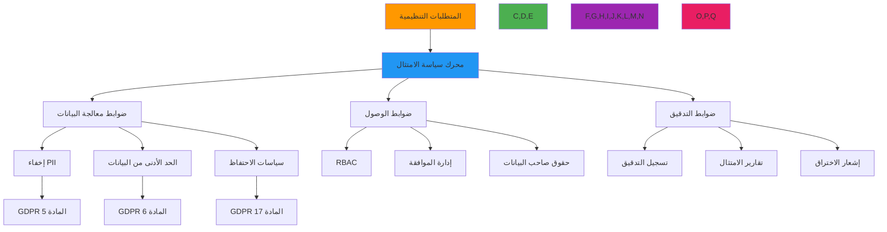

# إطار الامتثال لـ RDAPify

**الهدف**: دليل شامل لتطبيق ضوابط الامتثال التنظيمي ضمن RDAPify لـ GDPR وCCPA وSOC 2 والأطر الأخرى مع أمثلة ضبط عملية وتقارير جاهزة للتدقيق
**ذات صلة**: [اكتشاف PII](pii-detection.md) | [التحقق من البيانات](data-validation.md) | [نموذج التهديدات](threat-model.md)
**وقت القراءة**: 8 دقائق

## نظرة عامة على إطار الامتثال

يوفر RDAPify إطار امتثال موحداً يساعد المؤسسات على تلبية المتطلبات التنظيمية عبر ولايات قضائية متعددة أثناء معالجة بيانات التسجيل. يُطبّق الإطار ضوابط امتثال دفاع متعمق مع إدارة مركزية للسياسات وقدرات تدقيق شاملة:



### مبادئ الامتثال الأساسية
- **الخصوصية بشكل افتراضي**: إخفاء PII والحد الأدنى من البيانات مُفعّلان دون ضبط صريح
- **الوعي بالولاية القضائية**: التطبيق التلقائي للمتطلبات الامتثالية الإقليمية بناءً على سياق البيانات
- **إمكانية التدقيق**: مسارات تدقيق غير قابلة للتغيير مع توقيعات مشفرة لجميع عمليات معالجة البيانات
- **حقوق أصحاب البيانات**: أدوات مدمجة للتعامل مع طلبات الوصول والتصحيح والحذف
- **التحقق من طرف ثالث**: التكامل مع أنظمة التحقق الخارجية من الامتثال

## ضبط سياسة الامتثال

### 1. محرك الامتثال متعدد الولايات القضائية
```typescript
// src/compliance/compliance-engine.ts
export class ComplianceEngine {
  private policyRegistry = new Map<string, CompliancePolicy>();
  private jurisdictionMap = new Map<string, string[]>();
  private auditLogger: AuditLogger;

  constructor(readonly context: ComplianceContext) {
    this.auditLogger = new AuditLogger(context.auditConfig);
    this.initializeDefaultPolicies();
    this.initializeJurisdictionMap();
  }

  private initializeDefaultPolicies() {
    // سياسة امتثال GDPR
    this.registerPolicy('gdpr', {
      name: 'GDPR Compliance Policy',
      description: 'General Data Protection Regulation compliance controls',
      jurisdiction: ['EU', 'EEA', 'UK'],
      dataMinimization: true,
      piiRedaction: {
        requiredFields: ['email', 'tel', 'adr', 'fn'],
        redactionLevel: 'full',
        legalBasisRequired: true
      },
      dataRetention: {
        maxDays: 30,
        legalBasis: 'legitimate-interest'
      },
      breachNotification: {
        maxHours: 72,
        requiredElements: ['nature', 'scope', 'remediation']
      },
      auditRequirements: {
        dataAccess: true,
        consentChanges: true,
        policyModifications: true
      }
    });

    // سياسة امتثال CCPA
    this.registerPolicy('ccpa', {
      name: 'CCPA Compliance Policy',
      description: 'California Consumer Privacy Act compliance controls',
      jurisdiction: ['US-CA'],
      dataMinimization: true,
      piiRedaction: {
        requiredFields: ['email', 'tel', 'adr'],
        redactionLevel: 'conditional',
        doNotSellRequired: true
      },
      consumerRights: {
        accessRequests: true,
        deletionRequests: true,
        optOutRequests: true
      },
      auditRequirements: {
        consumerRequests: true,
        dataSharing: true
      }
    });

    // سياسة امتثال SOC 2
    this.registerPolicy('soc2', {
      name: 'SOC 2 Compliance Policy',
      description: 'Security and availability controls for SOC 2 compliance',
      trustServices: ['security', 'availability', 'confidentiality'],
      controls: {
        accessManagement: 'strict',
        changeManagement: 'formal',
        riskManagement: 'continuous'
      },
      auditRequirements: {
        systemChanges: true,
        accessReviews: true,
        vulnerabilityScanning: true
      }
    });
  }

  private initializeJurisdictionMap() {
    this.jurisdictionMap.set('EU', ['gdpr', 'eprivacy']);
    this.jurisdictionMap.set('US-CA', ['ccpa', 'cpa']);
    this.jurisdictionMap.set('global', ['soc2', 'iso27001']);
  }

  getActivePolicies(context: ComplianceContext): CompliancePolicy[] {
    const policies: CompliancePolicy[] = [];

    // الحصول على السياسات الخاصة بالولاية القضائية
    const jurisdictionPolicies = this.jurisdictionMap.get(context.jurisdiction) || [];
    jurisdictionPolicies.forEach(policyId => {
      const policy = this.policyRegistry.get(policyId);
      if (policy) policies.push(policy);
    });

    // الحصول على السياسات المُفعّلة صراحةً
    context.enabledPolicies?.forEach(policyId => {
      const policy = this.policyRegistry.get(policyId);
      if (policy && !policies.some(p => p.name === policy.name)) {
        policies.push(policy);
      }
    });

    return policies;
  }

  async applyComplianceControls(response: any, context: ComplianceContext): Promise<ComplianceResult> {
    const startTime = Date.now();
    const policies = this.getActivePolicies(context);
    const results: PolicyApplicationResult[] = [];

    try {
      // تطبيق كل سياسة
      for (const policy of policies) {
        const result = await this.applyPolicy(response, policy, context);
        results.push(result);

        // تحديث الاستجابة بتطبيقات السياسة
        response = this.mergeResults(response, result);
      }

      // توليد بيانات وصفية للامتثال
      const metadata = this.generateComplianceMetadata(policies, context);

      return {
        originalResponse: response,
        compliancePolicies: policies.map(p => p.name),
        metadata,
        policyResults: results,
        processingTime: Date.now() - startTime
      };
    } catch (error) {
      this.auditLogger.log('compliance_error', {
        error: error.message,
        policies: policies.map(p => p.name),
        context,
        timestamp: new Date().toISOString()
      });

      throw new ComplianceError(`Compliance processing failed: ${error.message}`, {
        originalError: error,
        policies: policies.map(p => p.name)
      });
    }
  }

  generateComplianceReport(context: ComplianceContext, period: ReportingPeriod): ComplianceReport {
    const report: ComplianceReport = {
      timestamp: new Date().toISOString(),
      period: period,
      policies: this.getActivePolicies(context).map(p => ({
        name: p.name,
        status: 'compliant',
        lastAudit: new Date().toISOString()
      })),
      metrics: {
        dataProcessed: 0,
        piiRedacted: 0,
        retentionCompliance: 0,
        breachIncidents: 0
      },
      findings: [],
      recommendations: [],
      auditor: context.auditor || 'system'
    };

    // جمع المقاييس من سجلات التدقيق
    report.metrics.dataProcessed = this.getProcessedDataCount(context, period);
    report.metrics.piiRedacted = this.getRedactedDataCount(context, period);
    report.metrics.retentionCompliance = this.getRetentionComplianceRate(context, period);

    // التحقق من نتائج الامتثال
    const findings = this.identifyComplianceFindings(context, period);
    report.findings.push(...findings);

    // توليد التوصيات بناءً على النتائج
    report.recommendations = this.generateRecommendations(findings, context);

    // تحديد الحالة الإجمالية
    report.overallStatus = findings.some(f => f.severity === 'critical') ? 'non_compliant' :
                         findings.some(f => f.severity === 'high') ? 'partial_compliance' : 'compliant';

    return report;
  }
}
```

### 2. تنفيذ GDPR المادة 6
```typescript
// src/compliance/gdpr-article6.ts
export class GDPRArticle6 {
  private static readonly LEGAL_BASES = {
    consent: {
      requirements: [
        'explicit_opt_in',
        'granular_consent',
        'withdrawal_mechanism',
        'age_verification'
      ],
      retention: 30 // أيام
    },
    'contract': {
      requirements: [
        'contract_exists',
        'necessity_demonstration',
        'performance_verification'
      ],
      retention: 180 // أيام
    },
    'legal_obligation': {
      requirements: [
        'specific_law_reference',
        'necessity_demonstration',
        'proportionality_check'
      ],
      retention: 2555 // 7 سنوات
    },
    'legitimate_interests': {
      requirements: [
        'legitimate_interest_assessment',
        'balancing_test',
        'data_minimization',
        'objection_mechanism'
      ],
      retention: 30 // أيام
    }
  };
}
```

## متطلبات الامتثال التنظيمي

### GDPR - اللائحة الأوروبية العامة لحماية البيانات

| المادة | المتطلب | تنفيذ RDAPify |
|--------|---------|---------------|
| المادة 5 | مبادئ معالجة البيانات | الحد الأدنى من البيانات + إخفاء PII |
| المادة 6 | مشروعية المعالجة | التحقق من الأساس القانوني قبل المعالجة |
| المادة 17 | الحق في المحو | إخفاء PII عند الطلب |
| المادة 25 | الخصوصية بالتصميم | الإخفاء التلقائي افتراضياً |
| المادة 32 | أمان المعالجة | تشفير + ضوابط الوصول + SSRF |
| المادة 33 | إشعار الاختراق | تسجيل وتنبيه خلال 72 ساعة |

### CCPA - قانون خصوصية المستهلك في كاليفورنيا

| الحق | المتطلب | الدعم المتاح |
|------|---------|-------------|
| الحق في المعرفة | إبلاغ المستهلكين بالبيانات المجمّعة | سجلات التدقيق + تقارير الاستخدام |
| الحق في الحذف | حذف البيانات الشخصية عند الطلب | آلية إخفاء PII |
| الحق في إلغاء الاشتراك | منع بيع البيانات الشخصية | ضبط إلغاء الاشتراك |
| الحق في عدم التمييز | معاملة متساوية | لا توجد قيود قائمة على الامتثال |

### SOC 2 - معايير ثقة الخدمة

| معيار الثقة | الضابط | التنفيذ |
|------------|--------|---------|
| الأمان | منع الوصول غير المصرح | حماية SSRF + ضوابط الوصول |
| التوافر | موثوقية النظام | تحديد المعدل + قواطع الدائرة |
| السرية | حماية المعلومات الحساسة | تشفير + إخفاء PII |
| خصوصية المعالجة | التعامل السليم مع البيانات | سياسات الإخفاء + التدقيق |

## قوالب الامتثال

### إعداد GDPR
```typescript
const gdprClient = new RDAPClient({
  privacy: {
    jurisdiction: 'EU',
    redactEmails: true,
    redactPhones: true,
    redactAddresses: true,
    legalBasis: 'legitimate-interest',
    dataRetentionDays: 30
  },
  audit: {
    enabled: true,
    logRedactions: true,
    immutableLogs: true
  }
});
```

### إعداد CCPA
```typescript
const ccpaClient = new RDAPClient({
  privacy: {
    jurisdiction: 'US-CA',
    redactEmails: true,
    redactPhones: true,
    doNotSell: true
  },
  audit: {
    enabled: true,
    logConsumerRequests: true
  }
});
```

## المراجع التنظيمية

- [GDPR الرسمي](https://gdpr-info.eu/)
- [CCPA الرسمي](https://oag.ca.gov/privacy/ccpa)
- [إطار SOC 2](https://www.aicpa.org/interestareas/frc/assuranceadvisoryservices/aicpasoc2report.html)
- [ISO 27001](https://www.iso.org/isoiec-27001-information-security.html)
