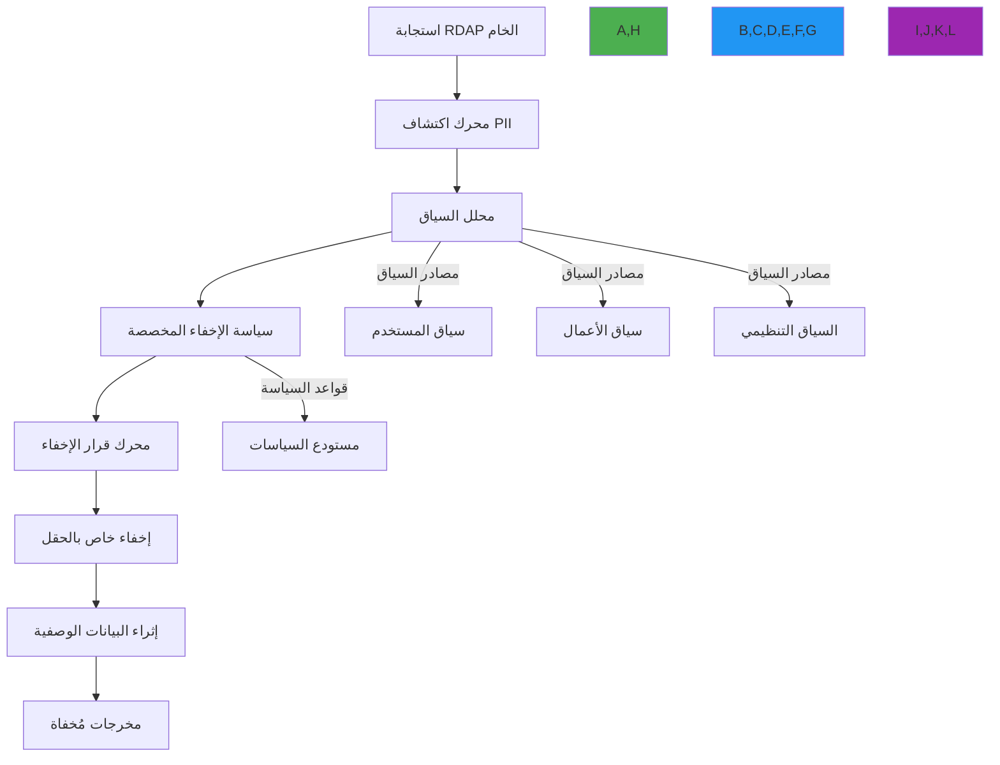

# أنماط الإخفاء المخصصة لبيانات التسجيل

**الهدف**: دليل شامل لتطبيق أنماط إخفاء PII مخصصة لمعالجة بيانات تسجيل RDAP مع تحكم دقيق في الكشف عن البيانات وسياسات خاصة بالولاية القضائية وتكامل منطق الأعمال
**ذات صلة**: [اكتشاف PII](pii-detection.md) | [التحقق من البيانات](data-validation.md) | [نموذج التهديدات](threat-model.md)
**وقت القراءة**: 7 دقائق

## بنية الإخفاء المخصص

يُمكّن RDAPify المؤسسات من تطبيق سياسات إخفاء متطورة وواعية بالسياق تتجاوز إزالة PII الأساسية للتعامل مع متطلبات خصوصية معقدة عبر الولايات القضائية وسياقات الأعمال:



### مبادئ الإخفاء الأساسية
- **الوعي بالسياق**: قرارات الإخفاء بناءً على سياق المستخدم والأعمال والتنظيم
- **التحكم الدقيق**: تعريفات سياسة على مستوى الحقل مع استراتيجيات إخفاء متعددة
- **تركيب السياسة**: الجمع بين سياسات متعددة لمتطلبات امتثال معقدة
- **مسار التدقيق**: تسجيل كامل لقرارات الإخفاء مع المبرر
- **الإخفاء العكسي**: التجزئة المشفرة للإخفاء العكسي حيث يُسمح قانوناً

## تنفيذ الإخفاء المخصص

### 1. إطار تعريف السياسة
```typescript
// src/security/redaction-policy.ts
interface RedactionPolicy {
  id: string;                      // معرف السياسة الفريد
  name: string;                    // الاسم المقروء للإنسان
  description: string;             // وصف السياسة
  version: string;                 // إصدار دلالي (مثلاً "1.2.0")
  jurisdiction: string[];          // الولايات القضائية المطبَّقة
  legalBasis: string[];            // الأسس القانونية (GDPR المادة 6)
  priority: number;                // مستوى الأولوية (الأعلى = الأكثر تحديداً)
  conditions: PolicyCondition[];   // شروط تطبيق السياسة
  rules: RedactionRule[];          // قواعد الإخفاء
  metadata: {
    createdBy: string;
    createdAt: Date;
    lastModified: Date;
    approvalStatus: 'draft' | 'pending' | 'approved' | 'rejected';
    dpoReviewRequired: boolean;
  };
}

interface PolicyCondition {
  field: string;                   // الحقل المراد تقييمه
  operator: 'equals' | 'contains' | 'regex' | 'in' | 'not_in'; // عامل المقارنة
  value: any;                      // القيمة للمقارنة
  contextScope: 'user' | 'request' | 'registry' | 'data'; // نطاق السياق
}

interface RedactionRule {
  target: string;                  // مسار الحقل أو النمط للمطابقة
  redactionType: 'remove' | 'mask' | 'hash' | 'replace' | 'partial'; // استراتيجية الإخفاء
  maskCharacter?: string;          // الحرف المستخدم للإخفاء (افتراضي: '*')
  preserveLength?: boolean;        // الحفاظ على طول الحقل الأصلي
  hashAlgorithm?: 'sha256' | 'blake3'; // خوارزمية التجزئة المشفرة
  replacementValue?: string;       // القيمة لاستبدال الحقل بها
  partialPreserve?: number;        // عدد الأحرف للحفاظ عليها (مثلاً 4 للأرقام الأخيرة)
  exceptions?: ExceptionRule[];    // استثناءات القاعدة
}

interface ExceptionRule {
  condition: PolicyCondition;      // شرط الاستثناء
  action: 'bypass' | 'modify';    // الإجراء المتخذ (تجاوز الإخفاء أو تعديل القاعدة)
  modifiedRule?: Partial<RedactionRule>; // القاعدة المعدّلة إذا كان الإجراء 'modify'
}

class RedactionPolicyEngine {
  private policies: Map<string, RedactionPolicy> = new Map();
  private compiledPolicies: Map<string, CompiledPolicy> = new Map();
  private contextProvider: ContextProvider;
  private auditLogger: AuditLogger;

  constructor(
    contextProvider: ContextProvider,
    auditLogger: AuditLogger,
    initialPolicies: RedactionPolicy[] = []
  ) {
    this.contextProvider = contextProvider;
    this.auditLogger = auditLogger;
    initialPolicies.forEach(policy => this.registerPolicy(policy));
  }

  registerPolicy(policy: RedactionPolicy): void {
    // التحقق من صحة هيكل السياسة
    this.validatePolicy(policy);

    // تخزين السياسة
    this.policies.set(policy.id, policy);

    // تجميع السياسة للتنفيذ
    this.compiledPolicies.set(policy.id, this.compilePolicy(policy));

    // تسجيل تسجيل السياسة
    this.auditLogger.log('policy_registered', {
      policyId: policy.id,
      name: policy.name,
      version: policy.version,
      jurisdiction: policy.jurisdiction
    });
  }

  async applyRedaction(
    data: any,
    context: RedactionContext
  ): Promise<RedactionResult> {
    const startTime = Date.now();
    const results: FieldRedactionResult[] = [];
    let policyApplied = false;

    try {
      // الحصول على السياسات المنطبقة بناءً على السياق
      const applicablePolicies = this.getApplicablePolicies(context);

      // تطبيق السياسات بترتيب الأولوية
      for (const policy of applicablePolicies) {
        const policyResult = await this.applyPolicy(data, policy, context);
        results.push(...policyResult.fieldResults);

        if (policyResult.applied) {
          policyApplied = true;
          this.auditLogger.log('policy_applied', {
            policyId: policy.id,
            fieldsAffected: policyResult.fieldResults.length,
            context
          });
        }
      }

      return {
        originalData: data,
        redactedData: data,
        fieldResults: results,
        policyApplied,
        processingTime: Date.now() - startTime
      };
    } catch (error) {
      throw new RedactionError(`Redaction failed: ${error.message}`, {
        originalError: error,
        context
      });
    }
  }
}
```

## أمثلة الإخفاء المخصص

### سياسة GDPR للاتحاد الأوروبي
```typescript
const gdprPolicy: RedactionPolicy = {
  id: 'gdpr-eu-v1',
  name: 'سياسة GDPR للاتحاد الأوروبي',
  description: 'إخفاء PII الكامل للامتثال لـ GDPR',
  version: '1.0.0',
  jurisdiction: ['EU', 'EEA', 'UK'],
  legalBasis: ['legitimate-interest', 'legal-obligation'],
  priority: 100,
  conditions: [
    {
      field: 'user.jurisdiction',
      operator: 'in',
      value: ['EU', 'EEA', 'UK'],
      contextScope: 'user'
    }
  ],
  rules: [
    {
      target: 'fn',
      redactionType: 'replace',
      replacementValue: '[REDACTED FOR PRIVACY]'
    },
    {
      target: 'email',
      redactionType: 'replace',
      replacementValue: 'Please query the RDDS service of the Registrar of Record'
    },
    {
      target: 'tel',
      redactionType: 'mask',
      maskCharacter: 'X',
      preserveLength: false
    },
    {
      target: 'adr',
      redactionType: 'replace',
      replacementValue: '[ADDRESS REDACTED]'
    }
  ],
  metadata: {
    createdBy: 'compliance-team',
    createdAt: new Date('2025-01-01'),
    lastModified: new Date('2025-06-01'),
    approvalStatus: 'approved',
    dpoReviewRequired: true
  }
};
```

### سياسة قابلة للضبط بناءً على الدور
```typescript
const roleBasedPolicy: RedactionPolicy = {
  id: 'role-based-v1',
  name: 'سياسة إخفاء قائمة على الدور',
  description: 'إخفاء انتقائي بناءً على دور المستخدم',
  version: '1.0.0',
  jurisdiction: ['global'],
  legalBasis: ['legitimate-interest'],
  priority: 50,
  conditions: [
    {
      field: 'user.role',
      operator: 'not_in',
      value: ['admin', 'compliance-officer'],
      contextScope: 'user'
    }
  ],
  rules: [
    {
      target: 'email',
      redactionType: 'partial',
      partialPreserve: 0, // عدم الحفاظ على أي جزء
      exceptions: [
        {
          condition: {
            field: 'user.hasVerifiedIdentity',
            operator: 'equals',
            value: true,
            contextScope: 'user'
          },
          action: 'modify',
          modifiedRule: {
            redactionType: 'partial',
            partialPreserve: 4 // الحفاظ على 4 أحرف أولى
          }
        }
      ]
    }
  ],
  metadata: {
    createdBy: 'security-team',
    createdAt: new Date('2025-03-01'),
    lastModified: new Date('2025-03-01'),
    approvalStatus: 'approved',
    dpoReviewRequired: false
  }
};
```

## التكامل مع عميل RDAPify

```typescript
import { RDAPClient } from 'rdapify';
import { RedactionPolicyEngine } from './redaction-policy';

const policyEngine = new RedactionPolicyEngine(
  contextProvider,
  auditLogger,
  [gdprPolicy, roleBasedPolicy]
);

const client = new RDAPClient({
  privacy: {
    customRedactionEngine: policyEngine
  }
});

// استخدام عادي - الإخفاء يُطبَّق تلقائياً بناءً على السياسات المُهيَّأة
const result = await client.domain('example.com');
```

## مراقبة وتدقيق الإخفاء

```typescript
// مراجعة إحصاءات الإخفاء
const stats = await policyEngine.getRedactionStats({
  period: 'last-30-days',
  groupBy: 'policy'
});

console.log(stats);
// {
//   'gdpr-eu-v1': { applied: 1523, fieldsRedacted: 4891 },
//   'role-based-v1': { applied: 890, fieldsRedacted: 1245 }
// }
```

## المراجع

- [اكتشاف PII](pii-detection.md)
- [إطار الامتثال](compliance.md)
- [أفضل الممارسات الأمنية](best-practices.md)
