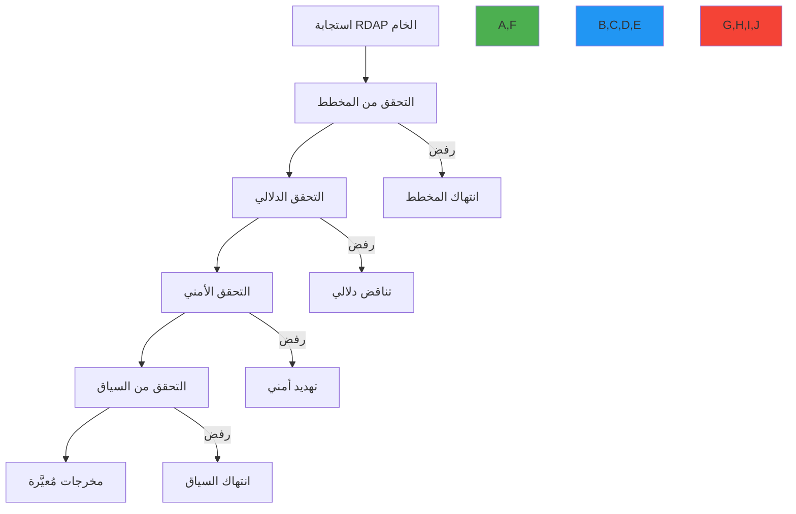

# دليل أمان التحقق من البيانات

**الهدف**: دليل شامل لتطبيق التحقق القوي من البيانات لمعالجة بيانات تسجيل RDAP، والحماية من هجمات الحقن وتلف البيانات وانتهاكات الامتثال مع أنماط تنفيذ عملية
**ذات صلة**: [منع SSRF](ssrf-prevention.md) | [اكتشاف PII](pii-detection.md) | [نموذج التهديدات](threat-model.md)
**وقت القراءة**: 7 دقائق

## الملخص التنفيذي

يُعدّ التحقق من البيانات ضابطاً أمنياً حيوياً لعملاء RDAP الذين يعالجون بيانات التسجيل من مصادر متعددة غير موثوقة. على عكس تطبيقات الويب التقليدية، يجب على عملاء RDAP التعامل مع هياكل بيانات معقدة وغير متجانسة من سجلات مختلفة مع منع هجمات الحقن وتلف البيانات وكشف PII. يقدم هذا الدليل استراتيجيات تحقق مُختبرة مستمدة من عمليات تدقيق أمنية من طرف ثالث ومنع هجمات فعلية.

**مبادئ التحقق الأساسية**:
- **الدفاع المتعمق**: طبقات تحقق مستقلة متعددة للمسارات الحرجة للبيانات
- **تطبيق المخطط**: التحقق الصارم وفق RFC 7483 والمخططات الخاصة بالسجلات
- **التحقق الواعي بالسياق**: قواعد تحقق مختلفة بناءً على سياق المعالجة
- **الإعدادات الافتراضية الآمنة**: رفض البيانات غير الصالحة بدلاً من محاولة الاسترداد
- **التعرف على أنماط الهجوم**: الاكتشاف النشط للأنماط الخبيثة في البيانات

## أساسيات التحقق من المدخلات

### 1. بنية التحقق متعددة الطبقات


### 2. تنفيذ التحقق من المدخلات
```typescript
// src/security/data-validation.ts
import { JSONSchema7 } from 'json-schema';
import { RegistryResponse } from '../types';

export class RDAPDataValidator {
  private schemas = new Map<string, JSONSchema7>();
  private threatPatterns = new Map<string, RegExp[]>();
  private contextValidators = new Map<string, ContextValidator>();

  constructor() {
    this.loadSchemas();
    this.loadThreatPatterns();
    this.initializeContextValidators();
  }

  validateResponse(response: RegistryResponse, context: ValidationContext): ValidationResult {
    const startTime = Date.now();
    const results: ValidationResult[] = [];
    let passed = true;
    let threatScore = 0;

    try {
      // الطبقة 1: التحقق من المخطط
      const schemaResult = this.validateSchema(response, context.registry);
      results.push(schemaResult);
      if (!schemaResult.passed) passed = false;
      threatScore = Math.max(threatScore, schemaResult.threatScore);

      // الطبقة 2: التحقق الدلالي
      const semanticResult = this.validateSemantics(response, context);
      results.push(semanticResult);
      if (!semanticResult.passed) passed = false;
      threatScore = Math.max(threatScore, semanticResult.threatScore);

      // الطبقة 3: التحقق الأمني
      const securityResult = this.validateSecurity(response, context);
      results.push(securityResult);
      if (!securityResult.passed) passed = false;
      threatScore = Math.max(threatScore, securityResult.threatScore);

      // الطبقة 4: التحقق من السياق
      const contextResult = this.validateContext(response, context);
      results.push(contextResult);
      if (!contextResult.passed) passed = false;
      threatScore = Math.max(threatScore, contextResult.threatScore);

      return {
        passed,
        threatScore,
        results,
        normalized: passed ? this.normalizeResponse(response, context) : null,
        validationTime: Date.now() - startTime
      };
    } catch (error) {
      return {
        passed: false,
        threatScore: 0.9,
        results: [{
          layer: 'exception',
          passed: false,
          threatScore: 0.9,
          errors: [{ field: 'system', message: error.message }]
        }],
        normalized: null,
        validationTime: Date.now() - startTime
      };
    }
  }

  private validateSchema(response: RegistryResponse, registry: string): ValidationResult {
    const schema = this.schemas.get(registry) || this.schemas.get('default');
    if (!schema) {
      return { passed: false, threatScore: 0.8, layer: 'schema', errors: [{ field: 'schema', message: 'No schema available' }] };
    }

    const errors = this.validateAgainstSchema(response, schema);
    if (errors.length > 0) {
      // حساب درجة التهديد بناءً على خطورة الأخطاء
      const threatScore = this.calculateSchemaThreatScore(errors);

      return {
        passed: false,
        threatScore,
        layer: 'schema',
        errors
      };
    }

    return { passed: true, threatScore: 0, layer: 'schema' };
  }

  private validateAgainstSchema(data: any, schema: JSONSchema7): ValidationError[] {
    const errors: ValidationError[] = [];

    // التحقق من الحقول المطلوبة
    if (schema.required) {
      for (const field of schema.required) {
        if (!(field in data)) {
          errors.push({
            field,
            message: `Required field '${field}' is missing`,
            severity: 'critical'
          });
        }
      }
    }

    // التحقق من النوع
    if (schema.type && !this.validateType(data, schema.type)) {
      errors.push({
        field: 'root',
        message: `Invalid type: expected ${schema.type}`,
        severity: 'critical'
      });
    }

    return errors;
  }
}
```

## قواعد التحقق من المدخلات

### التحقق من النطاقات
```typescript
// قواعد التحقق من صحة النطاق بناءً على RFC 1035
export const domainValidationRules = {
  maxLength: 253,
  labelMaxLength: 63,
  allowedPattern: /^[a-z0-9]([a-z0-9\-]{0,61}[a-z0-9])?(\.[a-z0-9]([a-z0-9\-]{0,61}[a-z0-9])?)*$/i,
  blockedPatterns: [
    /\.\./,          // نقاط متتالية
    /^-/,            // يبدأ بشرطة
    /-$/,            // ينتهي بشرطة
    /\s/             // مسافات بيضاء
  ]
};
```

### التحقق من عناوين IP
```typescript
// التحقق من IPv4
export const ipv4ValidationRules = {
  pattern: /^(\d{1,3})\.(\d{1,3})\.(\d{1,3})\.(\d{1,3})$/,
  octetsRange: { min: 0, max: 255 },
  noLeadingZeros: true,        // 010.0.0.1 غير صالح
  allowCIDR: true              // 192.168.1.0/24 مقبول
};

// التحقق من IPv6
export const ipv6ValidationRules = {
  pattern: /^[0-9a-f:]+$/i,
  allowCompressed: true,       // :: مقبولة
  allowIPv4Mapped: true        // ::ffff:192.0.2.1 مقبولة
};
```

### التحقق من ASN
```typescript
// قواعد التحقق من رقم النظام المستقل
export const asnValidationRules = {
  minValue: 0,
  maxValue: 4294967295,  // 32 بت
  allowPrefix: true,     // قبول "AS64512" و "64512"
  allowHyphen: false     // رفض "AS64512-64514"
};
```

## اكتشاف أنماط الهجوم

```typescript
// src/security/threat-patterns.ts
export const threatPatterns = {
  // أنماط حقن SQL
  sqlInjection: [
    /(\b)(select|insert|update|delete|drop|create|alter)\b/i,
    /union\s+select/i,
    /'\s*or\s*'1'\s*=\s*'1/i
  ],

  // أنماط حقن LDAP
  ldapInjection: [
    /[*)(\\]/,
    /\x00/
  ],

  // أنماط SSRF في قيم الحقول
  ssrfPatterns: [
    /\b(?:10|127|172\.(?:1[6-9]|2[0-9]|3[0-1])|192\.168|169\.254)\.\d{1,3}\.\d{1,3}\b/,
    /^(?:file|gopher|dict|ldap|tftp):/i,
    /(?:localhost|internal|intranet)\./i
  ],

  // أنماط XSS
  xssPatterns: [
    /<script[^>]*>/i,
    /javascript:/i,
    /on\w+\s*=/i
  ]
};
```

## التكامل مع RDAPify

```typescript
import { RDAPClient } from 'rdapify';

const client = new RDAPClient({
  validation: {
    strict: true,              // رفض الاستجابات غير المتوافقة مع المخطط
    validateCertificates: true,
    checkThreatPatterns: true, // فحص أنماط الهجوم في الاستجابات
    sanitizeInputs: true       // تطهير جميع المدخلات قبل المعالجة
  }
});

// التحقق من المدخلات يدوياً
import { validateDomain, validateIP, validateASN } from 'rdapify';

try {
  const domainResult = validateDomain('example.com');
  if (!domainResult.valid) {
    throw new Error(`Domain validation failed: ${domainResult.reason}`);
  }

  const result = await client.domain('example.com');
} catch (error) {
  if (error instanceof ValidationError) {
    console.error('Validation failed:', error.message);
  }
}
```

## قائمة التحقق من أمان البيانات

### التحقق من المدخلات
- [ ] التحقق من جميع إدخالات المستخدم قبل المعالجة
- [ ] تطبيق حدود الطول على جميع حقول النص
- [ ] التحقق من تنسيق النطاق وعنوان IP وASN
- [ ] حظر الأحرف والأنماط الخطيرة
- [ ] تطهير الكيانات HTML في قيم الاستجابة

### التحقق من الاستجابة
- [ ] التحقق من صحة الاستجابات مقابل مخطط RFC 7483
- [ ] فحص أنماط التهديد في البيانات المُستلَمة
- [ ] التحقق من أن الاستجابة من السجل المتوقع
- [ ] التحقق من سلامة بيانات الاستجابة

### التحقق الأمني
- [ ] فحص محتوى الاستجابة بحثاً عن محاولات SSRF
- [ ] التحقق من عدم وجود حقول PII غير مُخفاة
- [ ] مراجعة سجلات التدقيق بانتظام بحثاً عن أنماط مشبوهة

## المراجع

- [RFC 7483 - تنسيق استجابة RDAP](https://tools.ietf.org/html/rfc7483)
- [OWASP - التحقق من المدخلات](https://owasp.org/www-project-proactive-controls/v3/en/c5-validate-inputs)
- [CWE-20: التحقق غير الصحيح من المدخلات](https://cwe.mitre.org/data/definitions/20.html)
