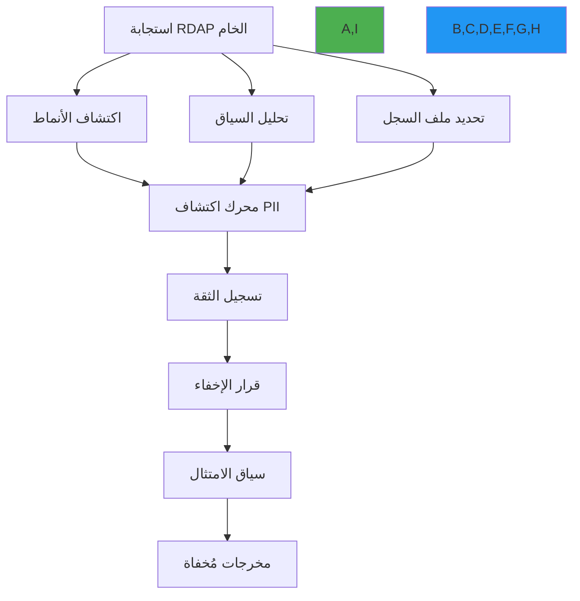

# اكتشاف PII في بيانات التسجيل

**الهدف**: دليل شامل لاكتشاف وتعامل مع Personally Identifiable Information (PII) في بيانات تسجيل RDAP مع التعرف المتقدم على الأنماط والاكتشاف الواعي بالسياق وتقنيات المعالجة الحافظة للامتثال
**ذات صلة**: [التحقق من البيانات](data-validation.md) | [منع SSRF](ssrf-prevention.md) | [امتثال GDPR](compliance.md) | [نموذج التهديدات](threat-model.md)
**وقت القراءة**: 8 دقائق

## الملخص التنفيذي

يُعدّ اكتشاف PII ضابطاً أمنياً حيوياً لعملاء RDAP الذين يعالجون بيانات التسجيل من السجلات العالمية. على عكس التطبيقات التقليدية، يجب على عملاء RDAP التعامل مع تنسيقات PII معقدة وغير متجانسة عبر ولايات قضائية متعددة مع منع الكشف غير المصرح عن البيانات. يقدم هذا الدليل استراتيجيات اكتشاف PII المُختبرة في بيئات إنتاجية حقيقية.

**مبادئ اكتشاف PII الأساسية**:
- **الاكتشاف متعدد الأوضاع**: الجمع بين مطابقة الأنماط وتحليل السياق والتعلم الآلي
- **التكيف الخاص بالسجل**: قواعد اكتشاف مختلفة لتنسيق بيانات كل سجل
- **المعالجة الواعية بالامتثال**: الإخفاء التلقائي بناءً على الولاية القضائية والأساس القانوني
- **صفر إيجابيات كاذبة سالبة**: إعطاء الأولوية لاكتمال الاكتشاف على حساب الإيجابيات الكاذبة
- **الحفاظ على السياق**: الحفاظ على فائدة البيانات مع حماية الخصوصية

## بنية اكتشاف PII

### 1. نظام الاكتشاف متعدد الطبقات


### 2. تنفيذ محرك الاكتشاف
```typescript
// src/security/pii-detection.ts
export class PIIDetectionEngine {
  private static readonly PII_PATTERNS = {
    // أنماط البريد الإلكتروني
    email: /\b[A-Za-z0-9._%+-]+@[A-Za-z0-9.-]+\.[A-Z|a-z]{2,}\b/i,

    // أنماط الهاتف (التنسيق الدولي)
    phone: /\b(?:\+?1[-.\s]?)?\(?\d{3}\)?[-.\s]?\d{3}[-.\s]?\d{4}\b/,

    // أنماط الاسم مع السياق
    name: /\b(?:Mr|Mrs|Ms|Dr)\.\s+[A-Z][a-z]+(?:\s+[A-Z][a-z]+)?\b/,

    // أنماط العنوان
    address: /\b\d{1,5}\s+(?:[\w\s]+,?\s+){2,4}[A-Z]{2}\s+\d{5}(-\d{4})?\b/gi,

    // أرقام الهوية (SSN، جواز السفر، إلخ)
    idNumber: /\b(?:\d{3}-\d{2}-\d{4}|\d{9}|[A-Z0-9]{8,9})\b/,

    // أنماط بطاقة الائتمان
    creditCard: /\b(?:\d[ -]*?){13,16}\b/
  };

  private static readonly CONTEXT_KEYWORDS = {
    personal: ['registrant', 'admin', 'billing', 'technical', 'contact', 'person', 'name', 'address', 'phone', 'email'],
    business: ['registrar', 'organization', 'org', 'company', 'inc', 'llc', 'corp'],
    sensitive: ['password', 'secret', 'token', 'key', 'credential', 'authentication']
  };

  private registryProfiles = new Map<string, RegistryProfile>();
  private mlModel: MLModel | null = null;
  private confidenceThreshold: number;

  constructor(options: PIIDetectionOptions = {}) {
    this.confidenceThreshold = options.confidenceThreshold || 0.7;
    this.initializeRegistryProfiles();
    this.loadMLModel();
  }

  detectPII(response: RegistryResponse, context: DetectionContext): PIIDetectionResult {
    const startTime = Date.now();
    const results: PIIField[] = [];
    const confidenceScores = new Map<string, number>();

    try {
      // الحصول على ملف السجل للاكتشاف الواعي بالسياق
      const registryProfile = this.getRegistryProfile(context.registry || 'default');

      // اجتياز هيكل الاستجابة
      this.traverseResponse(response, '', registryProfile, context, results, confidenceScores);

      // تطبيق تسجيل الثقة والتصفية
      const filteredResults = this.applyConfidenceFiltering(results, confidenceScores, registryProfile);

      // حساب درجة المخاطر الإجمالية
      const riskScore = this.calculateRiskScore(filteredResults, context);

      return {
        detectedFields: filteredResults,
        riskScore,
        confidence: this.calculateOverallConfidence(filteredResults),
        processingTime: Date.now() - startTime,
        jurisdiction: context.jurisdiction,
        redactionRequired: riskScore > 0.3
      };
    } catch (error) {
      console.error('PII detection failed:', error);
      return {
        detectedFields: [],
        riskScore: 0,
        confidence: 0,
        processingTime: Date.now() - startTime,
        error: error.message,
        jurisdiction: context.jurisdiction
      };
    }
  }

  private initializeRegistryProfiles() {
    // ملف Verisign
    this.registryProfiles.set('verisign', {
      name: 'verisign',
      piiFields: ['fn', 'adr', 'tel', 'email'],
      confidenceBoosters: {
        'vcardArray': 0.2,
        'entities': 0.3,
        'role': 0.15
      },
      patternOverrides: {
        phone: /\b\d{3}-\d{3}-\d{4}\b/, // تنسيق هاتف Verisign
        name: /\b[A-Z][a-z]+(?:\s+[A-Z][a-z]+)+\b/ // تنسيق الاسم الأول واسم العائلة
      }
    });

    // ملف ARIN
    this.registryProfiles.set('arin', {
      name: 'arin',
      piiFields: ['fn', 'adr', 'tel', 'email', 'title'],
      confidenceBoosters: {
        'contact': 0.4,
        'poc': 0.3,
        'organization': 0.2
      },
      patternOverrides: {
        address: /\b\d{1,5}\s+[\w\s.,]+\b/ // تنسيق عنوان ARIN
      }
    });

    // الملف الافتراضي
    this.registryProfiles.set('default', {
      name: 'default',
      piiFields: ['fn', 'adr', 'tel', 'email', 'n', 'title'],
      confidenceBoosters: {},
      patternOverrides: {}
    });
  }

  private traverseResponse(
    obj: any,
    path: string,
    profile: RegistryProfile,
    context: DetectionContext,
    results: PIIField[],
    confidenceScores: Map<string, number>
  ) {
    if (obj === null || obj === undefined) return;

    if (typeof obj === 'string') {
      this.analyzeStringField(obj, path, profile, context, results, confidenceScores);
    } else if (Array.isArray(obj)) {
      obj.forEach((item, index) => {
        this.traverseResponse(item, `${path}[${index}]`, profile, context, results, confidenceScores);
      });
    } else if (typeof obj === 'object') {
      Object.entries(obj).forEach(([key, value]) => {
        const currentPath = path ? `${path}.${key}` : key;
        this.traverseResponse(value, currentPath, profile, context, results, confidenceScores);
      });
    }
  }

  private analyzeStringField(
    value: string,
    path: string,
    profile: RegistryProfile,
    context: DetectionContext,
    results: PIIField[],
    confidenceScores: Map<string, number>
  ) {
    // تخطي القيم الفارغة أو القصيرة جداً
    if (!value || value.length < 3) return;

    // حساب الثقة بناءً على مسار الحقل
    let confidence = this.calculatePathConfidence(path, profile);

    // تطبيق مطابقة الأنماط مع التجاوزات الخاصة بالسجل
    const patterns = profile.patternOverrides || PIIDetectionEngine.PII_PATTERNS;

    for (const [type, pattern] of Object.entries(patterns)) {
      if (pattern.test(value)) {
        // زيادة الثقة للأنماط المطابقة
        const patternConfidence = this.calculatePatternConfidence(type, value, profile);
        confidence = Math.max(confidence, patternConfidence);

        // التحقق من كلمات مفتاحية في السياق
        const contextConfidence = this.calculateContextConfidence(value, path, profile);
        confidence = Math.max(confidence, contextConfidence);

        // تطبيق تعزيزات خاصة بالولاية القضائية
        confidence = this.applyJurisdictionBoost(confidence, type, context);

        if (confidence > this.confidenceThreshold) {
          results.push({
            field: path,
            value: value.substring(0, 50), // اقتطاع للتسجيل
            type: type as PIIType,
            confidence,
            context: {
              path,
              registry: profile.name,
              jurisdiction: context.jurisdiction,
              legalBasis: context.legalBasis
            }
          });

          confidenceScores.set(path, Math.max(confidenceScores.get(path) || 0, confidence));
        }
      }
    }
  }

  private calculatePathConfidence(path: string, profile: RegistryProfile): number {
    // التحقق من تطابق المسار مع حقول PII المعروفة لهذا السجل
    if (profile.piiFields.some(field => path.includes(field))) {
      return 0.8; // ثقة عالية لحقول PII المعروفة
    }

    // التحقق من معززات السياق
    const boosters = profile.confidenceBoosters;
    for (const [booster, boost] of Object.entries(boosters)) {
      if (path.includes(booster)) {
        return 0.6 + boost; // الثقة الأساسية + المعزز
      }
    }

    // الثقة الافتراضية بناءً على عمق المسار
    const depth = path.split('.').length;
    return Math.max(0.3, 0.5 - (depth * 0.1));
  }

  private calculatePatternConfidence(type: string, value: string, profile: RegistryProfile): number {
    switch (type) {
      case 'email':
        return value.includes('@') && value.includes('.') ? 0.95 : 0.8;
      case 'phone':
        return /\d{10,}/.test(value.replace(/[^\d]/g, '')) ? 0.9 : 0.7;
      case 'name':
        return /^[A-Z][a-z]+(?:\s+[A-Z][a-z]+)+$/.test(value) ? 0.85 : 0.6;
      case 'address':
        return /\d{1,5}\s+[A-Za-z]/.test(value) ? 0.8 : 0.6;
      case 'idNumber':
        return /\d{9,}/.test(value.replace(/[^\d]/g, '')) ? 0.95 : 0.85;
      default:
        return 0.7;
    }
  }

  private applyJurisdictionBoost(confidence: number, type: string, context: DetectionContext): number {
    if (context.jurisdiction === 'EU' && ['name', 'email', 'phone', 'address'].includes(type)) {
      return Math.min(1.0, confidence * 1.2); // متطلبات PII الصارمة في الاتحاد الأوروبي
    }

    if (context.jurisdiction === 'US-CA' && ['email', 'phone'].includes(type)) {
      return Math.min(1.0, confidence * 1.1); // تركيز CCPA على معلومات الاتصال
    }

    return confidence;
  }

  private applyConfidenceFiltering(
    results: PIIField[],
    confidenceScores: Map<string, number>,
    profile: RegistryProfile
  ): PIIField[] {
    // إزالة التكرارات حسب مسار الحقل
    const uniqueResults = new Map<string, PIIField>();

    results.forEach(result => {
      const existing = uniqueResults.get(result.field);
      if (!existing || existing.confidence < result.confidence) {
        uniqueResults.set(result.field, result);
      }
    });

    // تطبيق حد الثقة
    return Array.from(uniqueResults.values()).filter(result =>
      result.confidence >= this.confidenceThreshold
    );
  }
}
```

## استراتيجيات الإخفاء

### الإخفاء الافتراضي
يطبق RDAPify إخفاءً تلقائياً للحقول الحساسة التالية:

| نوع PII | مثال | النتيجة بعد الإخفاء |
|---------|-------|---------------------|
| البريد الإلكتروني | `user@example.com` | `[EMAIL REDACTED]` |
| الهاتف | `+1-555-1234` | `[PHONE REDACTED]` |
| العنوان | `123 Main St, City, ST 12345` | `[ADDRESS REDACTED]` |
| الاسم الكامل | `John Doe` | `[NAME REDACTED]` |

### الإخفاء المخصص
```typescript
const client = new RDAPClient({
  privacy: {
    redactEmails: true,
    redactPhones: true,
    redactAddresses: true,
    customRedactionRules: [
      {
        pattern: /\b\d{3}-\d{2}-\d{4}\b/,
        replacement: '[SSN REDACTED]'
      },
      {
        pattern: /passport\s*#?\s*[A-Z0-9]{6,9}/i,
        replacement: '[PASSPORT REDACTED]'
      }
    ]
  }
});
```

## الامتثال للوائح

### GDPR (اللائحة الأوروبية العامة لحماية البيانات)
- **المادة 5**: الحد الأدنى من البيانات - جمع البيانات الضرورية فقط
- **المادة 17**: الحق في المحو - إخفاء PII عند الطلب
- **المادة 25**: الخصوصية بالتصميم - الإخفاء التلقائي افتراضياً

### CCPA (قانون خصوصية المستهلك في كاليفورنيا)
- **القسم 1798.100**: الحق في معرفة البيانات الشخصية المجمّعة
- **القسم 1798.105**: الحق في حذف البيانات الشخصية
- **القسم 1798.120**: الحق في إلغاء الاشتراك في بيع البيانات الشخصية

## المراقبة والتدقيق

```typescript
const client = new RDAPClient({
  privacy: { redactEmails: true },
  audit: {
    enabled: true,
    logRedactions: true,      // تسجيل عدد الإخفاءات (ليس المحتوى)
    logPIIPatterns: false,    // لا تسجّل الأنماط الفعلية
    sensitiveDataLogging: false
  }
});
```

**الأحداث المسجّلة**:
- عدد حقول PII المكتشفة (بدون المحتوى)
- تطبيق قواعد الإخفاء
- أخطاء معالجة PII
- إحصاءات الامتثال

## المراجع

- [GDPR الرسمي](https://gdpr-info.eu/)
- [CCPA الرسمي](https://oag.ca.gov/privacy/ccpa)
- [RFC 7483 - تنسيق استجابة RDAP](https://tools.ietf.org/html/rfc7483)
- [IANA RDAP Bootstrap](https://data.iana.org/rdap/)
