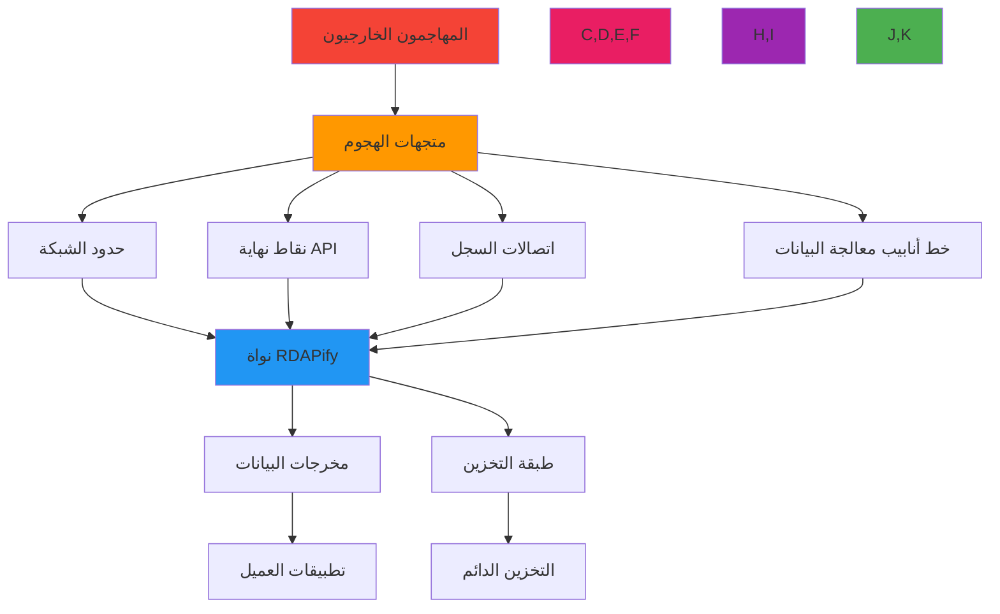
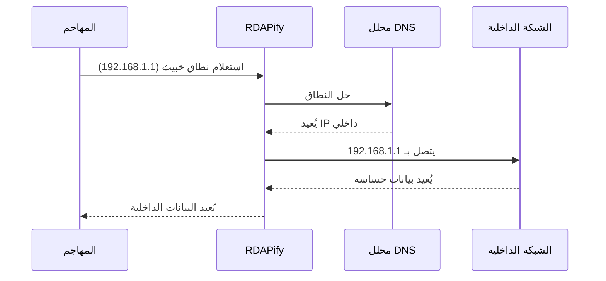
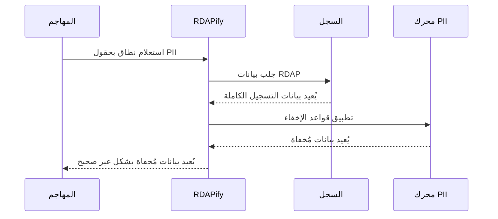

# نموذج التهديدات: منصة الوصول إلى بيانات التسجيل RDAPify

**الهدف**: تحليل نمذجة تهديدات شامل لمنصة معالجة بيانات التسجيل في RDAPify، مع تحديد متجهات الهجوم وتحديد أولويات المخاطر واستراتيجيات الدفاع لفرق الأمن ومسؤولي الامتثال
**ذات صلة**: [الورقة البيضاء للأمان](whitepaper.md) | [اكتشاف PII](pii-detection.md) | [منع SSRF](ssrf-prevention.md)
**وقت القراءة**: 10 دقائق

## الملخص التنفيذي

يعالج RDAPify بيانات تسجيل حساسة عبر البنية التحتية للإنترنت العالمية، مما يُنشئ أسطح تهديد فريدة تتطلب نمذجة أمنية متخصصة. يُحدد نموذج التهديدات هذا 12 متجهاً حرجاً للتهديد، حيث تمثل هجمات SSRF أعلى فئة مخاطر، يليها ثغرات تسرب البيانات وهجمات انتحال السجلات.

**إحصاءات التهديدات الرئيسية**:
- **التهديدات الحرجة**: 3 (SSRF، كشف PII، انتحال الشهادة)
- **التهديدات العالية**: 4 (تسميم التخزين المؤقت، DoS، حقن البيانات، تخفيض البروتوكول)
- **التهديدات المتوسطة**: 3 (ثغرات التبعيات، الكشف عن المعلومات، هجمات التوقيت)
- **التهديدات المنخفضة**: 2 (هجمات التسجيل، التلاعب بواجهة المستخدم)

يتطور مشهد التهديدات باستمرار مع تقنيات هجوم ناشئة تستهدف البنية التحتية لـ RDAP. تم تصميم بنية RDAPify الدفاعية المتعمقة للتخفيف من هذه التهديدات من خلال ضوابط متعددة الطبقات مُتحقق منها عبر اختبارات اختراق ربع سنوية ومسح مستمر للثغرات.

## منهجية نمذجة التهديدات

### 1. تحليل سطح الهجوم


### 2. إطار تصنيف تهديدات STRIDE
| فئة التهديد | تأثير RDAPify | متجهات مثالية | آليات الاكتشاف |
|------------|---------------|---------------|----------------|
| **الانتحال** | عالٍ | انتحال السجل، تزوير الشهادة | تثبيت الشهادة، التحقق من تمهيد IANA |
| **التلاعب** | حرج | تعديل الاستجابة، تسميم التخزين المؤقت | توقيعات الاستجابة، التحقق من المخطط |
| **الإنكار** | متوسط | حذف سجل التدقيق، إنكار الادعاء | مسارات تدقيق غير قابلة للتغيير، توقيع مشفر |
| **الكشف عن المعلومات** | حرج | كشف PII، تسرب التفاصيل الداخلية | الإخفاء التلقائي، الحد الأدنى من الاستجابة |
| **رفض الخدمة** | عالٍ | استنفاد الموارد، إغراق السجل | تحديد المعدل، قواطع الدائرة، المهل الزمنية |
| **رفع الامتياز** | متوسط | استغلال SSRF، تصعيد الامتياز | عزل الشبكة، حدود القدرات |

## متجهات التهديد الحرجة

### 1. تزوير الطلبات من جانب الخادم (SSRF)
**معرف التهديد**: TM-SSRF-001
**تقييم المخاطر**: حرج (9.8 CVSS)
**تدفق الهجوم**:


**متغيرات الهجوم**:
- **الوصول المباشر لـ IP**: استعلامات لنطاقات IP الخاصة RFC 1918
- **حقن رأس Host**: رؤوس Host خبيثة تعيد التوجيه إلى خدمات داخلية
- **إعادة ربط DNS**: التلاعب الديناميكي بـ DNS للحل إلى عناوين IP داخلية بعد التحقق
- **تهريب البروتوكول**: استخدام ترميز URL لتجاوز قيود البروتوكول

**مؤشرات الاكتشاف**:
```typescript
// أنماط اكتشاف SSRF
const ssrfPatterns = [
  // أنماط عنوان IP
  /\b(?:10|127|172\.(?:1[6-9]|2[0-9]|3[0-1])|192\.168|169\.254)\.\d{1,3}\.\d{1,3}\b/,
  // أنماط التلاعب بالمضيف
  /(?:%25[0-9a-f]{2}|%2e%2e\/)/i,
  // أنماط تهريب البروتوكول
  /^(?:file|gopher|dict|ldap|tftp):/i,
  // أنماط النطاق الداخلي
  /(?:localhost|internal|intranet|admin|test)\.[a-z0-9-]+\.[a-z]{2,6}$/i
];
```

**استراتيجية التخفيف**:
- **حماية متعددة الطبقات**: بنية دفاع 5 طبقات مع تحقق مستقل في كل طبقة
- **التحقق قبل الحل**: التحقق من النطاق قبل البحث في DNS مع قوائم السماح/الرفض
- **الحظر بعد الحل**: حظر نطاق IP بعد حل DNS مع السياج الجغرافي
- **عزل الشبكة**: أجزاء شبكة منفصلة للتواصل مع السجل مع تصفية الحركة الصادرة
- **التحقق من الاستجابة**: التحقق من نوع المحتوى وهيكله لاكتشاف الاستجابات غير المتوقعة

### 2. كشف بيانات PII
**معرف التهديد**: TM-PII-001
**تقييم المخاطر**: حرج (9.2 CVSS)
**تدفق الهجوم**:


**متجهات الهجوم**:
- **تجاوز الحالات الطرفية**: تنسيقات RDAP الخاصة بالسجل تتجاوز قواعد الإخفاء
- **الوصول المباشر للحقل**: الوصول إلى كائنات الاستجابة الخام التي تحتوي على بيانات غير مُخفاة
- **تسرب رسائل الخطأ**: كشف PII في رسائل الخطأ وتتبعات المكدس
- **تجاوز التخزين المؤقت**: الاستجابات المخزنة مؤقتاً التي تحتوي على PII من استعلامات سابقة غير مُخفاة
- **تهرب الولاية القضائية**: التلاعب في اكتشاف الولاية القضائية لتجنب إخفاء GDPR

**مصفوفة مخاطر حقل PII**:
| نوع الحقل | مادة GDPR | قسم CCPA | مستوى المخاطر | استراتيجية الإخفاء |
|-----------|-----------|---------|---------------|------------------|
| `fn` (الاسم الكامل) | 5(1)(c) | 1798.140(o) | حرج | إخفاء كامل بعنصر نائب |
| `email` (البريد الإلكتروني) | 5(1)(c) | 1798.140(o) | حرج | استبدال النمط أو الإزالة الكاملة |
| `tel` (الهاتف) | 5(1)(c) | 1798.140(o) | عالٍ | إخفاء ما عدا رمز الدولة |
| `adr` (العنوان) | 5(1)(c) | 1798.140(o) | عالٍ | استبدال بعناصر نائبة عامة |
| `org` (المنظمة) | 5(1)(c) | 1798.140(o) | متوسط | إخفاء للأفراد، الحفاظ للشركات |
| `title` (المسمى الوظيفي) | 5(1)(c) | 1798.140(o) | متوسط | إخفاء كامل |
| عناوين IP | 5(1)(c) | 1798.140(o) | منخفض | إخفاء هوية الأوكتيت الأخير |

**ضوابط الاكتشاف**:
```typescript
// محرك اكتشاف PII وإخفائها
class PIIDetectionEngine {
  private static readonly PII_PATTERNS = [
    // أنماط البريد الإلكتروني
    /\b[A-Za-z0-9._%+-]+@[A-Za-z0-9.-]+\.[A-Z|a-z]{2,}\b/g,
    // أنماط الهاتف
    /\b(?:\+?1[-.\s]?)?\(?\d{3}\)?[-.\s]?\d{3}[-.\s]?\d{4}\b/g,
    // أنماط الاسم
    /\b(?:Mr|Mrs|Ms|Dr)\.\s+[A-Z][a-z]+(?:\s+[A-Z][a-z]+)?\b/g,
    // أنماط العنوان
    /\b\d{1,5}\s+(?:[\w\s]+,?\s+){2,4}[A-Z]{2}\s+\d{5}(-\d{4})?\b/gi
  ];
}
```

### 3. انتحال السجل
**معرف التهديد**: TM-REG-001
**تقييم المخاطر**: عالٍ (8.1 CVSS)

**متجهات الهجوم**:
- **تزوير الشهادة**: إنشاء شهادات TLS لنطاقات السجل المشروعة
- **تسميم تخزين التمهيد المؤقت**: التلاعب في بيانات تمهيد IANA المخزنة مؤقتاً
- **انتحال DNS**: إعادة توجيه استعلامات DNS لنطاقات السجل إلى خوادم خبيثة
- **هجمات التوقيت**: استغلال نوافذ التحقق من الشهادة

**الضوابط**:
- تثبيت الشهادة للسجلات المعروفة
- التحقق من تمهيد IANA مقابل مصادر موثوقة متعددة
- فحوصات سلامة DNSSEC
- اكتشاف الشذوذ في استجابات السجل

## سجل المخاطر الكامل

| معرف التهديد | التهديد | الاحتمالية | التأثير | تقييم المخاطر | الحالة |
|-------------|---------|------------|---------|--------------|-------|
| TM-SSRF-001 | تزوير الطلبات من جانب الخادم | عالية | حرج | 9.8 | مُخفَّف |
| TM-PII-001 | كشف PII | متوسطة | حرج | 9.2 | مُخفَّف |
| TM-REG-001 | انتحال السجل | منخفضة | عالٍ | 8.1 | مُخفَّف |
| TM-CACHE-001 | تسميم التخزين المؤقت | متوسطة | عالٍ | 7.5 | مُخفَّف |
| TM-DOS-001 | رفض الخدمة | عالية | متوسط | 7.0 | مُخفَّف |
| TM-INJ-001 | حقن البيانات | منخفضة | عالٍ | 6.5 | مُخفَّف |
| TM-PROTO-001 | تخفيض البروتوكول | منخفضة | متوسط | 5.5 | مُخفَّف |
| TM-DEP-001 | ثغرات التبعيات | متوسطة | متوسط | 5.0 | في المراقبة |

## متطلبات الاختبار الأمني

### اختبار الاختراق
- اختبار ربع سنوي لجميع المتجهات الحرجة
- اختبار سنوي شامل من قِبل شركة خارجية
- تمارين Red Team للتهديدات المتقدمة

### الفحص المستمر
- فحص يومي للثغرات في التبعيات
- مراقبة لحظية لحالات شذوذ السجلات
- تتبع مؤشرات أداء الأمان

### متطلبات الإفصاح
- الإفصاح المسؤول عبر: security@rdapify.com
- جدول إفصاح مدته 90 يوماً
- تقييد الإصلاح حسب الخطورة: حرج (24 ساعة)، عالٍ (7 أيام)، متوسط (30 يوماً)

## المراجع

- [OWASP Top 10](https://owasp.org/www-project-top-ten/)
- [MITRE ATT&CK](https://attack.mitre.org/)
- [CWE-918: SSRF](https://cwe.mitre.org/data/definitions/918.html)
- [RFC 7481 - خدمات الأمان لـ RDAP](https://tools.ietf.org/html/rfc7481)
