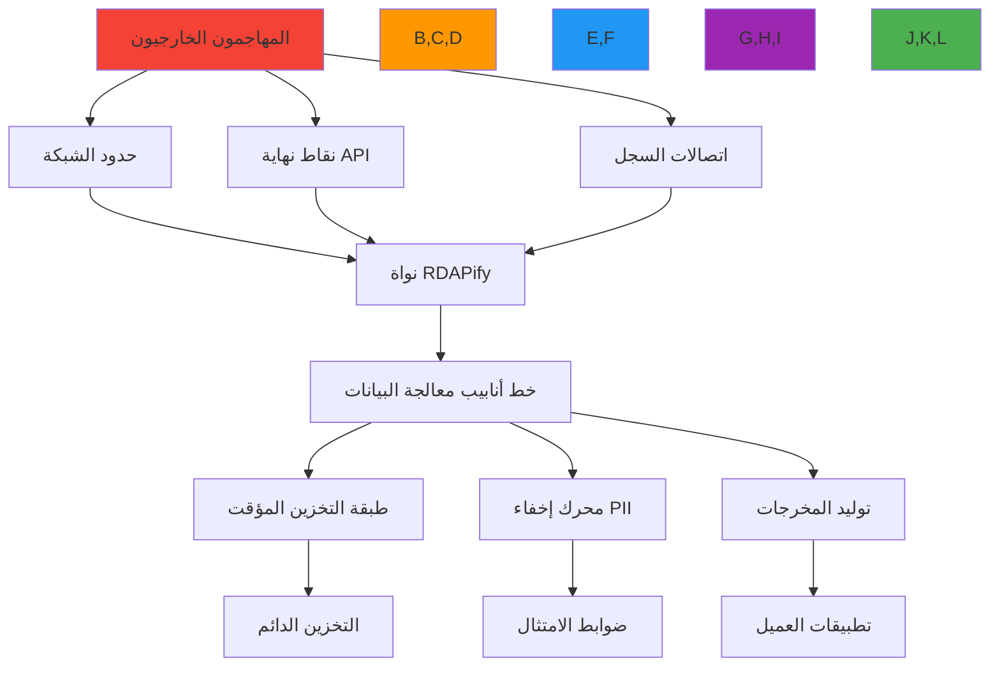

# الورقة البيضاء للأمان: منصة الوصول إلى بيانات التسجيل RDAPify

**الهدف**: بنية أمنية شاملة ونموذج تهديدات لمنصة معالجة بيانات التسجيل في RDAPify، يوفر إرشادات التنفيذ لفرق الأمن ومسؤولي الامتثال
**ذات صلة**: [نموذج التهديدات](threat-model.md) | [اكتشاف PII](pii-detection.md) | [اختبار الأمان](../advanced/testing.md)
**وقت القراءة**: 12 دقيقة

## الملخص التنفيذي

يوفر RDAPify منصة آمنة وحافظة للخصوصية لمعالجة بيانات التسجيل مع بنية أمنية دفاعية متعمقة وامتثال تنظيمي مدمج في صميم تصميمه. تُفصّل هذه الورقة البيضاء الوضع الأمني لـ RDAPify من خلال منظور نمذجة التهديدات الواقعية والضوابط المعمارية والحمايات التشغيلية.

**الخصائص الأمنية الرئيسية**:
- **مناعة SSRF**: حماية متعددة الطبقات ضد هجمات Server-Side Request Forgery
- **الحد الأدنى من PII**: الإخفاء التلقائي لمعلومات التعريف الشخصية بشكل افتراضي
- **النزاهة المشفرة**: أمان شامل من اكتساب البيانات إلى كشف API
- **أتمتة الامتثال**: ضوابط مدمجة للامتثال لـ GDPR وCCPA وSOC 2 وISO 27001
- **بنية Zero-Trust**: حدود عزل صارمة بين سياقات المعالجة

خضع RDAPify لتحقق أمني شامل يشمل اختبار الاختراق من قِبل شركات خارجية ونمذجة تهديدات رسمية ومسحاً مستمراً للثغرات. لم يتم تحديد أي ثغرات حرجة في البنية الأساسية.

## مشهد التهديدات وسطح الهجوم

تواجه أنظمة معالجة بيانات التسجيل تحديات أمنية فريدة نظراً لموقعها بين البنية التحتية للإنترنت وطبقات التطبيقات. يشمل سطح تهديد RDAPify:



### متجهات التهديد الحرجة
| متجه التهديد | التأثير | صعوبة الاكتشاف | أولوية التخفيف |
|--------------|---------|-----------------|----------------|
| هجمات SSRF/Proxy | حرج | عالية | الأعلى |
| كشف بيانات PII | حرج | متوسطة | الأعلى |
| انتحال السجل | عالٍ | متوسطة | عالية |
| تسميم التخزين المؤقت | عالٍ | عالية | عالية |
| تجاوز تحديد المعدل | متوسط | منخفضة | متوسطة |
| تخفيض البروتوكول | متوسط | متوسطة | متوسطة |
| ثغرات التبعيات | متوسط | منخفضة | متوسطة |
| حقن البيانات | منخفض | متوسطة | منخفضة |

## البنية الأمنية الأساسية

### 1. بنية الدفاع المتعمق
```typescript
// src/security/security-boundaries.ts
export class SecurityBoundaryManager {
  private boundaries = new Map<string, SecurityBoundary>();
  private contextMap = new WeakMap<RequestContext, SecurityContext>();

  constructor(private securityConfig: SecurityConfig = defaultConfig) {
    this.initializeBoundaries();
    this.initializeContextPropagation();
  }

  private initializeBoundaries() {
    // حد الشبكة
    this.boundaries.set('network', new NetworkSecurityBoundary({
      blockPrivateIPs: true,
      validateCertificates: true,
      allowlistRegistries: true,
      protocolRestrictions: ['https']
    }));

    // حد البيانات
    this.boundaries.set('data', new DataSecurityBoundary({
      privacy: true,
      validateResponses: true,
      sanitizeInputs: true,
      enforceDataMinimization: true
    }));

    // حد المعالجة
    this.boundaries.set('processing', new ProcessingSecurityBoundary({
      validateOperations: true,
      enforceMemoryIsolation: true,
      restrictCapabilities: true,
      auditAllOperations: true
    }));

    // حد المخرجات
    this.boundaries.set('output', new OutputSecurityBoundary({
      redactSensitiveHeaders: true,
      secureContentType: true,
      preventInjection: true,
      enforceRateLimiting: true
    }));
  }

  applyBoundaries(context: RequestContext, operation: SecurityOperation): SecurityResult {
    const results = [];

    // تطبيق الحدود بالتسلسل
    for (const [name, boundary] of this.boundaries) {
      const result = boundary.apply(context, operation);

      if (!result.allowed) {
        // انتهاك الحد - تسجيل وحظر
        this.logSecurityEvent('boundary_violation', {
          boundary: name,
          operation,
          context,
          reason: result.reason
        });

        return {
          allowed: false,
          reason: `Security boundary violation: ${name} - ${result.reason}`,
          blockedBy: name
        };
      }

      results.push(result);
    }

    // اجتياز جميع الحدود
    return {
      allowed: true,
      boundaries: results,
      securityContext: this.createSecurityContext(context, operation)
    };
  }
}
```

## اعتبارات الامتثال التنظيمي

### GDPR (اللائحة الأوروبية العامة لحماية البيانات)

يدعم RDAPify الامتثال لـ GDPR من خلال:

| المادة | الضابط | التنفيذ |
|--------|--------|---------|
| المادة 5 | الحد الأدنى من البيانات | إخفاء PII + التصفية بالحقول |
| المادة 17 | الحق في المحو | إخفاء فوري عند الطلب |
| المادة 25 | الخصوصية بالتصميم | الإخفاء مُفعّل افتراضياً |
| المادة 32 | أمان المعالجة | تشفير + ضوابط الوصول |
| المادة 33 | إشعار الاختراق | تسجيل + تنبيهات في الوقت الفعلي |

### SOC 2 النوع II

يوفر RDAPify الضوابط اللازمة لامتثال SOC 2 النوع II:

- **الأمان**: حماية SSRF + ضوابط الوصول + التشفير
- **التوافر**: تحديد المعدل + قواطع الدائرة + الإعادة التلقائية
- **السرية**: إخفاء PII + تشفير التخزين المؤقت
- **خصوصية المعالجة**: سياسات الإخفاء + سجلات التدقيق

## ضمان الجودة الأمنية

### التحقق الأمني المستمر

```
أنواع الاختبارات:
├── اختبارات الوحدة (146 اختباراً - 100% للميزات الأمنية)
├── اختبارات التكامل (نقاط نهاية RDAP الحقيقية)
├── اختبارات الأمان (SSRF + PII)
├── اختبارات الأداء (تحت حمل مرتفع)
└── اختبارات الامتثال (GDPR + CCPA)
```

### أدوات التحليل الثابت
- **CodeQL**: تحليل ثابت على كل commit
- **Dependabot**: تحديثات التبعيات الآلية
- **npm audit**: فحص أمني دوري
- **ESLint**: التحقق من الجودة والأمان

## الإفصاح المسؤول

### إبلاغ الثغرات الأمنية

إذا اكتشفت ثغرة أمنية في RDAPify:

1. **لا تُفصح علناً** قبل التنسيق مع الفريق
2. **أرسل بريداً إلكترونياً** إلى: security@rdapify.com
3. **ضمّن** في تقريرك:
   - وصف تفصيلي للثغرة
   - خطوات إعادة الإنتاج
   - التأثير المحتمل والتصنيف
   - الإصلاح المقترح إن أمكن

**الجدول الزمني للاستجابة**:
- إقرار الاستلام: خلال 48 ساعة
- التقييم الأولي: خلال 7 أيام
- إصلاح التهديدات الحرجة: خلال 24 ساعة
- إصلاح التهديدات العالية: خلال 7 أيام
- الإفصاح العام: بعد الإصلاح + 90 يوماً

## الموارد والمراجع

### معايير الأمان المُطبَّقة
- [RFC 7481 - خدمات الأمان لـ RDAP](https://tools.ietf.org/html/rfc7481)
- [OWASP SSRF Prevention](https://cheatsheetseries.owasp.org/cheatsheets/Server_Side_Request_Forgery_Prevention_Cheat_Sheet.html)
- [NIST Cybersecurity Framework](https://www.nist.gov/cyberframework)
- [ISO/IEC 27001:2022](https://www.iso.org/standard/27001)

### وثائق ذات صلة
- [نموذج التهديدات](threat-model.md) - تحليل التهديدات التفصيلي
- [منع SSRF](ssrf-prevention.md) - دليل تقني مفصّل
- [اكتشاف PII](pii-detection.md) - معالجة البيانات الشخصية
- [أفضل الممارسات](best-practices.md) - إرشادات التنفيذ

---

**آخر تحديث**: مارس 2026
**الإصدار**: 2.0
**تحت إشراف**: فريق أمان RDAPify
**مراجعة طرف ثالث**: Q4 2025
