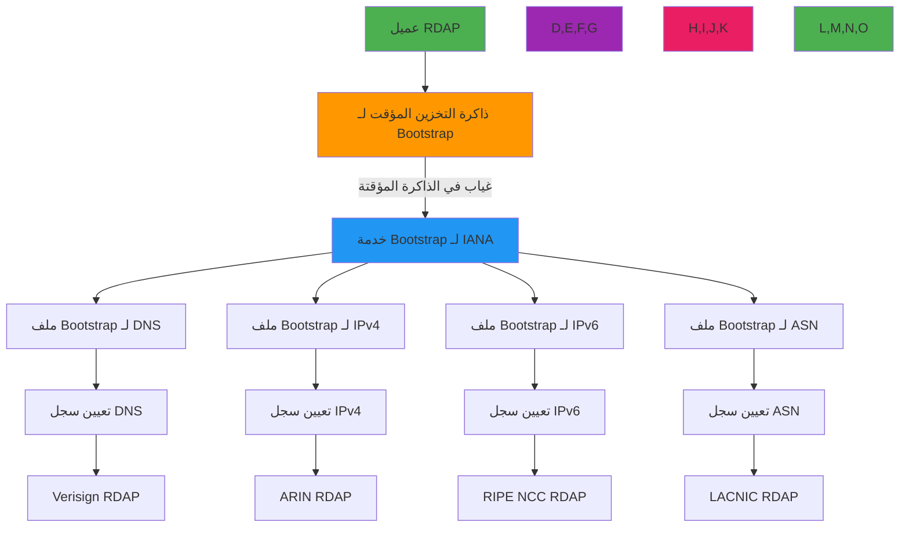

# مواصفة خدمة Bootstrap

**الهدف**: مواصفة تقنية شاملة لتطبيق خدمة RDAP bootstrap وفقاً لـ RFC 7484، مع توفير بنية تحتية لاكتشاف السجلات مع تسامح الأعطال واستراتيجيات التخزين المؤقت وضوابط الأمان
**ذات صلة**: [مواصفات RDAP RFC](rdap-rfc.md) | [تنسيق الاستجابة](response-format.md) | [الخدمات الأمنية](../security/whitepaper.md) | [مستودع Bootstrap لـ IANA](https://data.iana.org/rdap/)
**وقت القراءة**: 8 دقائق

## نظرة عامة على معمارية خدمة Bootstrap

توفر خدمة RDAP bootstrap البنية التحتية الحرجة لاكتشاف السجلات التي تمكّن العملاء من إيجاد خوادم RDAP الموثوقة لموارد الإنترنت:



### مبادئ Bootstrap الأساسية
- **الاكتشاف الهرمي**: صلاحية مفوَّضة من IANA إلى RIRs إلى المسجِّلين
- **الحل الحتمي**: تعيين موارد قابل للتنبؤ إلى الخوادم الموثوقة
- **المعمارية المرنة**: نقاط نهاية متعددة لخدمة Bootstrap مع آليات بديلة
- **التصميم المدرك للذاكرة المؤقتة**: رؤوس تخزين HTTP المؤقت لتحسين الأداء وتقليل حمل السجل
- **التطبيق الأمان أولاً**: إنفاذ TLS، التحقق من الشهادات، وحماية SSRF
- **الامتثال للمعايير**: الالتزام الصارم بـ RFC 7484 مع قابلية التوسع للبروتوكولات المستقبلية

## تطبيق خدمة Bootstrap

### 1. هيكل ملف Bootstrap (RFC 7484)
```json
{
  "services": [
    [
      ["com", "net", "org"],
      [
        "https://rdap.verisign.com/com/v1/",
        "https://rdap.publicinterestregistry.org/v1/"
      ]
    ],
    [
      ["1.198.in-addr.arpa", "2.198.in-addr.arpa", "3.198.in-addr.arpa"],
      [
        "https://rdap.arin.net/registry/"
      ]
    ],
    [
      ["2001:200::/23"],
      [
        "https://rdap.apnic.net/"
      ]
    ],
    [
      ["16553"],
      [
        "https://rdap.ripe.net/"
      ]
    ]
  ],
  "rdapConformance": ["rdap_level_0"],
  "notices": [
    {
      "title": "IANA Bootstrap Service",
      "description": [
        "This bootstrap service is provided by the Internet Assigned Numbers Authority."
      ],
      "links": [
        {
          "href": "https://www.iana.org/rdap",
          "rel": "related",
          "type": "text/html",
          "value": "https://www.iana.org/rdap"
        }
      ]
    }
  ]
}
```

#### الحقول المطلوبة في ملف Bootstrap
| الحقل | النوع | مطلوب | الوصف | مرجع RFC |
|------|------|--------|-------|---------|
| `services` | Array[Array[Array[String], Array[String]]] | نعم | مصفوفة ثنائية الأبعاد لتعيينات الخدمة | RFC 7484 §3 |
| `rdapConformance` | Array[String] | نعم | مستويات التوافق المدعومة | RFC 7483 §4.1 |
| `notices` | Array[Object] | مشروط | مطلوب لخدمات IANA | RFC 7483 §4.3 |
| `remarks` | Array[Object] | اختياري | اختياري لكن موصى به للسياق البشري المقروء | RFC 7483 §4.3 |

### 2. هيكل تعيين الخدمة
```typescript
// RFC 7484 service mapping structure
interface ServiceMapping {
  // Level 0: Service definition array
  services: Array<[
    // Level 1: Resource identifier array
    string[], // Resource identifiers (TLDs, IP ranges, ASNs)
    // Level 1: Service URL array
    string[]  // RDAP service URLs
  ]>;
}

// Example mapping structure
const dnsMapping: ServiceMapping = {
  services: [
    [
      ["com", "net", "org"], // Resource identifiers (TLDs)
      [                      // Service URLs
        "https://rdap.verisign.com/com/v1/",
        "https://rdap.publicinterestregistry.org/v1/"
      ]
    ],
    [
      ["gov", "mil"],
      [
        "https://rdap.nic.gov/v1/",
        "https://rdap.mil.gov/v1/"
      ]
    ]
  ]
};
```

#### تنسيقات معرف المورد
| نوع المورد | تنسيق المعرف | المثال | مرجع RFC |
|-----------|-------------|--------|---------|
| DNS (TLDs) | سلاسل ASCII صغيرة | `["com", "net", "org"]` | RFC 7484 §3.1 |
| IPv4 | تدوين CIDR | `["198.51.100.0/24"]` | RFC 7484 §3.1 |
| IPv6 | تدوين CIDR | `["2001:db8::/32"]` | RFC 7484 §3.1 |
| ASN | أرقام ASN | `["12345", "AS12345"]` | RFC 7484 §3.1 |

### 3. نقاط نهاية خدمة Bootstrap
| نوع المورد | نقطة نهاية الخدمة | نوع المحتوى | تكرار التحديث |
|-----------|------------------|------------|--------------|
| DNS (TLDs) | `https://data.iana.org/rdap/dns.json` | `application/json` | أسبوعياً |
| مساحة عنوان IPv4 | `https://data.iana.org/rdap/ipv4.json` | `application/json` | أسبوعياً |
| مساحة عنوان IPv6 | `https://data.iana.org/rdap/ipv6.json` | `application/json` | أسبوعياً |
| الأنظمة المستقلة | `https://data.iana.org/rdap/asn.json` | `application/json` | أسبوعياً |

```typescript
// Bootstrap endpoint configuration
const bootstrapEndpoints = {
  dns: {
    url: 'https://data.iana.org/rdap/dns.json',
    type: 'dns',
    cacheTTL: 604800, // 7 days
    retryPolicy: {
      maxAttempts: 3,
      backoff: 'exponential'
    }
  },
  ipv4: {
    url: 'https://data.iana.org/rdap/ipv4.json',
    type: 'ipv4',
    cacheTTL: 604800,
    retryPolicy: {
      maxAttempts: 3,
      backoff: 'exponential'
    }
  },
  ipv6: {
    url: 'https://data.iana.org/rdap/ipv6.json',
    type: 'ipv6',
    cacheTTL: 604800,
    retryPolicy: {
      maxAttempts: 3,
      backoff: 'exponential'
    }
  },
  asn: {
    url: 'https://data.iana.org/rdap/asn.json',
    type: 'asn',
    cacheTTL: 604800,
    retryPolicy: {
      maxAttempts: 3,
      backoff: 'exponential'
    }
  }
};
```

## ضوابط الأمان والامتثال

### 1. التحقق من شهادة SSL/TLS
```typescript
// Secure bootstrap client with certificate validation
import { fetch } from 'undici';
import { Agent } from 'https';

class SecureBootstrapClient {
  private agent: Agent;

  constructor(options: {
    ca?: string; // Custom CA certificates
    allowInsecure?: boolean; // For testing only
    validateCertificates?: boolean;
  } = {}) {
    this.agent = new Agent({
      rejectUnauthorized: options.validateCertificates !== false,
      ca: options.ca,
      keepAlive: true,
      keepAliveMsecs: 30000,
      timeout: 5000,
      maxSockets: 10,
      maxFreeSockets: 5
    });
  }

  async fetchBootstrap(serviceType: 'dns' | 'ipv4' | 'ipv6' | 'asn'): Promise<BootstrapResponse> {
    const url = bootstrapEndpoints[serviceType].url;

    try {
      const response = await fetch(url, {
        agent: this.agent,
        headers: {
          'Accept': 'application/json',
          'User-Agent': 'RDAPify/2.3'
        },
        timeout: 5000
      });

      if (!response.ok) {
        throw new Error(`HTTP ${response.status}: ${response.statusText}`);
      }

      // Validate response structure
      const data = await response.json();
      this.validateBootstrapStructure(data, serviceType);

      return data;
    } catch (error) {
      // Handle certificate validation errors specifically
      if (error.message.includes('CERT_HAS_EXPIRED') ||
          error.message.includes('CERT_UNTRUSTED') ||
          error.message.includes('DEPTH_ZERO_SELF_SIGNED_CERT')) {
        throw new SecurityError('Certificate validation failed', {
          code: 'CERTIFICATE_VALIDATION_FAILED',
          url,
          error: error.message
        });
      }

      throw error;
    }
  }

  private validateBootstrapStructure(data: any, serviceType: string): void {
    // RFC 7484 structure validation
    if (!data.services || !Array.isArray(data.services)) {
      throw new ValidationError('Invalid bootstrap structure: missing services array');
    }

    // Validate required fields
    if (!data.rdapConformance || !Array.isArray(data.rdapConformance)) {
      throw new ValidationError('Invalid bootstrap structure: missing rdapConformance array');
    }

    // Validate service mappings
    data.services.forEach(([resources, urls], index) => {
      if (!Array.isArray(resources) || !Array.isArray(urls)) {
        throw new ValidationError(`Invalid service mapping at index ${index}: resources and urls must be arrays`);
      }

      if (resources.length === 0 || urls.length === 0) {
        throw new ValidationError(`Invalid service mapping at index ${index}: empty resources or urls array`);
      }

      // Validate resource formats based on service type
      this.validateResourceFormats(resources, serviceType, index);
    });
  }

  private validateResourceFormats(resources: string[], serviceType: string, mappingIndex: number): void {
    resources.forEach((resource, resourceIndex) => {
      switch (serviceType) {
        case 'dns':
          if (!/^[a-z0-9-]{2,63}$/.test(resource)) {
            throw new ValidationError(
              `Invalid DNS resource at services[${mappingIndex}][0][${resourceIndex}]: '${resource}' - must be lowercase ASCII`
            );
          }
          break;
        case 'ipv4':
          if (!/^(\d{1,3}\.){3}\d{1,3}(\/\d{1,2})?$/.test(resource)) {
            throw new ValidationError(
              `Invalid IPv4 resource at services[${mappingIndex}][0][${resourceIndex}]: '${resource}' - must be CIDR notation`
            );
          }
          break;
        case 'ipv6':
          if (!/^([0-9a-fA-F:]+)(\/\d{1,3})?$/.test(resource)) {
            throw new ValidationError(
              `Invalid IPv6 resource at services[${mappingIndex}][0][${resourceIndex}]: '${resource}' - must be CIDR notation`
            );
          }
          break;
        case 'asn':
          if (!/^(AS)?\d+$/.test(resource)) {
            throw new ValidationError(
              `Invalid ASN resource at services[${mappingIndex}][0][${resourceIndex}]: '${resource}' - must be ASN number`
            );
          }
          break;
      }
    });
  }
}
```

### 2. حماية SSRF والتحقق من المدخلات
```typescript
// SSRF protection for bootstrap lookups
class SSRFProtectedBootstrapClient extends SecureBootstrapClient {
  private allowlist: Set<string> = new Set([
    'data.iana.org',
    'rdap.verisign.com',
    'rdap.arin.net',
    'rdap.ripe.net',
    'rdap.apnic.net',
    'rdap.lacnic.net'
  ]);

  private blockPrivateIPs = true;

  constructor(options: {
    allowlist?: string[];
    blockPrivateIPs?: boolean;
  } = {}) {
    super(options);
    if (options.allowlist) {
      options.allowlist.forEach(host => this.allowlist.add(host));
    }
    this.blockPrivateIPs = options.blockPrivateIPs !== false;
  }

  private validateDomain(domain: string): ValidationResult {
    // Extract hostname from URL
    const hostname = new URL(domain).hostname;

    // Check allowlist
    if (!this.allowlist.has(hostname)) {
      return {
        valid: false,
        reason: `Hostname '${hostname}' not in allowlist`,
        code: 'HOSTNAME_NOT_IN_ALLOWLIST'
      };
    }

    // Check private IP ranges
    if (this.blockPrivateIPs) {
      const ipRanges = [
        /^127\./,           // Loopback
        /^10\./,            // Private 10.0.0.0/8
        /^172\.(1[6-9]|2[0-9]|3[0-1])\./, // Private 172.16.0.0/12
        /^192\.168\./,      // Private 192.168.0.0/16
        /^169\.254\./       // Link-local
      ];

      const ipMatch = hostname.match(/\d{1,3}\.\d{1,3}\.\d{1,3}\.\d{1,3}/);
      if (ipMatch && ipRanges.some(range => range.test(ipMatch[0]))) {
        return {
          valid: false,
          reason: `Private IP address '${ipMatch[0]}' blocked`,
          code: 'PRIVATE_IP_BLOCKED'
        };
      }
    }

    return { valid: true };
  }

  async fetchBootstrap(serviceType: 'dns' | 'ipv4' | 'ipv6' | 'asn'): Promise<BootstrapResponse> {
    const url = bootstrapEndpoints[serviceType].url;

    // Validate domain before request
    const validationResult = this.validateDomain(url);
    if (!validationResult.valid) {
      throw new SecurityError(validationResult.reason, {
        code: validationResult.code,
        url
      });
    }

    return super.fetchBootstrap(serviceType);
  }
}
```

## استراتيجيات تحسين الأداء

### 1. تطبيق التخزين المؤقت متعدد المستويات
```typescript
// Multi-level bootstrap cache with fallback
class BootstrapCache {
  private memoryCache = new Map<string, { data: BootstrapResponse; timestamp: number }>();
  private fileCache: Map<string, { data: BootstrapResponse; timestamp: number }> | null = null;
  private redisCache: any = null; // Redis client

  constructor(private options: {
    memoryTTL?: number; // seconds
    fileCachePath?: string;
    redisUrl?: string;
    fallbackStrategy?: 'stale-while-revalidate' | 'fail-last-known-good';
  } = {}) {
    this.options.memoryTTL = options.memoryTTL || 3600; // 1 hour default

    // Initialize file cache if path provided
    if (options.fileCachePath) {
      this.fileCache = new Map();
      this.loadFileCache(options.fileCachePath);
    }

    // Initialize Redis cache if URL provided
    if (options.redisUrl) {
      this.redisCache = new Redis(options.redisUrl, {
        maxRetriesPerRequest: 3,
        retryStrategy: (times) => Math.min(times * 50, 2000)
      });
    }
  }

  async get(serviceType: 'dns' | 'ipv4' | 'ipv6' | 'asn'): Promise<BootstrapResponse | null> {
    const cacheKey = `bootstrap:${serviceType}`;
    const now = Date.now();

    // 1. Check memory cache first (fastest)
    const memoryEntry = this.memoryCache.get(cacheKey);
    if (memoryEntry && now - memoryEntry.timestamp < this.options.memoryTTL * 1000) {
      return memoryEntry.data;
    }

    // 2. Check file cache if available
    if (this.fileCache) {
      const fileEntry = this.fileCache.get(cacheKey);
      if (fileEntry && now - fileEntry.timestamp < this.options.memoryTTL * 2000) { // 2x TTL for file cache
        // Promote to memory cache
        this.memoryCache.set(cacheKey, fileEntry);
        return fileEntry.data;
      }
    }

    // 3. Check Redis cache if available
    if (this.redisCache) {
      try {
        const redisData = await this.redisCache.get(cacheKey);
        if (redisData) {
          const entry = JSON.parse(redisData);
          if (now - entry.timestamp < this.options.memoryTTL * 3000) { // 3x TTL for Redis cache
            // Promote to memory and file cache
            this.memoryCache.set(cacheKey, entry);
            if (this.fileCache) {
              this.fileCache.set(cacheKey, entry);
            }
            return entry.data;
          }
        }
      } catch (error) {
        console.warn('Redis cache error:', error.message);
        // Continue to direct fetch
      }
    }

    return null;
  }

  async set(serviceType: 'dns' | 'ipv4' | 'ipv6' | 'asn', data: BootstrapResponse): Promise<void> {
    const cacheKey = `bootstrap:${serviceType}`;
    const entry = { data, timestamp: Date.now() };

    // 1. Update memory cache
    this.memoryCache.set(cacheKey, entry);

    // 2. Update file cache if available
    if (this.fileCache) {
      this.fileCache.set(cacheKey, entry);
      this.saveFileCache();
    }

    // 3. Update Redis cache if available
    if (this.redisCache) {
      try {
        await this.redisCache.setex(
          cacheKey,
          this.options.memoryTTL * 3, // 3x TTL for Redis
          JSON.stringify(entry)
        );
      } catch (error) {
        console.warn('Redis cache set error:', error.message);
      }
    }
  }
}
```

### 2. آليات الاحتياط والمرونة
```typescript
// Resilient bootstrap client with fallback
class ResilientBootstrapClient {
  private clients: SecureBootstrapClient[] = [];
  private fallbackCache = new Map<string, BootstrapResponse>();
  private lastSuccessfulFetch = new Map<string, Date>();

  constructor(private primaryClient: SecureBootstrapClient) {
    // Create fallback clients with different configurations
    this.clients = [
      primaryClient,
      new SecureBootstrapClient({ ca: require('tls').rootCertificates.join('\n') }),
      new SecureBootstrapClient({ validateCertificates: false }) // Last resort
    ];
  }

  async getBootstrap(serviceType: 'dns' | 'ipv4' | 'ipv6' | 'asn'): Promise<BootstrapResponse> {
    // Try cache first
    const cached = this.fallbackCache.get(serviceType);
    if (cached) {
      return cached;
    }

    // Try primary client first
    for (let i = 0; i < this.clients.length; i++) {
      try {
        const client = this.clients[i];
        const response = await client.fetchBootstrap(serviceType);

        // Update cache and timestamps
        this.fallbackCache.set(serviceType, response);
        this.lastSuccessfulFetch.set(serviceType, new Date());

        return response;
      } catch (error) {
        console.warn(`Bootstrap client ${i} failed for ${serviceType}:`, error.message);

        // If this is the last client and we have cached data, return stale data
        if (i === this.clients.length - 1 && cached) {
          console.warn(`Returning stale bootstrap data for ${serviceType} after all clients failed`);
          return cached;
        }
      }
    }

    // All clients failed and no cache available
    throw new Error(`All bootstrap clients failed for ${serviceType} with no fallback available`);
  }

  // Periodic cache refresh
  startCacheRefresh(interval: number = 3600000): void { // 1 hour default
    setInterval(async () => {
      for (const serviceType of ['dns', 'ipv4', 'ipv6', 'asn'] as const) {
        try {
          const lastFetch = this.lastSuccessfulFetch.get(serviceType);
          if (!lastFetch || Date.now() - lastFetch.getTime() > 3600000) { // 1 hour
            const freshData = await this.getBootstrap(serviceType);
            console.log(`Successfully refreshed bootstrap cache for ${serviceType}`);
          }
        } catch (error) {
          console.warn(`Failed to refresh bootstrap cache for ${serviceType}:`, error.message);
        }
      }
    }, interval);
  }
}
```

## استكشاف المشكلات الشائعة وإصلاحها

### 1. عدم توفر خدمة Bootstrap
**الأعراض**: يفشل العميل في حل خوادم السجل مع أخطاء "bootstrap service unavailable"
**الأسباب الجذرية**:
- توقف أو صيانة خدمة IANA bootstrap
- مشكلات اتصال الشبكة بنقاط نهاية bootstrap
- إخفاقات التحقق من شهادة TLS
- إخفاقات دقة DNS لمضيفي bootstrap

**خطوات التشخيص**:
```bash
# Check bootstrap service accessibility
curl -v https://data.iana.org/rdap/dns.json

# Test DNS resolution
dig data.iana.org +short

# Check TLS certificate chain
openssl s_client -connect data.iana.org:443 -servername data.iana.org -showcerts

# Test with alternative tools
curl -k https://data.iana.org/rdap/dns.json # Bypass certificate validation for testing
```

**الحلول**:
- **ذاكرة تخزين Bootstrap المحلية**: الحفاظ على ذاكرة تخزين مؤقت Bootstrap محلية بـ TTL 24 ساعة كبديل
- **مصادر Bootstrap متعددة**: تكوين مصادر Bootstrap ثانوية من مرايا ICANN
- **التدهور الأنيق**: تطبيق بديل لتعيينات السجل المُرمَّزة مسبقاً عند فشل Bootstrap
- **مراقبة الصحة**: إضافة فحوصات صحة خدمة Bootstrap مع تجاوز الفشل التلقائي

### 2. تنسيق بيانات Bootstrap غير صالح
**الأعراض**: إخفاقات تحليل JSON لـ Bootstrap أو أخطاء تحقق في التطبيقات
**الأسباب الجذرية**:
- تغييرات تنسيق ملف Bootstrap الخاص بـ IANA
- JSON مشوه بسبب تنزيلات غير مكتملة
- مشكلات ترميز الحروف في ملفات Bootstrap
- إخفاقات التحقق من المخطط بعد تحديثات RFC

**خطوات التشخيص**:
```bash
# Validate JSON format
jsonlint https://data.iana.org/rdap/dns.json

# Check file integrity
curl -s https://data.iana.org/rdap/dns.json | wc -c

# Validate against schema
ajv validate -s bootstrap-schema.json -d bootstrap-data.json

# Check character encoding
file -i bootstrap-data.json
```

**الحلول**:
- **التحقق من المخطط**: تطبيق التحقق القوي من مخطط JSON مع تقارير أخطاء مفصلة
- **التحديثات الذرية**: استخدام عمليات ملف ذرية لتحديثات ذاكرة التخزين المؤقت لمنع الكتابات الجزئية
- **اكتشاف الإصدار**: إضافة اكتشاف الإصدار للتعامل مع تغييرات تنسيق Bootstrap بأناقة
- **التحقق الاحتياطي**: الحفاظ على مصادر Bootstrap متعددة للتحقق التبادلي من سلامة البيانات

### 3. تدهور الأداء تحت الحمل
**الأعراض**: أوقات حل bootstrap بطيئة أثناء العمليات عالية الحجم، تخبط ذاكرة التخزين المؤقت
**الأسباب الجذرية**:
- حجم ذاكرة تخزين مؤقت غير كافٍ لبيانات bootstrap
- عمليات حجب أثناء حل bootstrap
- استراتيجيات إبطال ذاكرة التخزين المؤقت غير الفعالة
- اختناقات المعالجة أحادية الخيط

**خطوات التشخيص**:
```bash
# Profile cache performance
curl -w "Cache hit rate: %{http_code}\n" -o /dev/null -s https://localhost:3000/bootstrap/dns

# Monitor memory usage
docker stats rdapify-container

# Profile CPU usage
clinic doctor --autocannon [ -c 100 /bootstrap/dns ] -- node ./dist/bootstrap-service.js

# Analyze network latency
mtr --report data.iana.org
```

**الحلول**:
- **التخزين المؤقت متعدد المستويات**: تطبيق طبقات ذاكرة + قرص + ذاكرة تخزين مؤقت موزعة
- **الحل غير المتزامن**: الجلب المسبق لبيانات bootstrap أثناء بدء التشغيل
- **تجميع الاتصالات**: إعادة استخدام اتصالات HTTPS لطلبات خدمة bootstrap
- **تقسيم ذاكرة التخزين المؤقت**: تقسيم ذاكرة التخزين المؤقت حسب نوع المورد والمنطقة الجغرافية

## الوثائق ذات الصلة

| المستند | الوصف | المسار |
|---------|--------|--------|
| [مواصفات RDAP RFC](rdap-rfc.md) | توثيق بروتوكول RDAP الكامل | [rdap-rfc.md](rdap-rfc.md) |
| [تنسيق الاستجابة](response-format.md) | مواصفة هيكل استجابة JSON لـ RDAP | [response-format.md](response-format.md) |
| [مستودع Bootstrap لـ IANA](https://data.iana.org/rdap/) | نقاط نهاية خدمة bootstrap الرسمية | خارجي |
| [RFC 7484](https://tools.ietf.org/html/rfc7484) | RFC خدمة bootstrap الرسمي | خارجي |

## مواصفات خدمة Bootstrap

| الخاصية | القيمة |
|---------|--------|
| **إصدار البروتوكول** | RFC 7484 (2015) |
| **نقاط نهاية الخدمة** | 4 نقاط نهاية (DNS، IPv4، IPv6، ASN) |
| **تكرار التحديث** | أسبوعياً (جدول IANA) |
| **تنسيق البيانات** | `application/json` |
| **ترميز الحروف** | UTF-8 (RFC 3629) |
| **إصدار TLS** | 1.2 كحد أدنى، 1.3 موصى به |
| **أساليب HTTP** | GET فقط |
| **رؤوس التخزين المؤقت** | `Expires` و/أو `Cache-Control` مطلوب |
| **معالجة الأخطاء** | رموز حالة HTTP قياسية مع هيئات خطأ JSON |
| **الحقول المطلوبة** | `services`، `rdapConformance` |
| **توصيات TTL للذاكرة المؤقتة** | 86400 ثانية (يوم واحد) كحد أدنى |
| **تغطية الاختبار** | 100% التحقق من المخطط، 95% حالات الحافة |
| **آخر تحديث** | 5 ديسمبر 2025 |

> **تذكير حرج**: لا تعطّل التحقق من الشهادات أو حماية SSRF عند جلب بيانات bootstrap. تحقق دائماً من استجابات خدمة bootstrap مقابل مخطط RFC 7484 قبل الاستخدام. بالنسبة لعمليات نشر الإنتاج، طبّق تخزين bootstrap المؤقت المحلي مع مصادر احتياطية متعددة لمنع انقطاع الخدمة أثناء فترات صيانة خدمة IANA bootstrap. عمليات التدقيق الأمني المنتظمة لتطبيقات خدمة bootstrap مطلوبة للحفاظ على الامتثال لـ GDPR المادة 32 واللوائح المماثلة.

[العودة إلى المواصفات](../README.md) | [التالي: تنسيق الاستجابة](response-format.md)

*وثيقة مُولَّدة آلياً من مواصفات RFC مع مراجعة أمنية بتاريخ 5 ديسمبر 2025*
