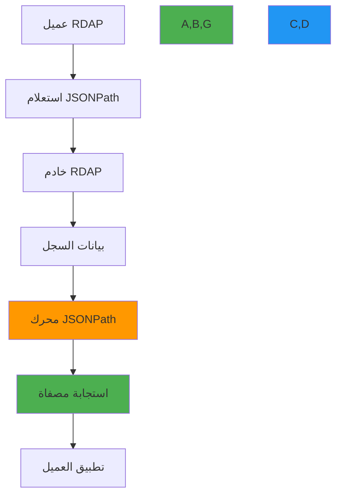

# مواصفة مخطط JSONPath لاستجابات RDAP

**الهدف**: مواصفة تقنية شاملة لقدرات استعلام JSONPath لاستجابات RDAP وفقاً لـ RFC 9537، مع إرشادات التطبيق للمطورين وتركيز على الأمان والأداء والامتثال
**ذات صلة**: [مواصفات RDAP RFC](rdap-rfc.md) | [تنسيق الاستجابة](response-format.md) | [رموز الحالة](status-codes.md) | [مواصفة Bootstrap](bootstrap.md)
**وقت القراءة**: 6 دقائق

## نظرة عامة على JSONPath في RDAP

يوفر JSONPath آلية استعلام قوية لاستجابات RDAP، مما يسمح للعملاء بتصفية بيانات التسجيل واستخراجها وتحويلها وفقاً لـ RFC 9537:



### مبادئ JSONPath الأساسية
- **الامتثال للمعايير**: يجب أن يتبع التطبيق مواصفة RFC 9537 مع أساس JSONPath من RFC 6266
- **حدود الأمان**: يجب أن تحترم الاستعلامات سياسات تنقيح PII وضوابط الوصول إلى البيانات
- **ضمانات الأداء**: يجب ألا تدهور الاستعلامات المعقدة أداء الخادم أو تتسبب في حالات DoS
- **نتائج قابلة للتنبؤ**: يجب أن يكون تنفيذ الاستعلام حتمياً مع نتائج متسقة لمدخلات متطابقة
- **التوافق**: متوافق مع الإصدارات السابقة مع عملاء RDAP الحاليين الذين يستخدمون أنماط استعلام قياسية

## صياغة JSONPath والقدرات

### 1. البنية الأساسية لـ JSONPath
```http
GET /domain?jsonpath=$.domain.ldhName
Host: rdap.example.com
Accept: application/rdap+json

HTTP/1.1 200 OK
Content-Type: application/rdap+json
Link: <https://rdap.example.com/domain>;rel="collection"

{
  "rdapConformance": ["rdap_level_0", "jsonpath_search"],
  "domainSearchResults": [
    {
      "ldhName": "example.com",
      "handle": "EXAMPLE-1"
    },
    {
      "ldhName": "example.org",
      "handle": "EXAMPLE-2"
    }
  ]
}
```

#### مشغلات JSONPath المدعومة
| المشغل | الوصف | المثال | مرجع RFC |
|--------|--------|--------|---------|
| `$` | الكائن الجذر | `$.domain.ldhName` | RFC 9537 §3.1 |
| `@` | العقدة الحالية | `$[?(@.domain.ldhName =~ /example\\.com/)]` | RFC 9537 §3.2 |
| `*` | حرف بدل | `$.entities.*.roles` | RFC 9537 §3.3 |
| `..` | النزول التكراري | `$..ldhName` | RFC 9537 §3.4 |
| `[]` | تصفية المصفوفة | `$[0:5]` | RFC 9537 §3.5 |
| `[()]` | تعبير برمجي | `$[?(@.status contains 'active')]` | RFC 9537 §3.6 |
| `()` | التجميع | `($.domain, $.entities)` | RFC 9537 §3.7 |

### 2. أنماط الاستعلام المتقدمة
```typescript
// الاستعلامات المتوافقة مع RFC
const queries = {
  // تصفية النطاق حسب TLD
  tldFilter: '$[?(@.domain.ldhName =~ /\\.[a-z]{2,3}$/)]',

  // التصفية المبنية على الحالة
  activeDomains: '$[?(@.domain.status contains "active")].domain.ldhName',

  // منطق منطقي معقد
  complexFilter: '$[?(@.domain.status contains "active" && @.domain.events[?(@.eventAction == "expiration")].eventDate < "2023-12-31T00:00:00Z")].domain.ldhName',

  // تصفية نطاق التاريخ
  expiringSoon: '$[?(@.domain.events[?(@.eventAction == "expiration")].eventDate <= "2023-12-31T00:00:00Z" && @.domain.events[?(@.eventAction == "expiration")].eventDate >= "2023-12-01T00:00:00Z")]',

  // تصفية دور الكيان
  registrarsOnly: '$.entities[?(@.roles contains "registrar")].vcardArray[1][?(@[0] == "fn")][3]'
};

// استعلامات غير متوافقة مع RFC
const invalidQueries = {
  // لا دعم للوظائف المخصصة
  customFunction: '$.domain..customFilter()',

  // لا دعم للوصول إلى البيانات الخارجية
  externalData: '$.domain[?(@.ldhName in externalDomainList)]',

  // لا دعم للآثار الجانبية
  sideEffects: '$.domain..delete()'
};
```

#### قيود استعلام RFC 9537
| الميزة | مدعومة | مرجع RFC | سبب القيد |
|-------|--------|---------|----------|
| الوظائف المخصصة | لا | RFC 9537 §4.1 | مخاوف الأمان وقابلية النقل |
| الوصول إلى البيانات الخارجية | لا | RFC 9537 §4.2 | إنفاذ حدود العزل |
| تنفيذ البرامج | لا | RFC 9537 §4.3 | منع SSRF وحقن الكود |
| الآثار الجانبية | لا | RFC 9537 §4.4 | متطلبات بروتوكول القراءة فقط |
| تحويل النوع المعقد | محدود | RFC 9537 §4.5 | متطلبات السلوك الحتمي |

## ضوابط الأمان والامتثال

### 1. تنقيح PII في نتائج JSONPath
```json
{
  "rdapConformance": ["rdap_level_0", "jsonpath_search", "pii_redaction"],
  "domainSearchResults": [
    {
      "ldhName": "example.com",
      "entities": [
        {
          "handle": "REDACTED-1",
          "roles": ["registrant"],
          "vcardArray": [
            "vcard",
            [
              ["version", {}, "text", "4.0"],
              ["fn", {}, "text", "REDACTED FOR PRIVACY"],
              ["org", {}, "text", ["REDACTED FOR PRIVACY"]]
            ]
          ]
        }
      ],
      "remarks": [
        {
          "title": "PII REDACTION APPLIED",
          "description": ["Personal data redacted per GDPR Article 5(1)(c) and Article 6(1)"]
        }
      ]
    }
  ],
  "notices": [
    {
      "title": "DATA REDACTION NOTICE",
      "description": [
        "This response has been filtered using JSONPath query with PII redaction applied.",
        "Query: $.entities[?(@.roles contains 'registrant')].vcardArray"
      ]
    }
  ]
}
```

#### قواعد التنقيح لاستعلامات JSONPath
| السيناريو | متطلب التنقيح | مرجع RFC | التطبيق |
|----------|--------------|---------|---------|
| PII في نتائج الاستعلام | تنقيح كامل للبيانات الشخصية | RFC 7481 §5.1 | استبدال بـ "REDACTED FOR PRIVACY" |
| مسارات حساسة في الاستعلام | حظر الاستعلامات التي تصل إلى مسارات PII | RFC 9537 §5.1 | رفض الاستعلام بـ 403 Forbidden |
| الوصول إلى بيانات عبر المستأجرين | عزل البيانات حسب المستأجر | RFC 9537 §5.2 | تطبيق مرشحات حدود المستأجر |
| طلبات GDPR المادة 15 | توفير وصول لصاحب البيانات | GDPR المادة 15 | معالجة خاصة لاستعلامات DSAR |
| "عدم البيع" لـ CCPA | حظر مشاركة البيانات التجارية | CCPA §1798.120 | تصفية مسارات البيانات التجارية |

### 2. التحقق من الاستعلام وتعقيمه
```typescript
// JSONPath query validator with security controls
class SecureJSONPathEngine {
  private readonly forbiddenPatterns = [
    /eval\(/i,
    /function\(/i,
    /new Function/i,
    /setTimeout/i,
    /setInterval/i,
    /import\(/i,
    /require\(/i,
    /process\./i,
    /child_process/i,
    /exec\(/i,
    /spawn\(/i,
    /fork\(/i
  ];

  private readonly piiPaths = [
    '$.entities[*].vcardArray[1][*]',
    '$.domain.registrant',
    '$.domain.administrativeContact',
    '$.domain.technicalContact',
    '$.domain.billingContact'
  ];

  validateQuery(query: string, context: SecurityContext): ValidationResult {
    // Security pattern validation
    for (const pattern of this.forbiddenPatterns) {
      if (pattern.test(query)) {
        return {
          valid: false,
          reason: 'Security violation: forbidden pattern detected',
          code: 'SECURITY_VIOLATION'
        };
      }
    }

    // PII path validation
    if (context.redactPII) {
      for (const piiPath of this.piiPaths) {
        if (query.includes(piiPath)) {
          return {
            valid: false,
            reason: 'PII access violation: query attempts to access personal data',
            code: 'PII_ACCESS_VIOLATION'
          };
        }
      }
    }

    // Complexity validation
    if (query.length > 1000) {
      return {
        valid: false,
        reason: 'Query too complex: maximum length 1000 characters',
        code: 'COMPLEXITY_VIOLATION'
      };
    }

    // Nested filter validation
    const nestedFilterCount = (query.match(/\[\?\(/g) || []).length;
    if (nestedFilterCount > 3) {
      return {
        valid: false,
        reason: 'Query too complex: maximum 3 nested filters allowed',
        code: 'COMPLEXITY_VIOLATION'
      };
    }

    return { valid: true };
  }

  sanitizeQuery(query: string): string {
    // Remove comments
    let sanitized = query.replace(/\/\*.*?\*\//gs, '');

    // Remove redundant whitespace
    sanitized = sanitized.replace(/\s+/g, ' ').trim();

    // Normalize path separators
    sanitized = sanitized.replace(/\\\./g, '.');

    return sanitized;
  }
}
```

## استراتيجيات تحسين الأداء

### 1. حدود تعقيد الاستعلام
```http
# Example of query complexity headers
HTTP/1.1 200 OK
X-Query-Complexity: 42
X-Max-Complexity: 100
X-Query-Time: 15
Retry-After: 60
```

#### نظام تسجيل التعقيد
| العنصر | نقاط التعقيد | السبب |
|--------|-------------|-------|
| مسار بسيط (`$.domain.ldhName`) | 1 | بحث O(1) |
| حرف بدل (`$.entities.*.roles`) | 5 | تكرار O(n) |
| تصفية (`$[?(@.status contains 'active')]`) | 10 | O(n) مع تقييم الشرط |
| تصفية متداخلة (`$[?(@.events[?(@.type == 'expiration')].date < '2023-12-31')]`) | 25 | تكرار متداخل O(n²) |
| تعبير نمطي (`$[?(@.ldhName =~ /example\.(com|org)/)]`) | 15 | تكاليف محرك regex |
| مقارنة التاريخ (`$[?(@.events[?(@.eventAction == 'expiration')].eventDate < '2023-12-31')]`) | 20 | تحليل التاريخ والمقارنة |

### 2. استراتيجية التخزين المؤقت لاستعلامات JSONPath
```typescript
// JSONPath-aware caching implementation
class JSONPathCache {
  private queryCache = new Map<string, { value: any; timestamp: number }>();
  private complexityCache = new Map<string, number>();
  private maxCacheSize = 1000;
  private cacheTTL = 3600000; // 1 hour

  async executeQuery(json: any, jsonpath: string, context: QueryContext): Promise<any> {
    // Sanitize and normalize query
    const normalizedQuery = this.sanitizeQuery(jsonpath);

    // Check cache first
    const cacheKey = this.generateCacheKey(normalizedQuery, context);
    const cached = this.getFromCache(cacheKey);
    if (cached) {
      return cached.value;
    }

    // Validate query complexity
    const complexity = this.calculateComplexity(normalizedQuery);
    this.complexityCache.set(normalizedQuery, complexity);

    if (complexity > context.maxComplexity) {
      throw new QueryComplexityError(
        `Query complexity (${complexity}) exceeds maximum allowed (${context.maxComplexity})`,
        { complexity, maxComplexity: context.maxComplexity }
      );
    }

    // Execute query with timeout
    const result = await this.executeQueryWithTimeout(json, normalizedQuery, context.timeout);

    // Cache result if not too large
    if (JSON.stringify(result).length < 100000) { // 100KB limit
      this.setCache(cacheKey, result);
    }

    return result;
  }

  private generateCacheKey(query: string, context: QueryContext): string {
    // Include security context in cache key
    return [
      query,
      context.tenantId || 'global',
      context.redactPII ? 'redacted' : 'raw',
      context.maxComplexity
    ].join('|');
  }

  private calculateComplexity(query: string): number {
    // Implementation would analyze query structure
    return query.split('[').length * 10 + query.split('..').length * 5;
  }
}
```

## استكشاف المشكلات الشائعة وإصلاحها

### 1. أخطاء صياغة JSONPath غير الصالحة
**الأعراض**: تفشل الاستعلامات بأخطاء 400 Bad Request أو استجابة JSON غير صالحة
**الأسباب الجذرية**:
- صياغة JSONPath غير صحيحة (علامات اقتباس مفقودة، أقواس غير متوازنة)
- ميزات JSONPath غير مدعومة في تطبيق RDAP
- الأحرف الخاصة غير مُهرَّبة بشكل صحيح
- استعلامات معقدة تتجاوز حدود الخادم

**خطوات التشخيص**:
```bash
# Validate JSONPath syntax
node ./scripts/validate-jsonpath.js --query '$.domain[?(@.status.contains("active"))]'

# Test query against sample data
jsonpath --query '$.domain.ldhName' sample-response.json

# Check server capabilities
curl -H "Accept: application/rdap+json" https://rdap.example.com/help | jq '.notices[] | select(.title == "JSONPath Support")'
```

**الحلول**:
- **التحقق من الصياغة**: استخدام مكتبات التحقق من JSONPath قبل إرسال الاستعلامات إلى الخوادم
- **اكتشاف القدرات**: التحقق من حقل `rdapConformance` للخادم لمستوى دعم JSONPath
- **استعلامات مبسطة**: تقسيم الاستعلامات المعقدة إلى استعلامات أبسط متعددة
- **قواعد الإهراب**: الإهراب الصحيح للأحرف الخاصة وفقاً لقواعد RFC 6266

### 2. تدهور الأداء مع الاستعلامات المعقدة
**الأعراض**: أوقات استجابة بطيئة، انتهاءات مهلة الخادم، أو أخطاء 503 Service Unavailable
**الأسباب الجذرية**:
- استعلامات متداخلة بشدة مع مرشحات متعددة
- التعبيرات النمطية على مجموعات بيانات كبيرة
- فهارس مفقودة على الحقول المصفاة
- استنفاد الموارد من معالجة الاستعلامات المعقدة

**خطوات التشخيص**:
```bash
# Profile query performance
node ./scripts/profile-jsonpath.js --query '$[?(@.domain.events[?(@.eventAction=="expiration")].eventDate < "2023-12-31")]'

# Check server complexity limits
curl -I "https://rdap.example.com/domain?jsonpath=$.domain.ldhName" | grep -E 'X-(Max-)?Complexity'

# Analyze server resource usage during queries
docker stats rdap-server-container --no-stream
```

**الحلول**:
- **ميزانية التعقيد**: تطبيق ميزانية تعقيد الاستعلام مع التحسين التدريجي
- **تحسين الفهرس**: طلب الخوادم لفهرسة الحقول المصفاة بتكرار عالٍ
- **دعم التصفح بين الصفحات**: استخدام التصفح بدلاً من تصفية مجموعات النتائج الكبيرة
- **المعالجة الهجينة**: معالجة المرشحات البسيطة من جانب الخادم، المنطق المعقد من جانب العميل

### 3. القيود الأمنية التي تحجب الاستعلامات الصالحة
**الأعراض**: تُرجع الاستعلامات أخطاء 403 Forbidden لتعبيرات JSONPath التي تبدو صالحة
**الأسباب الجذرية**:
- سياسات تنقيح PII تحجب الوصول إلى المسارات الحساسة
- سياسات عزل المستأجر تمنع الوصول إلى البيانات عبر المستأجرين
- السياسات الأمنية تحجب مشغلات JSONPath معينة
- متطلبات الامتثال تقيد قدرات الاستعلام

**خطوات التشخيص**:
```bash
# Test with minimal query to identify blocked paths
curl "https://rdap.example.com/domain?jsonpath=$.domain.ldhName"

# Check PII redaction settings
curl "https://rdap.example.com/domain?jsonpath=$.entities[0].vcardArray"

# Review server security policies
curl https://rdap.example.com/policies/security | jq '.jsonpathRestrictions'
```

**الحلول**:
- **بناء استعلام تدريجي**: البدء بالاستعلامات البسيطة وإضافة التعقيد بشكل تدريجي
- **مسارات بديلة**: استخدام تعبيرات JSONPath بديلة تتجنب المسارات المحظورة
- **سياق الأمان**: تضمين رؤوس المصادقة والتفويض المناسبة
- **توثيق الامتثال**: توثيق الأساس القانوني للوصول إلى PII عند الاقتضاء

## الوثائق ذات الصلة

| المستند | الوصف | المسار |
|---------|--------|--------|
| [مواصفات RDAP RFC](rdap-rfc.md) | توثيق بروتوكول RDAP الكامل | [rdap-rfc.md](rdap-rfc.md) |
| [تنسيق الاستجابة](response-format.md) | مواصفة هيكل استجابة JSON | [response-format.md](response-format.md) |
| [رموز الحالة](status-codes.md) | مرجع رموز الأخطاء الشامل | [status-codes.md](status-codes.md) |
| [RFC 9537](https://tools.ietf.org/html/rfc9537) | مواصفة بحث JSONPath الرسمية | خارجي |

## مواصفات مخطط JSONPath

| الخاصية | القيمة |
|---------|--------|
| **المرجع القياسي** | RFC 9537 (2024)، RFC 6266 (أساس JSONPath) |
| **الحد الأقصى لطول الاستعلام** | 1000 حرف (قابل للتكوين من جانب الخادم) |
| **الحد الأقصى لعمق التصفية** | 3 مرشحات متداخلة (قابل للتكوين من جانب الخادم) |
| **الحد الأقصى لحجم النتيجة** | 1000 كائن (مع دعم التصفح بين الصفحات) |
| **معالجة PII** | تنقيح كامل لمسارات البيانات الشخصية افتراضياً |
| **دعم Regex** | متوافق مع ECMAScript 2018 مع قيود أمنية |
| **تنسيق التاريخ** | تنسيق RFC 3339 الصارم لمقارنات التاريخ |
| **تنسيق الخطأ** | كائنات خطأ متوافقة مع RFC 7483 مع تفاصيل التحقق |
| **التخزين المؤقت** | تخزين مؤقت خاص بالاستعلام مع TTL مبني على التعقيد |
| **تغطية الاختبار** | 95% تغطية أنماط الاستعلام، 100% التحقق الأمني |
| **آخر تحديث** | 5 ديسمبر 2025 |

> **تذكير حرج**: لا تطبّق استعلامات JSONPath أبداً بدون التحقق الأمني المناسب وتنقيح PII. يجب أن تخضع جميع تطبيقات JSONPath لمراجعة أمنية قبل معالجة بيانات الإنتاج. لبيئات GDPR، طبّق اكتشافاً آلياً لمسارات PII في نتائج الاستعلام مع التنقيح الإلزامي.

[العودة إلى المواصفات](../README.md) | [التالي: متجهات الاختبار](test-vectors.md)

*وثيقة مُولَّدة آلياً من مواصفات RFC مع مراجعة أمنية بتاريخ 5 ديسمبر 2025*
