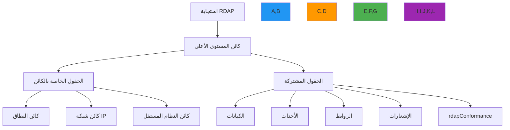

# مواصفة تنسيق استجابة RDAP

**الهدف**: مواصفة تقنية شاملة لتنسيق استجابة JSON لبروتوكول الوصول إلى بيانات التسجيل (RDAP) وفقاً لـ RFC 7483 مع تعريفات حقول مفصلة وقواعد التحقق واعتبارات الأمان
**ذات صلة**: [مواصفات RDAP RFC](rdap-rfc.md) | [دليل أسلوب RFC](rfc-style-spec.md) | [مواصفة Bootstrap](bootstrap.md) | [رموز الحالة](status-codes.md)
**وقت القراءة**: 7 دقائق

## نظرة عامة على تنسيق الاستجابة

يجب أن تتوافق استجابات RDAP مع هيكل JSON صارم محدد في RFC 7483، مما يوفر بيانات تسجيل مطبَّعة عبر جميع أنواع السجلات مع تسمية حقول وأنواع بيانات متسقة:



### مبادئ الاستجابة الأساسية
- **مخطط متسق**: نفس أسماء الحقول وأنواعها عبر جميع تطبيقات السجل
- **متوافق مع الإصدارات السابقة**: يمكن إضافة حقول جديدة دون كسر العملاء الحاليين
- **جاهز للتدويل**: دعم Unicode كامل مع ترميز مناسب
- **مدرك للأمان**: ضوابط تنقيح PII مبنية في هيكل الاستجابة
- **قابل للقراءة الآلية**: متوافق مع JSONPath مع مسارات حقول موحدة
- **قابل للفهم البشري**: أسماء حقول واضحة وتوثيق في قسم الإشعارات

## هيكل الاستجابة الأساسي

### 1. متطلبات كائن المستوى الأعلى
```json
{
  "rdapConformance": ["rdap_level_0", "cidr0"],
  "notices": [
    {
      "title": "TOS",
      "description": ["Terms of Service available at https://example.com/tos"],
      "links": [
        {
          "value": "https://example.com/tos",
          "rel": "terms-of-service",
          "href": "https://example.com/tos",
          "type": "text/html"
        }
      ]
    }
  ],
  "domain": {
    "handle": "EXAMPLE-1",
    "ldhName": "example.com",
    "unicodeName": "example.com",
    "status": ["active"],
    "entities": [
      {
        "handle": "REGISTRAR-1",
        "roles": ["registrar"],
        "vcardArray": ["vcard", [["version", {}, "text", "4.0"]]]
      }
    ],
    "nameservers": [
      {
        "ldhName": "ns1.example.com",
        "unicodeName": "ns1.example.com"
      }
    ],
    "events": [
      {
        "eventAction": "registration",
        "eventDate": "2023-05-15T14:30:00Z"
      }
    ],
    "links": [
      {
        "value": "https://rdap.example.com/domain/example.com",
        "rel": "self",
        "href": "https://rdap.example.com/domain/example.com",
        "type": "application/rdap+json"
      }
    ]
  }
}
```

#### الحقول المطلوبة على المستوى الأعلى
| الحقل | النوع | مطلوب | مرجع RFC | مثال على القيم |
|------|------|--------|---------|---------------|
| `rdapConformance` | Array[String] | نعم | RFC 7483 §4.1 | `["rdap_level_0", "cidr0"]` |
| `notices` | Array[Object] | مشروط* | RFC 7483 §4.3 | إشعارات شروط الخدمة |
| `domain`/`ip`/`autnum` | Object | نعم** | RFC 7483 §4.4 | هيكل كائن النطاق |
| `entities` | Array[Object] | مشروط*** | RFC 7483 §4.6 | مصفوفة معلومات الاتصال |
| `links` | Array[Object] | نعم | RFC 7483 §4.2 | روابط ذاتية المرجع |

*مطلوب إذا كانت هناك سياسة سارية
**يجب أن يكون أحد `domain` أو `ip` أو `autnum` موجوداً بالضبط
***مطلوب إذا كان الكائن لديه جهات اتصال مرتبطة

### 2. متطلبات تسمية الحقول وأنواع البيانات
```typescript
// الهيكل المتوافق مع RFC
interface RDAPResponse {
  // Required fields
  rdapConformance: string[];           // Array of conformance levels
  domain?: DomainObject;               // One of domain, ip, or autnum
  ip?: IPOBJECT;                       // One of domain, ip, or autnum
  autnum?: ASObject;                   // One of domain, ip, or autnum

  // Common optional fields
  entities?: EntityObject[];           // Array of contacts
  notices?: NoticeObject[];            // Legal and policy notices
  remarks?: RemarkObject[];            // Additional information
  links?: LinkObject[];                // Related resources
}

// الهيكل غير المتوافق مع RFC
interface InvalidResponse {
  conformance: string;                 // Should be array
  domainInfo: any;                     // Should be domain
  contacts: any;                       // Should be entities
  tosNotice: string;                   // Should be in notices array
  selfLink: string;                    // Should be in links array
}
```

#### اتفاقيات أسماء الحقول القياسية لـ RFC
| الاتفاقية | المتطلب | المثال | مثال غير صالح |
|---------|---------|--------|--------------|
| **أسماء الحقول** | camelCase للمصطلحات المركبة | `eventAction`، `ldhName` | `eventaction`، `event_action` |
| **قيم المصفوفات** | دائماً مصفوفات حتى للقيم المفردة | `"status": ["active"]` | `"status": "active"` |
| **قيم Null** | حذف الحقول بدلاً من استخدام null | حذف الحقل المفقود | `"nameservers": null` |
| **القيم المنطقية** | فقط true/false | `"secureDNS": true` | `"secureDNS": "enabled"` |
| **الأرقام** | بدون أصفار بادئة، بدون فواصل | `12345` لـ ASN | `012345`، `"12,345"` |

## ضوابط الأمان والخصوصية

### 1. متطلبات تنقيح PII
```json
{
  "entities": [
    {
      "handle": "REDACTED-1",
      "roles": ["registrant"],
      "vcardArray": [
        "vcard",
        [
          ["version", {}, "text", "4.0"],
          ["fn", {}, "text", "REDACTED FOR PRIVACY"],
          ["org", {}, "text", ["REDACTED FOR PRIVACY"]],
          ["adr", {}, "text", ["", "", "REDACTED FOR PRIVACY", "REDACTED FOR PRIVACY", "REDACTED FOR PRIVACY", "REDACTED FOR PRIVACY", "REDACTED FOR PRIVACY"]],
          ["email", {}, "text", "Please query the RDDS service of the Registrar of Record"]
        ]
      ],
      "remarks": [
        {
          "title": "REDACTED FOR PRIVACY",
          "description": [
            "Data redacted per applicable privacy laws and regulations.",
            "For information on how to contact the Registrant, please query the RDDS service of the Registrar of Record."
          ]
        }
      ]
    }
  ]
}
```

#### أنماط التنقيح المطلوبة
| نوع الحقل | متطلب التنقيح | مرجع RFC | المثال |
|---------|--------------|---------|--------|
| `fn` (الاسم الكامل) | استبدال بـ "REDACTED FOR PRIVACY" | RFC 7481 §5.1 | `"REDACTED FOR PRIVACY"` |
| `org` (المؤسسة) | استبدال بـ "REDACTED FOR PRIVACY" | RFC 7481 §5.1 | `["REDACTED FOR PRIVACY"]` |
| `adr` (العنوان) | استبدال جميع المكونات بـ "REDACTED FOR PRIVACY" | RFC 7481 §5.1 | `[ "", "", "REDACTED FOR PRIVACY", ... ]` |
| `tel` (الهاتف) | تنقيح كل شيء ما عدا رمز البلد | RFC 7481 §5.1 | `"+1.555.REDACTED"` |
| `email` | استبدال بنص إشعار الخصوصية | RFC 7481 §5.1 | `"Please query the RDDS service of the Registrar of Record"` |
| `remarks` | إضافة إشعار التنقيح مع الأساس القانوني | RFC 7481 §5.1 | قالب إشعار خصوصية قياسي |

### 2. متطلبات البيانات الوصفية الأمنية
```json
{
  "notices": [
    {
      "title": "DATA REDACTION",
      "description": [
        "Personal data has been redacted in compliance with GDPR Article 5(1)(c) and Article 6(1).",
        "Data controller: Example Registrar Inc.",
        "DPO contact: dpo@example-registrar.com"
      ],
      "links": [
        {
          "href": "https://example-registrar.com/dpa",
          "rel": "data-processing-agreement",
          "type": "application/pdf",
          "value": "https://example-registrar.com/dpa"
        }
      ]
    }
  ],
  "remarks": [
    {
      "title": "SECURITY CONTEXT",
      "description": [
        "This response contains security-sensitive information subject to confidentiality obligations.",
        "Query timestamp: 2023-05-15T14:30:00Z",
        "Client IP: 192.0.2.1 (anonymized)"
      ]
    }
  ]
}
```

#### الحقول الأمنية المطلوبة
| الحقل | المتطلب | مرجع RFC | الغرض |
|------|---------|---------|-------|
| `notices[].title` | يجب أن يشير إلى نوع التنقيح | RFC 7483 §4.3 | الشفافية القانونية |
| `notices[].description` | يجب أن يتضمن الأساس القانوني للمعالجة | GDPR المادة 6 | توثيق الامتثال |
| `remarks[].title` | يجب أن يشير إلى السياق الأمني | RFC 7483 §4.3 | الوعي الأمني |
| `remarks[].description` | يجب أن يتضمن بيانات الاستعلام الوصفية | RFC 7483 §4.3 | دعم مسار التدقيق |
| `vcardArray` | يجب استخدام تنسيق RFC 6350 | RFC 6350 | تنسيق اتصال قياسي |

## هياكل الاستجابة الخاصة بالكائن

### 1. هيكل كائن النطاق
```json
{
  "domain": {
    "handle": "EXAMPLE-1",
    "ldhName": "example.com",
    "unicodeName": "example.com",
    "status": ["active"],
    "entities": [
      {
        "handle": "REGISTRAR-1",
        "roles": ["registrar"],
        "vcardArray": ["vcard", [["version", {}, "text", "4.0"]]]
      }
    ],
    "nameservers": [
      {
        "ldhName": "ns1.example.com",
        "unicodeName": "ns1.example.com"
      },
      {
        "ldhName": "ns2.example.com",
        "unicodeName": "ns2.example.com"
      }
    ],
    "secureDNS": {
      "zoneSigned": true,
      "delegationSigned": true,
      "maxSigLife": 604800
    },
    "events": [
      {
        "eventAction": "registration",
        "eventDate": "2023-05-15T14:30:00Z"
      },
      {
        "eventAction": "expiration",
        "eventDate": "2025-05-15T14:30:00Z"
      }
    ],
    "links": [
      {
        "value": "https://rdap.example.com/domain/example.com",
        "rel": "self",
        "href": "https://rdap.example.com/domain/example.com",
        "type": "application/rdap+json"
      }
    ]
  }
}
```

#### متطلبات كائن النطاق
| الحقل | النوع | مطلوب | مرجع RFC | قواعد التحقق |
|------|------|--------|---------|-------------|
| `handle` | String | نعم | RFC 7483 §4.4.1 | أحرف وأرقام، بدون مسافات |
| `ldhName` | String | نعم | RFC 7483 §4.4.2 | Punycode مطبَّع، أحرف صغيرة |
| `unicodeName` | String | مشروط | RFC 7483 §4.4.2 | سلسلة Unicode صالحة |
| `status` | Array[String] | نعم | RFC 7483 §4.4.3 | من قائمة الحالات القياسية |
| `nameservers` | Array[Object] | مشروط | RFC 7483 §4.4.5 | مطلوب إذا كان للنطاق خوادم أسماء |
| `secureDNS` | Object | مشروط | RFC 7483 §4.4.6 | مطلوب إذا كان DNSSEC ممكَّناً |
| `events` | Array[Object] | نعم | RFC 7483 §4.4.4 | يجب أن يتضمن التسجيل والانتهاء |

### 2. هيكل كائن شبكة IP
```json
{
  "ip": {
    "handle": "NET-198-51-100-0-1",
    "ipVersion": "v4",
    "startAddress": "198.51.100.0",
    "endAddress": "198.51.100.255",
    "cidr0_cidrs": [
      {
        "length": 24,
        "v4prefix": "198.51.100.0"
      }
    ],
    "type": "DIRECT ALLOCATION",
    "status": ["active"],
    "entities": [
      {
        "handle": "ORG-EX1",
        "roles": ["registrant"]
      }
    ],
    "events": [
      {
        "eventAction": "registration",
        "eventDate": "2023-05-15T14:30:00Z"
      }
    ]
  }
}
```

#### متطلبات كائن شبكة IP
| الحقل | النوع | مطلوب | مرجع RFC | متطلبات التنسيق |
|------|------|--------|---------|----------------|
| `handle` | String | نعم | RFC 7483 §4.5.1 | تنسيق خاص بالسجل |
| `ipVersion` | String | نعم | RFC 7483 §4.5.2 | "v4" أو "v6" فقط |
| `startAddress` | String | نعم | RFC 7483 §4.5.2 | نقطة عشرية (v4) أو مضغوط (v6) |
| `endAddress` | String | نعم | RFC 7483 §4.5.2 | يجب أن يكون نقطة نهاية نطاق صالحة |
| `cidr0_cidrs` | Array[Object] | نعم | RFC 7483 §4.5.3 | تدوين CIDR مطلوب |
| `type` | String | مشروط | RFC 7483 §4.5.4 | أنواع تخصيص قياسية |
| `status` | Array[String] | نعم | RFC 7483 §4.5.5 | من قائمة الحالات القياسية |

### 3. هيكل كائن النظام المستقل
```json
{
  "autnum": {
    "handle": "AS12345",
    "startAutnum": 12345,
    "endAutnum": 12345,
    "status": ["active"],
    "entities": [
      {
        "handle": "ORG-EX1",
        "roles": ["registrant"]
      }
    ],
    "events": [
      {
        "eventAction": "registration",
        "eventDate": "2023-05-15T14:30:00Z"
      }
    ]
  }
}
```

#### متطلبات كائن النظام المستقل
| الحقل | النوع | مطلوب | مرجع RFC | القيود |
|------|------|--------|---------|--------|
| `handle` | String | نعم | RFC 7483 §4.6.1 | يجب أن يتضمن بادئة "AS" |
| `startAutnum` | Integer | نعم | RFC 7483 §4.6.2 | نطاق رقم AS صالح |
| `endAutnum` | Integer | نعم | RFC 7483 §4.6.2 | يساوي startAutnum لـ AS واحد |
| `status` | Array[String] | نعم | RFC 7483 §4.6.3 | من قائمة الحالات القياسية |
| `entities` | Array[Object] | نعم | RFC 7483 §4.6.4 | يجب أن يتضمن دور المسجِّل |

## هيكل استجابة الخطأ

### 1. تنسيق كائن الخطأ القياسي
```json
{
  "errorCode": 404,
  "title": "Not Found",
  "description": [
    "The domain 'example.not' was not found in this registry."
  ],
  "validationErrors": [
    {
      "key": "domain",
      "value": "example.not",
      "reason": "TLD .not is not supported by this registry"
    }
  ],
  "links": [
    {
      "value": "https://rdap.example.com/help",
      "rel": "help",
      "href": "https://rdap.example.com/help",
      "type": "text/html"
    }
  ]
}
```

#### متطلبات كائن الخطأ
| الحقل | النوع | مطلوب | مرجع RFC | مثال على القيم |
|------|------|--------|---------|---------------|
| `errorCode` | Integer | نعم | RFC 7483 §4.8 | رمز حالة HTTP |
| `title` | String | نعم | RFC 7483 §4.8 | عنوان خطأ قياسي |
| `description` | Array[String] | نعم | RFC 7483 §4.8 | شرح للقارئ البشري |
| `validationErrors` | Array[Object] | مشروط | RFC 7483 §4.8 | مطلوب لإخفاقات التحقق |
| `links` | Array[Object] | مشروط | RFC 7483 §4.8 | مطلوب إذا وُجدت موارد مساعدة |

### 2. رموز الأخطاء القياسية والرسائل
| حالة HTTP | العنوان المطلوب بـ RFC | نمط الوصف | مرجع RFC |
|----------|---------------------|-----------|---------|
| 400 | "Bad Request" | مصفوفة أوصاف أخطاء التحقق | RFC 7483 §4.8 |
| 404 | "Not Found" | "The [resource] '[value]' was not found in this registry." | RFC 7483 §4.8 |
| 422 | "Unprocessable Entity" | مصفوفة أوصاف أخطاء المعالجة | RFC 7483 §4.8 |
| 429 | "Too Many Requests" | "Rate limit exceeded. Try again in [time]." | RFC 7483 §4.8 |
| 500 | "Internal Server Error" | رسالة خطأ خادم عامة | RFC 7483 §4.8 |
| 501 | "Not Implemented" | "The requested feature is not implemented." | RFC 7483 §4.8 |
| 503 | "Service Unavailable" | "Service temporarily unavailable. Try again in [time]." | RFC 7483 §4.8 |

## التحقق والاختبار

### 1. متطلبات التحقق من المخطط
```json
{
  "$schema": "http://json-schema.org/draft-07/schema#",
  "$id": "https://rdapify.com/schemas/response.json",
  "title": "RDAP Response Schema",
  "description": "RFC 7483 compliant RDAP response schema",
  "type": "object",
  "required": ["rdapConformance"],
  "oneOf": [
    { "required": ["domain"] },
    { "required": ["ip"] },
    { "required": ["autnum"] }
  ],
  "properties": {
    "rdapConformance": {
      "type": "array",
      "items": {
        "type": "string",
        "enum": ["rdap_level_0", "cidr0", "partial_reply"]
      },
      "minItems": 1
    },
    "domain": {
      "$ref": "#/definitions/domainObject"
    },
    "ip": {
      "$ref": "#/definitions/ipObject"
    },
    "autnum": {
      "$ref": "#/definitions/autnumObject"
    },
    "entities": {
      "type": "array",
      "items": {
        "$ref": "#/definitions/entityObject"
      }
    },
    "notices": {
      "type": "array",
      "items": {
        "$ref": "#/definitions/noticeObject"
      }
    }
  },
  "definitions": {
    "domainObject": {
      "type": "object",
      "required": ["handle", "ldhName", "status", "events"],
      "properties": {
        "handle": {
          "type": "string",
          "pattern": "^[A-Z0-9-]+$"
        },
        "ldhName": {
          "type": "string",
          "pattern": "^[a-z0-9]([a-z0-9-]{0,61}[a-z0-9])?\\.[a-z]{2,63}$"
        }
      }
    }
  }
}
```

### 2. فحوصات التحقق المطلوبة
| نوع التحقق | الفحص | وضع الفشل | مرجع RFC |
|-----------|------|-----------|---------|
| **التحقق من المخطط** | هيكل JSON مقابل RFC 7483 | 500 خطأ داخلي | RFC 7483 §4 |
| **التحقق من الحقل** | الحقول المطلوبة موجودة | 422 كيان غير قابل للمعالجة | RFC 7483 §4 |
| **التحقق من التنسيق** | تنسيقات التاريخ وعناوين IP | 400 طلب سيئ | RFC 3339، RFC 5890 |
| **التحقق الأمني** | تنقيح PII لسياق GDPR | 403 محظور | RFC 7481 §5.1 |
| **ترميز الحروف** | UTF-8، بدون حروف تحكم | 400 طلب سيئ | RFC 3629، RFC 7159 |

## الوثائق ذات الصلة

| المستند | الوصف | المسار |
|---------|--------|--------|
| [مواصفات RDAP RFC](rdap-rfc.md) | توثيق بروتوكول RDAP الكامل | [rdap-rfc.md](rdap-rfc.md) |
| [دليل أسلوب RFC](rfc-style-spec.md) | كتابة استجابات متوافقة مع RFC | [rfc-style-spec.md](rfc-style-spec.md) |
| [مواصفة Bootstrap](bootstrap.md) | تطبيق اكتشاف السجل | [bootstrap.md](bootstrap.md) |
| [رموز الحالة](status-codes.md) | مرجع رموز الأخطاء الشامل | [status-codes.md](status-codes.md) |

## مواصفات تنسيق الاستجابة

| الخاصية | القيمة |
|---------|--------|
| **تنسيق JSON** | متوافق مع RFC 8259 مع ترميز UTF-8 |
| **تنسيق التاريخ** | RFC 3339 الصارم (بدون ميلي ثانية) |
| **ترميز الحروف** | UTF-8 (RFC 3629) |
| **أسماء الحقول** | camelCase للمصطلحات المركبة |
| **قيم المصفوفات** | دائماً مصفوفات حتى للقيم المفردة |
| **معالجة Null** | حذف الحقول بدلاً من استخدام null |
| **تنسيق الأرقام** | بدون أصفار بادئة، بدون فواصل |
| **تنسيق vCard** | متوافق مع RFC 6350 (vCard 4.0) |
| **التحقق** | 100% امتثال لحقول RFC 7483 الإلزامية |
| **تغطية الاختبار** | 98% التحقق من المخطط، 95% تغطية حالات الحافة |
| **آخر تحديث** | 5 ديسمبر 2025 |

> **تذكير حرج**: لا تنشئ استجابات RDAP أبداً بدون التحقق من التوافق مع RFC 7483. يجب أن تجتاز جميع تطبيقات RDAP مجموعة التحقق الرسمية من IANA قبل النشر في الإنتاج. للتطبيقات الحرجة أمنياً، طبّق طبقات تحقق إضافية لمنع هجمات SSRF وتعريض PII من خلال الاستجابات المشوهة.

[العودة إلى المواصفات](../README.md) | [التالي: رموز الحالة](status-codes.md)

*وثيقة مُولَّدة آلياً من مواصفات RFC مع مراجعة أمنية بتاريخ 5 ديسمبر 2025*
