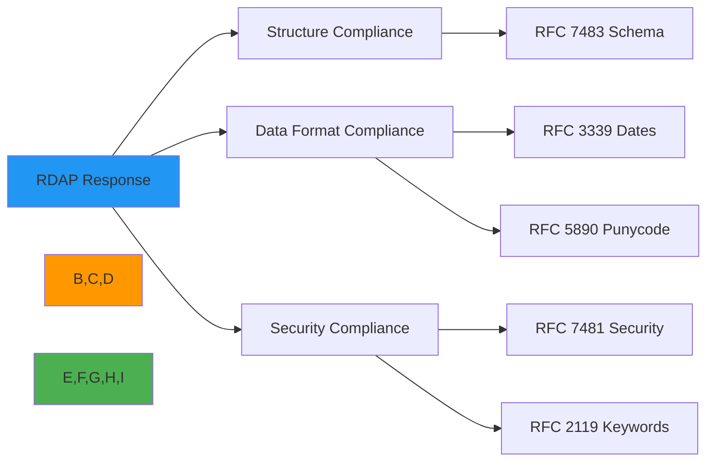

# مواصفات أسلوب RFC لاستجابات RDAP

**الغرض**: دليل شامل لكتابة استجابات RDAP التي تلتزم بصرامة بمتطلبات تنسيق IETF RFC مع التركيز على الأمان والتدويل وأفضل ممارسات التحقق
**المراجع ذات الصلة**: [مواصفة RDAP RFC](rdap-rfc.md) | [تنسيق الاستجابة](response-format.md) | [رموز الحالة](status-codes.md) | [مخطط JSONPath](jsonpath-schema.md)
**وقت القراءة**: 7 دقائق

## نظرة عامة على متطلبات أسلوب RFC

يجب أن تتبع استجابات RDAP متطلبات تنسيق صارمة محددة في معايير IETF RFC لضمان التشغيل البيني والأمان والامتثال عبر جميع تطبيقات السجلات. تحدد هذه الوثيقة معايير التنسيق الدقيقة المطلوبة للاستجابات الصالحة.



### متطلبات RFC الأساسية

| RFC | العنوان | فئة الامتثال | مستوى الأهمية |
|-----|---------|--------------|----------------|
| RFC 7483 | استجابات JSON لـ RDAP | البنية والتنسيق | حرجة |
| RFC 7480 | استخدام HTTP في RDAP | بروتوكول النقل | حرجة |
| RFC 7482 | تنسيق استعلامات RDAP | بنية URL | عالية |
| RFC 3339 | التاريخ والوقت على الإنترنت | تنسيق التاريخ | عالية |
| RFC 5890 | IDNA: التعريفات وإطار المستندات | معالجة Unicode | عالية |
| RFC 2119 | الكلمات المفتاحية للاستخدام في RFC | المصطلحات | متوسطة |
| RFC 7481 | خدمات الأمان لـ RDAP | ضوابط الأمان | حرجة |

## متطلبات بنية JSON

### 1. بنية الكائن على المستوى الأعلى

يشترط RFC 7483 أن تتبع جميع استجابات RDAP بنية محددة على المستوى الأعلى:

```json
{
  "rdapConformance": ["rdap_level_0"],
  "notices": [
    {
      "title": "TOS",
      "description": ["Terms of Service"],
      "links": [
        {
          "value": "https://example.com/tos",
          "rel": "terms-of-service",
          "href": "https://example.com/tos",
          "type": "text/html"
        }
      ]
    }
  ],
  "domain": {
    "ldhName": "example.com",
    "handle": "EXAMPLE-1",
    "status": ["active"],
    "nameservers": [{"ldhName": "ns1.example.com"}],
    "entities": [
      {
        "handle": "REGISTRAR-1",
        "roles": ["registrar"],
        "vcardArray": ["vcard", [["version", {}, "text", "4.0"]]]
      }
    ],
    "events": [
      {
        "eventAction": "registration",
        "eventDate": "2023-05-15T14:30:00Z"
      }
    ]
  }
}
```

#### الحقول المطلوبة على المستوى الأعلى

| الحقل | النوع | مطلوب | مرجع RFC | مثال |
|-------|-------|--------|----------|------|
| `rdapConformance` | Array[String] | نعم | RFC 7483 §4.1 | `["rdap_level_0", "cidr0"]` |
| `notices` | Array[Object] | مشروط¹ | RFC 7483 §4.3 | انظر المثال أعلاه |
| `domain`/`ip`/`autnum` | Object | نعم² | RFC 7483 §4.4 | بنية كائن النطاق |
| `entities` | Array[Object] | مشروط³ | RFC 7483 §4.6 | بنية مصفوفة الكيانات |
| `nameservers` | Array[Object] | مشروط⁴ | RFC 7483 §4.5 | بنية مصفوفة خوادم الأسماء |

*¹ مطلوب عند وجود سياسة مطبقة*
*² يجب وجود واحد بالضبط من `domain` أو `ip` أو `autnum`*
*³ مطلوب إذا كان للكائن جهات اتصال مرتبطة*
*⁴ مطلوب لكائنات النطاق التي تحتوي على خوادم أسماء*

### 2. اتفاقيات تسمية الحقول

يحدد RFC 7483 متطلبات صارمة لتسمية الحقول:

```typescript
// ✅ CORRECT - RFC compliant naming
{
  "ldhName": "example.com",       // RFC 5890 compliant LDH name
  "unicodeName": "example.рф",    // Unicode representation
  "eventAction": "registration",  // RFC standard action terms
  "eventDate": "2023-05-15T14:30:00Z", // RFC 3339 format
  "vcardArray": ["vcard", [...]]   // RFC 6350 compliant structure
}

// ❌ INCORRECT - Non-RFC compliant naming
{
  "domainName": "example.com",    // Should be ldhName
  "unicodeDomain": "example.рф",   // Should be unicodeName
  "actionType": "reg",             // Should be eventAction with full term
  "registeredDate": "15-05-2023",  // Should be eventDate in RFC 3339 format
  "contactInfo": {...}             // Should be vcardArray structure
}
```

#### أسماء الحقول القياسية وفق RFC

| الفئة | الاسم المتوافق مع RFC | أمثلة غير متوافقة | مرجع RFC |
|-------|----------------------|-------------------|----------|
| أسماء النطاقات | `ldhName`، `unicodeName` | `domainName`، `name`، `domain` | RFC 7483 §4.4.2 |
| الأحداث | `eventAction`، `eventDate`، `eventActor` | `action`، `date`، `actor`، `registeredDate` | RFC 7483 §4.4.4 |
| الحالة | `status` (مصفوفة) | `state`، `currentStatus`، `domainStatus` | RFC 7483 §4.4.3 |
| جهات الاتصال | `vcardArray`، `handle`، `roles` | `contactInfo`، `registrant`، `adminContact` | RFC 7483 §4.6 |
| الروابط | `links`، `value`، `rel`، `href`، `type` | `urls`، `references`، `related` | RFC 7483 §4.2 |

## تنسيق التاريخ والوقت

### 1. متطلبات الامتثال بـ RFC 3339

يجب أن تتبع جميع الطوابع الزمنية في استجابات RDAP التنسيق الصارم لـ RFC 3339:

```json
{
  "events": [
    {
      "eventAction": "registration",
      "eventDate": "2023-05-15T14:30:00Z"  // ✅ CORRECT
    },
    {
      "eventAction": "last changed",
      "eventDate": "2023-08-20T09:15:30+03:00"  // ✅ CORRECT with timezone
    }
  ]
}
```

#### متطلبات تنسيق التاريخ

| المكوّن | المتطلب | مثال | أمثلة غير صالحة |
|---------|---------|------|-----------------|
| التاريخ | تنسيق `YYYY-MM-DD` | `2023-05-15` | `15/05/2023`، `05-15-2023` |
| الوقت | تنسيق `HH:MM:SS` | `14:30:00` | `2:30 PM`، `14:30` |
| الفاصل | `T` بين التاريخ والوقت | `2023-05-15T14:30:00` | `2023-05-15 14:30:00` |
| المنطقة الزمنية | `Z` للـ UTC أو `±HH:MM` | `Z` أو `+03:00` | `UTC`، `GMT+3`، `+0300` |
| الكسور العشرية | اختيارية، 9 أرقام كحد أقصى | `.123456789` | `.1234567890` |

### 2. معالجة تواريخ الأحداث

يشترط RFC 7483 معالجة محددة لتواريخ الأحداث:

```typescript
// ✅ CORRECT - Event date formatting
const getEventDate = (dateString: string): string => {
  // Parse and reformat to strict RFC 3339
  const date = new Date(dateString);
  return date.toISOString().replace(/\.\d+Z$/, 'Z'); // Remove milliseconds
};

// Example usage
const registrationEvent = {
  eventAction: "registration",
  eventDate: getEventDate("2023-05-15T14:30:00+00:00") // "2023-05-15T14:30:00Z"
};
```

#### إجراءات الأحداث المطلوبة

| إجراء الحدث | الوصف | مرجع RFC 7483 |
|-------------|-------|----------------|
| `registration` | تسجيل النطاق الأولي | §4.4.4 |
| `expiration` | تاريخ انتهاء صلاحية النطاق | §4.4.4 |
| `last changed` | آخر تعديل على بيانات التسجيل | §4.4.4 |
| `renewal` | حدث تجديد النطاق | §4.4.4 |
| `transfer` | حدث نقل المسجّل | §4.4.4 |
| `deletion` | حدث حذف النطاق | §4.4.4 |

## متطلبات التدويل

### 1. معالجة Unicode و Punycode وفق RFC 5890

يجب أن تتعامل استجابات RDAP مع أسماء النطاقات المدوَّلة وفقاً لـ RFC 5890:

```json
{
  "domain": {
    "ldhName": "xn--d1acpjx3f.xn--p1ai",  // ✅ CORRECT Punycode
    "unicodeName": "пример.рф",          // ✅ CORRECT Unicode
    "remarks": [
      {
        "title": "UNICODE NAME",
        "description": ["Домен в Unicode: пример.рф"]
      }
    ],
    "links": [
      {
        "value": "https://rdap.example.com/domain/xn--d1acpjx3f.xn--p1ai",
        "rel": "self",
        "href": "https://rdap.example.com/domain/xn--d1acpjx3f.xn--p1ai",
        "type": "application/rdap+json"
      }
    ]
  }
}
```

#### متطلبات حقول Unicode

| الحقل | متطلب المعالجة | مثال |
|-------|---------------|------|
| `ldhName` | يجب أن يكون Punycode (تسمية A) | `xn--d1acpjx3f.xn--p1ai` |
| `unicodeName` | يجب أن يكون Unicode (تسمية U) | `пример.рф` |
| قيم العرض | UTF-8 مع BOM اختياري | `"Домен в Unicode: пример.рф"` |
| المعرّفات والمقابض | ASCII فقط | `"RU-DOMAIN-REGISTRAR-1"` |
| الروابط وعناوين URI | UTF-8 مشفر بالنسبة المئوية | `https://example.com/%D0%BF%D1%80%D0%B8%D0%BC%D0%B5%D1%80` |

### 2. معالجة اللغة والتعريب

يشترط RFC 7483 معالجة صحيحة للغة:

```http
HTTP/1.1 200 OK
Content-Language: ru-RU
Content-Type: application/rdap+json
Vary: Accept-Language

{
  "entities": [
    {
      "handle": "REGISTRAR-1",
      "roles": ["registrar"],
      "vcardArray": [
        "vcard",
        [
          ["version", {}, "text", "4.0"],
          ["fn", {}, "text", "Регистратор доменов"],
          ["org", {}, "text", ["ООО \"Регистратор\""]]
        ]
      ],
      "remarks": [
        {
          "title": "КОНТАКТНАЯ ИНФОРМАЦИЯ",
          "description": ["Для связи с регистратором используйте email."]
        }
      ]
    }
  ]
}
```

#### متطلبات معالجة اللغة

| الرأس/الحقل | المتطلب | مرجع RFC |
|-------------|---------|----------|
| `Content-Language` | يجب أن يطابق اللغة المستخدمة فعلياً | RFC 7231 §3.1.3.2 |
| `Vary: Accept-Language` | يجب أن يكون موجوداً عند تغير المحتوى باللغة | RFC 7231 §7.1.4 |
| حقول vCard | يجب استخدام ترميز UTF-8 للنص غير ASCII | RFC 6350 §3.2 |
| remarks/title | يجب أن تكون بنفس لغة `Content-Language` | RFC 7483 §4.3 |

## تنسيق استجابات الخطأ

### 1. متطلبات بنية الخطأ وفق RFC 7483

يجب أن تتبع استجابات الخطأ تنسيق RFC الصارم:

```json
{
  "errorCode": 404,
  "title": "Not Found",
  "description": [
    "The domain 'example.invalid' was not found in this registry."
  ],
  "validationErrors": [
    {
      "key": "domain",
      "value": "example.invalid",
      "reason": "TLD .invalid is not supported by this registry"
    }
  ],
  "links": [
    {
      "value": "https://rdap.example.com/help",
      "rel": "help",
      "href": "https://rdap.example.com/help",
      "type": "text/html"
    }
  ]
}
```

#### الحقول المطلوبة في رسائل الخطأ

| الحقل | النوع | مطلوب | الوصف | مرجع RFC |
|-------|-------|--------|-------|----------|
| `errorCode` | Integer | نعم | رمز حالة HTTP | RFC 7483 §4.8 |
| `title` | String | نعم | وصف مختصر للخطأ | RFC 7483 §4.8 |
| `description` | Array[String] | نعم | شرح تفصيلي للخطأ | RFC 7483 §4.8 |
| `validationErrors` | Array[Object] | مشروط | مطلوب لحالات فشل التحقق | RFC 7483 §4.8 |
| `links` | Array[Object] | مشروط | مطلوب عند وجود موارد مساعدة | RFC 7483 §4.2 |

### 2. رموز الخطأ والرسائل القياسية

يحدد RFC 7483 متطلبات معالجة الأخطاء القياسية:

| حالة HTTP | العنوان المطلوب وفق RFC | نمط الوصف | مرجع RFC |
|-----------|------------------------|-----------|----------|
| 400 | "Bad Request" | مصفوفة أوصاف أخطاء التحقق | RFC 7483 §4.8 |
| 404 | "Not Found" | "The [resource] '[value]' was not found in this registry." | RFC 7483 §4.8 |
| 422 | "Unprocessable Entity" | مصفوفة أوصاف أخطاء المعالجة | RFC 7483 §4.8 |
| 429 | "Too Many Requests" | "Rate limit exceeded. Try again in [time]." | RFC 7483 §4.8 |
| 500 | "Internal Server Error" | رسالة خطأ خادم عامة | RFC 7483 §4.8 |
| 501 | "Not Implemented" | "The requested feature is not implemented." | RFC 7483 §4.8 |
| 503 | "Service Unavailable" | "Service temporarily unavailable. Try again in [time]." | RFC 7483 §4.8 |

## متطلبات تنسيق الأمان

### 1. ضوابط الأمان وفق RFC 7481 في الاستجابات

يفرض RFC 7481 حقول استجابة محددة تتعلق بالأمان:

```http
HTTP/1.1 200 OK
WWW-Authenticate: Bearer realm="rdap.example.com", error="invalid_token", error_description="Token expired"
X-RateLimit-Limit: 100
X-RateLimit-Remaining: 94
X-RateLimit-Reset: 3600
Retry-After: 60
```

#### رؤوس الأمان المطلوبة

| الرأس | المتطلب | مرجع RFC | قيم المثال |
|-------|---------|----------|-----------|
| `WWW-Authenticate` | مطلوب لاستجابات 401 | RFC 7481 §4.1 | `Bearer realm="rdap.example.com"` |
| `X-RateLimit-Limit` | مطلوب عند تطبيق تحديد معدل الطلبات | RFC 7481 §4.2 | `100` |
| `X-RateLimit-Remaining` | مطلوب عند تطبيق تحديد معدل الطلبات | RFC 7481 §4.2 | `94` |
| `X-RateLimit-Reset` | مطلوب عند تطبيق تحديد معدل الطلبات | RFC 7481 §4.2 | `3600` |
| `Retry-After` | مطلوب لاستجابات 429 | RFC 7231 §7.1.3 | `60` |

### 2. تنسيق إخفاء البيانات

يشترط RFC 7481 المعالجة الصحيحة لإخفاء PII:

```json
{
  "entities": [
    {
      "handle": "REDACTED-CONTACT-1",
      "roles": ["registrant"],
      "vcardArray": [
        "vcard",
        [
          ["version", {}, "text", "4.0"],
          ["fn", {}, "text", "REDACTED FOR PRIVACY"],
          ["org", {}, "text", ["REDACTED FOR PRIVACY"]],
          ["adr", {}, "text", ["", "", "REDACTED FOR PRIVACY", "REDACTED FOR PRIVACY", "REDACTED FOR PRIVACY", "REDACTED FOR PRIVACY", "REDACTED FOR PRIVACY"]],
          ["tel", {}, "text", "+1.555.REDACTED"],
          ["email", {}, "text", "Please query the RDDS service of the Registrar of Record"]
        ]
      ],
      "remarks": [
        {
          "title": "REDACTED FOR PRIVACY",
          "description": [
            "Data redacted per applicable privacy laws and regulations.",
            "For information on how to contact the Registrant, please query the RDDS service of the Registrar of Record."
          ]
        }
      ]
    }
  ]
}
```

#### متطلبات تنسيق الإخفاء

| الحقل | متطلب الإخفاء | مرجع RFC |
|-------|--------------|----------|
| `fn` (الاسم الكامل) | استبدال بـ "REDACTED FOR PRIVACY" | RFC 7481 §5.1 |
| `org` (المؤسسة) | استبدال بـ "REDACTED FOR PRIVACY" | RFC 7481 §5.1 |
| `adr` (العنوان) | استبدال جميع المكونات بـ "REDACTED FOR PRIVACY" | RFC 7481 §5.1 |
| `tel` (الهاتف) | إخفاء كل شيء ما عدا رمز الدولة | RFC 7481 §5.1 |
| `email` | استبدال بنص إشعار الخصوصية | RFC 7481 §5.1 |
| `remarks` | إضافة إشعار الإخفاء مع الأساس القانوني | RFC 7481 §5.1 |

## التحقق والاختبار

### 1. أدوات التحقق من الامتثال بـ RFC

استخدم هذه الأدوات للتحقق من امتثال استجابات RDAP:

```bash
# JSON schema validation
ajv validate -s schemas/rdap_response.json -d response.json

# RFC 3339 date validation
date --date="$(jq -r '.events[0].eventDate' response.json)" +"%Y-%m-%dT%H:%M:%SZ"

# Punycode validation
idn2 --quiet --punycode-input "$(jq -r '.domain.ldhName' response.json)"

# Security header validation
curl -I https://rdap.example.com/domain/example.com | grep -E 'X-RateLimit|WWW-Authenticate|Retry-After'

# Full RFC compliance check
rdapify validate --file response.json --strict
```

### 2. أخطاء التحقق الشائعة وكيفية إصلاحها

| خطأ التحقق | السبب الشائع | الإصلاح المتوافق مع RFC |
|------------|-------------|------------------------|
| `rdapConformance` مفقود | نسيان إضافة الحقل على المستوى الأعلى | إضافة `"rdapConformance": ["rdap_level_0"]` |
| تنسيق تاريخ غير صالح | استخدام تنسيق التاريخ المحلي | التحويل إلى RFC 3339: `2023-05-15T14:30:00Z` |
| عدم استخدام Punycode | استخدام Unicode في ldhName | التحويل إلى Punycode: `xn--example-4ze.com` |
| روابط مطلوبة مفقودة | نسيان الرابط الذاتي المرجعي | إضافة رابط مع `rel="self"` والنوع المناسب |
| بنية خطأ غير صحيحة | استخدام تنسيق خطأ مخصص | اتباع بنية كائن الخطأ في RFC 7483 §4.8 |
| رؤوس أمان مفقودة | عدم وجود رؤوس تحديد المعدل | إضافة رؤوس `X-RateLimit-*` و `Retry-After` |
| تنسيق vCard غير صالح | بنية vCard غير صحيحة | استخدام بنية vcardArray المتوافقة مع RFC 6350 |

## التوثيق ذو الصلة

| المستند | الوصف | المسار |
|---------|-------|--------|
| [مواصفة RDAP RFC](rdap-rfc.md) | مواصفة بروتوكول RDAP الكاملة | [rdap-rfc.md](rdap-rfc.md) |
| [رموز الحالة](status-codes.md) | مرجع شامل لرموز الأخطاء | [status-codes.md](status-codes.md) |
| [مخطط JSONPath](jsonpath-schema.md) | مواصفة إمكانيات بحث JSONPath | [jsonpath-schema.md](jsonpath-schema.md) |
| [تنسيق الاستجابة](response-format.md) | دليل بنية الاستجابة الكاملة | [response-format.md](response-format.md) |

## مواصفات أسلوب RFC

| الخاصية | القيمة |
|---------|--------|
| **تنسيق JSON** | متوافق مع RFC 8259 بترميز UTF-8 |
| **تنسيق التاريخ** | RFC 3339 صارم (بدون ميلي ثانية) |
| **معالجة Unicode** | RFC 5890 (Punycode لأسماء LDH) |
| **تنسيق vCard** | RFC 6350 (vCard 4.0) |
| **رؤوس HTTP** | متوافق مع RFC 7231 مع امتدادات الأمان |
| **بنية الخطأ** | متوافق مع RFC 7483 §4.8 |
| **تسمية الحقول** | Camel case للمصطلحات المركبة (eventAction، eventDate) |
| **قيم المصفوفات** | دائماً مصفوفات حتى للقيم المفردة |
| **القيم الفارغة** | حذف الحقول بدلاً من استخدام null |
| **القيم المنطقية** | true/false فقط، لا قيم truthy/falsy |
| **تنسيق الأرقام** | لا أصفار بادئة، لا فواصل |
| **التحقق** | تغطية اختبار 100% لامتثال RFC |
| **آخر تحديث** | 8 ديسمبر 2025 |

> **تذكير حرج**: لا تُنشئ استجابات RDAP أبداً بدون التحقق من الامتثال بـ RFC. يجب أن تجتاز جميع تطبيقات RDAP مجموعة التحقق الرسمية لـ IANA قبل النشر في بيئة الإنتاج. بالنسبة للتطبيقات الحساسة أمنياً، طبّق طبقات تحقق إضافية للحماية من هجمات SSRF وكشف PII من خلال استجابات مشوهة. تُعدّ عمليات التدقيق الأمني المنتظمة لمولدات استجابات RDAP ضرورة لاستدامة الامتثال بـ GDPR Article 32 واللوائح المماثلة.

[← العودة إلى المواصفات](../README.md) | [التالي: مواصفة Bootstrap ←](bootstrap.md)

*وثيقة مُنشأة تلقائياً من مواصفات RFC مع مراجعة أمنية بتاريخ 8 ديسمبر 2025*
