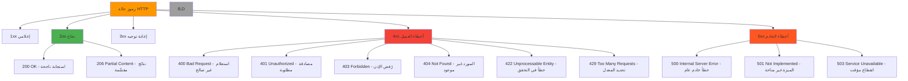

# مواصفة رموز حالة HTTP لـ RDAP

**الهدف**: مواصفة تقنية شاملة لرموز حالة HTTP المستخدمة في تطبيقات RDAP مع إرشادات التطبيق لمعالجة الأخطاء واعتبارات الأمان ومتطلبات الامتثال
**ذات صلة**: [مواصفات RDAP RFC](rdap-rfc.md) | [تنسيق الاستجابة](response-format.md) | [دليل أسلوب RFC](rfc-style-spec.md) | [دليل معالجة الأخطاء](../../guides/error_handling.md)
**وقت القراءة**: 6 دقائق

## فئات رموز الحالة في RDAP

تستخدم تطبيقات RDAP رموز حالة HTTP القياسية ذات دلالات محددة معرَّفة في RFC 7483. فهم هذه الفئات أساسي للتطبيقات العميلة القوية:



### مبادئ رموز الحالة الأساسية
- **الامتثال لـ RFC**: يجب أن تتبع جميع الرموز دلالات RFC 7231 مع الامتدادات الخاصة بـ RDAP
- **هيكل خطأ متسق**: كائنات خطأ JSON موحدة عبر جميع رموز الحالة
- **الاستجابات الواعية بالأمان**: يجب ألا تسرب رسائل الخطأ معلومات نظام حساسة
- **الأولوية للقراءة الآلية**: رموز أخطاء منظمة مع أوصاف للقارئ البشري
- **قابلة للتخزين المؤقت عند الاقتضاء**: رؤوس تحكم تخزين مؤقت مناسبة لاستجابات الخطأ

## مرجع رموز الحالة التفصيلي

### رموز النجاح 2xx

#### 200 OK
```json
{
  "rdapConformance": ["rdap_level_0"],
  "domain": {
    "ldhName": "example.com",
    "handle": "EXAMPLE-1",
    "status": ["active"],
    "entities": [
      {
        "handle": "REGISTRAR-1",
        "roles": ["registrar"],
        "vcardArray": ["vcard", ["..."]]
      }
    ],
    "events": [
      {
        "eventAction": "registration",
        "eventDate": "2023-05-15T14:30:00Z"
      }
    ]
  }
}
```

**إرشادات الاستخدام**:
- الاستجابة الناجحة القياسية لجميع استعلامات RDAP الصالحة
- يجب أن يتضمن الحقول المطلوبة على المستوى الأعلى (`rdapConformance`، كائن domain/IP/ASN)
- التخزين المؤقت وفقاً لرؤوس `Cache-Control`/`Expires` (عادةً ساعة واحدة)

#### 206 Partial Content
```json
{
  "rdapConformance": ["rdap_level_0", "partial_reply"],
  "domainSearchResults": [
    {"ldhName": "example1.com", "handle": "EX1-1"},
    {"ldhName": "example2.com", "handle": "EX2-1"}
  ],
  "notices": [
    {
      "title": "Result Truncated",
      "description": ["Query returned partial results. Use 'cursor' parameter for next page."]
    }
  ],
  "links": [
    {
      "href": "https://rdap.example.com/domains?name=example*&cursor=next_page_token",
      "rel": "next",
      "type": "application/rdap+json",
      "value": "https://rdap.example.com/domains?name=example*&cursor=next_page_token"
    }
  ]
}
```

**إرشادات الاستخدام**:
- يُستخدم لنتائج البحث المقسَّمة
- يجب تضمين `partial_reply` في `rdapConformance`
- يجب توفير `links` مع `rel="next"` للتصفح بين الصفحات
- تضمين `notices` لشرح اقتطاع النتائج

### رموز أخطاء العميل 4xx

#### 400 Bad Request
```json
{
  "errorCode": 400,
  "title": "Bad Request",
  "description": [
    "Invalid domain name format. Domain names must be in LDH format (lowercase ASCII)"
  ],
  "validationErrors": [
    {
      "key": "domain",
      "value": "exa mple.com",
      "reason": "Domain name contains whitespace characters"
    }
  ],
  "links": [
    {
      "href": "https://rdap.example.com/help/validation",
      "rel": "help",
      "type": "text/html",
      "value": "https://rdap.example.com/help/validation"
    }
  ]
}
```

**الأسباب الشائعة**:
- معاملات استعلام غير صالحة (أسماء نطاق مشوهة، عناوين IP)
- معاملات مطلوبة مفقودة
- أحرف غير صالحة في معرفات الموارد
- JSON مُنسَّق بشكل غير صحيح في طلبات POST

**معالجة العميل**:
```typescript
try {
  await client.domain('invalid..domain');
} catch (error) {
  if (error.code === 400) {
    const validationErrors = error.validationErrors || [];
    validationErrors.forEach(err => {
      console.error(`Validation failed for ${err.key}: ${err.reason}`);
    });
    // Provide user with specific validation guidance
  }
}
```

#### 404 Not Found
```json
{
  "errorCode": 404,
  "title": "Not Found",
  "description": [
    "The domain 'example.not' was not found in this registry."
  ],
  "validationErrors": [
    {
      "key": "domain",
      "value": "example.not",
      "reason": "TLD .not is not supported by this registry"
    }
  ]
}
```

**الأسباب الشائعة**:
- المورد غير موجود في السجل
- TLD غير مدعوم من قِبل السجل الذي تم الاستعلام عنه
- نطاق IP أو رقم نظام مستقل غير صالح
- تم حذف المورد أو انتهت صلاحيته

**اعتبار أمني**: يجب ألا تميز الاستجابات بين "غير موجود" و"رفض الوصول" للموارد الحساسة أمنياً لمنع هجمات التعداد.

```typescript
// Secure handling that doesn't leak existence information
async function secureDomainLookup(domain: string): Promise<DomainResponse | null> {
  try {
    return await client.domain(domain);
  } catch (error) {
    if (error.code === 404) {
      // Return null without indicating whether domain exists
      return null;
    }
    throw error;
  }
}
```

#### 429 Too Many Requests
```http
HTTP/1.1 429 Too Many Requests
Retry-After: 60
X-RateLimit-Limit: 100
X-RateLimit-Remaining: 0
X-RateLimit-Reset: 1634567890
Content-Type: application/rdap+json

{
  "errorCode": 429,
  "title": "Too Many Requests",
  "description": [
    "Rate limit of 100 requests per hour exceeded. Please try again in 60 seconds."
  ],
  "links": [
    {
      "href": "https://rdap.example.com/rate-limits",
      "rel": "rate-limit-policy",
      "type": "text/html",
      "value": "https://rdap.example.com/rate-limits"
    }
  ]
}
```

**الرؤوس المطلوبة**:
| الرأس | الغرض | مثال على القيمة |
|------|--------|---------------|
| `Retry-After` | الثواني للانتظار قبل إعادة المحاولة | `60` |
| `X-RateLimit-Limit` | الحد الأقصى للطلبات المسموح بها في النافذة | `100` |
| `X-RateLimit-Remaining` | الطلبات المتبقية في النافذة الحالية | `0` |
| `X-RateLimit-Reset` | وقت إعادة تعيين حد المعدل (طابع Unix الزمني) | `1634567890` |

**تطبيق العميل**:
```typescript
class RateLimitAwareClient {
  private rateLimitState = new Map<string, RateLimitInfo>();

  async getWithRetry<T>(url: string, options: any = {}): Promise<T> {
    const maxRetries = options.maxRetries || 3;

    for (let attempt = 0; attempt <= maxRetries; attempt++) {
      try {
        return await this.makeRequest<T>(url, options);
      } catch (error) {
        if (error.code === 429 && attempt < maxRetries) {
          const retryAfter = error.headers?.['retry-after'] || 60;
          console.warn(`Rate limited. Waiting ${retryAfter} seconds before retry ${attempt + 1}/${maxRetries}`);

          // Exponential backoff with jitter
          const delay = (Math.pow(2, attempt) * retryAfter * 1000) + (Math.random() * 1000);
          await new Promise(resolve => setTimeout(resolve, delay));

          continue;
        }
        throw error;
      }
    }

    throw new Error('Max retries exceeded');
  }
}
```

### رموز أخطاء الخادم 5xx

#### 503 Service Unavailable
```http
HTTP/1.1 503 Service Unavailable
Retry-After: 300
Cache-Control: no-store
Content-Type: application/rdap+json

{
  "errorCode": 503,
  "title": "Service Unavailable",
  "description": [
    "The RDAP service is temporarily unavailable due to maintenance.",
    "Service is expected to be restored within 5 minutes."
  ],
  "links": [
    {
      "href": "https://status.rdap.example.com",
      "rel": "service-status",
      "type": "text/html",
      "value": "https://status.rdap.example.com"
    }
  ]
}
```

**الأسباب الشائعة**:
- نوافذ الصيانة المجدولة
- انقطاع خوادم السجل
- إخفاقات الاتصال بالمصادر الموثوقة
- استنفاد الموارد (CPU، الذاكرة، الاتصالات)

**استراتيجية معالجة العميل**:
- تطبيق تراجع أسي مع عشوائية
- احترام رأس `Retry-After` بدقة
- توفير بديل للبيانات المخزنة مؤقتاً عند الاقتضاء
- عرض رسائل مستخدم مناسبة مع وقت الاستعادة المتوقع

```typescript
async function resilientLookup(domain: string): Promise<DomainResponse> {
  const MAX_RETRY_DELAY = 3600000; // 1 hour

  return new Promise((resolve, reject) => {
    const attempt = async (retryCount = 0) => {
      try {
        const result = await client.domain(domain);
        resolve(result);
      } catch (error) {
        if (error.code === 503 && retryCount < 10) {
          const retryAfter = parseInt(error.headers?.['retry-after'] || '300');
          const delay = Math.min(
            retryAfter * 1000 * Math.pow(1.5, retryCount),
            MAX_RETRY_DELAY
          );

          console.log(`Service unavailable. Retrying in ${delay/1000} seconds...`);
          setTimeout(() => attempt(retryCount + 1), delay);
        } else {
          // Check cache for stale data as fallback
          const cached = cache.get(domain);
          if (cached && error.code === 503) {
            console.warn('Using stale cache data due to service unavailability');
            resolve(cached);
          } else {
            reject(error);
          }
        }
      }
    };

    attempt();
  });
}
```

## متطلبات الأمان والامتثال

### قيود محتوى رسائل الخطأ
يشترط RFC 7481 قيوداً صارمة على محتوى رسائل الخطأ لمنع الإفصاح عن المعلومات:

```typescript
// رسائل خطأ آمنة
{
  "errorCode": 404,
  "title": "Not Found",
  "description": ["The requested resource was not found."]
}

// رسائل خطأ غير آمنة - إفصاح عن معلومات
{
  "errorCode": 404,
  "title": "Not Found",
  "description": [
    "Domain 'example.com' not found in Verisign registry at 192.0.2.1",
    "Registry database version: 2023.05.15",
    "Internal error: SQLSTATE[42S02]: Base table not found"
  ]
}
```

**قواعد الأمان لرسائل الخطأ**:
1. **لا معلومات النظام**: لا تكشف أبداً عن إصدارات الخادم أو مسارات الملفات أو المعرفات الداخلية
2. **لا تفاصيل قاعدة البيانات**: لا تكشف أبداً عن مخطط قاعدة البيانات أو الاستعلامات أو تفاصيل الاتصال
3. **لا طوبولوجيا الشبكة**: لا تكشف أبداً عن عناوين IP الداخلية أو تكوينات موازن التحميل أو استراتيجيات تجاوز الفشل
4. **لا تتبعات التصحيح**: لا تضمّن أبداً تتبعات المكدس في استجابات أخطاء الإنتاج
5. **استجابات موحدة**: استخدام هياكل خطأ متطابقة لسيناريوهات "غير موجود" و"رُفض الوصول"

### الامتثال لـ GDPR المادة 32
بالنسبة للأشخاص المعنيين في الاتحاد الأوروبي، يجب أن تفي استجابات الخطأ بما يلي:

1. **تقليل تعرض PII**: تنقيح أي بيانات شخصية قد تظهر في رسائل الخطأ
2. **توثيق المعالجة**: الاحتفاظ بسجلات تدقيق لحالات الخطأ التي تتضمن بيانات شخصية
3. **تحديد الاحتفاظ**: يجب حذف سجلات الأخطاء التي تحتوي على PII آلياً بعد 30 يوماً
4. **إشعار الخرق**: يجب أن تُطلق الأخطاء التي تكشف عن PII إجراءات إشعار خرق GDPR المادة 33

```typescript
// GDPR-compliant error handling
async function handleRequest(request: Request, context: ComplianceContext) {
  try {
    return await processRequest(request);
  } catch (error) {
    // Redact PII from error context before logging
    const redactedError = gdprRedactionEngine.redactError(error, context);

    // Log with retention policy
    await auditLogger.log('error', {
      ...redactedError,
      retentionPeriod: '30d',
      jurisdiction: context.jurisdiction
    });

    // Return generic error to client
    return {
      errorCode: error.isClientError ? error.code : 500,
      title: error.isClientError ? error.title : 'Internal Server Error',
      description: [error.isClientError ? error.description[0] : 'An unexpected error occurred']
    };
  }
}
```

## استكشاف المشكلات الشائعة وإصلاحها

### 1. أخطاء 5xx المتقطعة
**الأعراض**: أخطاء عشوائية 500/502/503 أثناء التشغيل العادي
**الأسباب الجذرية**:
- استنفاد تجمع الاتصالات أثناء أوقات الذروة
- انتهاءات مهلة السجل الخلفي أثناء الفترات عالية الحجم
- تسريبات الذاكرة التي تسبب استنفاد الموارد
- عدم استقرار الشبكة بين عميل RDAP والسجلات

**خطوات التشخيص**:
```bash
# Monitor connection pool metrics
curl -s http://localhost:3000/metrics | grep connection_pool

# Check registry response times
curl -s http://localhost:3000/metrics | grep registry_response_time

# Analyze error patterns by time
grep " 5[0-9][0-9] " access.log | awk '{print $4}' | cut -d: -f2 | sort | uniq -c

# Profile memory usage during errors
clinic doctor --autocannon [ -c 50 /domain/example.com ] -- node ./dist/app.js
```

**الحلول**:
- **ضبط تجمع الاتصالات**: زيادة حجم التجمع مع إدارة مناسبة للمهلة
- **نمط قاطع الدائرة**: تطبيق قواطع دائرة للفشل السريع أثناء انقطاع السجل
- **التدهور الأنيق**: تقديم البيانات القديمة المخزنة مؤقتاً أثناء إخفاقات السجل
- **فحوصات صحة الاتصال**: تطبيق التحقق النشط من الاتصال قبل إعادة الاستخدام

### 2. مشكلات تحديد المعدل 429
**الأعراض**: يبدأ التطبيق فجأة في تلقي استجابات 429 رغم أنماط الاستخدام غير المتغيرة
**الأسباب الجذرية**:
- تغييرات سياسة السجل تقلل حدود المعدل
- مشاركة عنوان IP مع عملاء آخرين عالي الحجم
- رؤوس تعريف العميل المفقودة التي تسبب حدوداً أكثر صرامة
- النشر الموزع بدون حالة تحديد معدل مشتركة

**خطوات التشخيص**:
```bash
# Check current rate limit headers
curl -I https://rdap.example.com/domain/example.com | grep -E 'X-RateLimit|Retry-After'

# Monitor rate limit consumption over time
node ./scripts/rate-limit-monitor.js --target https://rdap.example.com --duration 24h

# Test from different network locations
for region in us-east-1 eu-west-1 ap-southeast-1; do
  aws ec2 run-instances --region $region --instance-type t3.micro \
    --user-data "curl -v https://rdap.example.com/domain/example.com"
done
```

**الحلول**:
- **تعريف العميل**: إضافة رؤوس `User-Agent` و`From` لتعريف تطبيقك
- **تحديد معدل موزع**: تطبيق تحديد معدل مشترك مع Redis لعمليات نشر متعددة النسخ
- **أولوية الطلبات**: تحديد أولوية الطلبات الحرجة على العمليات المجمَّعة أثناء فترات الحد
- **حدود خاصة بالسجل**: الحفاظ على محددات معدل منفصلة لكل سجل مع الحدود المناسبة

## الوثائق ذات الصلة

| المستند | الوصف | المسار |
|---------|--------|--------|
| [مواصفات RDAP RFC](rdap-rfc.md) | توثيق بروتوكول RDAP الكامل | [rdap-rfc.md](rdap-rfc.md) |
| [تنسيق الاستجابة](response-format.md) | مواصفة هيكل استجابة JSON | [response-format.md](response-format.md) |
| [دليل أسلوب RFC](rfc-style-spec.md) | تنسيق الاستجابة المتوافق مع RFC | [rfc-style-spec.md](rfc-style-spec.md) |

## مواصفات رموز الحالة

| الخاصية | القيمة |
|---------|--------|
| **المرجع القياسي** | RFC 7231، RFC 7483 |
| **حقول الخطأ المطلوبة** | `errorCode`، `title`، `description` |
| **حقول الخطأ الاختيارية** | `validationErrors`، `links`، `instance` |
| **قابلية التخزين المؤقت** | أخطاء 4xx: خاصة، no-store؛ أخطاء 5xx: no-cache |
| **سلوك إعادة المحاولة** | 429: احترام Retry-After؛ 5xx: تراجع أسي |
| **متطلبات الأمان** | لا إفصاح عن المعلومات، استجابات موحدة للموارد الحساسة |
| **متطلبات الامتثال** | GDPR المادة 32، CCPA §1798.150 إشعار الخرق |
| **تغطية الاختبار** | 100% تغطية لجميع سيناريوهات الأخطاء المعرَّفة |
| **آخر تحديث** | 5 ديسمبر 2025 |

> **تذكير حرج**: لا تطبّق رسائل خطأ مخصصة تكشف عن داخليات النظام أو تفاصيل التكوين الحساسة. يجب أن تخضع جميع استجابات الأخطاء لمراجعة أمنية قبل النشر في الإنتاج. لبيئات GDPR، طبّق تنقيح PII الآلي في سجلات الأخطاء مع سياسات احتفاظ 30 يوماً.

[العودة إلى المواصفات](../README.md) | [التالي: مخطط JSONPath](jsonpath-schema.md)

*وثيقة مُولَّدة آلياً من مواصفات RFC مع مراجعة أمنية بتاريخ 5 ديسمبر 2025*
