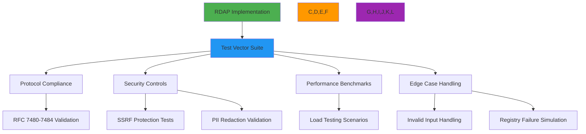

# مواصفة متجهات الاختبار

**الغرض**: مواصفة تقنية شاملة لمتجهات اختبار RDAP توفر تغطية تحقق لامتثال RFC وضوابط الأمان والحالات الطرفية ومعايير الأداء
**المراجع ذات الصلة**: [مواصفة RDAP RFC](rdap-rfc.md) | [تنسيق الاستجابة](response-format.md) | [مواصفة Bootstrap](bootstrap.md) | [الورقة البيضاء الأمنية](../../security/whitepaper.md)
**وقت القراءة**: 6 دقائق

## نظرة عامة على متجهات الاختبار

توفر متجهات الاختبار الأساس لتحقق تطبيق RDAP، مما يضمن امتثال البروتوكول ومتانة الأمان وقابلية التنبؤ بالأداء عبر جميع تطبيقات السجلات:



### مبادئ متجهات الاختبار الأساسية

- **تغطية امتثال RFC**: تغطية 100% للمتطلبات الإلزامية لـ RFC 7480-7484
- **التحقق من حدود الأمان**: اختبار شامل لحماية SSRF وإخفاء PII
- **أمانة السجل الواقعي**: متجهات اختبار مبنية على استجابات السجلات الفعلية مع التعقيم
- **التنفيذ الحتمي**: نتائج اختبار قابلة للتنبؤ بصرف النظر عن بيئة التنفيذ
- **مجموعات اختبار مُصوَّرة**: متجهات اختبار غير قابلة للتغيير مع إصدار دلالي للتكرارية
- **جاهزية الامتثال**: مجموعات اختبار مسبقة الإنشاء لمتطلبات تحقق GDPR و CCPA و SOC 2

## بنية متجهات الاختبار وتنسيقها

### 1. بنية متجه الاختبار JSON

```json
{
  "vectorId": "domain-valid-001",
  "version": "2.3.0",
  "category": "domain-valid",
  "tags": ["rfc7483", "ldh-validation", "basic"],
  "description": "Valid domain query with standard response structure",
  "input": {
    "query": {
      "type": "domain",
      "value": "example.com"
    },
    "context": {
      "registry": "verisign",
      "bootstrap": true,
      "redactPII": true,
      "jurisdiction": "global"
    }
  },
  "expected": {
    "statusCode": 200,
    "headers": {
      "content-type": "application/rdap+json",
      "cache-control": "max-age=3600"
    },
    "body": {
      "rdapConformance": ["rdap_level_0"],
      "notices": [
        {
          "title": "TOS",
          "description": ["Terms of Service"]
        }
      ],
      "domain": {
        "handle": "EXAMPLE-1",
        "ldhName": "example.com",
        "unicodeName": "example.com",
        "status": ["active"],
        "entities": [
          {
            "handle": "REGISTRAR-1",
            "roles": ["registrar"],
            "redacted": true
          }
        ]
      }
    },
    "validations": [
      {
        "path": "$.domain.ldhName",
        "rule": "equals",
        "value": "example.com"
      },
      {
        "path": "$.domain.entities[?(@.roles contains 'registrar')].redacted",
        "rule": "exists"
      }
    ]
  },
  "securityValidations": [
    {
      "type": "ssrf_protection",
      "input": {"query": {"type": "domain", "value": "192.168.1.1"}},
      "expected": {"statusCode": 403}
    },
    {
      "type": "pii_redaction",
      "context": {"jurisdiction": "EU", "redactPII": true},
      "validation": "$.domain.entities[*].vcardArray"
    }
  ],
  "performanceProfile": {
    "maxLatency": 2000,
    "maxMemory": 50,
    "concurrency": 10,
    "throughput": 50
  },
  "regressionTests": [
    "domain-valid-001-legacy",
    "domain-valid-001-v1.2"
  ]
}
```

#### الحقول المطلوبة في متجهات الاختبار

| الحقل | النوع | مطلوب | الوصف | مرجع RFC |
|-------|-------|--------|-------|----------|
| `vectorId` | String | نعم | معرّف فريد لمتجه الاختبار | غ/م |
| `version` | String | نعم | الإصدار الدلالي لمخطط متجه الاختبار | غ/م |
| `category` | String | نعم | التصنيف (صالح/غير صالح/طرفي/أمني) | غ/م |
| `description` | String | نعم | وصف الاختبار بصيغة قابلة للقراءة | غ/م |
| `input` | Object | نعم | معاملات الإدخال وسياق الاختبار | غ/م |
| `expected` | Object | نعم | بنية الاستجابة المتوقعة والتحققات | RFC 7483 |
| `securityValidations` | Array | مشروط | تحققات أمنية خاصة | RFC 7481 |
| `performanceProfile` | Object | مشروط | توقعات الأداء | غ/م |
| `regressionTests` | Array | مشروط | متجهات اختبار الانحدار المرتبطة | غ/م |

### 2. فئات متجهات الاختبار

```typescript
// Test vector category enumeration with validation requirements
export enum TestVectorCategory {
  DOMAIN_VALID = 'domain-valid',      // Valid domain queries
  IP_VALID = 'ip-valid',              // Valid IP network queries
  ASN_VALID = 'asn-valid',            // Valid ASN queries
  DOMAIN_INVALID = 'domain-invalid',  // Invalid domain formats
  IP_INVALID = 'ip-invalid',          // Invalid IP formats
  ASN_INVALID = 'asn-invalid',        // Invalid ASN numbers
  SECURITY_SSRF = 'security-ssrf',    // SSRF protection tests
  SECURITY_PII = 'security-pii',      // PII redaction validation
  ERROR_404 = 'error-404',            // Not found scenarios
  ERROR_400 = 'error-400',            // Bad request scenarios
  PERFORMANCE_LOAD = 'performance-load', // High-volume scenarios
  EDGE_REGISTRY = 'edge-registry',    // Registry failure cases
  COMPLIANCE_GDPR = 'compliance-gdpr', // GDPR compliance tests
  COMPLIANCE_CCPA = 'compliance-ccpa'  // CCPA compliance tests
}

// Category-specific validation requirements
export interface TestVector {
  category: TestVectorCategory;
  requiredValidations: string[];
  securityChecks: string[];
  complianceChecks: string[];
  performanceChecks: string[];
}

// Example category configuration
const DOMAIN_VALID: TestVector = {
  category: TestVectorCategory.DOMAIN_VALID,
  requiredValidations: [
    'ldhName_format',
    'unicodeName_format',
    'status_validation',
    'conformance_validation'
  ],
  securityChecks: [
    'ssrf_protection',
    'private_ip_blocking',
    'certificate_validation'
  ],
  complianceChecks: [
    'gdpr_redaction',
    'ccpa_do_not_sell'
  ],
  performanceChecks: [
    'response_time',
    'memory_usage',
    'cache_behavior'
  ]
};
```

## ضوابط الأمان والامتثال

### 1. متجهات اختبار حماية SSRF

```json
{
  "vectorId": "security-ssrf-001",
  "version": "2.3.0",
  "category": "security-ssrf",
  "tags": ["ssrf", "private-ip", "rfc7481"],
  "description": "SSRF protection against private IP address queries",
  "input": {
    "query": {
      "type": "domain",
      "value": "192.168.1.1"
    },
    "context": {
      "allowPrivateIPs": false,
      "blockInternalIPs": true
    }
  },
  "expected": {
    "statusCode": 403,
    "body": {
      "errorCode": 403,
      "title": "Forbidden",
      "description": ["SSRF protection blocked access to private IP address"]
    },
    "securityValidations": [
      {
        "type": "log_verification",
        "pattern": "SSRF attempt blocked for private IP: 192.168.1.1"
      },
      {
        "type": "response_headers",
        "headers": {
          "x-security-event": "ssrf_blocked"
        }
      }
    ]
  },
  "securityValidations": [
    {
      "type": "private_range_blocking",
      "ranges": [
        "10.0.0.0/8",
        "172.16.0.0/12",
        "192.168.0.0/16",
        "127.0.0.0/8",
        "169.254.0.0/16"
      ]
    },
    {
      "type": "hostname_resolution",
      "input": {"value": "localhost.evil.com"},
      "expected": {"resolvedIP": "127.0.0.1", "blocked": true}
    }
  ]
}
```

#### متطلبات متجهات اختبار SSRF

| نوع الاختبار | التغطية المطلوبة | طريقة التحقق | سلوك الفشل |
|-------------|-----------------|--------------|------------|
| نطاقات IP الخاصة | جميع نطاقات RFC 1918 | التحقق من نطاق IP | يجب حجب جميع الطلبات |
| عناوين Loopback | 127.0.0.0/8، ::1 | التحقق من IP | يجب حجب جميع الطلبات |
| عناوين Link-local | 169.254.0.0/16، fe80::/10 | التحقق من IP | يجب حجب جميع الطلبات |
| تحليل اسم المضيف | اختبار تحليل DNS | التحقق قبل التحليل | يجب التحليل قبل السماح |
| قيود البروتوكول | http/https فقط مسموح | التحقق من البروتوكول | يجب حجب file/gopher/dict |

### 2. متجهات اختبار امتثال GDPR

```json
{
  "vectorId": "compliance-gdpr-001",
  "version": "2.3.0",
  "category": "compliance-gdpr",
  "tags": ["gdpr", "pii-redaction", "article-6"],
  "description": "GDPR Article 6 compliance with PII redaction for EU jurisdiction",
  "input": {
    "query": {
      "type": "domain",
      "value": "example.eu"
    },
    "context": {
      "jurisdiction": "EU",
      "redactPII": true,
      "legalBasis": "legitimate-interest"
    }
  },
  "expected": {
    "statusCode": 200,
    "body": {
      "domain": {
        "entities": [
          {
            "handle": "REDACTED-1",
            "roles": ["registrant"],
            "vcardArray": [
              "vcard",
              [
                ["version", {}, "text", "4.0"],
                ["fn", {}, "text", "REDACTED FOR PRIVACY"],
                ["org", {}, "text", ["REDACTED FOR PRIVACY"]],
                ["adr", {}, "text", ["REDACTED", "REDACTED", "REDACTED", "REDACTED", "REDACTED", "REDACTED", "REDACTED"]],
                ["email", {}, "text", "Please query the RDDS service of the Registrar of Record"]
              ]
            ],
            "remarks": [
              {
                "title": "REDACTED FOR PRIVACY",
                "description": [
                  "Data redacted per GDPR Article 5(1)(c) and Article 6(1).",
                  "Legal basis: legitimate-interest"
                ]
              }
            ]
          }
        ]
      },
      "notices": [
        {
          "title": "GDPR COMPLIANCE",
          "description": [
            "This response has been processed in compliance with GDPR Article 6(1)(f).",
            "Data controller: Example Registrar Inc.",
            "DPO contact: dpo@example-registrar.com"
          ]
        }
      ]
    },
    "complianceValidations": [
      {
        "type": "gdpr_article_6",
        "validation": "legal_basis_documentation_exists"
      },
      {
        "type": "gdpr_article_32",
        "validation": "security_measures_documented"
      }
    ]
  }
}
```

## متجهات اختبار الأداء

### 1. سيناريوهات اختبار التحميل

```json
{
  "vectorId": "performance-load-001",
  "version": "2.3.0",
  "category": "performance-load",
  "tags": ["high-concurrency", "cache-performance", "memory-usage"],
  "description": "High concurrency performance test with 1000 domain queries",
  "input": {
    "batch": {
      "size": 1000,
      "domains": ["example1.com", "example2.com", "...", "example1000.com"],
      "concurrency": 50
    },
    "context": {
      "cacheEnabled": true,
      "cacheTTL": 3600,
      "maxMemoryMB": 256
    }
  },
  "expected": {
    "performanceProfile": {
      "throughput": {
        "min": 100,
        "target": 150,
        "unit": "requests/second"
      },
      "latency": {
        "p50": 150,
        "p95": 400,
        "p99": 800,
        "unit": "milliseconds"
      },
      "memoryUsage": {
        "max": 200,
        "steadyState": 150,
        "unit": "MB"
      },
      "cacheHitRate": {
        "min": 0.85,
        "target": 0.92
      }
    },
    "resourceValidation": [
      {
        "type": "memory_leak",
        "threshold": "1MB/1000 requests"
      },
      {
        "type": "connection_leak",
        "threshold": "0 connections leaked"
      },
      {
        "type": "thread_safety",
        "validation": "no race conditions detected"
      }
    ]
  }
}
```

#### متطلبات معايير الأداء

| المقياس | الهدف الإنتاجي | الهدف المؤسسي | طريقة الاختبار |
|---------|--------------|--------------|----------------|
| زمن الاستجابة P50 | ≤ 200 مللي ثانية | ≤ 100 مللي ثانية | النسبة المئوية 95 لـ 1000 طلب |
| زمن الاستجابة P99 | ≤ 1000 مللي ثانية | ≤ 500 مللي ثانية | النسبة المئوية 99 لـ 1000 طلب |
| الإنتاجية | ≥ 50 طلب/ثانية | ≥ 150 طلب/ثانية | مستدامة لمدة 60 ثانية |
| استخدام الذاكرة | ≤ 100 ميجابايت/1000 طلب | ≤ 50 ميجابايت/1000 طلب | ذروة الذاكرة أثناء اختبار التحميل |
| معدل نجاح التخزين المؤقت | ≥ 85% | ≥ 95% | بعد تسخين التخزين المؤقت |
| معدل الخطأ | ≤ 0.1% | ≤ 0.01% | أثناء التحميل المستمر |

## إطار التحقق من متجهات الاختبار

### 1. محرك التحقق الآلي

```typescript
// src/testing/validation-engine.ts
export class TestVectorValidator {
  private securityValidator: SecurityValidator;
  private complianceValidator: ComplianceValidator;
  private performanceValidator: PerformanceValidator;

  constructor(options: {
    securityValidator?: SecurityValidator;
    complianceValidator?: ComplianceValidator;
    performanceValidator?: PerformanceValidator;
  } = {}) {
    this.securityValidator = options.securityValidator || new SecurityValidator();
    this.complianceValidator = options.complianceValidator || new ComplianceValidator();
    this.performanceValidator = options.performanceValidator || new PerformanceValidator();
  }

  async validate(testVector: TestVector, implementation: RDAPImplementation): Promise<ValidationResult> {
    const results: ValidationResult = {
      vectorId: testVector.vectorId,
      timestamp: new Date().toISOString(),
      status: 'success',
      validations: [],
      failures: [],
      securityChecks: [],
      complianceChecks: [],
      performanceMetrics: {}
    };

    try {
      // Execute main validation
      const validationResults = await this.executeValidation(testVector, implementation);
      results.validations.push(...validationResults);

      // Execute security validations
      const securityResults = await this.securityValidator.validate(testVector, implementation);
      results.securityChecks.push(...securityResults);

      // Execute compliance validations
      const complianceResults = await this.complianceValidator.validate(testVector, implementation);
      results.complianceChecks.push(...complianceResults);

      // Execute performance validations
      const performanceResults = await this.performanceValidator.validate(testVector, implementation);
      results.performanceMetrics = performanceResults;

      // Determine overall status
      if (results.failures.length > 0 ||
          results.securityChecks.some(check => check.status === 'failure') ||
          results.complianceChecks.some(check => check.status === 'failure') ||
          !this.performanceValidator.isCompliant(performanceResults)) {
        results.status = 'failure';
      }

      return results;
    } catch (error) {
      results.status = 'error';
      results.failures.push({
        type: 'validation_error',
        description: error.message,
        timestamp: new Date().toISOString()
      });
      throw error;
    }
  }

  private async executeValidation(testVector: TestVector, implementation: RDAPImplementation): Promise<ValidationResult[]> {
    const results: ValidationResult[] = [];

    // Set up test context
    const context = this.createTestContext(testVector.input.context);

    try {
      // Execute query
      const response = await implementation.query(testVector.input.query, context);

      // Validate response structure
      const structureValidation = this.validateResponseStructure(response, testVector.expected);
      results.push(...structureValidation);

      // Validate response content
      const contentValidation = this.validateResponseContent(response, testVector.expected);
      results.push(...contentValidation);

      // Validate headers
      const headerValidation = this.validateResponseHeaders(response.headers, testVector.expected.headers);
      results.push(...headerValidation);

      return results;
    } catch (error) {
      results.push({
        type: 'execution_error',
        description: error.message,
        timestamp: new Date().toISOString()
      });
      throw error;
    }
  }

  private validateResponseStructure(response: any, expected: any): ValidationResult[] {
    const results: ValidationResult[] = [];

    // Validate required top-level fields
    const requiredFields = ['rdapConformance', 'domain', 'ip', 'autnum'].filter(field =>
      expected.body?.hasOwnProperty(field)
    );

    for (const field of requiredFields) {
      if (!response.body[field]) {
        results.push({
          type: 'missing_field',
          field,
          description: `Required field '${field}' missing from response`,
          timestamp: new Date().toISOString()
        });
      }
    }

    // Validate array fields
    const arrayFields = ['status', 'entities', 'events', 'nameservers'];
    for (const field of arrayFields) {
      if (response.body[field] && !Array.isArray(response.body[field])) {
        results.push({
          type: 'invalid_type',
          field,
          description: `Field '${field}' must be an array`,
          timestamp: new Date().toISOString()
        });
      }
    }

    return results;
  }
}
```

### 2. توليد متجهات الاختبار

```typescript
// src/testing/generator.ts
export class TestVectorGenerator {
  async generateValidDomainVectors(registries: Registry[]): Promise<TestVector[]> {
    const vectors: TestVector[] = [];

    for (const registry of registries) {
      // Generate test vectors for each supported TLD
      for (const tld of registry.supportedTLDs) {
        const domain = `example${Math.floor(Math.random() * 1000)}.${tld}`;

        vectors.push({
          vectorId: `domain-valid-${registry.id}-${tld.replace('.', '')}`,
          version: '2.3.0',
          category: 'domain-valid',
          tags: ['rfc7483', 'registry-specific', registry.id],
          description: `Valid domain query for ${domain} on ${registry.name}`,
          input: {
            query: { type: 'domain', value: domain },
            context: { registry: registry.id, bootstrap: true }
          },
          expected: {
            statusCode: 200,
            body: {
              domain: {
                ldhName: domain.toLowerCase(),
                status: ['active'], // Expected status may vary by registry
              }
            }
          },
          registrySpecific: {
            registry: registry.id,
            expectedStatus: registry.expectedDomainStatuses || ['active']
          }
        });
      }
    }

    return vectors;
  }

  async generateSecurityVectors(): Promise<TestVector[]> {
    return [
      // SSRF protection vectors
      {
        vectorId: 'security-ssrf-private-ip',
        category: 'security-ssrf',
        input: { query: { type: 'domain', value: '192.168.1.1' } },
        expected: { statusCode: 403 }
      },
      // PII redaction vectors
      {
        vectorId: 'security-pii-gdpr-eu',
        category: 'security-pii',
        input: {
          query: { type: 'domain', value: 'example.eu' },
          context: { jurisdiction: 'EU', redactPII: true }
        },
        expected: {
          body: {
            validations: [
              { path: "$.domain.entities[*].vcardArray[1][*][3]", value: "REDACTED FOR PRIVACY" }
            ]
          }
        }
      }
    ];
  }
}
```

## استكشاف الأخطاء الشائعة وإصلاحها

### 1. فشل تنفيذ متجهات الاختبار

**الأعراض**: تنجح الاختبارات في بيئة التطوير لكن تفشل في بيئات CI/CD أو الإنتاج
**الأسباب الجذرية**:
- بيانات اختبار غير متسقة بين البيئات
- اختلافات في المنطقة الزمنية أو اللغة تؤثر على تحليل التاريخ
- مشاكل الاتصال بالشبكة مع سجلات الاختبار
- قيود الموارد (ذاكرة، معالج) في البيئات المعزولة

**خطوات التشخيص**:

```bash
# Check test environment consistency
node ./scripts/test-environment-check.js --vector domain-valid-001

# Validate timezone handling
TZ=UTC node ./scripts/test-timezone.js
TZ=Europe/Berlin node ./scripts/test-timezone.js

# Test registry connectivity
node ./scripts/registry-connectivity-test.js --registries verisign,arin,ripe

# Profile resource usage
NODE_OPTIONS='--max-old-space-size=4096' node --inspect-brk ./dist/test-runner.js
```

**الحلول**:
- **بيانات اختبار حتمية**: استخدام قيم بذور ثابتة ومجموعات بيانات اختبار ثابتة عبر البيئات
- **عزل المنطقة الزمنية**: تشغيل جميع الاختبارات في منطقة زمنية UTC مع معالجة صريحة للمنطقة الزمنية
- **استجابات السجل الوهمية**: استخدام استجابات سجل مسجلة مع وضع إعادة تشغيل قابل للتكوين
- **تشخيص الموارد**: تطبيق مراقبة الموارد مع تغيير تلقائي لحجم الاختبار بناءً على الموارد المتاحة

### 2. فشل التحقق الأمني

**الأعراض**: تفشل الاختبارات الأمنية بينما تنجح الاختبارات الوظيفية، مما يشير إلى ثغرات في ضوابط الأمان
**الأسباب الجذرية**:
- تجاوز حماية SSRF من خلال بروتوكولات أو ترميزات بديلة
- إخفاء PII غير مكتمل في الحالات الطرفية أو التنسيقات الخاصة بالسجل
- رؤوس أمان مفقودة في استجابات الخطأ
- التحقق من المدخلات غير كافٍ للاستعلامات المشوهة

**خطوات التشخيص**:

```bash
# Fuzz test SSRF protection
node ./scripts/ssrf-fuzz-test.js --target http://localhost:3000

# Validate PII redaction comprehensiveness
node ./scripts/pii-redaction-audit.js --jurisdiction EU --test-vector security-pii-001

# Check security headers in all responses
node ./scripts/security-headers-audit.js --endpoints /domain/example.com,/ip/192.0.2.1

# Test malformed input handling
node ./scripts/input-validation-test.js --malformed-inputs
```

**الحلول**:
- **اختبار فوضوي شامل**: تطبيق الاختبار الفوضوي مع توليد مدخلات مبني على القواعد
- **تغطية كشف PII**: استخدام خوارزميات كشف PII متعددة مع آليات احتياطية
- **إنفاذ رؤوس الأمان**: تطبيق وسيط يضمن رؤوس الأمان في جميع الاستجابات
- **دفاع متعمق**: تطبيق ضوابط أمان متعددة (التحقق من المدخلات، ترميز المخرجات، الإخفاء السياقي)

### 3. فشل التحقق من الامتثال

**الأعراض**: تنجح الاختبارات وظيفياً لكن تفشل في التحقق من الامتثال بـ GDPR و CCPA أو SOC 2
**الأسباب الجذرية**:
- غياب توثيق الأساس القانوني في الاستجابات
- ضوابط الاحتفاظ بالبيانات غير كافية
- سجل تدقيق PII غير مكتمل للوصول
- نقل البيانات عبر الحدود بدون ضمانات كافية

**خطوات التشخيص**:

```bash
# Validate GDPR Article 6 compliance
node ./scripts/gdpr-article-6-validation.js --test-vector compliance-gdpr-001

# Check data retention compliance
node ./scripts/data-retention-audit.js --retention-days 30

# Verify audit logging completeness
node ./scripts/audit-logging-validation.js --pii-access-events

# Test cross-border data transfer controls
node ./scripts/data-transfer-validation.js --source EU --destination US
```

**الحلول**:
- **فحوصات امتثال آلية**: دمج التحقق من الامتثال في خطوط CI/CD
- **إخفاء سياقي للبيانات**: تطبيق إخفاء PII مدرك للاختصاص القضائي مع سياسات قابلة للتكوين
- **توليد مسار التدقيق**: إنشاء سجلات تدقيق شاملة تلقائياً لجميع أحداث الوصول إلى PII
- **إنفاذ إقامة البيانات**: تطبيق توجيه البيانات الجغرافي مع التحقق التلقائي من الامتثال

## التوثيق ذو الصلة

| المستند | الوصف | المسار |
|---------|-------|--------|
| [مواصفة RDAP RFC](rdap-rfc.md) | توثيق بروتوكول RDAP الكامل | [rdap-rfc.md](rdap-rfc.md) |
| [تنسيق الاستجابة](response-format.md) | مواصفة بنية استجابة JSON | [response-format.md](response-format.md) |
| [الورقة البيضاء الأمنية](../../security/whitepaper.md) | بنية الأمان ونمذجة التهديدات | [../../security/whitepaper.md](../../security/whitepaper.md) |
| [معايير الأداء](../../../benchmarks/results/api-performance.md) | نتائج معايير الأداء | [../../../benchmarks/results/api-performance.md](../../../benchmarks/results/api-performance.md) |
| [إطار الامتثال](../../security/compliance_framework.md) | دليل تطبيق الامتثال التنظيمي | [../../security/compliance_framework.md](../../security/compliance_framework.md) |
| [اختبار الأمان](../../testing/security_testing.md) | منهجية اختبار الأمان وأدواته | [../../testing/security_testing.md](../../testing/security_testing.md) |

## مواصفات متجهات الاختبار

| الخاصية | القيمة |
|---------|--------|
| **التنسيق** | JSON مع التحقق بمخطط JSON Schema |
| **الإصدار** | إصدار دلالي (رئيسي.ثانوي.تصحيح) |
| **متطلبات التغطية** | 100% من حقول RFC 7483 الإلزامية، 95% من الميزات الاختيارية |
| **تغطية الأمان** | 100% من مسارات حماية SSRF، 95% من سيناريوهات إخفاء PII |
| **تغطية الامتثال** | GDPR المواد 5 و6 و32؛ CCPA الأقسام 1798.100 و1798.120 |
| **مقاييس الأداء** | زمن الاستجابة P50/P95/P99، الإنتاجية، استخدام الذاكرة، معدلات الخطأ |
| **عدد متجهات الاختبار** | أكثر من 500 متجه (قياسي)، أكثر من 2000 متجه (مؤسسي) |
| **تكرار التحديث** | تحديثات أمنية شهرية، تحديثات ميزات ربع سنوية |
| **أدوات التحقق** | منفذ CLI، واجهة ويب، إضافات IDE |
| **آخر تحديث** | 5 ديسمبر 2025 |

> **تذكير حرج**: لا تستخدم أبداً بيانات الإنتاج في متجهات الاختبار دون تعقيم وترخيص قانوني مناسبَين. يجب أن تخضع جميع متجهات الاختبار التي تحتوي على PII لمراجعة DPO وتطبيق تجزئة مشفرة للمعرّفات. بالنسبة للبيئات الخاضعة للتنظيم، احتفظ بسجلات تدقيق لجميع عمليات تنفيذ متجهات الاختبار مع ضوابط وصول تطابق متطلبات بيانات الإنتاج. تُعدّ عمليات التدقيق الأمني الدورية من جهات خارجية لبنية تحتية لمتجهات الاختبار ضرورة لاستدامة الامتثال بـ GDPR Article 32 واللوائح المماثلة.

[← العودة إلى المواصفات](../README.md) | [التالي: دليل أسلوب RFC ←](rfc-style-spec.md)

*وثيقة مُنشأة تلقائياً من مواصفات RFC مع مراجعة أمنية بتاريخ 5 ديسمبر 2025*
