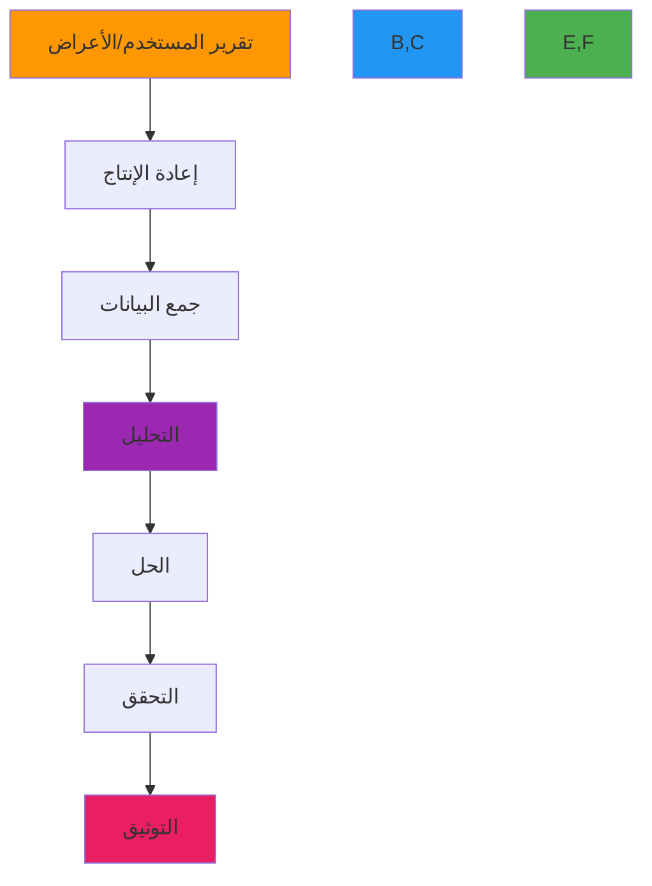

# دليل استكشاف الأخطاء وإصلاحها

**الهدف**: دليل شامل لتشخيص وحل المشكلات الشائعة في عمليات نشر RDAPify مع تقنيات عملية وأدوات تشخيصية وإجراءات تصعيد لفرق الدعم والمطورين
**ذات صلة**: [التسجيل المفصّل](verbose-logging.md) | [تصحيح الشبكة](network-debugging.md) | [الحصول على المساعدة](getting-help.md) | [الأخطاء الشائعة](../troubleshooting/common-errors.md)
**وقت القراءة**: 5 دقائق

## منهجية استكشاف الأخطاء

تتبع مشكلات RDAPify عملية تشخيص منهجية تتدرج من ملاحظة الأعراض إلى حل السبب الجذري:



**مبادئ التشخيص**:
✅ **إعادة الإنتاج أولاً**: محاولة إعادة إنتاج المشكلة دائماً قبل التحليل العميق
✅ **جمع الأدلة**: جمع السجلات والمقاييس والسياق البيئي بشكل منهجي
✅ **العزل**: تضييق نطاق المشكلة بالتخلص من المتغيرات
✅ **التركيز على السبب الجذري**: معالجة الأسباب الكامنة لا الأعراض
✅ **التوثيق**: تسجيل خطوات الحل لمشاركة المعرفة

## فئات المشكلات الشائعة وحلولها

### 1. أخطاء انتهاء مهلة الاتصال
**الأعراض**:
- `Error: Timeout of 5000ms exceeded`
- `Error: connect ETIMEDOUT`
- `Error: socket hang up`

**أوامر التشخيص**:
```bash
# التحقق من الاتصال بخوادم السجلات
curl -v -m 5 https://rdap.verisign.com/com/v1/domain/example.com

# تصحيح تحليل DNS
dig +trace rdap.verisign.com

# مراقبة محاولات الاتصال
sudo tcpdump -i any -nn port 443 and host rdap.verisign.com
```

**استراتيجيات الحل**:
✅ **إعداد المهلة التكيفية**:
```javascript
const client = new RDAPClient({
  timeout: {
    default: 5000,
    verisign: 8000,
    arin: 10000,
    ripe: 7000
  },
  retry: {
    maxAttempts: 3,
    backoff: 'exponential'
  }
});
```

✅ **تحسين مجمع الاتصالات**:
```yaml
# مقطع docker-compose.yml
services:
  rdapify:
    environment:
      UV_THREADPOOL_SIZE: 16
      RDAP_CONNECTION_POOL_SIZE: 50
      RDAP_MAX_SOCKETS: 100
    ulimits:
      nofile:
        soft: 65535
        hard: 65535
```

✅ **تحليل مسار الشبكة**:
```
mtr --report --interval 1 rdap.verisign.com
```

### 2. إيجابيات كاذبة لحماية SSRF
**الأعراض**:
- `SSRF protection blocked domain query: example.com`
- `Domain validation failed: contains private IP pattern`
- نطاقات مشروعة يتم حجبها

**أوامر التشخيص**:
```bash
# تفعيل تسجيل تصحيح SSRF
RDAP_DEBUG_LEVEL=debug RDAP_DEBUG_SSRF=true node app.js

# اختبار قواعد التحقق من صحة النطاق
npx rdapify ssrf-test --domain example.com --registry verisign
```

**استراتيجيات الحل**:
✅ **قائمة السماح الخاصة بالسجلات**:
```javascript
const client = new RDAPClient({
  security: {
    ssrfProtection: {
      enabled: true,
      registryAllowlist: {
        'verisign': {
          domains: ['example.com', '*.com'],
          ips: ['192.0.2.0/24']
        },
        'arin': {
          domains: ['example.net', '*.net'],
          ips: ['198.51.100.0/24']
        }
      }
    }
  }
});
```

✅ **تجاوز واعٍ بالسياق** (للأنظمة الموثوقة):
```javascript
await client.domain('internal.example.com', {
  securityContext: {
    bypassJustification: 'Internal domain required for compliance reporting',
    requestingSystem: 'compliance-dashboard',
    authorization: 'compliance-team-lead'
  }
});
```

✅ **إدارة قائمة السماح الديناميكية**:
```javascript
// تحديث قائمة السماح دورياً من مصدر موثوق
async function refreshSSRFAllowlist() {
  try {
    const response = await fetch('https://trusted-source.example.com/rdap-allowlist.json');
    const allowlist = await response.json();
    rdapClient.updateSecurityConfig({ ssrfProtection: { dynamicAllowlist: allowlist } });
  } catch (error) {
    rdapClient.revertSecurityConfig(); // العودة إلى آخر إعداد صحيح معروف
  }
}
setInterval(refreshSSRFAllowlist, 24 * 60 * 60 * 1000); // كل 24 ساعة
```

### 3. مشكلات تعارض الذاكرة المؤقتة
**الأعراض**:
- استجابات مختلفة لنفس الاستعلام عبر المثيلات
- بيانات قديمة بعد تحديثات السجلات
- معدلات إصابة الذاكرة المؤقتة أقل بكثير من المتوقع

**أوامر التشخيص**:
```bash
# التحقق من مقاييس الذاكرة المؤقتة
curl http://localhost:3000/metrics | grep cache_

# فحص محتويات الذاكرة المؤقتة
RDAP_DEBUG_CACHE=true node app.js --domain example.com

# التحقق من توليد مفاتيح الذاكرة المؤقتة
node ./scripts/cache-key-test.js --domain example.com --jurisdiction EU
```

**استراتيجيات الحل**:
✅ **إبطال الذاكرة المؤقتة الموزعة**:
```javascript
class DistributedCacheManager extends CacheManager {
  constructor(options) {
    super(options);
    this.redis = new Redis(options.redisUrl);
    this.subscribeToInvalidationChannel();
  }

  subscribeToInvalidationChannel() {
    const subscriber = this.redis.duplicate();
    subscriber.subscribe('rdapify:cache:invalidation', (message) => {
      const { key, timestamp, source } = JSON.parse(message);
      console.log(`🔄 Cache invalidation received from ${source}: ${key}`);
      this.invalidateLocalCache(key);
    });
  }

  async invalidateCache(key) {
    this.invalidateLocalCache(key);

    await this.redis.publish('rdapify:cache:invalidation', JSON.stringify({
      key,
      timestamp: Date.now(),
      source: process.env.HOSTNAME || 'unknown'
    }));
  }
}
```

✅ **مفاتيح ذاكرة مؤقتة مُعَوَّنة**:
```javascript
function generateCacheKey(query, context) {
  const schemaVersion = 'v0.1.8'; // يُزاد عند التغييرات الجذرية
  const jurisdiction = context.jurisdiction || 'global';
  const legalBasis = context.legalBasis || 'legitimate-interest';

  return `rdap:${schemaVersion}:${jurisdiction}:${legalBasis}:${query.type}:${query.value}`;
}
```

✅ **مزامنة الساعة**:
```bash
# ضمان مزامنة NTP عبر جميع المثيلات
sudo timedatectl set-ntp true
sudo systemctl restart chrony
```

## أدوات التشخيص المتقدمة

### 1. مولّد حزمة الدعم
```bash
# توليد حزمة دعم شاملة
npx rdapify support-bundle --output /tmp/rdapify-support-bundle.zip

# المحتويات تشمل:
# - معلومات النظام (إصدار Node.js، تفاصيل نظام التشغيل)
# - ملفات الإعداد (معقّمة)
# - السجلات الأخيرة (آخر 1000 سطر)
# - لقطة المقاييس
# - إحصاءات الذاكرة المؤقتة
# - نتائج اختبار الاتصال الشبكي
# - ملخص إعداد الأمان
```

### 2. التصحيح في الوقت الفعلي مع Inspector
```bash
# إرفاق المصحح بالعملية الجارية
node --inspect-brk app.js

# استخدام Chrome DevTools للتصحيح المباشر
# افتح chrome://inspect في متصفح Chrome
# انقر "Open dedicated DevTools for Node"
```

### 3. تحليل حركة مرور الشبكة
```bash
# التقاط حركة المرور لسجل محدد
sudo tcpdump -i any -w rdap_verisign.pcap host rdap.verisign.com and port 443

# تحليل مصافحة TLS
sudo tcpdump -i any -w tls_handshake.pcap 'tcp port 443 and (tcp[tcpflags] & (tcp-syn|tcp-ack) != 0)'

# مراقبة حركة المرور في الوقت الفعلي
sudo ngrep -d any -qt 'GET|POST' port 443
```

## استكشاف الأخطاء الخاصة بالبيئة

### 1. مشكلات AWS Lambda
**الأعراض الشائعة**:
- انتهاء مهلة البداية الباردة (تجاوز حد 15 ثانية)
- استنفاد الذاكرة أثناء معالجة الدفعات
- تأخيرات البداية الباردة لـ VPC (8-10 ثوانٍ)

**أوامر التشخيص**:
```bash
# التحقق من وقت تهيئة Lambda في CloudWatch
aws logs filter-log-events --log-group-name /aws/lambda/rdapify-prod \
  --filter-pattern '"INIT_START" OR "INIT_END"' --query 'events[*].{timestamp:timestamp,message:message}'

# مراقبة استخدام الذاكرة
aws cloudwatch get-metric-statistics --namespace AWS/Lambda --metric-name MemoryUtilization \
  --dimensions Name=FunctionName,Value=rdapify-prod --start-time $(date -d '1 hour ago' +%s) \
  --end-time $(date +%s) --period 300 --statistics Average,Maximum
```

**استراتيجيات الحل**:
✅ **التزامن المُحضَّر**:
```yaml
# مقطع serverless.yml
functions:
  domain:
    handler: handlers/domain.handler
    provisionedConcurrency: 1
```

✅ **تحسين الذاكرة**:
```javascript
// معالج Lambda مع إدارة الذاكرة
exports.handler = async (event) => {
  const before = process.memoryUsage();

  try {
    const result = await global.rdapClient.domain(event.domain);

    const after = process.memoryUsage();
    const heapUsedMB = (after.heapUsed - before.heapUsed) / 1024 / 1024;

    // فرض تجميع القمامة إذا كان استخدام الذاكرة مرتفعاً
    if (heapUsedMB > 50) { // عتبة 50 ميغابايت
      if (typeof global.gc === 'function') {
        global.gc();
      }
    }

    return { statusCode: 200, body: JSON.stringify(result) };
  } catch (error) {
    return { statusCode: 500, body: JSON.stringify({ error: error.message }) };
  }
};
```

### 2. مشكلات نشر Kubernetes
**الأعراض الشائعة**:
- فشل فحوصات الجاهزية
- انتهاء مهلة الاتصال بين الـ pods
- استنفاد الموارد (حدود المعالج/الذاكرة)

**أوامر التشخيص**:
```bash
# التحقق من حالة pod والأحداث
kubectl get pods -l app=rdapify
kubectl describe pod rdapify-deployment-xxxxx

# التحقق من اتصال الخدمة
kubectl run -it --rm debug --image=alpine --restart=Never -- sh
apk add curl
curl http://rdapify-service:3000/health

# مراقبة استخدام الموارد
kubectl top pods -l app=rdapify
```

**استراتيجيات الحل**:
✅ **ضبط تخصيص الموارد**:
```yaml
# مقطع deployment.yaml
resources:
  requests:
    memory: "256Mi"
    cpu: "100m"
  limits:
    memory: "1Gi"
    cpu: "1000m"
```

✅ **فحوصات السلامة والجاهزية**:
```yaml
livenessProbe:
  httpGet:
    path: /health
    port: 3000
  initialDelaySeconds: 5
  periodSeconds: 10
  timeoutSeconds: 5
  successThreshold: 1
  failureThreshold: 3

readinessProbe:
  httpGet:
    path: /ready
    port: 3000
  initialDelaySeconds: 2
  periodSeconds: 5
  timeoutSeconds: 3
  successThreshold: 1
  failureThreshold: 2
```

## متى تتواصل مع الدعم

### معايير التصعيد
**تواصل مع الدعم فوراً (في غضون ساعة)**:
- ثغرات أمنية (تجاوز SSRF، تسرب البيانات)
- انقطاع كامل للخدمة يؤثر على أكثر من 50% من المستخدمين
- تلف البيانات أو فقدانها
- انتهاكات الامتثال (خروقات GDPR أو CCPA)

**تواصل مع الدعم في غضون 24 ساعة**:
- تدهور الأداء بأكثر من 50% عن الخط الأساسي
- معدلات أخطاء متزايدة (أكثر من 5% من الطلبات)
- تعارض الذاكرة المؤقتة عبر مثيلات متعددة
- فشل خاص بالسجلات يؤثر على النطاقات الحرجة

**تواصل مع الدعم خلال ساعات العمل**:
- طلبات الميزات أو اقتراحات التحسين
- تحسينات التوثيق
- أسئلة تحسين الإعداد
- أخطاء غير حرجة مع حلول بديلة متاحة

### قالب طلب الدعم
عند التواصل مع الدعم، أدرج هذه المعلومات:

```markdown
## معلومات البيئة
- إصدار RDAPify: [الإصدار]
- إصدار Node.js: [الإصدار]
- نظام التشغيل: [تفاصيل نظام التشغيل]
- منصة النشر: [AWS Lambda، Kubernetes، Docker، إلخ.]
- البيئة: [الإنتاج، التدريج، التطوير]

## وصف المشكلة
- طابع زمني أول ظهور: [طابع ISO زمني]
- التكرار: [مستمر، متقطع، مرة واحدة]
- التأثير: [عدد المستخدمين/الطلبات المتأثرة]
- التأثير التجاري: [حرج، عالٍ، متوسط، منخفض]

## خطوات إعادة الإنتاج
1. [الخطوة 1]
2. [الخطوة 2]
3. [الخطوة 3]

## معلومات التشخيص
- سجلات الأخطاء (آخر 10 أسطر): [الصق السجلات]
- لقطة المقاييس: [أرفق المقاييس]
- الإعداد (معقّم): [الصق الإعداد ذي الصلة]
- نتائج اختبار الاتصال الشبكي: [الصق النتائج]

## خطوات استكشاف الأخطاء المجربة بالفعل
- [الخطوة 1] - النتيجة: [نجاح/فشل]
- [الخطوة 2] - النتيجة: [نجاح/فشل]
- [الخطوة 3] - النتيجة: [نجاح/فشل]

## السياق التجاري
- العمليات التجارية الحرجة المتأثرة: [وصف]
- الآثار التنظيمية/الامتثالية: [وصف]
- متطلبات الجدول الزمني: [وصف]
```

## الوثائق ذات الصلة

| الوثيقة | الوصف | المسار |
|---------|-------|--------|
| [التسجيل المفصّل](verbose-logging.md) | إعداد التسجيل المتقدم | [verbose-logging.md](verbose-logging.md) |
| [تصحيح الشبكة](network-debugging.md) | تقنيات استكشاف أخطاء الشبكة | [network-debugging.md](network-debugging.md) |
| [الحصول على المساعدة](getting-help.md) | قنوات الدعم وموارد المجتمع | [getting-help.md](getting-help.md) |
| [الأخطاء الشائعة](../troubleshooting/common-errors.md) | المشكلات الشائعة وحلولها | [../troubleshooting/common-errors.md](../troubleshooting/common-errors.md) |

## مواصفات الدعم

| الخاصية | القيمة |
|---------|--------|
| **ساعات العمل** | الاثنين-الجمعة، 9 ص - 5 م UTC |
| **استجابة الطوارئ** | 24/7 للمشكلات الأمنية الحرجة |
| **أوقات استجابة SLA** | حرج: ساعة، عالٍ: 4 ساعات، متوسط: 24 ساعة، منخفض: 72 ساعة |
| **قنوات الدعم** | البريد الإلكتروني: support@rdapify.com، المجتمع: Matrix/Element |
| **مسار التصعيد** | support@rdapify.com → senior-support@rdapify.com → cto@rdapify.com |
| **المعلومات المطلوبة** | الإصدار، السجلات، خطوات إعادة الإنتاج، التأثير التجاري |
| **سياسة جمع البيانات** | جميع بيانات التشخيص مشفرة أثناء النقل وفي حالة السكون |

> **تذكير حرج**: لا تشارك أبداً بيانات اعتماد حساسة أو مفاتيح API أو PII في تذاكر الدعم دون تشفير. احرص دائماً على تعقيم المعلومات الحساسة من السجلات وملفات الإعداد قبل المشاركة. للثغرات الأمنية، استخدم تشفير PGP.

[← العودة إلى الدعم](../README.md) | [التالي: التسجيل المفصّل ←](verbose-logging.md)

*وثيقة مُولَّدة تلقائياً من الكود المصدري مع مراجعة أمنية في 5 ديسمبر 2025*
