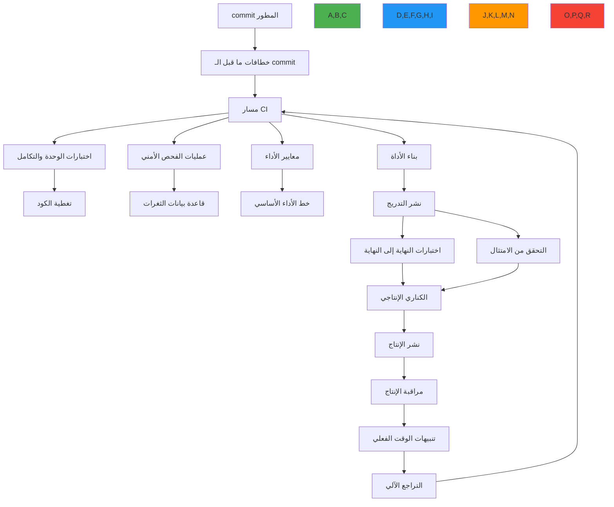

# استراتيجية الاختبار المستمر

**الهدف**: دليل شامل لتطبيق الاختبار المستمر لـ RDAPify عبر بيئات التطوير والتدريج والإنتاج مع التركيز على التحقق الأمني والأداء والامتثال
**ذات صلة**: [متجهات الاختبار](test-vectors.md) | [أمثلة حقيقية](real-examples.md) | [نظرة عامة على الاختبار](overview.md)
**وقت القراءة**: 7 دقائق

## نظرة عامة على معمارية الاختبار المستمر

تتسم استراتيجية الاختبار المستمر في RDAPify بالتحقق من النهاية إلى النهاية عبر دورة تسليم البرمجيات، مضمونةً أن كل تغيير يحافظ على الامتثال البروتوكولي وحدود الأمان وخصائص الأداء:



### مبادئ الاختبار الأساسية
✅ **نقل الأمان يساراً**: التحقق الأمني في كل مرحلة، من الـ commit إلى الإنتاج
✅ **تكافؤ الإنتاج**: تعكس بيئات الاختبار إعداد الإنتاج وأنماط البيانات
✅ **أتمتة الامتثال**: المتطلبات التنظيمية (GDPR وCCPA) تتحقق تلقائياً في المسار
✅ **بوابات الأداء**: حدود صارمة تمنع انحدارات الأداء من الوصول إلى الإنتاج
✅ **تكامل قابلية الرصد**: تغذي نتائج الاختبار مباشرة أنظمة المراقبة والتنبيه
✅ **مسارات ذاتية الشفاء**: معالجة تلقائية لحالات فشل الاختبار الشائعة ومشكلات البنية التحتية

## تطبيق مسار CI/CD

### 1. إعداد مسار GitHub Actions
```yaml
# .github/workflows/continuous-testing.yml
name: Continuous Testing Pipeline

on:
  push:
    branches: [ main, develop ]
  pull_request:
    branches: [ main ]
  schedule:
    - cron: '0 2 * * *'  # يومياً الساعة 2 صباحاً UTC
  workflow_dispatch:  # تشغيل يدوي

env:
  NODE_VERSION: 20
  CACHE_VERSION: 1
  SECURITY_LEVEL: high
  PERFORMANCE_THRESHOLD: 0.95  # 95% من أداء الخط الأساسي

jobs:
  lint-and-typecheck:
    runs-on: ubuntu-latest
    steps:
      - uses: actions/checkout@v4

      - name: Setup Node.js
        uses: actions/setup-node@v4
        with:
          node-version: ${{ env.NODE_VERSION }}
          cache: 'npm'

      - name: Install Dependencies
        run: npm ci --omit=dev

      - name: Run ESLint
        run: npm run lint

      - name: Run TypeScript Check
        run: npm run typecheck

  unit-tests:
    runs-on: ubuntu-latest
    needs: [lint-and-typecheck]
    strategy:
      matrix:
        node-version: [18, 20, 22]
    steps:
      - uses: actions/checkout@v4
        with:
          fetch-depth: 0  # مطلوب للتغطية

      - name: Setup Node.js ${{ matrix.node-version }}
        uses: actions/setup-node@v4
        with:
          node-version: ${{ matrix.node-version }}
          cache: 'npm'

      - name: Install Dependencies
        run: npm ci

      - name: Run Unit Tests
        run: npm run test:unit -- --coverage
        env:
          JEST_JUNIT_OUTPUT: test-results/junit/unit.xml

      - name: Upload Coverage Report
        uses: actions/upload-artifact@v4
        with:
          name: coverage-unit-node${{ matrix.node-version }}
          path: coverage/

  security-scans:
    runs-on: ubuntu-latest
    needs: [lint-and-typecheck]
    steps:
      - uses: actions/checkout@v4

      - name: Setup Node.js
        uses: actions/setup-node@v4
        with:
          node-version: ${{ env.NODE_VERSION }}
          cache: 'npm'

      - name: Install Security Dependencies
        run: |
          npm install -g @snyk/cli trivy
          npm ci

      - name: Snyk Dependency Scan
        run: snyk test --all-projects --fail-on-severity=high
        env:
          SNYK_TOKEN: ${{ secrets.SNYK_TOKEN }}

      - name: Trivy Container Scan
        run: |
          docker build -t rdapify:test .
          trivy image --severity CRITICAL,HIGH --exit-code 1 rdapify:test
        if: github.ref == 'refs/heads/main'

      - name: Semgrep Code Scan
        uses: returntocorp/semgrep-action@v1
        with:
          config: >-
            p/security-audit
            p/secrets
            p/nodejsscan
          generate_sarif: "true"

      - name: Upload SARIF Report
        uses: github/codeql-action/upload-sarif@v3
        with:
          sarif_file: semgrep.sarif

  performance-benchmarks:
    runs-on: ubuntu-latest
    needs: [unit-tests]
    timeout-minutes: 15
    steps:
      - uses: actions/checkout@v4

      - name: Setup Node.js
        uses: actions/setup-node@v4
        with:
          node-version: ${{ env.NODE_VERSION }}
          cache: 'npm'

      - name: Install Dependencies
        run: npm ci

      - name: Run Performance Benchmarks
        run: npm run benchmark -- --threshold ${{ env.PERFORMANCE_THRESHOLD }}
        env:
          BENCHMARK_ENV: ci

      - name: Upload Benchmark Results
        uses: actions/upload-artifact@v4
        with:
          name: benchmark-results-${{ github.sha }}
          path: benchmark-results/

  compliance-validation:
    runs-on: ubuntu-latest
    needs: [unit-tests, security-scans]
    steps:
      - uses: actions/checkout@v4

      - name: Setup Node.js
        uses: actions/setup-node@v4
        with:
          node-version: ${{ env.NODE_VERSION }}
          cache: 'npm'

      - name: Install Dependencies
        run: npm ci

      - name: Run GDPR Compliance Tests
        run: npm run test:compliance -- --jurisdiction EU
        env:
          COMPLIANCE_LEVEL: strict

      - name: Run CCPA Compliance Tests
        run: npm run test:compliance -- --jurisdiction US-CA
        env:
          COMPLIANCE_LEVEL: strict

      - name: Validate Test Vectors
        run: npm run test:vectors
        env:
          VECTOR_SET: production

  staging-deployment:
    runs-on: ubuntu-latest
    needs: [performance-benchmarks, compliance-validation]
    if: github.ref == 'refs/heads/main'
    environment: staging
    steps:
      - uses: actions/checkout@v4

      - name: Deploy to Staging
        run: ./scripts/deploy-staging.sh
        env:
          STAGING_API_KEY: ${{ secrets.STAGING_API_KEY }}

      - name: Run End-to-End Tests
        run: npm run test:e2e
        env:
          TEST_ENV: staging

      - name: Run Production Simulation
        run: npm run test:simulation
        env:
          SIMULATION_MODE: production-like

  production-deployment:
    runs-on: ubuntu-latest
    needs: [staging-deployment]
    if: github.ref == 'refs/heads/main'
    environment: production
    steps:
      - uses: actions/checkout@v4

      - name: Approve Production Deployment
        uses: phani-innovations/approval-gate@v1
        with:
          environment: production
          reviewers: 'maintainers'
          min_required_approvals: 2

      - name: Deploy to Production
        run: ./scripts/deploy-production.sh
        env:
          PRODUCTION_API_KEY: ${{ secrets.PRODUCTION_API_KEY }}
          CANARY_PERCENTAGE: 5

      - name: Monitor Canary Deployment
        run: ./scripts/monitor-canary.sh
        env:
          MONITORING_DURATION: 300  # 5 دقائق

      - name: Full Production Rollout
        if: steps.monitor-canary.outcome == 'success'
        run: ./scripts/full-rollout.sh
        env:
          PRODUCTION_API_KEY: ${{ secrets.PRODUCTION_API_KEY }}

      - name: Post-Deployment Verification
        run: npm run test:smoke
        env:
          TEST_ENV: production
```

### 2. لوحة مراقبة مسار الاختبار
```typescript
// src/monitoring/test-pipeline-dashboard.ts
import { TestPipelineMetrics } from '../types';

export class TestPipelineDashboard {
  private metricsCollector: MetricsCollector;
  private alertManager: AlertManager;

  constructor(options: {
    metricsCollector?: MetricsCollector;
    alertManager?: AlertManager;
  } = {}) {
    this.metricsCollector = options.metricsCollector || new DefaultMetricsCollector();
    this.alertManager = options.alertManager || new DefaultAlertManager();
  }

  async collectPipelineMetrics(): Promise<TestPipelineMetrics> {
    const startTime = Date.now();

    try {
      // جمع المقاييس من جميع مراحل المسار
      const lintMetrics = await this.collectStageMetrics('lint');
      const unitMetrics = await this.collectStageMetrics('unit-tests');
      const securityMetrics = await this.collectStageMetrics('security-scans');
      const performanceMetrics = await this.collectStageMetrics('performance-benchmarks');
      const complianceMetrics = await this.collectStageMetrics('compliance-validation');
      const deploymentMetrics = await this.collectStageMetrics('deployment');

      // حساب صحة المسار الإجمالية
      const healthScore = this.calculateHealthScore({
        lintMetrics,
        unitMetrics,
        securityMetrics,
        performanceMetrics,
        complianceMetrics,
        deploymentMetrics
      });

      // اكتشاف الشذوذات
      const anomalies = await this.detectAnomalies({
        healthScore,
        unitMetrics,
        performanceMetrics
      });

      // توليد تقرير المقاييس
      const metrics: TestPipelineMetrics = {
        timestamp: new Date().toISOString(),
        duration: Date.now() - startTime,
        healthScore,
        anomalies,
        stages: {
          lint: lintMetrics,
          unitTests: unitMetrics,
          securityScans: securityMetrics,
          performanceBenchmarks: performanceMetrics,
          complianceValidation: complianceMetrics,
          deployment: deploymentMetrics
        },
        trends: await this.getTrends()
      };

      // إرسال تنبيهات للمشكلات الحرجة
      await this.sendAlerts(metrics);

      // تخزين المقاييس للتحليل التاريخي
      await this.storeMetrics(metrics);

      return metrics;
    } catch (error) {
      console.error('Failed to collect pipeline metrics:', error);
      throw error;
    }
  }

  private calculateHealthScore(metrics: any): number {
    // حساب درجة الصحة الموزونة
    const weights = {
      unitTests: 0.3,
      securityScans: 0.25,
      performanceBenchmarks: 0.2,
      complianceValidation: 0.15,
      deployment: 0.1
    };

    return (
      metrics.unitMetrics.successRate * weights.unitTests +
      (1 - metrics.securityMetrics.vulnerabilityCount / 10) * weights.securityScans +
      (metrics.performanceMetrics.score / 100) * weights.performanceBenchmarks +
      metrics.complianceMetrics.complianceScore * weights.complianceValidation +
      (metrics.deploymentMetrics.success ? 1 : 0) * weights.deployment
    );
  }

  private async detectAnomalies(metrics: AnomalyInput): Promise<Anomaly[]> {
    const anomalies: Anomaly[] = [];

    // اكتشاف انحدار الأداء
    if (metrics.performanceMetrics.duration > metrics.performanceMetrics.baseline * 1.2) {
      anomalies.push({
        type: 'performance_regression',
        severity: 'high',
        description: `تم اكتشاف انحدار في الأداء: ${metrics.performanceMetrics.duration} مللي ثانية مقابل الخط الأساسي ${metrics.performanceMetrics.baseline} مللي ثانية`,
        timestamp: new Date().toISOString()
      });
    }

    // اكتشاف تقطع الاختبار
    if (metrics.unitMetrics.flakyTestCount > 5) {
      anomalies.push({
        type: 'test_flakiness',
        severity: 'medium',
        description: `تم اكتشاف ${metrics.unitMetrics.flakyTestCount} اختبار متقطع`,
        timestamp: new Date().toISOString()
      });
    }

    // اكتشاف اتجاه الثغرات الأمنية
    if (metrics.securityMetrics.newVulnerabilities > 3) {
      anomalies.push({
        type: 'security_trend',
        severity: 'critical',
        description: `تم اكتشاف ${metrics.securityMetrics.newVulnerabilities} ثغرة أمنية جديدة`,
        timestamp: new Date().toISOString()
      });
    }

    return anomalies;
  }
}
```

## أتمتة الأمان والامتثال

### 1. تكامل الفحص الأمني المستمر
```typescript
// src/security/continuous-security-scans.ts
export class ContinuousSecurityScanner {
  private static readonly CRITICAL_VULNERABILITY_THRESHOLD = 0;
  private static readonly HIGH_VULNERABILITY_THRESHOLD = 1;

  async runComprehensiveSecurityScan(): Promise<SecurityScanResult> {
    const startTime = Date.now();
    const results: SecurityScanResult = {
      timestamp: new Date().toISOString(),
      duration: 0,
      status: 'success',
      vulnerabilities: {
        critical: 0,
        high: 0,
        medium: 0,
        low: 0
      },
      scans: [],
      recommendations: [],
      complianceStatus: {
        gdpr: 'compliant',
        ccpa: 'compliant',
        soc2: 'compliant'
      }
    };

    try {
      // تشغيل جميع عمليات الفحص الأمني بالتوازي
      const [
        sastResults,
        dependencyResults,
        containerResults,
        complianceResults
      ] = await Promise.all([
        this.runSASTScan(),
        this.runDependencyScan(),
        this.runContainerScan(),
        this.runComplianceScan()
      ]);

      // تجميع النتائج
      results.scans = [
        ...sastResults.scans,
        ...dependencyResults.scans,
        ...containerResults.scans,
        ...complianceResults.scans
      ];

      results.vulnerabilities = {
        critical: sastResults.vulnerabilities.critical +
                  dependencyResults.vulnerabilities.critical +
                  containerResults.vulnerabilities.critical,
        high: sastResults.vulnerabilities.high +
              dependencyResults.vulnerabilities.high +
              containerResults.vulnerabilities.high,
        medium: sastResults.vulnerabilities.medium +
                dependencyResults.vulnerabilities.medium +
                containerResults.vulnerabilities.medium,
        low: sastResults.vulnerabilities.low +
             dependencyResults.vulnerabilities.low +
             containerResults.vulnerabilities.low
      };

      results.complianceStatus = {
        gdpr: complianceResults.complianceStatus.gdpr,
        ccpa: complianceResults.complianceStatus.ccpa,
        soc2: complianceResults.complianceStatus.soc2
      };

      // توليد التوصيات
      results.recommendations = this.generateRecommendations(results);

      // تحديد الحالة الإجمالية
      if (results.vulnerabilities.critical > ContinuousSecurityScanner.CRITICAL_VULNERABILITY_THRESHOLD ||
          results.vulnerabilities.high > ContinuousSecurityScanner.HIGH_VULNERABILITY_THRESHOLD) {
        results.status = 'failed';
      }

      results.duration = Date.now() - startTime;
      return results;
    } catch (error) {
      results.status = 'error';
      results.error = error.message;
      results.duration = Date.now() - startTime;
      throw error;
    }
  }

  private generateRecommendations(results: SecurityScanResult): Recommendation[] {
    const recommendations: Recommendation[] = [];

    // الثغرات الحرجة
    if (results.vulnerabilities.critical > 0) {
      recommendations.push({
        priority: 'critical',
        description: `تم العثور على ${results.vulnerabilities.critical} ثغرة حرجة. يتطلب معالجة فورية.`,
        action: 'حجب المسار وإصلاح جميع الثغرات الحرجة',
        owners: ['security-team', 'engineering-lead']
      });
    }

    // الثغرات العالية
    if (results.vulnerabilities.high > 0) {
      recommendations.push({
        priority: 'high',
        description: `تم العثور على ${results.vulnerabilities.high} ثغرة عالية. يجب المعالجة قبل الإصدار التالي.`,
        action: 'جدولة الإصلاحات خلال 48 ساعة',
        owners: ['security-team', 'engineering-lead']
      });
    }

    // مشكلات الامتثال
    if (results.complianceStatus.gdpr !== 'compliant' ||
        results.complianceStatus.ccpa !== 'compliant' ||
        results.complianceStatus.soc2 !== 'compliant') {
      recommendations.push({
        priority: 'high',
        description: 'تم اكتشاف انتهاكات الامتثال',
        action: 'التواصل مع فريق الامتثال فوراً',
        owners: ['compliance-team', 'legal']
      });
    }

    return recommendations;
  }
}
```

## منع انحدار الأداء

### 1. إدارة خط الأداء الأساسي
```typescript
// src/performance/baseline-manager.ts
import { PerformanceBaseline } from '../types';

export class PerformanceBaselineManager {
  private baselineStore = new Map<string, PerformanceBaseline>();
  private versionHistory = new Map<string, PerformanceBaseline[]>();

  constructor(private options: {
    storagePath?: string;
    autoUpdateThreshold?: number; // نسبة التغيير لتشغيل التحديث التلقائي
    maxHistory?: number;
  } = {}) {
    this.options.autoUpdateThreshold = options.autoUpdateThreshold || 5.0; // حد 5%
    this.options.maxHistory = options.maxHistory || 10;
  }

  async loadBaseline(testId: string, environment: string): Promise<PerformanceBaseline> {
    const cacheKey = this.generateCacheKey(testId, environment);

    // التحقق من الذاكرة المؤقتة أولاً
    if (this.baselineStore.has(cacheKey)) {
      return this.baselineStore.get(cacheKey)!;
    }

    // تحميل من التخزين
    try {
      const baseline = await this.loadFromStorage(testId, environment);
      this.baselineStore.set(cacheKey, baseline);
      return baseline;
    } catch (error) {
      // إنشاء خط أساسي افتراضي إذا لم يُعثر عليه
      const defaultBaseline = this.createDefaultBaseline(testId, environment);
      await this.saveBaseline(defaultBaseline);
      this.baselineStore.set(cacheKey, defaultBaseline);
      return defaultBaseline;
    }
  }

  async updateBaseline(testId: string, environment: string, newResults: TestResults): Promise<void> {
    const currentBaseline = await this.loadBaseline(testId, environment);
    const significantChange = this.detectSignificantChange(currentBaseline, newResults);

    if (significantChange || this.shouldForceUpdate(newResults)) {
      // إنشاء إصدار خط أساسي جديد
      const newBaseline: PerformanceBaseline = {
        id: `baseline-${Date.now()}-${Math.random().toString(36).slice(2, 8)}`,
        testId,
        environment,
        timestamp: new Date().toISOString(),
        metrics: this.extractMetrics(newResults),
        version: currentBaseline.version + 1,
        previousId: currentBaseline.id,
        changeReason: significantChange?.reason || 'forced_update'
      };

      // حفظ الخط الأساسي الجديد
      await this.saveBaseline(newBaseline);

      // تحديث السجل التاريخي
      this.updateVersionHistory(testId, environment, newBaseline);

      // إبطال الذاكرة المؤقتة
      this.baselineStore.delete(this.generateCacheKey(testId, environment));
    }
  }

  private detectSignificantChange(baseline: PerformanceBaseline, results: TestResults): ChangeDetectionResult | null {
    const changes: MetricChange[] = [];

    // مقارنة كل مقياس
    for (const [metricName, metricValue] of Object.entries(results.metrics)) {
      const baselineValue = baseline.metrics[metricName];
      if (baselineValue !== undefined) {
        const changePercent = ((metricValue - baselineValue) / baselineValue) * 100;

        if (Math.abs(changePercent) > this.options.autoUpdateThreshold!) {
          changes.push({
            name: metricName,
            baseline: baselineValue,
            current: metricValue,
            changePercent,
            direction: changePercent > 0 ? 'increase' : 'decrease'
          });
        }
      }
    }

    if (changes.length > 0) {
      return {
        significant: true,
        changes,
        reason: `تم اكتشاف تغيير في الأداء في ${changes.length} مقاييس تجاوز حد ${this.options.autoUpdateThreshold}%`
      };
    }

    return null;
  }
}
```

## استكشاف مشكلات الاختبار المستمر الشائعة

### 1. فشل المسار المتقطع
**الأعراض**: ينجح المسار بنسبة عالية لكن يفشل أحياناً بدون تغييرات واضحة في الكود
**الأسباب الجذرية**:
- ظروف سباق في اختبارات غير متزامنة
- موارد بنية تحتية متغيرة في بيئات CI المشتركة
- اختبارات تعتمد على الوقت تفشل في الحالات الحدية
- تسريبات موارد تؤثر على الاختبارات اللاحقة

**خطوات التشخيص**:
```bash
# تحديد الاختبارات المتقطعة
jest --testResultsProcessor=jest-flaky-test-detector --runInBand

# تشغيل الاختبارات مع زيادة التسجيل
DEBUG=* jest --verbose --detectOpenHandles 2>&1 | tee debug.log

# تحليل رسائل فشل المسار
gh run list --workflow=continuous-testing.yml --status=failure --limit=10
gh run view <run-id> --log-failed
```

**الحلول**:
✅ **تتبع الاختبارات المتقطعة**: تطبيق تتبع الاختبارات المتقطعة بإعادة محاولة تلقائية وتقارير
✅ **تحسين عزل الاختبار**: التأكد من تنظيف الحالة المشتركة بشكل صحيح بين الاختبارات
✅ **معالجة الاعتماد على الوقت**: استبدال التحققات المعتمدة على الوقت بتحققات مستندة إلى الحدث
✅ **مراقبة الموارد**: إضافة مراقبة للموارد لاكتشاف استنفاد الموارد في بيئات CI

### 2. انكسار بوابات أداء المسار
**الأعراض**: المسار يفشل بسبب انتهاكات أداء رغم عدم وجود تغييرات كود مقصودة للأداء
**الأسباب الجذرية**:
- خطوط أداء أساسية لم تعد تعكس الأداء المتوقع
- موارد CI متغيرة تؤثر على نتائج معياريات الأداء
- تبعيات خارجية أبطأ تؤثر على أوقات الاستجابة

**خطوات التشخيص**:
```bash
# مقارنة أوقات تنفيذ المعياريات الأخيرة
node ./scripts/benchmark-history.js --last 10 --metric p95_latency

# تشغيل المعياريات على بنية تحتية معزولة
docker run --cpus=2 --memory=4g rdapify:test npm run benchmark

# مقارنة مع الخط الأساسي
npm run benchmark -- --compare-to baseline-2025-12-01.json
```

**الحلول**:
✅ **حدود أداء قابلة للتكيف**: ضبط عتبات الأداء تلقائياً بناءً على إمكانيات البنية التحتية
✅ **بيئة CI مخصصة للأداء**: استخدام عداء مخصص ثابت الأداء للاختبارات المعيارية
✅ **تحديثات خط أساسي دورية**: مراجعة وتحديث خطوط الأداء الأساسية بشكل دوري

### 3. تطابق استجابات السجل
**الأعراض**: تفشل اختبارات التكامل بسبب تغييرات في استجابات السجل الحي
**الأسباب الجذرية**:
- تحديثات تنسيق RDAP في سجلات مختلفة
- تغييرات في حقول GDPR في استجابات RIPE
- إضافة متطلبات رأس جديدة أو تغييرها

**الحلول**:
✅ **كناري RDAP**: تشغيل اختبارات صغيرة مقابل سجلات حية بشكل دوري للكشف المبكر عن تغييرات التنسيق
✅ **محاكاة إصدار التثبيتات**: تعيين إصدار لتثبيتات الاختبار وتحديثها مع تغييرات السجل الموثقة
✅ **خطوط أساسية مرنة للمخطط**: استخدام JSONPath للتحقق من الحقول الأساسية بدلاً من مقارنة الاستجابة الكاملة

## الوثائق ذات الصلة

| الوثيقة | الوصف | المسار |
|---------|-------|--------|
| [متجهات الاختبار](test-vectors.md) | مجموعات بيانات اختبار شاملة | [test-vectors.md](test-vectors.md) |
| [نظرة عامة على الاختبار](overview.md) | استراتيجية الاختبار الشاملة | [overview.md](overview.md) |
| [أمثلة حقيقية](real-examples.md) | الاختبار بيانات السجل الحقيقية | [real-examples.md](real-examples.md) |
| [التثبيتات](fixtures.md) | إدارة ملفات بيانات الاختبار | [fixtures.md](fixtures.md) |

## مواصفات الاختبار المستمر

| الخاصية | القيمة |
|---------|--------|
| **تكرار التشغيل** | كل commit، تشغيل ليلي كامل، نشر مجدول يومياً |
| **وقت تنفيذ المسار** | أقل من 15 دقيقة (المسار الكامل)، أقل من 5 دقائق (المسار السريع) |
| **بوابات الأداء** | P50 أقل من 200 مللي ثانية، P95 أقل من 500 مللي ثانية، معدل خطأ أقل من 0.1% |
| **عتبة التغطية** | 95% جمل، 90% فروع، 98% دوال |
| **سياسة الثغرات** | حد صفر لثغرات حرجة/عالية في بناء الإصدار |
| **إطار الامتثال** | GDPR (المادة 6 و32)، CCPA، SOC 2 النوع II |
| **استراتيجية التراجع** | تراجع تلقائي عند اكتشاف انحدار الأداء أو الثغرات |
| **الاحتفاظ بنتائج الاختبار** | 90 يوماً لبيانات الأداء، 365 يوماً للبيانات الأمنية |
| **آخر تحديث** | 5 ديسمبر 2025 |

> **تذكير حرج**: لا تتجاوز بوابات الأمان أو تخفض عتبات التغطية لتحقيق إصدارات أسرع. يجب أن تحافظ جميع التغييرات على الامتثال الكامل مع المتطلبات الأمنية والامتثال قبل الوصول إلى الإنتاج. نفِّذ مراجعات دورية لفعالية مسار الاختبار وحدّث استراتيجيات الاختبار بناءً على أنماط الحوادث الإنتاجية.

[← العودة إلى الاختبار](../README.md) | [التالي: نظرة عامة على الاختبار ←](overview.md)

*وثيقة مُولَّدة تلقائياً من الكود المصدري مع مراجعة أمنية في 5 ديسمبر 2025*
