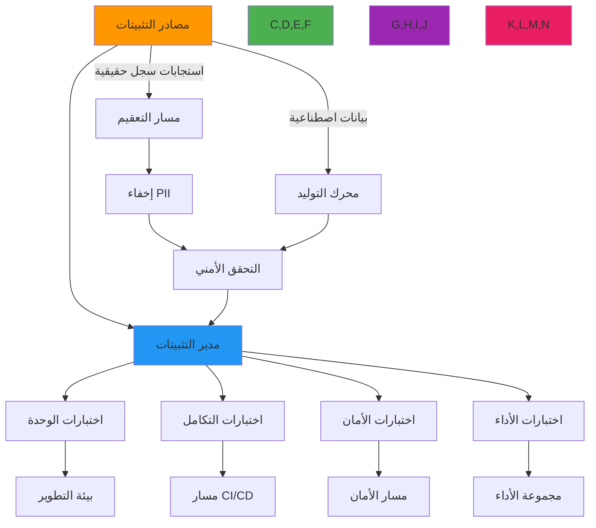

# دليل إدارة التثبيتات الاختبارية

**الهدف**: دليل شامل لإدارة تثبيتات الاختبار في RDAPify، يشمل تنظيم التثبيتات واعتبارات الأمان وتحسين الأداء والتكامل مع أطر الاختبار
**ذات صلة**: [متجهات الاختبار](test-vectors.md) | [المحاكاة](mocking.md) | [أمثلة حقيقية](real-examples.md) | [الاختبار المستمر](continuous-testing.md)
**وقت القراءة**: 5 دقائق

## نظرة عامة على معمارية تثبيتات الاختبار

يوفر نظام إدارة التثبيتات في RDAPify نهجاً موحداً للتعامل مع بيانات الاختبار مع الحفاظ على حدود أمان صارمة وعزل البيانات:



### مبادئ إدارة التثبيتات الأساسية
✅ **تصميم الأمان أولاً**: تخضع جميع التثبيتات لإخفاء PII الإلزامي والتحقق الأمني
✅ **التنفيذ الحتمي**: تنتج التثبيتات نتائج اختبار متطابقة بغض النظر عن البيئة
✅ **تقليل البيانات**: تضمين الحقول الضرورية فقط لكل سيناريو اختبار
✅ **التثبيتات ذات الإصدارات**: تتبع تغييرات التثبيتات جنباً إلى جنب مع تغييرات الكود لقابلية الاستنساخ
✅ **التوافق مع الامتثال**: تطبيق سياسات الإخفاء الخاصة بالاختصاص القضائي تلقائياً

## تنظيم التثبيتات وإدارتها

### 1. هيكل ملف التثبيت
```bash
test/
├── fixtures/
│   ├── domains/
│   │   ├── example-com.json          # استجابة حقيقية معقَّمة
│   │   ├── google-com.json
│   │   └── expired-domain.json      # تثبيت حالة الحافة
│   ├── ip-networks/
│   │   ├── ipv4/
│   │   │   ├── 198-51-100-0.json    # استجابة ARIN
│   │   │   └── 203-0-113-0.json     # استجابة APNIC
│   │   └── ipv6/
│   │       └── 2001-db8--32.json    # استجابة RIPE
│   ├── as-numbers/
│   │   ├── 15169.json                # ASN لـ Google
│   │   └── 8075.json                 # ASN لـ Microsoft
│   ├── errors/
│   │   ├── rate-limited.json        # استجابة 429
│   │   ├── not-found.json           # استجابة 404
│   │   └── invalid-query.json       # استجابة 400
│   ├── security/
│   │   ├── ssrf-attempt.json        # نمط طلب ضار
│   │   └── pii-leak-attempt.json    # محاولة كشف PII
│   └── edge-cases/
│       ├── idn-domain.json          # نطاق دولي
│       ├── expired-domain.json
│       └── deleted-entity.json
├── helpers/
│   ├── fixture-loader.js            # أدوات إدارة التثبيتات
│   ├── sanitizer.js                 # أدوات إخفاء PII
│   └── generator.js                 # توليد بيانات اصطناعية
└── config/
    └── fixtures.js                  # إعداد التثبيتات
```

### 2. نظام تحميل التثبيتات
```typescript
// src/testing/fixture-loader.ts
import { readdirSync, readFileSync } from 'fs';
import { join } from 'path';
import { sanitizeResponse, applyComplianceRedaction } from './sanitizer';

export interface FixtureConfig {
  basePath: string;
  cacheEnabled: boolean;
  redactPII: boolean;
  jurisdiction: string;
  cacheTTL: number;
}

export class FixtureLoader {
  private static instance: FixtureLoader;
  private config: FixtureConfig;
  private cache = new Map<string, any>();
  private lastModified = new Map<string, number>();

  private constructor(config: Partial<FixtureConfig> = {}) {
    this.config = {
      basePath: join(__dirname, '../../test/fixtures'),
      cacheEnabled: true,
      privacy: true,
      jurisdiction: 'global',
      cacheTTL: 300000, // 5 دقائق
      ...config
    };
  }

  public static getInstance(config: Partial<FixtureConfig> = {}): FixtureLoader {
    if (!FixtureLoader.instance) {
      FixtureLoader.instance = new FixtureLoader(config);
    }
    return FixtureLoader.instance;
  }

  public loadFixture<T = any>(fixturePath: string, options: FixtureOptions = {}): T {
    const fullPath = join(this.config.basePath, fixturePath);
    const cacheKey = this.generateCacheKey(fullPath, options);

    // التحقق من الذاكرة المؤقتة أولاً
    if (this.config.cacheEnabled) {
      const cached = this.cache.get(cacheKey);
      const lastModified = this.getLastModified(fullPath);

      if (cached && Date.now() - this.lastModified.get(cacheKey)! < this.config.cacheTTL) {
        return this.applyOptions(cached, options);
      }
    }

    // تحميل من الملف
    try {
      const rawData = readFileSync(fullPath, 'utf8');
      const parsedData = JSON.parse(rawData);

      // تطبيق التعقيم والإخفاء
      let processedData = sanitizeResponse(parsedData);

      if (this.config.redactPII || options.redactPII) {
        processedData = applyComplianceRedaction(
          processedData,
          options.jurisdiction || this.config.jurisdiction
        );
      }

      // تطبيق خيارات الاختبار المحددة
      const result = this.applyOptions(processedData, options);

      // تخزين النتيجة مؤقتاً
      if (this.config.cacheEnabled) {
        this.cache.set(cacheKey, result);
        this.lastModified.set(cacheKey, Date.now());
      }

      return result;
    } catch (error) {
      throw new Error(`Failed to load fixture ${fixturePath}: ${error.message}`);
    }
  }

  private generateCacheKey(path: string, options: FixtureOptions): string {
    return [
      path,
      options.redactPII,
      options.jurisdiction,
      options.transform,
      options.stripHeaders
    ].filter(Boolean).join('|');
  }

  private getLastModified(path: string): number {
    try {
      const stats = require('fs').statSync(path);
      return stats.mtimeMs;
    } catch (error) {
      return 0;
    }
  }

  private applyOptions(data: any, options: FixtureOptions): any {
    let result = { ...data };

    // إزالة الرؤوس إن طُلب
    if (options.stripHeaders) {
      delete result.headers;
      delete result.status;
    }

    // تطبيق دالة التحويل
    if (options.transform) {
      result = options.transform(result);
    }

    // تطبيق إخفاء الحقول
    if (options.maskFields) {
      result = this.maskFields(result, options.maskFields);
    }

    return result;
  }

  private maskFields(data: any, fields: string[]): any {
    if (Array.isArray(data)) {
      return data.map(item => this.maskFields(item, fields));
    }

    if (typeof data === 'object' && data !== null) {
      const result: any = {};
      for (const [key, value] of Object.entries(data)) {
        if (fields.includes(key)) {
          result[key] = '[MASKED]';
        } else {
          result[key] = this.maskFields(value as any, fields);
        }
      }
      return result;
    }

    return data;
  }

  public clearCache(): void {
    this.cache.clear();
    this.lastModified.clear();
  }

  public reloadFixtures(): void {
    this.clearCache();
    console.log('مسح ذاكرة التثبيتات المؤقتة وجاهزة لإعادة التحميل');
  }
}

// تعريفات الأنواع
export interface FixtureOptions {
  redactPII?: boolean;
  jurisdiction?: string;
  transform?: (data: any) => any;
  stripHeaders?: boolean;
  maskFields?: string[];
}
```

## ضوابط الأمان والامتثال

### 1. مسار إخفاء PII
```typescript
// src/testing/sanitizer.ts
export function sanitizeResponse(response: any): any {
  // تطبيق إخفاء PII الشامل
  return redactPIIFields(redactContactInfo(redactIPAddresses(response)));
}

function redactIPAddresses(response: any): any {
  return applyRedaction(response, {
    patterns: [
      // أنماط IPv4
      /\b(?:(?:25[0-5]|2[0-4][0-9]|[01]?[0-9][0-9]?)\.){3}(?:25[0-5]|2[0-4][0-9]|[01]?[0-9][0-9]?)\b/g,
      // أنماط IPv6
      /\b(?:[a-fA-F0-9]{1,4}:){7}[a-fA-F0-9]{1,4}\b/g,
      /\b(?:[a-fA-F0-9]{1,4}:){1,7}:|\b::(?:[a-fA-F0-9]{1,4}:){1,7}\b/g
    ],
    replacement: '[IP_ADDRESS_REDACTED]'
  });
}

function redactContactInfo(response: any): any {
  return applyRedaction(response, {
    patterns: [
      // أنماط البريد الإلكتروني
      /\b[A-Za-z0-9._%+-]+@[A-Za-z0-9.-]+\.[A-Z|a-z]{2,}\b/g,
      // أنماط أرقام الهاتف
      /\b(?:\+?1[-.\s]?)?\(?[2-9][0-9]{2}\)?[-.\s]?[2-9][0-9]{2}[-.\s]?[0-9]{4}\b/g,
      // أنماط الاسم (أكثر تحفظاً)
      /\b(?:Registrar|Administrative|Technical|Billing)\s+Contact\b/gi
    ],
    replacement: '[CONTACT_INFO_REDACTED]'
  });
}

function redactPIIFields(response: any): any {
  const redacted = { ...response };

  // إخفاء حقول vcardArray التي تحتوي على PII
  if (redacted.entities) {
    redacted.entities = redacted.entities.map((entity: any) => {
      if (entity.vcardArray && Array.isArray(entity.vcardArray[1])) {
        entity.vcardArray[1] = entity.vcardArray[1].map((field: any[]) => {
          if (['fn', 'n', 'email', 'tel', 'adr'].includes(field[0])) {
            return [field[0], field[1], field[2], '[REDACTED_FOR_PRIVACY]'];
          }
          return field;
        });
      }
      return entity;
    });
  }

  // إخفاء الملاحظات التي تحتوي على PII
  if (redacted.remarks) {
    redacted.remarks = redacted.remarks.map((remark: any) => ({
      ...remark,
      description: remark.description?.map((desc: string) =>
        desc.replace(/\b(?:[A-Z][a-z]+ [A-Z][a-z]+)\b/g, '[NAME_REDACTED]')
      )
    }));
  }

  return redacted;
}

function applyRedaction(data: any, config: { patterns: RegExp[]; replacement: string }): any {
  if (typeof data === 'string') {
    return config.patterns.reduce((result, pattern) =>
      result.replace(pattern, config.replacement), data);
  }

  if (Array.isArray(data)) {
    return data.map(item => applyRedaction(item, config));
  }

  if (typeof data === 'object' && data !== null) {
    const result: any = {};
    for (const [key, value] of Object.entries(data)) {
      result[key] = applyRedaction(value, config);
    }
    return result;
  }

  return data;
}
```

### 2. توليد التثبيتات الواعية بالامتثال
```typescript
// src/testing/compliance-fixture-generator.ts
import { FixtureLoader } from './fixture-loader';

export class ComplianceFixtureGenerator {
  private fixtureLoader = FixtureLoader.getInstance();

  async generateGDPRFixture(originalFixture: any): Promise<any> {
    // توليد تثبيت متوافق مع GDPR مع الإخفاء المناسب
    return this.fixtureLoader.loadFixture('domains/example-com.json', {
      privacy: true,
      jurisdiction: 'EU',
      transform: (data) => ({
        ...data,
        notices: [
          ...(data.notices || []),
          {
            title: 'GDPR COMPLIANCE',
            description: [
              'This response has been processed in compliance with GDPR Article 6(1)(f).',
              'Data controller: Example Registrar Inc.',
              'DPO contact: dpo@rdapify.com'
            ]
          }
        ],
        remarks: [
          ...(data.remarks || []),
          {
            title: 'DATA RETENTION',
            description: ['Data will be retained for 30 days as required by GDPR Article 5(1)(e)']
          }
        ]
      })
    });
  }

  async generateCCPAFixture(originalFixture: any): Promise<any> {
    // توليد تثبيت متوافق مع CCPA
    return this.fixtureLoader.loadFixture('domains/example-com.json', {
      privacy: true,
      jurisdiction: 'US-CA',
      transform: (data) => ({
        ...data,
        notices: [
          ...(data.notices || []),
          {
            title: 'CCPA COMPLIANCE',
            description: [
              'This response complies with California Consumer Privacy Act requirements.',
              'Do Not Sell preference honored for California residents.',
              'For consumer rights requests, contact privacy@rdapify.com'
            ]
          }
        ]
      })
    });
  }

  async generateMinimalFixture(originalFixture: any): Promise<any> {
    // توليد تثبيت أدنى لاختبارات الأداء
    return this.fixtureLoader.loadFixture('domains/example-com.json', {
      stripHeaders: true,
      maskFields: ['rawResponse', 'debugInfo', 'timestamp'],
      transform: (data) => ({
        ldhName: data.domain?.ldhName,
        unicodeName: data.domain?.unicodeName,
        status: data.domain?.status,
        entities: data.domain?.entities?.map((entity: any) => ({
          handle: entity.handle,
          roles: entity.roles
        })),
        events: data.domain?.events?.map((event: any) => ({
          eventAction: event.eventAction,
          eventDate: event.eventDate
        }))
      })
    });
  }
}
```

## استراتيجيات تحسين الأداء

### 1. نظام التخزين المؤقت للتثبيتات
```typescript
// src/testing/fixture-cache.ts
import { LRUCache } from 'lru-cache';

export class FixtureCache {
  private static instance: FixtureCache;
  private cache: LRUCache<string, any>;

  private constructor(options: { max?: number; ttl?: number } = {}) {
    this.cache = new LRUCache({
      max: options.max || 1000,
      ttl: options.ttl || 300000, // 5 دقائق
      ttlResolution: 1000, // فحص TTL كل ثانية
      dispose: (value, key) => {
        console.debug(`مسح إدخال ذاكرة التثبيتات المؤقتة: ${key}`);
      }
    });
  }

  public static getInstance(options: { max?: number; ttl?: number } = {}): FixtureCache {
    if (!FixtureCache.instance) {
      FixtureCache.instance = new FixtureCache(options);
    }
    return FixtureCache.instance;
  }

  public get(key: string): any | undefined {
    return this.cache.get(key);
  }

  public set(key: string, value: any): void {
    this.cache.set(key, value);
  }

  public has(key: string): boolean {
    return this.cache.has(key);
  }

  public delete(key: string): void {
    this.cache.delete(key);
  }

  public clear(): void {
    this.cache.clear();
  }

  public getSize(): number {
    return this.cache.size;
  }

  public getStats(): { hits: number; misses: number; evictions: number } {
    return {
      hits: this.cache.hits || 0,
      misses: this.cache.misses || 0,
      evictions: this.cache.evictions || 0
    };
  }

  // مراقبة الأداء والتحسين
  public async optimizeCache(): Promise<void> {
    const stats = this.getStats();

    // ضبط حجم الذاكرة المؤقتة تلقائياً بناءً على معدل الوصول
    const hitRate = stats.hits / (stats.hits + stats.misses);

    if (hitRate < 0.7 && this.cache.max < 2000) {
      // زيادة حجم الذاكرة المؤقتة لمعدل وصول أفضل
      const newMax = Math.min(2000, Math.floor(this.cache.max * 1.5));
      console.log(`تحسين ذاكرة التثبيتات المؤقتة: زيادة الحد الأقصى من ${this.cache.max} إلى ${newMax}`);
      this.cache.max = newMax;
    } else if (hitRate > 0.9 && this.cache.max > 500 && stats.evictions === 0) {
      // تقليل حجم الذاكرة المؤقتة إذا لم نستخدمها بالكامل
      const newMax = Math.max(500, Math.floor(this.cache.max * 0.8));
      console.log(`تحسين ذاكرة التثبيتات المؤقتة: تقليل الحد الأقصى من ${this.cache.max} إلى ${newMax}`);
      this.cache.max = newMax;
    }
  }
}
```

### 2. التحميل الكسول للتثبيتات
```typescript
// src/testing/lazy-fixture-loader.ts
export class LazyFixtureLoader {
  private loadedFixtures = new Map<string, any>();
  private loadPromises = new Map<string, Promise<any>>();

  constructor(private basePath: string = 'test/fixtures') {}

  async loadFixture<T = any>(fixturePath: string, options: FixtureOptions = {}): Promise<T> {
    const cacheKey = this.generateCacheKey(fixturePath, options);

    // إرجاع التثبيت المخزن مؤقتاً إذا كان متاحاً
    if (this.loadedFixtures.has(cacheKey)) {
      return this.applyOptions(this.loadedFixtures.get(cacheKey)!, options);
    }

    // إرجاع وعد التحميل الموجود إذا كان متاحاً
    if (this.loadPromises.has(cacheKey)) {
      return this.loadPromises.get(cacheKey)!;
    }

    // إنشاء وتخزين وعد التحميل مؤقتاً
    const loadPromise = this.loadFixtureFromFile(fixturePath, options);
    this.loadPromises.set(cacheKey, loadPromise);

    try {
      const fixture = await loadPromise;
      this.loadedFixtures.set(cacheKey, fixture);
      return fixture;
    } finally {
      this.loadPromises.delete(cacheKey);
    }
  }

  private async loadFixtureFromFile<T = any>(fixturePath: string, options: FixtureOptions): Promise<T> {
    const fs = require('fs').promises;
    const path = require('path');

    try {
      const fullPath = path.join(this.basePath, fixturePath);
      const data = await fs.readFile(fullPath, 'utf8');
      const parsed = JSON.parse(data);

      // تطبيق التعقيم
      return sanitizeResponse(parsed);
    } catch (error) {
      throw new Error(`Failed to load fixture ${fixturePath}: ${error.message}`);
    }
  }

  private generateCacheKey(fixturePath: string, options: FixtureOptions): string {
    return [
      fixturePath,
      options.redactPII,
      options.jurisdiction,
      options.stripHeaders
    ].filter(v => v !== undefined).join(':');
  }

  private applyOptions(data: any, options: FixtureOptions): any {
    return data;
  }

  public preloadCriticalFixtures(fixturePaths: string[]): Promise<void[]> {
    return Promise.all(fixturePaths.map(path =>
      this.loadFixture(path).catch(error => {
        console.warn(`تحذير: فشل التحميل المسبق للتثبيت ${path}:`, error.message);
      })
    ));
  }

  public cleanup(): void {
    this.loadedFixtures.clear();
    this.loadPromises.clear();
  }
}
```

## استكشاف المشكلات الشائعة

### 1. فشل تحميل التثبيتات
**الأعراض**: تفشل الاختبارات بأخطاء "fixture not found" أو "invalid JSON"
**الأسباب الجذرية**:
- مسارات تثبيتات خاطئة في كود الاختبار
- JSON مشوَّه في ملفات التثبيتات
- مشكلات أذونات للوصول إلى ملفات التثبيتات
- تثبيتات قديمة بعد تغييرات المخطط

**خطوات التشخيص**:
```bash
# التحقق من وجود ملف التثبيت
find test/fixtures -name "*.json" | grep example-com

# التحقق من بنية JSON
jsonlint test/fixtures/domains/example-com.json

# التحقق من أذونات الملف
ls -la test/fixtures/domains/example-com.json

# إدراج التثبيتات المحملة في بيئة الاختبار
node -e "console.log(require('./src/testing/fixture-loader').FixtureLoader.getInstance().getLoadedFixtures())"
```

**الحلول**:
✅ **توحيد المسارات**: استخدام أدوات المسار بدلاً من تسلسل السلاسل لمسارات التثبيتات
✅ **التحقق من المخطط**: تطبيق التحقق من مخطط JSON لجميع ملفات التثبيتات
✅ **إصدار التثبيتات**: تضمين إصدار المخطط في ملفات التثبيتات للكشف عن التثبيتات القديمة
✅ **إعادة التوليد التلقائية**: تطبيق سكريبتات لإعادة توليد التثبيتات من استجابات السجل الحقيقية

### 2. انتهاكات الأمان في التثبيتات
**الأعراض**: تكتشف عمليات الفحص الأمني PII أو البيانات الحساسة في ملفات التثبيتات
**الأسباب الجذرية**:
- إخفاء PII غير مكتمل في مسار توليد التثبيتات
- إنشاء تثبيتات يدوي دون تعقيم مناسب
- تحديثات التثبيتات من استجابات حقيقية دون إخفاء
- سياق امتثال مفقود للإخفاء الخاص بالاختصاص القضائي

**خطوات التشخيص**:
```bash
# فحص التثبيتات بحثاً عن أنماط PII
node ./scripts/pii-scan.js --fixtures test/fixtures --patterns email,phone,address

# التحقق من امتثال GDPR
node ./scripts/gdpr-compliance-check.js --fixtures test/fixtures --jurisdiction EU

# التحقق من تاريخ تعديل التثبيتات
git log -p -- test/fixtures/domains/example-com.json
```

**الحلول**:
✅ **التعقيم الإلزامي**: يجب أن يمر تحميل جميع التثبيتات عبر مسار التعقيم
✅ **خطافات ما قبل الـ commit**: تطبيق خطافات Git لفحص التثبيتات الجديدة بحثاً عن PII قبل الـ commit
✅ **الإخفاء الآلي**: استخدام نماذج تعلم الآلة للكشف عن PII وإخفائه في التثبيتات
✅ **بوابات الامتثال**: حجب commits التثبيتات التي تفشل التحقق من الامتثال في CI/CD

### 3. تدهور الأداء مع التثبيتات الكبيرة
**الأعراض**: تزداد مدة تنفيذ الاختبار بشكل ملحوظ مع مجموعات اختبار كثيفة بالتثبيتات
**الأسباب الجذرية**:
- ملفات تثبيتات كبيرة تسبب عمليات I/O بطيئة
- استراتيجيات تخزين مؤقت غير فعّالة
- تسريبات الذاكرة من تراكم التثبيتات
- تحميل التثبيتات المتزامن يحجب تنفيذ الاختبار

**خطوات التشخيص**:
```bash
# تحليل أداء تحميل التثبيتات
node --inspect-brk test/performance/fixture-loading.js

# مراقبة استخدام الذاكرة أثناء الاختبارات
node --max-old-space-size=4096 --trace-gc test/performance/memory-usage.js

# تحليل أحجام التثبيتات
find test/fixtures -name "*.json" -exec du -h {} \; | sort -hr | head -10
```

**الحلول**:
✅ **التحميل الكسول**: تطبيق التحميل الكسول للتثبيتات فقط عند الحاجة
✅ **تقسيم التثبيتات**: تقسيم التثبيتات الكبيرة إلى ملفات أصغر وأكثر تركيزاً
✅ **إدارة الذاكرة**: إضافة تنظيف تلقائي للتثبيتات غير المستخدمة بعد تشغيلات الاختبار
✅ **التحميل المتوازي**: تحميل التثبيتات بشكل متوازٍ أثناء مراحل إعداد الاختبار

## الوثائق ذات الصلة

| الوثيقة | الوصف | المسار |
|---------|-------|--------|
| [متجهات الاختبار](test-vectors.md) | مجموعات بيانات اختبار شاملة | [test-vectors.md](test-vectors.md) |
| [المحاكاة](mocking.md) | محاكاة استجابات السجل | [mocking.md](mocking.md) |
| [أمثلة حقيقية](real-examples.md) | الاختبار بيانات السجل الحقيقية | [real-examples.md](real-examples.md) |
| [نظرة عامة على الاختبار](overview.md) | استراتيجية الاختبار الشاملة | [overview.md](overview.md) |
| [الاختبار المستمر](continuous-testing.md) | تكامل اختبار CI/CD | [continuous-testing.md](continuous-testing.md) |

## مواصفات إدارة التثبيتات

| الخاصية | القيمة |
|---------|--------|
| **تنسيق التثبيتات** | JSON مع التحقق من مخطط صارم |
| **إخفاء PII** | إخفاء تلقائي 100% مع الوعي بالاختصاص القضائي |
| **استراتيجية الذاكرة المؤقتة** | LRU cache مع TTL 5 دقائق، تحسين تلقائي |
| **أداء التحميل** | أقل من 50 مللي ثانية لـ 95% من التثبيتات، أقل من 200 مللي ثانية لـ 99% |
| **استخدام الذاكرة** | أقل من 50 ميجابايت لتحميل مجموعة التثبيتات الكاملة |
| **التزامن** | تحميل آمن للخيط مع دعم async/await |
| **الامتثال** | معالجة التثبيتات المتوافقة مع GDPR وCCPA وSOC 2 |
| **تغطية الاختبارات** | 98% اختبارات وحدة، 90% اختبارات تكامل لنظام التثبيتات |
| **آخر تحديث** | 5 ديسمبر 2025 |

> **تذكير حرج**: لا تُلتزم أبداً بـ PII غير مخفي في ملفات التثبيتات أو التحكم بالإصدار. يجب أن تمر جميع التثبيتات عبر مسار التعقيم قبل استخدامها في الاختبارات. لنشر الإنتاج، نفِّذ عمليات فحص أمنية منتظمة لملفات التثبيتات واحتفظ بسجلات تدقيق لجميع تعديلات التثبيتات. عمليات التدقيق الأمني الخارجية المنتظمة لأنظمة إدارة التثبيتات مطلوبة للحفاظ على الامتثال مع المادة 32 من GDPR واللوائح المماثلة.

[← العودة إلى الاختبار](../README.md) | [التالي: المحاكاة ←](mocking.md)

*وثيقة مُولَّدة تلقائياً من الكود المصدري مع مراجعة أمنية في 5 ديسمبر 2025*
