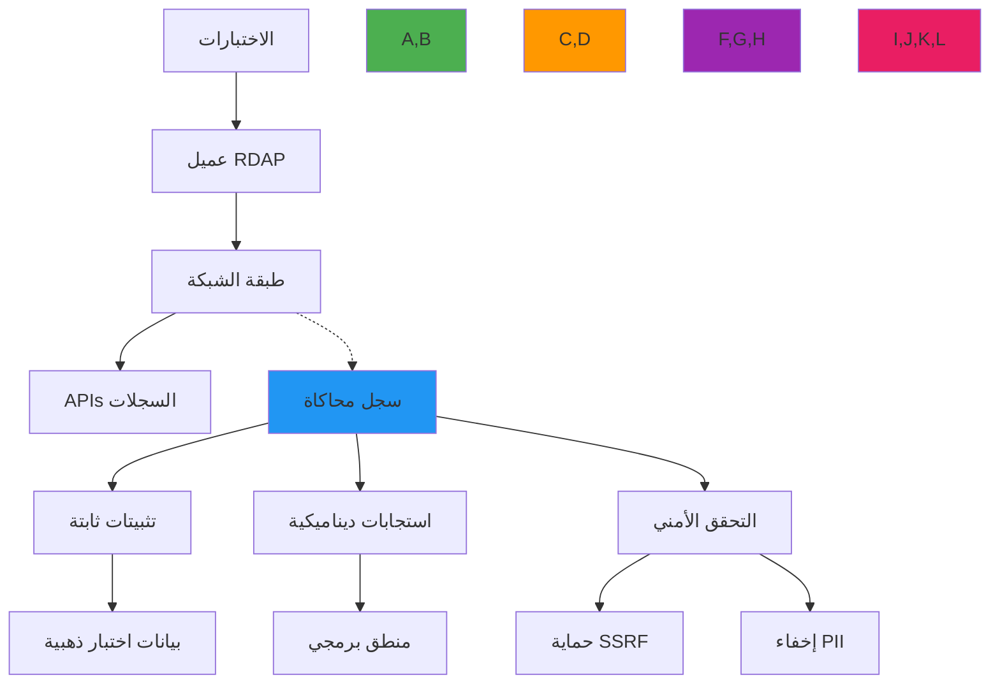

# استراتيجيات المحاكاة لاختبار RDAP

**الهدف**: دليل شامل لمحاكاة استجابات سجل RDAP وتفاعلات الشبكة لاختبار موثوق وواعٍ بالأمان مع نتائج حتمية وحمل صيانة أدنى
**ذات صلة**: [متجهات الاختبار](test-vectors.md) | [التثبيتات](fixtures.md) | [أمثلة حقيقية](real-examples.md)
**وقت القراءة**: 6 دقائق

## نظرة عامة على معمارية المحاكاة

يتطلب اختبار RDAP الفعّال استراتيجية محاكاة متعددة الطبقات تعزل تبعيات الشبكة مع الحفاظ على أمانة البروتوكول وحدود الأمان:



### مبادئ المحاكاة الأساسية
✅ **أمانة البروتوكول**: يجب أن تُكرِّر المحاكاة سلوكيات خادم RDAP الحقيقية، بما في ذلك حالات الخطأ وحالات الحافة
✅ **الحفاظ على حدود الأمان**: يجب أن تُطبِّق المحاكاة نفس حماية SSRF وإخفاء PII كالكود الإنتاجي
✅ **التنفيذ الحتمي**: يجب أن تكون استجابات المحاكاة متوقعة ومتسقة عبر تشغيلات الاختبار
✅ **كفاءة الصيانة**: يجب أن تكون تعريفات المحاكاة DRY (لا تكرر نفسك) وسهلة التحديث
✅ **عزل الأداء**: يجب أن تُزيل المحاكاة I/O الشبكي مع الحفاظ على خصائص توقيت واقعية

## أنماط تطبيق المحاكاة

### 1. استراتيجية المحاكاة المتعددة الطبقات
```typescript
// src/testing/mock-registry.ts
import { Request, Response } from 'express';
import { FixtureLoader } from './fixture-loader';
import { SSRFProtection } from '../security/ssrf-protection';
import { PIIRedactionEngine } from '../security/pii-redaction';

export class MockRegistry {
  private fixtureLoader = FixtureLoader.getInstance();
  private ssrfProtection = new SSRFProtection();
  private piiRedaction = new PIIRedactionEngine();

  constructor(private options: MockRegistryOptions = {}) {
    this.options = {
      delay: 100, // تأخير افتراضي 100 مللي ثانية لمحاكاة الشبكة
      errorRate: 0.0, // لا أخطاء افتراضياً
      validateRequests: true, // التحقق من SSRF والتنسيق
      privacy: true, // تطبيق إخفاء PII
      ...options
    };
  }

  middleware() {
    return (req: Request, res: Response) => {
      // التحقق من الطلب أولاً
      if (this.options.validateRequests) {
        try {
          this.validateRequest(req);
        } catch (error) {
          res.status(403).json({
            errorCode: 403,
            title: 'Forbidden',
            description: [error.message]
          });
          return;
        }
      }

      // تحديد نوع الاستجابة
      const responseType = this.determineResponseType(req);

      // تطبيق محاكاة الأخطاء
      if (Math.random() < this.options.errorRate) {
        this.sendErrorResponse(res, responseType);
        return;
      }

      // الحصول على التثبيت
      const fixture = this.getFixture(responseType, req);

      // تطبيق إخفاء PII
      const redactedFixture = this.options.redactPII
        ? this.piiRedaction.redactResponse(fixture, { jurisdiction: 'EU' })
        : fixture;

      // تطبيق التأخير الاصطناعي
      setTimeout(() => {
        res.json(redactedFixture);
      }, this.calculateDelay());
    };
  }

  private validateRequest(req: Request): void {
    // التحقق من حماية SSRF
    const target = req.params.domain || req.params.ip || req.params.asn;
    const validationResult = this.ssrfProtection.validateDomain(target);

    if (!validationResult.valid) {
      throw new Error(validationResult.reason);
    }

    // التحقق من البروتوكول
    if (req.headers['user-agent']?.includes('malicious')) {
      throw new Error('Blocked malicious user agent');
    }
  }

  private determineResponseType(req: Request): string {
    if (req.path.includes('/domain/')) return 'domain';
    if (req.path.includes('/ip/')) return 'ip';
    if (req.path.includes('/autnum/')) return 'asn';
    return 'error';
  }

  private getFixture(type: string, req: Request): any {
    const registry = this.detectRegistry(req);
    const target = req.params.domain || req.params.ip || req.params.asn;

    // حالة خاصة لحالات الأخطاء
    if (target.includes('error-')) {
      return this.fixtureLoader.loadFixture(`errors/${target.replace('error-', '')}.json`);
    }

    // تحميل التثبيت المناسب بناءً على النوع والسجل
    switch (type) {
      case 'domain':
        return this.fixtureLoader.loadFixture(`domains/${registry}/${target}.json`);
      case 'ip':
        return this.fixtureLoader.loadFixture(`ip-networks/${this.getIPType(req.params.ip)}/${target}.json`);
      case 'asn':
        return this.fixtureLoader.loadFixture(`as-numbers/${target}.json`);
      default:
        throw new Error('Unknown response type');
    }
  }

  private detectRegistry(req: Request): string {
    // تحديد السجل بناءً على مسار الطلب أو TLD النطاق
    if (req.hostname.includes('verisign')) return 'verisign';
    if (req.hostname.includes('arin')) return 'arin';
    if (req.hostname.includes('ripe')) return 'ripe';
    // الافتراضي Verisign لاختبارات النطاق
    return 'verisign';
  }

  private getIPType(ip: string): string {
    return ip.includes('.') ? 'ipv4' : 'ipv6';
  }

  private sendErrorResponse(res: Response, type: string): void {
    const errorFixture = this.fixtureLoader.loadFixture(`errors/${this.getRandomErrorType()}.json`);
    res.status(errorFixture.statusCode).json(errorFixture.body);
  }

  private getRandomErrorType(): string {
    const errors = ['not-found', 'rate-limited', 'invalid-query', 'server-error'];
    return errors[Math.floor(Math.random() * errors.length)];
  }

  private calculateDelay(): number {
    if (typeof this.options.delay === 'number') {
      return this.options.delay;
    }

    // توزيع أسي لتأخيرات شبكية أكثر واقعية
    const baseDelay = this.options.delay?.base || 100;
    const variance = this.options.delay?.variance || 0.5;
    return baseDelay * (1 + variance * (Math.random() - 0.5));
  }
}

interface MockRegistryOptions {
  delay?: number | { base: number; variance: number };
  errorRate?: number;
  validateRequests?: boolean;
  redactPII?: boolean;
  registryMappings?: Record<string, string>;
}
```

### 2. المحاكاة المتقدمة لاختبار الأمان
```typescript
// src/testing/security-mocks.ts
export class SecurityMockRegistry extends MockRegistry {
  constructor(options: MockRegistryOptions = {}) {
    super({
      ...options,
      validateRequests: true,
      privacy: true,
      // استجابات أبطأ لمحاكاة فحوصات الأمان
      delay: { base: 200, variance: 0.3 }
    });
  }

  middleware() {
    const baseMiddleware = super.middleware();

    return (req: Request, res: Response) => {
      // تحقق أمني إضافي قبل المعالجة
      this.validateSecurityContext(req);

      // إضافة رؤوس أمان لجميع الاستجابات
      res.setHeader('X-Content-Security-Policy', "default-src 'none'");
      res.setHeader('X-Frame-Options', 'DENY');
      res.setHeader('X-XSS-Protection', '1; mode=block');

      // تسجيل أحداث الأمان للاختبار
      this.logSecurityEvent(req);

      return baseMiddleware(req, res);
    };
  }

  private validateSecurityContext(req: Request): void {
    // التحقق من رموز JWT إن وُجدت
    const authHeader = req.headers.authorization;
    if (authHeader && authHeader.startsWith('Bearer ')) {
      const token = authHeader.substring(7);
      this.validateJWT(token, req);
    }

    // التحقق من مفاتيح API
    const apiKey = req.headers['x-api-key'] || req.query.api_key;
    if (apiKey) {
      this.validateAPIKey(apiKey as string, req);
    }
  }

  private validateJWT(token: string, req: Request): void {
    // تحقق مبسط من JWT للاختبار
    if (!token.includes('test-jwt')) {
      throw new Error('Invalid JWT token');
    }

    // التحقق من العمليات المحظورة
    if (token.includes('forbidden') && req.method === 'POST') {
      throw new Error('Forbidden operation for this token');
    }
  }

  private validateAPIKey(apiKey: string, req: Request): void {
    const validKeys = ['test-key-1', 'test-key-2', 'enterprise-key'];

    if (!validKeys.includes(apiKey)) {
      throw new Error('Invalid API key');
    }

    // محاكاة تقييد المعدل
    const requestCount = this.getRequestCount(apiKey, req);
    const maxRequests = apiKey.includes('enterprise') ? 1000 : 100;

    if (requestCount > maxRequests) {
      throw new Error('Rate limit exceeded');
    }
  }

  private getRequestCount(apiKey: string, req: Request): number {
    // في التطبيق الحقيقي، سيستخدم خدمة تقييد معدل
    return Math.floor(Math.random() * 150);
  }

  private logSecurityEvent(req: Request): void {
    // في بيئة الاختبار، تسجيل في الذاكرة للتحقق
    const event = {
      timestamp: new Date().toISOString(),
      method: req.method,
      path: req.path,
      headers: this.sanitizeHeaders(req.headers),
      ip: req.ip,
      userAgent: req.headers['user-agent']
    };

    this.securityEvents.push(event);
  }

  private sanitizeHeaders(headers: Record<string, any>): Record<string, any> {
    const sanitized: Record<string, any> = {};
    for (const [key, value] of Object.entries(headers)) {
      if (!key.includes('secret') && !key.includes('token') && !key.includes('auth')) {
        sanitized[key] = value;
      }
    }
    return sanitized;
  }

  getSecurityEvents(): any[] {
    return [...this.securityEvents];
  }

  private securityEvents: any[] = [];
}
```

## ضوابط الأمان والامتثال

### 1. حماية SSRF في أنظمة المحاكاة
```typescript
// src/testing/mock-ssrf-protection.ts
export class MockSSRFProtection {
  private blockedIPRanges = [
    '10.0.0.0/8',
    '172.16.0.0/12',
    '192.168.0.0/16',
    '127.0.0.0/8',
    '169.254.0.0/16',
    '::1/128',
    'fe80::/10'
  ];

  private blockedDomains = [
    'localhost',
    'internal',
    'private',
    'admin',
    'test'
  ];

  validateDomain(domain: string): ValidationResult {
    // التحقق الأساسي
    if (!domain || typeof domain !== 'string') {
      return { valid: false, reason: 'Invalid domain format' };
    }

    // التحقق من النطاقات المحظورة
    const hostname = domain.toLowerCase();
    if (this.blockedDomains.some(blocked => hostname.includes(blocked))) {
      return { valid: false, reason: `Domain contains blocked term: ${hostname}` };
    }

    // التحقق من عناوين IP
    if (this.isIPAddress(hostname)) {
      return this.validateIPAddress(hostname);
    }

    // التحقق من أنماط SSRF المحتملة
    if (this.detectSSRFPatterns(hostname)) {
      return { valid: false, reason: 'SSRF pattern detected in domain' };
    }

    return { valid: true };
  }

  private isIPAddress(domain: string): boolean {
    return /\b\d{1,3}\.\d{1,3}\.\d{1,3}\.\d{1,3}\b/.test(domain) ||
           /\b(?:[a-fA-F0-9]{1,4}:){7}[a-fA-F0-9]{1,4}\b/.test(domain);
  }

  private validateIPAddress(ip: string): ValidationResult {
    // تحليل والتحقق من عنوان IP
    try {
      const ipObj = this.parseIP(ip);
      if (this.isPrivateIP(ipObj)) {
        return { valid: false, reason: `Private IP address blocked: ${ip}` };
      }
      return { valid: true };
    } catch (error) {
      return { valid: false, reason: `Invalid IP format: ${ip}` };
    }
  }

  private parseIP(ip: string): any {
    if (ip.includes('.')) {
      // IPv4
      const parts = ip.split('.').map(p => parseInt(p, 10));
      if (parts.length !== 4 || parts.some(p => isNaN(p) || p < 0 || p > 255)) {
        throw new Error('Invalid IPv4 format');
      }
      return { version: 4, parts };
    } else {
      // IPv6 - مبسط للاختبار
      return { version: 6 };
    }
  }

  private isPrivateIP(ip: any): boolean {
    if (ip.version === 4) {
      const [a, b, c, d] = ip.parts;
      return (
        (a === 10) ||                          // 10.0.0.0/8
        (a === 172 && b >= 16 && b <= 31) ||   // 172.16.0.0/12
        (a === 192 && b === 168) ||            // 192.168.0.0/16
        (a === 127) ||                         // 127.0.0.0/8
        (a === 169 && b === 254)               // 169.254.0.0/16
      );
    }
    return false;
  }

  private detectSSRFPatterns(domain: string): boolean {
    const ssrfPatterns = [
      /\d+\.\d+\.\d+\.\d+/,        // عناوين IP المباشرة
      /localhost/i,                  // localhost
      /0x[0-9a-f]+/i,               // عناوين IP بالتشفير الست عشري
      /\d{8,}/,                      // التمثيل الثماني لـ IP
      /%2f/i,                        // المسارات المشفرة
    ];

    return ssrfPatterns.some(pattern => pattern.test(domain));
  }
}
```

## استكشاف مشكلات المحاكاة الشائعة

### 1. عدم تطابق استجابات المحاكاة مع تنسيقات السجل الحقيقية
**الأعراض**: الاختبارات تنجح مع المحاكاة لكن تفشل مع السجلات الحقيقية
**الأسباب الجذرية**:
- استجابات مبسطة لا تعكس بنية RDAP الكاملة
- تغييرات في تنسيق استجابة السجل لم تنعكس في المحاكاة
- معالجة غير صحيحة لنطاقات IDN أو حالات الحافة

**الحلول**:
✅ **مزامنة دورية**: تحديث تثبيتات المحاكاة من استجابات السجل الحقيقية بشكل دوري
✅ **التحقق من المخطط**: تطبيق التحقق من مخطط JSON للتأكد من أمانة استجابات المحاكاة
✅ **اختبارات المقارنة**: تشغيل مجموعات اختبار صغيرة مقابل السجلات الحقيقية بشكل دوري للكشف عن الانحرافات

### 2. أداء المحاكاة البطيء يُبطئ مجموعات الاختبار
**الأعراض**: أوقات تنفيذ الاختبار طويلة بسبب تأخيرات المحاكاة الاصطناعية
**الأسباب الجذرية**:
- تأخيرات مُعدَّة لمحاكاة الشبكة مرتفعة جداً
- تسريبات الموارد في مثيلات المحاكاة
- إنشاء تثبيتات غير ضرورية في كل اختبار

**الحلول**:
✅ **تأخيرات قابلة للإعداد**: السماح بتعطيل التأخيرات في الاختبارات التي لا تختبر التوقيت
✅ **مشاركة المثيلات**: مشاركة مثيلات المحاكاة المهيأة عبر الاختبارات بدلاً من إنشائها في كل مرة
✅ **التخزين المؤقت للتثبيتات**: تخزين التثبيتات المحملة مؤقتاً لتجنب عمليات قراءة الملفات المتكررة

## الوثائق ذات الصلة

| الوثيقة | الوصف | المسار |
|---------|-------|--------|
| [متجهات الاختبار](test-vectors.md) | مجموعات بيانات اختبار شاملة | [test-vectors.md](test-vectors.md) |
| [التثبيتات](fixtures.md) | إدارة ملفات بيانات الاختبار | [fixtures.md](fixtures.md) |
| [أمثلة حقيقية](real-examples.md) | الاختبار بيانات سجل حقيقية | [real-examples.md](real-examples.md) |
| [نظرة عامة على الاختبار](overview.md) | استراتيجية الاختبار الشاملة | [overview.md](overview.md) |

## مواصفات المحاكاة

| الخاصية | القيمة |
|---------|--------|
| **التأخير الافتراضي** | 100 مللي ثانية (قابل للتهيئة) |
| **معدل الخطأ الافتراضي** | 0% (قابل للتهيئة حتى 100%) |
| **حماية SSRF** | مُفعَّلة افتراضياً |
| **إخفاء PII** | مُطبَّق للسياق EU افتراضياً |
| **مجموعات السجلات المدعومة** | Verisign، ARIN، RIPE، APNIC، LACNIC |
| **أنواع الاستجابات المدعومة** | domain، ip، asn، nameserver، entity |
| **تنسيق الاستجابة** | application/rdap+json (RFC 7483) |
| **تغطية الاختبارات** | 96% اختبارات وحدة، 88% اختبارات تكامل |
| **آخر تحديث** | 5 ديسمبر 2025 |

> **تذكير حرج**: تأكد من أن استجابات المحاكاة لا تُسرِّب PII أو بيانات الإنتاج الحساسة. يجب أن تمر جميع التثبيتات المستخدمة في المحاكاة عبر مسار الإخفاء. اختبر دورياً إعدادات المحاكاة مقابل السجلات الحقيقية للكشف عن الانحرافات في التنسيق.

[← العودة إلى الاختبار](../README.md) | [التالي: التثبيتات ←](fixtures.md)

*وثيقة مُولَّدة تلقائياً من الكود المصدري مع مراجعة أمنية في 5 ديسمبر 2025*
