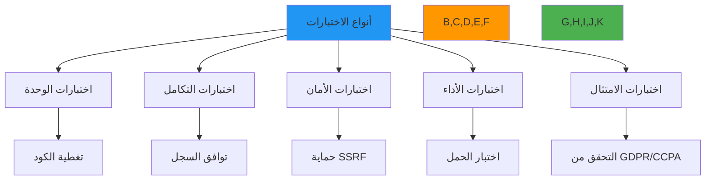

# نظرة عامة على الاختبار

**الهدف**: دليل شامل لاستراتيجية اختبار RDAPify، يشمل اختبارات الوحدة والتكامل والتحقق الأمني ومعيارية الأداء والتحقق من الامتثال مع أمثلة تطبيقية عملية
**ذات صلة**: [متجهات الاختبار](test-vectors.md) | [المحاكاة](mocking.md) | [التثبيتات](fixtures.md) | [الاختبار المستمر](continuous-testing.md)
**وقت القراءة**: 6 دقائق

## فلسفة الاختبار والاستراتيجية

يتبنى RDAPify استراتيجية اختبار دفاع متعمق تتحقق من كل طبقة من طبقات مجموعة التطبيقات، من الامتثال البروتوكولي إلى حدود الأمان وخصائص الأداء:



### مبادئ الاختبار الأساسية
✅ **أمانة البروتوكول**: تتحقق جميع الاختبارات من الامتثال الصارم لـ RFC 7480-7484 باستجابات سجلات حقيقية
✅ **الأمان أولاً**: اختبارات حدود الأمان إلزامية لجميع الميزات مع سياسة عدم التسامح
✅ **التنفيذ الحتمي**: تنتج الاختبارات نتائج متطابقة بغض النظر عن بيئة التنفيذ أو التوقيت
✅ **مماثل للإنتاج**: تحاكي اختبارات التكامل زمن الاستجابة الواقعي والأخطاء وسلوكيات السجل
✅ **التحقق من الامتثال**: التحقق الآلي من متطلبات GDPR وCCPA وSOC 2
✅ **خطوط أداء أساسية**: معايير مرجعية مع حدود فشل صارمة لمنع الانحدارات

## إطار وأدوات الاختبار

```typescript
// src/config/testing.config.ts
export const TestingConfig = {
  // إعداد بيئة الاختبار
  environments: {
    development: {
      cacheEnabled: true,
      timeout: 5000,
      logLevel: 'debug',
      strictValidation: true
    },
    ci: {
      cacheEnabled: true,
      timeout: 10000,
      logLevel: 'warn',
      strictValidation: true,
      parallel: true,
      coverage: true
    },
    security: {
      cacheEnabled: false,
      timeout: 30000,
      logLevel: 'error',
      strictValidation: true,
      securityProfile: 'high'
    }
  },

  // متطلبات تغطية الاختبار
  coverage: {
    statements: 95,
    branches: 90,
    functions: 98,
    lines: 95
  },

  // حدود الأداء
  performance: {
    maxLatencyP50: 200,      // مللي ثانية
    maxLatencyP95: 500,      // مللي ثانية
    minThroughput: 100,      // طلب/ثانية
    maxMemoryPerRequest: 50  // كيلوبايت
  },

  // إعدادات اختبار الأمان
  security: {
    ssrfTestVectors: 50,
    piiDetectionThreshold: 0.95,
    fuzzTestIterations: 10000,
    maxCriticalVulnerabilities: 0
  }
};
```

### أدوات الاختبار الأساسية
| الأداة | الغرض | مستوى التكامل | بيئة التنفيذ |
|--------|--------|----------------|--------------|
| **Jest** | اختبار الوحدة والتكامل | الإطار الأساسي | جميع البيئات |
| **Vitest** | اختبارات الوحدة الحرجة للأداء | إطار ثانوي | CI/CD فقط |
| **Mocha + Chai** | سيناريوهات التكامل المعقدة | دعم قديم | التطوير فقط |
| **Trivy** | فحص ثغرات الحاويات | مسار الأمان | CI/CD فقط |
| **OWASP ZAP** | اختبار أمان Web API | مسار الأمان | بيئة الأمان |
| **Artillery** | اختبار الحمل والإجهاد | مسار الأداء | مجموعة الأداء المخصصة |
| **Semgrep** | فحص نمط الأمان في الكود | مسار الأمان | CI/CD فقط |
| **Snyk** | فحص ثغرات التبعيات | مسار الأمان | CI/CD فقط |

## فئات الاختبار والتنفيذ

### 1. استراتيجية اختبار الوحدة
```typescript
// test/unit/discovery.test.ts
describe('Registry Discovery', () => {
  const mockBootstrapService = {
    getRegistry: jest.fn()
  };

  beforeEach(() => {
    jest.clearAllMocks();
  });

  test('discovers correct registry for .com domains', async () => {
    mockBootstrapService.getRegistry.mockResolvedValue({
      registry: 'verisign',
      baseUrl: 'https://rdap.verisign.com/com/v1/',
      supports: ['domain']
    });

    const discovery = new RegistryDiscovery(mockBootstrapService);
    const result = await discovery.getRegistryForDomain('example.com');

    expect(result.registry).toBe('verisign');
    expect(result.baseUrl).toBe('https://rdap.verisign.com/com/v1/');
    expect(mockBootstrapService.getRegistry).toHaveBeenCalledWith('com');
  });

  test('handles IDN domains correctly', async () => {
    mockBootstrapService.getRegistry.mockResolvedValue({
      registry: 'verisign',
      baseUrl: 'https://rdap.verisign.com/com/v1/',
      supports: ['domain']
    });

    const discovery = new RegistryDiscovery(mockBootstrapService);
    const result = await discovery.getRegistryForDomain('例子.测试');

    // يجب التحويل إلى Punycode للاكتشاف
    expect(mockBootstrapService.getRegistry).toHaveBeenCalledWith('xn--0zwm56d.xn--g6w251d');
    expect(result.registry).toBe('verisign');
  });

  test('rejects private IP addresses in domain discovery', async () => {
    const discovery = new RegistryDiscovery(mockBootstrapService);

    await expect(discovery.getRegistryForDomain('192.168.1.1'))
      .rejects
      .toThrow('SSRF protection blocked private IP address');

    await expect(discovery.getRegistryForDomain('localhost'))
      .rejects
      .toThrow('SSRF protection blocked local hostname');
  });
});
```

### 2. إطار اختبار الأمان
```typescript
// test/security/ssrf-protection.test.ts
describe('SSRF Protection', () => {
  const securityValidator = new SecurityValidator();
  const testVectors = loadTestVectors('security/ssrf-vectors.json');

  describe('Registry Query Protection', () => {
    test.each(testVectors.blockedTargets)(
      'blocks SSRF attempt to %s',
      async (target) => {
        await expect(securityValidator.validateDomain(target))
          .rejects
          .toThrow(/SSRF protection blocked/);
      }
    );

    test.each(testVectors.allowedTargets)(
      'allows legitimate target %s',
      async (target) => {
        await expect(securityValidator.validateDomain(target))
          .resolves
          .not.toThrow();
      }
    );
  });

  describe('Response Validation', () => {
    test('blocks responses containing internal IP addresses', async () => {
      const maliciousResponse = {
        rdapConformance: ['rdap_level_0'],
        entities: [{
          vcardArray: [
            'vcard',
            [['fn', {}, 'text', 'Admin']],
            ['adr', {}, 'text', ['Internal Server', '10.0.0.1', 'Private Network']]
          ]
        }]
      };

      await expect(securityValidator.validateResponse(maliciousResponse))
        .rejects
        .toThrow('Response contains blocked internal IP addresses');
    });

    test('blocks redirects to internal networks', async () => {
      const redirectHeaders = {
        'location': 'http://10.0.0.1/internal/admin'
      };

      await expect(securityValidator.validateHeaders(redirectHeaders))
        .rejects
        .toThrow('Redirect to internal network blocked');
    });
  });

  describe('Fuzz Testing', () => {
    test('survives 10,000 fuzzed inputs without crashes', async () => {
      const fuzzer = new Fuzzer({
        iterations: 10000,
        maxStringLength: 1000,
        charSets: ['printable', 'special', 'unicode']
      });

      const results = await fuzzer.run((input) => {
        return securityValidator.validateDomain(input);
      });

      expect(results.crashes).toBe(0);
      expect(results.exceptions).toBeLessThan(5); // السماح ببعض استثناءات التحقق
    }, 60000); // مهلة 60 ثانية
  });
});
```

## اختبار الأداء والحمل

### 1. إطار معيارية الأداء
```typescript
// test/performance/benchmarks.test.ts
import { bench, describe } from 'vitest';

describe('Performance Benchmarks', () => {
  const benchmarkConfig = {
    iterations: 1000,
    warmup: 100,
    sampleSize: 50,
    maxTime: 30000 // 30 ثانية كحد أقصى
  };

  bench('Domain lookup - cached', async () => {
    const client = createTestClient({ cache: true });
    await client.domain('example.com'); // إحماء

    for (let i = 0; i < benchmarkConfig.iterations; i++) {
      await client.domain('example.com');
    }
  }, benchmarkConfig);

  bench('Domain lookup - uncached', async () => {
    const client = createTestClient({ cache: false });

    for (let i = 0; i < benchmarkConfig.iterations; i++) {
      await client.domain(`example-${i}.com`);
    }
  }, benchmarkConfig);

  bench('Batch processing - 100 domains', async () => {
    const client = createTestClient({ cache: true });
    const domains = Array.from({ length: 100 }, (_, i) => `example-${i}.com`);

    await client.batch(domains);
  }, {
    ...benchmarkConfig,
    iterations: 100 // تكرارات أقل بسبب حجم الدفعة
  });

  bench('PII redaction - GDPR mode', async () => {
    const client = createTestClient({
      privacy: true,
      jurisdiction: 'EU'
    });

    const response = await client.domain('example.com');
    expect(response.entities).toBeDefined();

    // التحقق من أداء الإخفاء
    for (let i = 0; i < benchmarkConfig.iterations; i++) {
      client.applyPIIRedaction(response);
    }
  }, benchmarkConfig);
});
```

### 2. اختبار الحمل بسيناريوهات العالم الحقيقي
```bash
# scripts/load-test.sh
#!/bin/bash
set -e

# إعداد اختبار الحمل
REGISTRY_URL="https://api.rdapify.dev"
CONCURRENCY=50
DURATION=300  # 5 دقائق
TARGET_RPS=100

# نطاقات اختبار حقيقية
DOMAINS_FILE="test/fixtures/real_domains.txt"
DOMAIN_COUNT=$(wc -l < $DOMAINS_FILE)

echo "بدء اختبار الحمل مع ${CONCURRENCY} مستخدم متزامن لمدة ${DURATION} ثانية"

# تشغيل اختبار Artillery
artillery run --output load-test-results.json <<EOF
config:
  target: "${REGISTRY_URL}"
  phases:
    - duration: 60
      arrivalRate: 10
      name: "Warm up"
    - duration: 120
      arrivalRate: ${TARGET_RPS}
      name: "Peak load"
      rampTo: $((TARGET_RPS * 2))
    - duration: 120
      arrivalRate: ${TARGET_RPS}
      name: "Sustained load"
  defaults:
    headers:
      Content-Type: "application/json"
      User-Agent: "RDAPify-LoadTest/1.0"
  environments:
    production:
      target: "${REGISTRY_URL}"
scenarios:
  - name: "Domain lookup"
    flow:
      - get:
          url: "/domain/{{ domain }}"
          headers:
            Accept: "application/rdap+json"
      - think: 1
  - name: "IP lookup"
    flow:
      - get:
          url: "/ip/198.51.100.{{ random(1, 254) }}"
          headers:
            Accept: "application/rdap+json"
      - think: 2
  - name: "ASN lookup"
    flow:
      - get:
          url: "/autnum/{{ random(1000, 65000) }}"
          headers:
            Accept: "application/rdap+json"
      - think: 1
variables:
  domain:
    - "example.com"
    - "google.com"
    - "github.com"
    - "{{ readFile('${DOMAINS_FILE}') }}"
EOF

echo "اكتمل اختبار الحمل بنجاح"
echo "جاري توليد تقرير الأداء..."

# توليد التقرير
node scripts/generate-report.js load-test-results.json

echo "تم حفظ التقرير في performance-report.html"
```

## اختبار الأمان والامتثال

### 1. التحقق الآلي من الامتثال
```typescript
// test/compliance/gdpr.test.ts
describe('GDPR Compliance', () => {
  const complianceChecker = new GDPRComplianceChecker({
    dpoContact: 'dpo@rdapify.com',
    dataRetentionDays: 30
  });

  test('redacts PII in domain responses for EU jurisdiction', async () => {
    const client = createTestClient({
      privacy: true,
      jurisdiction: 'EU',
      legalBasis: 'legitimate-interest'
    });

    const response = await client.domain('example.eu');

    // التحقق من إخفاء PII
    response.entities.forEach(entity => {
      expect(entity.vcardArray[1]).toContainEqual(
        ["fn", {}, "text", "REDACTED FOR PRIVACY"]
      );

      expect(entity.vcardArray[1]).toContainEqual(
        ["org", {}, "text", ["REDACTED FOR PRIVACY"]]
      );
    });

    // التحقق من بيانات الامتثال
    expect(response.notices).toContainEqual(
      expect.objectContaining({
        title: "GDPR COMPLIANCE",
        description: expect.arrayContaining([
          expect.stringContaining("Data controller: "),
          expect.stringContaining("DPO contact: dpo@rdapify.com")
        ])
      })
    );
  });

  test('blocks queries without legal basis in strict mode', async () => {
    const client = createTestClient({
      privacy: true,
      jurisdiction: 'EU',
      legalBasis: null,
      strictCompliance: true
    });

    await expect(client.domain('example.eu'))
      .rejects
      .toThrow('GDPR compliance: No valid legal basis provided for processing');
  });

  test('includes data retention period in responses', async () => {
    const client = createTestClient({
      privacy: true,
      jurisdiction: 'EU',
      legalBasis: 'consent',
      dataRetentionDays: 30
    });

    const response = await client.domain('example.eu');

    expect(response.remarks).toContainEqual(
      expect.objectContaining({
        title: "DATA RETENTION",
        description: expect.arrayContaining([
          expect.stringContaining("Data will be retained for 30 days")
        ])
      })
    );
  });
});
```

### 2. مسار فحص الثغرات
```yaml
# .github/workflows/security.yml
name: Security Scanning

on:
  push:
    branches: [ main, develop ]
  pull_request:
    branches: [ main ]
  schedule:
    - cron: '0 2 * * 1'  # كل اثنين الساعة 2 صباحاً

jobs:
  dependency-scanning:
    runs-on: ubuntu-latest
    steps:
      - uses: actions/checkout@v4

      - name: Setup Node.js
        uses: actions/setup-node@v4
        with:
          node-version: 20

      - name: Install dependencies
        run: npm ci --omit=dev

      - name: Snyk Security Scan
        uses: snyk/actions/node@master
        env:
          SNYK_TOKEN: ${{ secrets.SNYK_TOKEN }}
        with:
          args: --all-projects --fail-on-severity=high

      - name: OWASP Dependency Check
        uses: dependency-check/Dependency-Check_Action@main
        with:
          project: rdapify
          format: HTML
          out: security-reports
          failOnAnyVulnerability: true

      - name: Upload Security Report
        uses: actions/upload-artifact@v4
        with:
          name: dependency-security-report
          path: security-reports/

  container-scanning:
    runs-on: ubuntu-latest
    needs: [build]
    steps:
      - uses: actions/checkout@v4

      - name: Set up Docker Buildx
        uses: docker/setup-buildx-action@v3

      - name: Login to Container Registry
        uses: docker/login-action@v3
        with:
          registry: ghcr.io
          username: ${{ github.actor }}
          password: ${{ secrets.GITHUB_TOKEN }}

      - name: Build Container
        uses: docker/build-push-action@v5
        with:
          context: .
          push: false
          tags: ghcr.io/rdapify/rdapify:test
          outputs: type=docker,dest=/tmp/rdapify.tar

      - name: Trivy Container Scan
        uses: aquasecurity/trivy-action@master
        with:
          image-ref: 'ghcr.io/rdapify/rdapify:test'
          format: 'table'
          exit-code: '1'
          ignore-unfixed: true
          severity: 'CRITICAL,HIGH'
          vuln-type: 'os,library'

      - name: Grype Vulnerability Scan
        uses: anchore/scan-action@v3
        with:
          image: 'ghcr.io/rdapify/rdapify:test'
          fail-build: true
          severity-cutoff: high
          acs-report-enable: true

  sast-scanning:
    runs-on: ubuntu-latest
    steps:
      - uses: actions/checkout@v4

      - name: Semgrep Scan
        uses: returntocorp/semgrep-action@v1
        with:
          config: >-
            p/security-audit
            p/secrets
            p/nodejsscan
          generate_sarif: "true"

      - name: ESLint Security Scan
        run: |
          npm install eslint-plugin-security
          npx eslint --ext .js,.ts src/ --no-error-on-unmatched-pattern \
            --rulesdir node_modules/eslint-plugin-security/rules

      - name: Upload SARIF Report
        uses: github/codeql-action/upload-sarif@v3
        with:
          sarif_file: semgrep.sarif
```

## استكشاف مشكلات الاختبار الشائعة

### 1. فشل الاختبار المتقطع
**الأعراض**: الاختبارات تنجح محلياً لكن تفشل عشوائياً في مسارات CI/CD
**الأسباب الجذرية**:
- عدم استقرار الشبكة عند الاتصال بخوادم RDAP الحقيقية
- حالات تعارق في إعداد/تفكيك الاختبار غير المتزامن
- اختلافات المنطقة الزمنية المؤثرة على تحليل التاريخ
- قيود الموارد في بيئات الاختبار المعبأة في حاويات

**خطوات التشخيص**:
```bash
# تشغيل الاختبارات مع تسجيل مفصّل
jest --verbose --logHeapUsage --detectOpenHandles

# اختبار استقرار الشبكة
node scripts/network-stability-test.js --url https://rdap.verisign.com --duration 60

# تحليل تنفيذ الاختبار
node --inspect-brk node_modules/jest/bin/jest.js --runInBand test/unit/discovery.test.ts
```

**الحلول**:
✅ **محاكاة التبعيات الحرجة**: استخدام محاكاة واقعية لاتصالات السجل مع معدلات زمن الاستجابة/الخطأ القابلة للإعداد
✅ **عزل الاختبار غير المتزامن**: تطبيق خطافات beforeEach/afterEach مع التنظيف المناسب وإدارة المهلة
✅ **تطبيع المنطقة الزمنية**: تعيين TZ=UTC لجميع الاختبارات مع معالجة صريحة للمنطقة الزمنية في تحليل التاريخ
✅ **قيود الموارد**: إعداد حدود CPU/ذاكرة مناسبة في بيئات CI مع مراقبة الموارد

### 2. نتائج إيجابية كاذبة في اختبارات الأمان
**الأعراض**: عمليات فحص الأمان تُشير إلى أنماط كود آمنة كثغرات
**الأسباب الجذرية**:
- مطابقة نمط قوية جداً في أدوات SAST
- تحليل غير واعٍ بالسياق لأنماط الأمان
- قواعد بيانات الثغرات القديمة
- إعداد خاطئ لأدوات الأمان

**خطوات التشخيص**:
```bash
# تحليل أنماط الإيجابيات الكاذبة
semgrep --config p/security-audit --debug src/ --json > semgrep-debug.json

# مراجعة سياق الثغرات
snyk test --all-sub-projects --json-file-output=snyk-results.json

# التحقق بأدوات متعددة
grype dir:./ --output json > grype-results.json
trivy fs --security-checks vuln,config --format json --output trivy-results.json
```

**الحلول**:
✅ **سياسات أمان واعية بالسياق**: إنشاء قواعد أمان مخصصة مع وعي خاص بسياق RDAP
✅ **التحقق من صحة تكامل الأدوات**: التحقق التبادلي من النتائج عبر أدوات أمان متعددة لتقليل الإيجابيات الكاذبة
✅ **إدارة الاستثناءات**: الحفاظ على قاعدة بيانات استثناءات معتمدة مع مبررات موثقة وتواريخ انتهاء صلاحية
✅ **مراجعة بطل الأمان**: تطبيق مراجعة إلزامية من بطل الأمان لجميع استثناءات الثغرات

### 3. اكتشاف انحدار الأداء
**الأعراض**: يتدهور الأداء بمرور الوقت دون تحديد واضح للتغييرات الإشكالية
**الأسباب الجذرية**:
- غياب مقاييس الأداء الأساسية
- بيئات اختبار غير متسقة
- تسريبات الموارد في العمليات طويلة التشغيل
- خوارزميات غير محسّنة مخفية خلف تجريدات

**خطوات التشخيص**:
```bash
# تشغيل مقارنة خط الأداء الأساسي
npm run benchmark -- --compare baseline.json --threshold 5%

# تحليل استخدام الذاكرة
node --heap-prof --heap-prof-interval 1000 test/performance/benchmarks.test.ts

# تتبع العمليات غير المتزامنة
NODE_OPTIONS='--trace-sync-io --trace-event-categories=async_hooks' \
  node --trace-warnings test/performance/benchmarks.test.ts
```

**الحلول**:
✅ **تتبع آلي للخط الأساسي**: تخزين خطوط أداء أساسية في التحكم بالإصدار مع اكتشاف آلي للانحدار
✅ **توحيد البيئة**: استخدام بيئات اختبار معبأة في حاويات مع تخصيصات موارد ثابتة
✅ **اكتشاف تسريبات الذاكرة**: تطبيق مقارنات آلية لسريعة heap مع حدود اكتشاف التسريبات
✅ **ميزانيات الأداء**: فرض حدود أداء صارمة في CI/CD مع فشل تلقائي عند تجاوز العتبات

## الوثائق ذات الصلة

| الوثيقة | الوصف | المسار |
|---------|-------|--------|
| [متجهات الاختبار](test-vectors.md) | مجموعات بيانات اختبار شاملة | [test-vectors.md](test-vectors.md) |
| [المحاكاة](mocking.md) | محاكاة استجابات السجل | [mocking.md](mocking.md) |
| [التثبيتات](fixtures.md) | إدارة ملفات بيانات الاختبار | [fixtures.md](fixtures.md) |
| [الاختبار المستمر](continuous-testing.md) | استراتيجيات اختبار CI/CD | [continuous-testing.md](continuous-testing.md) |

## مواصفات الاختبار

| الخاصية | القيمة |
|---------|--------|
| **تغطية الاختبار** | 95% جمل، 90% فروع، 98% دوال، 95% أسطر |
| **وقت تنفيذ الاختبار** | أقل من 5 دقائق (المجموعة الكاملة)، أقل من 30 ثانية (المسار الحرج) |
| **تكرار الفحص الأمني** | كل commit، فحص ليلي كامل، تدقيق أسبوعي للتبعيات |
| **حدود الأداء** | P50 أقل من 200 مللي ثانية، P95 أقل من 500 مللي ثانية، معدل خطأ أقل من 0.1% |
| **التحقق من الامتثال** | التحقق الآلي من GDPR/CCPA/SOC 2 في كل إصدار |
| **بيئة الاختبار** | Node.js 18+، Chrome Headless، Docker 24+ |
| **سياسة الثغرات** | صفر ثغرات حرجة/عالية في إصدارات الإنتاج |
| **آخر تحديث** | 5 ديسمبر 2025 |

> **تذكير حرج**: لا تُعطِّل اختبارات الأمان أو تخفض حدود التغطية لتحقيق عمليات بناء ناجحة. يجب إصلاح جميع الثغرات الأمنية أو توثيقها بشكل صحيح مع استثناءات معتمدة قبل الإصدار. لنشر الإنتاج، نفِّذ مراقبة أمنية مستمرة مع التراجع التلقائي عند اكتشاف الثغرات الحرجة. عمليات التدقيق الأمني الخارجية المنتظمة مطلوبة للحفاظ على الامتثال مع المادة 32 من GDPR واللوائح المماثلة.

[← العودة إلى الاختبار](../README.md) | [التالي: متجهات الاختبار ←](test-vectors.md)

*وثيقة مُولَّدة تلقائياً من الكود المصدري مع مراجعة أمنية في 5 ديسمبر 2025*
