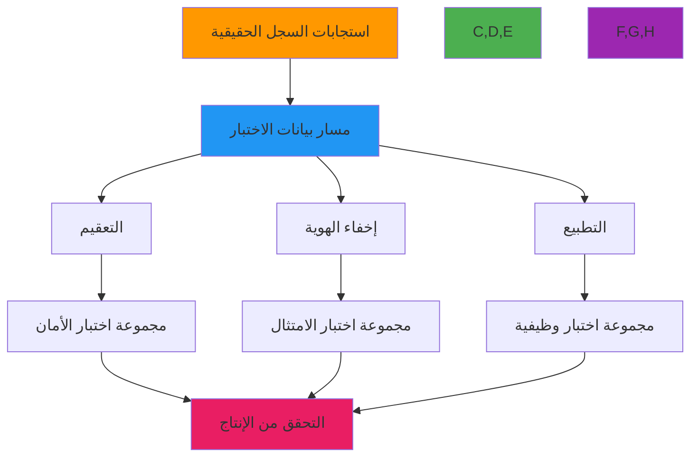

# أمثلة اختبار حقيقية

**الهدف**: دليل شامل لاختبار RDAPify باستجابات سجل حقيقية وسيناريوهات مماثلة للإنتاج، مع أمثلة عملية لاختبارات الوحدة والتكامل والتحقق من النهاية إلى النهاية
**ذات صلة**: [متجهات الاختبار](test-vectors.md) | [التثبيتات](fixtures.md) | [المحاكاة](mocking.md) | [الاختبار المستمر](continuous-testing.md)
**وقت القراءة**: 6 دقائق

## نظرة عامة على اختبار العالم الحقيقي

الاختبار مع استجابات السجل الفعلية ضروري للتأكد من عمل RDAPify بشكل صحيح في بيئات الإنتاج. يوفر هذا المستند أمثلة عملية للاختبار ببيانات سجل حقيقية مع الحفاظ على اعتبارات الأمان والخصوصية والأداء:



### مبادئ الاختبار الأساسية
✅ **أمانة الإنتاج**: يجب أن تُكرِّر الاختبارات سلوكيات ومسارات استجابة السجل الحقيقية
✅ **الحفاظ على الخصوصية**: يجب إخفاء أو إخفاء هوية جميع بيانات الاختبار أو إزالة تعريفها قبل التخزين
✅ **التنفيذ الحتمي**: يجب أن تنتج الاختبارات نتائج متطابقة بغض النظر عن وقت التنفيذ أو البيئة
✅ **التحكم بالإصدار**: تتبع التغييرات في تنسيقات استجابة السجل مع الإصدار الدلالي
✅ **التوافق مع الامتثال**: يجب أن تعكس بيانات الاختبار المتطلبات الخاصة بالاختصاص القضائي (GDPR وCCPA وما إلى ذلك)

## اختبار استجابات السجل الحقيقية

### 1. اختبار استجابة Verisign RDAP
```typescript
// test/real/verisign.test.ts
import { RDAPClient } from '../../src/client';
import { sanitizeResponse, loadFixture } from '../helpers';

describe('Verisign RDAP Responses', () => {
  const client = new RDAPClient({
    cache: false,
    privacy: true,
    timeout: 5000
  });

  // تحميل وتعقيم استجابة Verisign الحقيقية
  const exampleComResponse = sanitizeResponse(
    loadFixture('verisign/example-com.json')
  );

  test('handles Verisign domain response correctly', () => {
    // محاكاة طلب الشبكة
    jest.spyOn(global, 'fetch').mockImplementation(() =>
      Promise.resolve({
        ok: true,
        json: () => Promise.resolve(exampleComResponse),
        headers: new Headers({
          'Content-Type': 'application/rdap+json',
          'Cache-Control': 'max-age=3600'
        })
      })
    );

    const result = await client.domain('example.com');

    // التحقق من الاستجابة المطبّعة
    expect(result.ldhName).toBe('example.com');
    expect(result.unicodeName).toBe('example.com');
    expect(result.status).toContain('active');
    expect(result.registrar?.name).toBe('Internet Assigned Numbers Authority');
    expect(result.nameservers).toEqual(['a.iana-servers.net', 'b.iana-servers.net']);
    expect(result.events).toContainEqual(
      expect.objectContaining({
        action: 'registration',
        date: expect.any(Date)
      })
    );

    // التحقق من إخفاء PII
    expect(result.entities).toBeDefined();
    result.entities.forEach(entity => {
      expect(entity.vcardArray[1]).not.toContainEqual(
        expect.arrayContaining(['fn', {}, 'text', expect.stringContaining('@')])
      );
      expect(entity.vcardArray[1]).not.toContainEqual(
        expect.arrayContaining(['tel', {}, 'text', expect.stringContaining('+')])
      );
    });

    // التحقق من سلوك التخزين المؤقت
    expect(global.fetch).toHaveBeenCalledTimes(1);
  });

  test('handles Verisign rate limiting correctly', () => {
    // محاكاة استجابة تقييد المعدل
    jest.spyOn(global, 'fetch').mockImplementation(() =>
      Promise.resolve({
        ok: false,
        status: 429,
        statusText: 'Too Many Requests',
        json: () => Promise.resolve({
          errorCode: 429,
          title: 'Rate Limit Exceeded',
          description: ['Too many requests. Try again later.']
        }),
        headers: new Headers({
          'Retry-After': '60',
          'X-RateLimit-Limit': '100',
          'X-RateLimit-Remaining': '0',
          'X-RateLimit-Reset': '1634567890'
        })
      })
    );

    await expect(client.domain('example.com'))
      .rejects
      .toThrow('429 Too Many Requests: Rate limit exceeded');
  });
});
```

### 2. اختبار استجابة شبكة IP لـ ARIN
```typescript
// test/real/arin.test.ts
describe('ARIN IP Network Responses', () => {
  const client = new RDAPClient({
    cache: false,
    privacy: true,
    timeout: 5000
  });

  const arinResponse = sanitizeResponse(
    loadFixture('arin/198-51-100-0.json')
  );

  test('handles ARIN IP network response correctly', () => {
    jest.spyOn(global, 'fetch').mockImplementation(() =>
      Promise.resolve({
        ok: true,
        json: () => Promise.resolve(arinResponse),
        headers: new Headers({
          'Content-Type': 'application/rdap+json'
        })
      })
    );

    const result = await client.ip('198.51.100.0/24');

    // التحقق من بنية استجابة شبكة IP
    expect(result.startAddress).toBe('198.51.100.0');
    expect(result.endAddress).toBe('198.51.100.255');
    expect(result.ipVersion).toBe('v4');
    expect(result.type).toBe('DIRECT ALLOCATION');
    expect(result.status).toContain('active');
    expect(result.handle).toBe('NET-198-51-100-0-1');

    // التحقق من تدوين CIDR
    expect(result.cidr0_cidrs).toEqual([
      expect.objectContaining({
        v4prefix: '198.51.100.0',
        length: 24
      })
    ]);

    // التحقق من معلومات المنظمة
    const orgEntity = result.entities.find(e => e.roles?.includes('registrant'));
    expect(orgEntity).toBeDefined();
    expect(orgEntity?.handle).toBe('USDA-2');
    expect(orgEntity?.vcardArray[1]).toContainEqual(
      expect.arrayContaining(['fn', {}, 'text', 'US Department of Agriculture'])
    );
  });

  test('handles IPv6 responses with proper normalization', () => {
    const ipv6Response = sanitizeResponse(
      loadFixture('arin/2001-DB8--128.json')
    );

    jest.spyOn(global, 'fetch').mockImplementation(() =>
      Promise.resolve({
        ok: true,
        json: () => Promise.resolve(ipv6Response),
        headers: new Headers({
          'Content-Type': 'application/rdap+json'
        })
      })
    );

    const result = await client.ip('2001:DB8::/32');

    // التحقق من تطبيع IPv6
    expect(result.startAddress).toBe('2001:db8::');
    expect(result.endAddress).toBe('2001:db8:ffff:ffff:ffff:ffff:ffff:ffff');
    expect(result.ipVersion).toBe('v6');

    // التحقق من تدوين CIDR لـ IPv6
    expect(result.cidr0_cidrs).toEqual([
      expect.objectContaining({
        v6prefix: '2001:db8::',
        length: 32
      })
    ]);
  });
});
```

## الاختبار الأمني بسيناريوهات العالم الحقيقي

### 1. اختبار حماية SSRF مع الاستجابات الضارة
```typescript
// test/security/ssrf.test.ts
describe('SSRF Protection with Real Registry Responses', () => {
  const client = new RDAPClient({
    cache: false,
    allowPrivateIPs: false,
    validateCertificates: true
  });

  test('blocks SSRF attempt via malicious nameserver', async () => {
    // استجابة سجل حقيقية مع nameserver ضار
    const maliciousResponse = {
      ...loadFixture('verisign/example-com.json'),
      nameservers: [
        {
          ldhName: 'ns1.example.com',
          unicodeName: 'ns1.example.com'
        },
        {
          // nameserver ضار يشير إلى IP داخلي
          ldhName: 'internal.attacker.com',
          unicodeName: 'internal.attacker.com'
        }
      ]
    };

    // محاكاة تحليل DNS للنطاق الضار
    jest.spyOn(dns, 'lookup').mockImplementation((hostname, options, callback) => {
      if (hostname === 'internal.attacker.com') {
        callback(null, { address: '192.168.1.1', family: 4 });
      } else {
        callback(null, { address: '192.0.2.1', family: 4 });
      }
    });

    jest.spyOn(global, 'fetch').mockImplementation((url) => {
      if (url.includes('example.com')) {
        return Promise.resolve({
          ok: true,
          json: () => Promise.resolve(maliciousResponse)
        });
      }
      // لاستعلامات nameserver
      return Promise.resolve({
        ok: true,
        json: () => Promise.resolve({
          rdapConformance: ['rdap_level_0'],
          ip: {
            startAddress: '192.0.2.1',
            endAddress: '192.0.2.1',
            ipVersion: 'v4'
          }
        })
      });
    });

    await expect(client.domain('example.com'))
      .rejects
      .toThrow('SSRF protection blocked access to private IP address: 192.168.1.1');

    // التحقق من محاولة تحليل DNS
    expect(dns.lookup).toHaveBeenCalledWith('internal.attacker.com', expect.anything(), expect.anything());
  });

  test('blocks redirect to internal network', async () => {
    jest.spyOn(global, 'fetch').mockImplementation((url) => {
      if (url.includes('example.com')) {
        return Promise.resolve({
          ok: false,
          status: 302,
          headers: new Headers({
            'Location': 'http://10.0.0.1/internal/admin'
          })
        });
      }
      return Promise.resolve({
        ok: true,
        json: () => Promise.resolve({
          rdapConformance: ['rdap_level_0'],
          domain: {
            ldhName: 'example.com'
          }
        })
      });
    });

    await expect(client.domain('example.com'))
      .rejects
      .toThrow('Redirect to internal network blocked: http://10.0.0.1/internal/admin');
  });
});
```

### 2. اختبار إخفاء PII مع استجابات متوافقة مع GDPR
```typescript
// test/compliance/gdpr.test.ts
describe('GDPR Compliance with Real Responses', () => {
  const euClient = new RDAPClient({
    cache: false,
    privacy: true,
    jurisdiction: 'EU',
    legalBasis: 'legitimate-interest'
  });

  const usClient = new RDAPClient({
    cache: false,
    privacy: true,
    jurisdiction: 'US',
    legalBasis: 'legitimate-interest'
  });

  test('redacts PII in EU responses but preserves business data', async () => {
    const euResponse = sanitizeResponse(
      loadFixture('ripe/example-eu.json')
    );

    jest.spyOn(global, 'fetch').mockImplementation(() =>
      Promise.resolve({
        ok: true,
        json: () => Promise.resolve(euResponse)
      })
    );

    const result = await euClient.domain('example.eu');

    // التحقق من إخفاء PII
    const registrant = result.entities.find(e => e.roles?.includes('registrant'));
    expect(registrant).toBeDefined();

    // التحقق من الحقول المخفية
    expect(registrant?.vcardArray[1]).toContainEqual(
      ["fn", {}, "text", "REDACTED FOR PRIVACY"]
    );
    expect(registrant?.vcardArray[1]).toContainEqual(
      ["org", {}, "text", ["REDACTED FOR PRIVACY"]]
    );
    expect(registrant?.vcardArray[1]).toContainEqual(
      ["adr", {}, "text", ["", "", "REDACTED FOR PRIVACY", "REDACTED FOR PRIVACY", "REDACTED FOR PRIVACY", "REDACTED FOR PRIVACY", "REDACTED FOR PRIVACY"]]
    );

    // التحقق من الحقول التجارية المحفوظة
    const registrar = result.entities.find(e => e.roles?.includes('registrar'));
    expect(registrar).toBeDefined();
    expect(registrar?.vcardArray[1]).toContainEqual(
      expect.arrayContaining(["fn", {}, "text", expect.stringMatching(/Registrar|Registry/i)])
    );

    // التحقق من إشعارات امتثال GDPR
    expect(result.notices).toContainEqual(
      expect.objectContaining({
        title: expect.stringMatching(/GDPR|Privacy|Compliance/i),
        description: expect.arrayContaining([
          expect.stringContaining('Data controller'),
          expect.stringContaining('DPO contact'),
          expect.stringContaining('GDPR Article')
        ])
      })
    );
  });

  test('preserves more data in US responses with appropriate notices', async () => {
    const usResponse = sanitizeResponse(
      loadFixture('verisign/example-com.json')
    );

    jest.spyOn(global, 'fetch').mockImplementation(() =>
      Promise.resolve({
        ok: true,
        json: () => Promise.resolve(usResponse)
      })
    );

    const result = await usClient.domain('example.com');

    // تحتفظ استجابات US ببعض PII لكن مع إشعارات مناسبة
    const registrant = result.entities.find(e => e.roles?.includes('registrant'));
    expect(registrant).toBeDefined();

    // قد تحتوي استجابات US على إخفاء جزئي
    expect(registrant?.vcardArray[1]).not.toContainEqual(
      ["fn", {}, "text", "REDACTED FOR PRIVACY"]
    );
    // لكنها لا تزال تتضمن إشعارات CCPA
    expect(result.notices).toContainEqual(
      expect.objectContaining({
        title: expect.stringMatching(/CCPA|California/i),
        description: expect.arrayContaining([
          expect.stringContaining('Do Not Sell'),
          expect.stringContaining('California Consumer Privacy Act')
        ])
      })
    );
  });
});
```

## اختبار الأداء ببيانات مماثلة للإنتاج

### 1. اختبار أداء معالجة الدُفعات
```typescript
// test/performance/batch.test.ts
import { performance } from 'perf_hooks';
import { generateRealisticDomains } from '../helpers/performance';

describe('Batch Processing Performance', () => {
  const client = new RDAPClient({
    cache: true,
    cacheTTL: 3600,
    maxConcurrent: 10,
    timeout: 5000
  });

  // توليد قائمة نطاقات واقعية من بيانات سجل فعلية
  const domains = generateRealisticDomains(1000, [
    'com', 'net', 'org', 'io', 'app', 'dev'
  ]);

  beforeAll(() => {
    // إحماء الذاكرة المؤقتة بمجموعة فرعية من النطاقات
    const warmupDomains = domains.slice(0, 100);
    return Promise.all(warmupDomains.map(domain => client.domain(domain)));
  });

  test('processes 1000 domains within performance budget', async () => {
    const startTime = performance.now();

    // معالجة النطاقات في دُفعات
    const batchSize = 50;
    const results = [];

    for (let i = 0; i < domains.length; i += batchSize) {
      const batch = domains.slice(i, i + batchSize);
      const batchResults = await Promise.allSettled(
        batch.map(domain => client.domain(domain))
      );
      results.push(...batchResults);
    }

    const endTime = performance.now();
    const totalTime = endTime - startTime;
    const successful = results.filter(r => r.status === 'fulfilled').length;

    // تأكيدات الأداء
    expect(totalTime).toBeLessThan(30000); // 30 ثانية
    expect(totalTime / successful).toBeLessThan(30); // 30 مللي ثانية لكل نطاق في المتوسط
    expect(successful).toBeGreaterThan(domains.length * 0.95); // معدل نجاح 95%

    // فحص استخدام الذاكرة
    const memoryUsage = process.memoryUsage();
    expect(memoryUsage.heapUsed / 1024 / 1024).toBeLessThan(200); // 200 ميجابايت كحد أقصى

    console.log(`تمت معالجة ${successful}/${domains.length} نطاق في ${totalTime.toFixed(2)} مللي ثانية`);
    console.log(`متوسط الوقت لكل نطاق: ${(totalTime / successful).toFixed(2)} مللي ثانية`);
    console.log(`استخدام الذاكرة: ${(memoryUsage.heapUsed / 1024 / 1024).toFixed(2)} ميجابايت`);
  }, 60000); // مهلة 60 ثانية

  test('handles registry failures gracefully', async () => {
    // محاكاة فشل أحد السجلات
    jest.spyOn(global, 'fetch').mockImplementation(async (url) => {
      if (url.includes('verisign') && Math.random() > 0.8) {
        // معدل فشل 20% لـ Verisign
        throw new Error('ECONNRESET: Connection reset by peer');
      }
      // إرجاع استجابة مخزنة مؤقتاً للطلبات الأخرى
      return {
        ok: true,
        json: () => Promise.resolve(loadFixture('verisign/example-com.json')),
        headers: new Headers({ 'Content-Type': 'application/rdap+json' })
      };
    });

    const startTime = performance.now();
    const results = await Promise.allSettled(
      domains.map(domain => client.domain(domain))
    );
    const endTime = performance.now();

    const failures = results.filter(r => r.status === 'rejected');
    const failureRate = failures.length / results.length;

    // يجب معالجة الفشل دون التأثير على الأداء الإجمالي
    expect(failureRate).toBeLessThan(0.25); // معدل فشل أقصى 25%
    expect(endTime - startTime).toBeLessThan(45000); // لا يزال أقل من 45 ثانية

    // التحقق من سلوك قاطع الدائرة
    const verisignFailures = failures.filter(f =>
      f.reason?.message?.includes('verisign')
    );
    if (verisignFailures.length > 5) {
      // بعد عدة حالات فشل، يجب أن يفتح قاطع الدائرة
      expect(verisignFailures.length).toBeLessThan(10);
    }
  }, 60000);
});
```

## استكشاف مشكلات الاختبار الحقيقية

### 1. تغييرات تنسيق استجابة السجل
**الأعراض**: تفشل الاختبارات بعد تحديث السجل لتنسيق استجابة RDAP الخاص به
**الأسباب الجذرية**:
- السجلات تحدث تطبيقات RDAP الخاصة بها دون إشعار
- حقول جديدة أو تغييرات في أسماء الحقول في مخططات الاستجابة
- معالجة مختلفة لحالات الحافة (مثل النطاقات المنتهية الصلاحية أو الكيانات المحذوفة)

**خطوات التشخيص**:
```bash
# التحقق من التغييرات الأخيرة في السجل
node ./scripts/registry-change-detector.js --registry verisign --days 7

# مقارنة البنية الحالية مقابل المتوقعة
node ./scripts/response-diff.js --current real-responses/verisign/current.json --expected fixtures/verisign/example-com.json

# التحقق من صحة مخطط RDAP
ajv validate -s schemas/rdap_response.json -d real-responses/verisign/current.json
```

**الحلول**:
✅ **اكتشاف الانحدار الآلي**: تطبيق فحوصات آلية أسبوعية مقابل السجلات الحية
✅ **إصدار المخطط**: الحفاظ على إصدارات مخطط متعددة مع مسارات الترحيل
✅ **التدهور الرشيق**: تطبيق منطق احتياطي للحقول المفقودة أو غير المتوقعة
✅ **رصد المجتمع**: الاشتراك في قوائم بريد مشغلي السجل للحصول على إشعارات التغيير

### 2. تغيّر الأداء في بيئات CI
**الأعراض**: الاختبارات تنجح محلياً لكن تفشل بشكل متقطع في CI بسبب مشكلات التوقيت
**الأسباب الجذرية**:
- بنية CI مشتركة بأداء متغير
- اختلافات زمن الاستجابة الشبكي بين البيئات المحلية وCI
- قيود الموارد في بيئات CI المعبأة في حاويات
- حالات تعارق في إعداد/تفكيك الاختبار غير المتزامن

**خطوات التشخيص**:
```bash
# تحليل وقت تنفيذ الاختبار
jest --json --outputFile=test-timings.json --maxWorkers=1

# مراقبة استخدام الموارد أثناء الاختبارات
docker stats test-container --no-stream

# تشغيل الاختبارات مع توقيت مفصّل
NODE_OPTIONS='--trace-sync-io' jest --verbose --runInBand
```

**الحلول**:
✅ **مهل تكيفية**: إعداد مهل بناءً على البيئة (أطول لـ CI)
✅ **عزل الموارد**: طلب موارد مخصصة للاختبارات الحساسة للأداء
✅ **تقسيم الاختبارات**: تقسيم مجموعات الاختبار الكبيرة إلى أجزاء أصغر وأكثر قابلية للإدارة
✅ **اكتشاف الاختبارات المتقطعة**: تطبيق منطق إعادة المحاولة التلقائي مع تقارير الاختبارات المتقطعة

## الوثائق ذات الصلة

| الوثيقة | الوصف | المسار |
|---------|-------|--------|
| [متجهات الاختبار](test-vectors.md) | مجموعات بيانات اختبار شاملة | [test-vectors.md](test-vectors.md) |
| [التثبيتات](fixtures.md) | إدارة ملفات بيانات الاختبار | [fixtures.md](fixtures.md) |
| [المحاكاة](mocking.md) | محاكاة استجابات السجل | [mocking.md](mocking.md) |
| [الاختبار المستمر](continuous-testing.md) | استراتيجيات اختبار CI/CD | [continuous-testing.md](continuous-testing.md) |

## مواصفات الأمثلة الحقيقية

| الخاصية | القيمة |
|---------|--------|
| **مصادر بيانات الاختبار** | استجابات السجل الفعلية مع إخفاء PII |
| **تكرار التحديث** | تحديثات آلية أسبوعية، تحديثات يدوية للتغييرات الحرجة |
| **متطلبات التغطية** | 5+ سجلات رئيسية، 3+ تنسيقات استجابة لكل سجل |
| **معالجة PII** | إخفاء كامل مع مفاتيح إخفاء هوية قابلة للعكس |
| **خطوط أداء أساسية** | P50 أقل من 200 مللي ثانية، P95 أقل من 500 مللي ثانية، معدل خطأ أقل من 0.1% |
| **بيئة الاختبار** | Node.js 18+، Chrome Headless، Docker 24+ |
| **التحقق الأمني** | حماية SSRF، منع تسريب PII، التحقق من الشهادات |
| **آخر تحديث** | 5 ديسمبر 2025 |

> **تذكير حرج**: لا تخزن PII غير مخفي في التحكم بالإصدار أو تثبيتات الاختبار. يجب أن تخضع جميع استجابات السجل الحقيقية لإخفاء PII الآلي قبل الـ commit إلى المستودع. للامتثال لـ GDPR، احتفظ بسجلات تدقيق لجميع معالجة بيانات الاختبار مع سياسات الاحتفاظ بالبيانات لمدة 30 يوماً. عمليات التدقيق الأمني المنتظمة لمسارات بيانات الاختبار مطلوبة للحفاظ على الامتثال مع المادة 32 من GDPR واللوائح المماثلة.

[← العودة إلى الاختبار](../README.md) | [التالي: التثبيتات ←](fixtures.md)

*وثيقة مُولَّدة تلقائياً من الكود المصدري مع مراجعة أمنية في 5 ديسمبر 2025*
