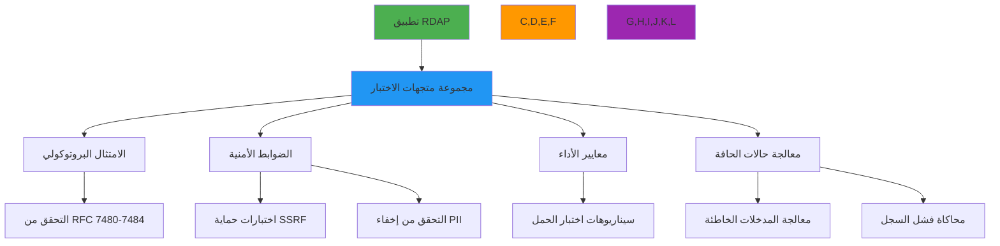

# مواصفات متجهات الاختبار

**الهدف**: مواصفة تقنية شاملة لمتجهات اختبار RDAP توفر تغطية تحقق لامتثال RFC والضوابط الأمنية وحالات الحافة ومعايير الأداء
**ذات صلة**: [المحاكاة](mocking.md) | [التثبيتات](fixtures.md) | [أمثلة حقيقية](real-examples.md)
**وقت القراءة**: 6 دقائق

## نظرة عامة على متجهات الاختبار

توفر متجهات الاختبار الأساس لتحقق تطبيقات RDAP، مضمونةً الامتثال البروتوكولي والمتانة الأمنية وقابلية التنبؤ بالأداء عبر جميع تطبيقات السجل:



### مبادئ متجهات الاختبار الأساسية
✅ **تغطية امتثال RFC**: تغطية 100% للمتطلبات الإلزامية لـ RFC 7480-7484
✅ **التحقق من حدود الأمان**: اختبار شامل لحماية SSRF وإخفاء PII
✅ **أمانة سجل العالم الحقيقي**: متجهات اختبار مبنية على استجابات السجل الفعلية مع التعقيم
✅ **التنفيذ الحتمي**: نتائج اختبار متوقعة بغض النظر عن بيئة التنفيذ
✅ **مجموعات اختبار ذات إصدارات**: متجهات اختبار غير قابلة للتغيير مع إصدار دلالي لقابلية الاستنساخ
✅ **جاهزة للامتثال**: مجموعات اختبار مسبقة التجهيز لمتطلبات التحقق من GDPR وCCPA وSOC 2

## بنية وتنسيق متجهات الاختبار

### 1. بنية متجه الاختبار JSON
```json
{
  "vectorId": "domain-valid-001",
  "version": "2.3.0",
  "category": "domain-valid",
  "tags": ["rfc7483", "ldh-validation", "basic"],
  "description": "Valid domain query with standard response structure",
  "input": {
    "query": {
      "type": "domain",
      "value": "example.com"
    },
    "context": {
      "registry": "verisign",
      "bootstrap": true,
      "redactPII": true,
      "jurisdiction": "global"
    }
  },
  "expected": {
    "statusCode": 200,
    "headers": {
      "content-type": "application/rdap+json",
      "cache-control": "max-age=3600"
    },
    "body": {
      "rdapConformance": ["rdap_level_0"],
      "notices": [
        {
          "title": "TOS",
          "description": ["Terms of Service"]
        }
      ],
      "domain": {
        "handle": "EXAMPLE-1",
        "ldhName": "example.com",
        "unicodeName": "example.com",
        "status": ["active"],
        "entities": [
          {
            "handle": "REGISTRAR-1",
            "roles": ["registrar"],
            "redacted": true
          }
        ]
      }
    },
    "validations": [
      {
        "path": "$.domain.ldhName",
        "rule": "equals",
        "value": "example.com"
      },
      {
        "path": "$.domain.entities[?(@.roles contains 'registrar')].redacted",
        "rule": "exists"
      }
    ]
  },
  "securityValidations": [
    {
      "type": "ssrf_protection",
      "input": {"query": {"type": "domain", "value": "192.168.1.1"}},
      "expected": {"statusCode": 403}
    },
    {
      "type": "pii_redaction",
      "context": {"jurisdiction": "EU", "redactPII": true},
      "validation": "$.domain.entities[*].vcardArray"
    }
  ],
  "performanceProfile": {
    "maxLatency": 2000,
    "maxMemory": 50,
    "concurrency": 10,
    "throughput": 50
  },
  "regressionTests": [
    "domain-valid-001-legacy",
    "domain-valid-001-v1.2"
  ]
}
```

#### حقول متجه الاختبار الإلزامية
| الحقل | النوع | إلزامي | الوصف | مرجع RFC |
|-------|-------|---------|-------|---------|
| `vectorId` | سلسلة | ✅ | معرف فريد لمتجه الاختبار | لا ينطبق |
| `version` | سلسلة | ✅ | إصدار دلالي لمخطط متجه الاختبار | لا ينطبق |
| `category` | سلسلة | ✅ | تصنيف (صالح/غير صالح/حافة/أمان) | لا ينطبق |
| `description` | سلسلة | ✅ | وصف اختبار مقروء بشرياً | لا ينطبق |
| `input` | كائن | ✅ | معاملات المدخلات والسياق | لا ينطبق |
| `expected` | كائن | ✅ | بنية الاستجابة المتوقعة والتحققات | RFC 7483 |
| `securityValidations` | مصفوفة | ⚠️ | تحققات خاصة بالأمان | RFC 7481 |
| `performanceProfile` | كائن | ⚠️ | توقعات الأداء | لا ينطبق |
| `regressionTests` | مصفوفة | ⚠️ | متجهات اختبار انحدار ذات صلة | لا ينطبق |

### 2. فئات متجهات الاختبار
```typescript
// تعداد فئات متجه الاختبار مع متطلبات التحقق
export enum TestVectorCategory {
  DOMAIN_VALID = 'domain-valid',      // استعلامات النطاقات الصالحة
  IP_VALID = 'ip-valid',              // استعلامات شبكات IP الصالحة
  ASN_VALID = 'asn-valid',            // استعلامات ASN الصالحة
  DOMAIN_INVALID = 'domain-invalid',  // تنسيقات النطاقات الخاطئة
  IP_INVALID = 'ip-invalid',          // تنسيقات IP الخاطئة
  ASN_INVALID = 'asn-invalid',        // أرقام ASN الخاطئة
  SECURITY_SSRF = 'security-ssrf',    // اختبارات حماية SSRF
  SECURITY_PII = 'security-pii',      // التحقق من إخفاء PII
  ERROR_404 = 'error-404',            // سيناريوهات عدم الوجود
  ERROR_400 = 'error-400',            // سيناريوهات طلب خاطئ
  PERFORMANCE_LOAD = 'performance-load', // سيناريوهات الحجم العالي
  EDGE_REGISTRY = 'edge-registry',    // حالات فشل السجل
  COMPLIANCE_GDPR = 'compliance-gdpr', // اختبارات امتثال GDPR
  COMPLIANCE_CCPA = 'compliance-ccpa'  // اختبارات امتثال CCPA
}

// متطلبات التحقق الخاصة بالفئة
export interface TestVector {
  category: TestVectorCategory;
  requiredValidations: string[];
  securityChecks: string[];
  complianceChecks: string[];
  performanceChecks: string[];
}

// مثال إعداد الفئة
const DOMAIN_VALID: TestVector = {
  category: TestVectorCategory.DOMAIN_VALID,
  requiredValidations: [
    'ldhName_format',
    'unicodeName_format',
    'status_validation',
    'conformance_validation'
  ],
  securityChecks: [
    'ssrf_protection',
    'private_ip_blocking',
    'certificate_validation'
  ],
  complianceChecks: [
    'gdpr_redaction',
    'ccpa_do_not_sell'
  ],
  performanceChecks: [
    'response_time',
    'memory_usage',
    'cache_behavior'
  ]
};
```

## ضوابط الأمان والامتثال

### 1. متجهات اختبار حماية SSRF
```json
{
  "vectorId": "security-ssrf-001",
  "version": "2.3.0",
  "category": "security-ssrf",
  "tags": ["ssrf", "private-ip", "rfc7481"],
  "description": "SSRF protection against private IP address queries",
  "input": {
    "query": {
      "type": "domain",
      "value": "192.168.1.1"
    },
    "context": {
      "allowPrivateIPs": false,
      "blockInternalIPs": true
    }
  },
  "expected": {
    "statusCode": 403,
    "body": {
      "errorCode": 403,
      "title": "Forbidden",
      "description": ["SSRF protection blocked access to private IP address"]
    },
    "securityValidations": [
      {
        "type": "log_verification",
        "pattern": "SSRF attempt blocked for private IP: 192.168.1.1"
      },
      {
        "type": "response_headers",
        "headers": {
          "x-security-event": "ssrf_blocked"
        }
      }
    ]
  },
  "securityValidations": [
    {
      "type": "private_range_blocking",
      "ranges": [
        "10.0.0.0/8",
        "172.16.0.0/12",
        "192.168.0.0/16",
        "127.0.0.0/8",
        "169.254.0.0/16"
      ]
    },
    {
      "type": "hostname_resolution",
      "input": {"value": "localhost.evil.com"},
      "expected": {"resolvedIP": "127.0.0.1", "blocked": true}
    }
  ]
}
```

#### متطلبات متجهات اختبار SSRF
| نوع الاختبار | التغطية المطلوبة | طريقة التحقق | وضع الفشل |
|-------------|-----------------|--------------|-----------|
| نطاقات IP الخاصة | جميع نطاقات RFC 1918 | التحقق من نطاق IP | يجب حجب جميع الطلبات |
| عناوين Loopback | 127.0.0.0/8، ::1 | التحقق من IP | يجب حجب جميع الطلبات |
| عناوين Link-local | 169.254.0.0/16، fe80::/10 | التحقق من IP | يجب حجب جميع الطلبات |
| تحليل اسم المضيف | اختبار تحليل DNS | التحقق قبل التحليل | يجب التحليل قبل السماح |
| قيود البروتوكول | http/https فقط مسموح | التحقق من البروتوكول | يجب حجب file/gopher/dict |

### 2. متجهات اختبار الامتثال لـ GDPR
```json
{
  "vectorId": "compliance-gdpr-001",
  "version": "2.3.0",
  "category": "compliance-gdpr",
  "tags": ["gdpr", "pii-redaction", "article-6"],
  "description": "GDPR Article 6 compliance with PII redaction for EU jurisdiction",
  "input": {
    "query": {
      "type": "domain",
      "value": "example.eu"
    },
    "context": {
      "jurisdiction": "EU",
      "redactPII": true,
      "legalBasis": "legitimate-interest"
    }
  },
  "expected": {
    "statusCode": 200,
    "body": {
      "domain": {
        "entities": [
          {
            "handle": "REDACTED-1",
            "roles": ["registrant"],
            "vcardArray": [
              "vcard",
              [
                ["version", {}, "text", "4.0"],
                ["fn", {}, "text", "REDACTED FOR PRIVACY"],
                ["org", {}, "text", ["REDACTED FOR PRIVACY"]],
                ["adr", {}, "text", ["REDACTED", "REDACTED", "REDACTED", "REDACTED", "REDACTED", "REDACTED", "REDACTED"]],
                ["email", {}, "text", "Please query the RDDS service of the Registrar of Record"]
              ]
            ],
            "remarks": [
              {
                "title": "REDACTED FOR PRIVACY",
                "description": [
                  "Data redacted per GDPR Article 5(1)(c) and Article 6(1).",
                  "Legal basis: legitimate-interest"
                ]
              }
            ]
          }
        ]
      },
      "notices": [
        {
          "title": "GDPR COMPLIANCE",
          "description": [
            "This response has been processed in compliance with GDPR Article 6(1)(f).",
            "Data controller: Example Registrar Inc.",
            "DPO contact: dpo@example-registrar.com"
          ]
        }
      ]
    },
    "complianceValidations": [
      {
        "type": "gdpr_article_6",
        "validation": "legal_basis_documentation_exists"
      },
      {
        "type": "gdpr_article_32",
        "validation": "security_measures_documented"
      }
    ]
  }
}
```

## متجهات اختبار الأداء

### 1. سيناريوهات اختبار الحمل
```json
{
  "vectorId": "performance-load-001",
  "version": "2.3.0",
  "category": "performance-load",
  "tags": ["high-concurrency", "cache-performance", "memory-usage"],
  "description": "High concurrency performance test with 1000 domain queries",
  "input": {
    "batch": {
      "size": 1000,
      "domains": ["example1.com", "example2.com", "...", "example1000.com"],
      "concurrency": 50
    },
    "context": {
      "cacheEnabled": true,
      "cacheTTL": 3600,
      "maxMemoryMB": 256
    }
  },
  "expected": {
    "performanceProfile": {
      "throughput": {
        "min": 100,
        "target": 150,
        "unit": "requests/second"
      },
      "latency": {
        "p50": 150,
        "p95": 400,
        "p99": 800,
        "unit": "milliseconds"
      },
      "memoryUsage": {
        "max": 200,
        "steadyState": 150,
        "unit": "MB"
      },
      "cacheHitRate": {
        "min": 0.85,
        "target": 0.92
      }
    },
    "resourceValidation": [
      {
        "type": "memory_leak",
        "threshold": "1MB/1000 requests"
      },
      {
        "type": "connection_leak",
        "threshold": "0 connections leaked"
      },
      {
        "type": "thread_safety",
        "validation": "no race conditions detected"
      }
    ]
  }
}
```

#### متطلبات معيارية الأداء
| المقياس | الهدف للإنتاج | الهدف للمؤسسات | طريقة الاختبار |
|---------|--------------|----------------|----------------|
| زمن انتظار P50 | ≤ 200 مللي ثانية | ≤ 100 مللي ثانية | النسبة المئوية 95 لـ 1000 طلب |
| زمن انتظار P99 | ≤ 1000 مللي ثانية | ≤ 500 مللي ثانية | النسبة المئوية 99 لـ 1000 طلب |
| الإنتاجية | ≥ 50 طلب/ثانية | ≥ 150 طلب/ثانية | مستدام لمدة 60 ثانية |
| استخدام الذاكرة | ≤ 100 ميجابايت/1000 طلب | ≤ 50 ميجابايت/1000 طلب | ذروة الذاكرة أثناء اختبار الحمل |
| معدل إصابة الذاكرة المؤقتة | ≥ 85% | ≥ 95% | بعد إحماء الذاكرة المؤقتة |
| معدل الخطأ | ≤ 0.1% | ≤ 0.01% | أثناء الحمل المستدام |

## إطار التحقق من متجهات الاختبار

### 1. محرك التحقق الآلي
```typescript
// src/testing/validation-engine.ts
export class TestVectorValidator {
  private securityValidator: SecurityValidator;
  private complianceValidator: ComplianceValidator;
  private performanceValidator: PerformanceValidator;

  constructor(options: {
    securityValidator?: SecurityValidator;
    complianceValidator?: ComplianceValidator;
    performanceValidator?: PerformanceValidator;
  } = {}) {
    this.securityValidator = options.securityValidator || new SecurityValidator();
    this.complianceValidator = options.complianceValidator || new ComplianceValidator();
    this.performanceValidator = options.performanceValidator || new PerformanceValidator();
  }

  async validate(testVector: TestVector, implementation: RDAPImplementation): Promise<ValidationResult> {
    const results: ValidationResult = {
      vectorId: testVector.vectorId,
      timestamp: new Date().toISOString(),
      status: 'success',
      validations: [],
      failures: [],
      securityChecks: [],
      complianceChecks: [],
      performanceMetrics: {}
    };

    try {
      // تنفيذ التحقق الرئيسي
      const validationResults = await this.executeValidation(testVector, implementation);
      results.validations.push(...validationResults);

      // تنفيذ تحققات الأمان
      const securityResults = await this.securityValidator.validate(testVector, implementation);
      results.securityChecks.push(...securityResults);

      // تنفيذ تحققات الامتثال
      const complianceResults = await this.complianceValidator.validate(testVector, implementation);
      results.complianceChecks.push(...complianceResults);

      // تنفيذ تحققات الأداء
      const performanceResults = await this.performanceValidator.validate(testVector, implementation);
      results.performanceMetrics = performanceResults;

      // تحديد الحالة الإجمالية
      if (results.failures.length > 0 ||
          results.securityChecks.some(check => check.status === 'failure') ||
          results.complianceChecks.some(check => check.status === 'failure') ||
          !this.performanceValidator.isCompliant(performanceResults)) {
        results.status = 'failure';
      }

      return results;
    } catch (error) {
      results.status = 'error';
      results.failures.push({
        type: 'validation_error',
        description: error.message,
        timestamp: new Date().toISOString()
      });
      throw error;
    }
  }
}
```

### 2. توليد متجهات الاختبار
```typescript
// src/testing/generator.ts
export class TestVectorGenerator {
  async generateValidDomainVectors(registries: Registry[]): Promise<TestVector[]> {
    const vectors: TestVector[] = [];

    for (const registry of registries) {
      // توليد متجهات اختبار لكل TLD مدعوم
      for (const tld of registry.supportedTLDs) {
        const domain = `example${Math.floor(Math.random() * 1000)}.${tld}`;

        vectors.push({
          vectorId: `domain-valid-${registry.id}-${tld.replace('.', '')}`,
          version: '2.3.0',
          category: 'domain-valid',
          tags: ['rfc7483', 'registry-specific', registry.id],
          description: `Valid domain query for ${domain} on ${registry.name}`,
          input: {
            query: { type: 'domain', value: domain },
            context: { registry: registry.id, bootstrap: true }
          },
          expected: {
            statusCode: 200,
            body: {
              domain: {
                ldhName: domain.toLowerCase(),
                status: ['active'],
              }
            }
          },
          registrySpecific: {
            registry: registry.id,
            expectedStatus: registry.expectedDomainStatuses || ['active']
          }
        });
      }
    }

    return vectors;
  }

  async generateSecurityVectors(): Promise<TestVector[]> {
    return [
      // متجهات حماية SSRF
      {
        vectorId: 'security-ssrf-private-ip',
        category: 'security-ssrf',
        input: { query: { type: 'domain', value: '192.168.1.1' } },
        expected: { statusCode: 403 }
      },
      // متجهات إخفاء PII
      {
        vectorId: 'security-pii-gdpr-eu',
        category: 'security-pii',
        input: {
          query: { type: 'domain', value: 'example.eu' },
          context: { jurisdiction: 'EU', redactPII: true }
        },
        expected: {
          body: {
            validations: [
              { path: "$.domain.entities[*].vcardArray[1][*][3]", value: "REDACTED FOR PRIVACY" }
            ]
          }
        }
      }
    ];
  }
}
```

## استكشاف المشكلات الشائعة

### 1. فشل تنفيذ متجهات الاختبار
**الأعراض**: الاختبارات تنجح في التطوير لكن تفشل في مسارات CI/CD أو بيئات الإنتاج
**الأسباب الجذرية**:
- عدم اتساق بيانات الاختبار بين البيئات
- اختلافات المنطقة الزمنية أو اللغة المحلية المؤثرة على تحليل التاريخ
- مشكلات الاتصال الشبكي بسجلات الاختبار
- قيود الموارد (ذاكرة، CPU) في البيئات المعبأة في حاويات

**خطوات التشخيص**:
```bash
# التحقق من اتساق بيئة الاختبار
node ./scripts/test-environment-check.js --vector domain-valid-001

# التحقق من معالجة المنطقة الزمنية
TZ=UTC node ./scripts/test-timezone.js
TZ=Europe/Berlin node ./scripts/test-timezone.js

# اختبار الاتصال بالسجل
node ./scripts/registry-connectivity-test.js --registries verisign,arin,ripe

# تحليل استخدام الموارد
NODE_OPTIONS='--max-old-space-size=4096' node --inspect-brk ./dist/test-runner.js
```

**الحلول**:
✅ **بيانات اختبار حتمية**: استخدام قيم أولية ثابتة ومجموعات بيانات اختبار ثابتة عبر البيئات
✅ **عزل المنطقة الزمنية**: تشغيل جميع الاختبارات في المنطقة الزمنية UTC مع معالجة صريحة للمنطقة الزمنية
✅ **محاكاة استجابات السجل**: استخدام استجابات السجل المسجلة مع أوضاع إعادة تشغيل قابلة للإعداد
✅ **تحليل الموارد**: تطبيق مراقبة الموارد مع تحجيم تلقائي للاختبارات بناءً على الموارد المتاحة

### 2. فشل التحقق الأمني
**الأعراض**: اختبارات الأمان تفشل بينما الاختبارات الوظيفية تنجح، مما يدل على فجوات في ضوابط الأمان
**الأسباب الجذرية**:
- تجاوز حماية SSRF عبر بروتوكولات أو ترميزات بديلة
- إخفاء PII غير مكتمل في حالات الحافة أو التنسيقات الخاصة بالسجل
- رؤوس أمان مفقودة في استجابات الأخطاء
- تحقق غير كافٍ من المدخلات للاستعلامات المشوهة

**الحلول**:
✅ **اختبار fuzzing الشامل**: تطبيق اختبار fuzzing مع توليد مدخلات قائم على القواعد
✅ **تغطية اكتشاف PII**: استخدام خوارزميات اكتشاف PII متعددة مع آليات احتياطية
✅ **فرض رؤوس الأمان**: تطبيق middleware يضمن رؤوس الأمان في جميع الاستجابات
✅ **الدفاع المتعمق**: تعديد ضوابط أمان متعددة (تحقق من المدخلات، ترميز المخرجات، إخفاء واعٍ بالسياق)

### 3. فشل التحقق من الامتثال
**الأعراض**: الاختبارات تنجح وظيفياً لكن تفشل عمليات التحقق من الامتثال لـ GDPR أو CCPA أو SOC 2
**الأسباب الجذرية**:
- وثائق الأساس القانوني مفقودة من الاستجابات
- ضوابط الاحتفاظ بالبيانات غير كافية
- تسجيل تدقيق غير كافٍ للوصول إلى PII
- نقل البيانات عبر الحدود دون ضمانات مناسبة

**الحلول**:
✅ **فحوصات امتثال آلية**: دمج التحقق من الامتثال في مسارات CI/CD
✅ **الإخفاء الواعي بالسياق**: تطبيق إخفاء PII واعٍ بالاختصاص القضائي مع سياسات قابلة للإعداد
✅ **توليد مسار التدقيق**: توليد تلقائي لسجلات تدقيق شاملة لجميع أحداث الوصول إلى PII
✅ **فرض إقامة البيانات**: تطبيق توجيه بيانات جغرافي مع التحقق التلقائي من الامتثال

## الوثائق ذات الصلة

| الوثيقة | الوصف | المسار |
|---------|-------|--------|
| [المحاكاة](mocking.md) | محاكاة استجابات السجل | [mocking.md](mocking.md) |
| [التثبيتات](fixtures.md) | إدارة ملفات بيانات الاختبار | [fixtures.md](fixtures.md) |
| [أمثلة حقيقية](real-examples.md) | الاختبار بيانات السجل الحقيقية | [real-examples.md](real-examples.md) |
| [نظرة عامة على الاختبار](overview.md) | استراتيجية الاختبار الشاملة | [overview.md](overview.md) |

## مواصفات متجهات الاختبار

| الخاصية | القيمة |
|---------|--------|
| **التنسيق** | JSON مع التحقق من مخطط JSON |
| **الإصدار** | إصدار دلالي (MAJOR.MINOR.PATCH) |
| **متطلبات التغطية** | 100% حقول RFC 7483 الإلزامية، 95% الميزات الاختيارية |
| **التغطية الأمنية** | 100% مسارات حماية SSRF، 95% سيناريوهات إخفاء PII |
| **تغطية الامتثال** | مواد GDPR 5، 6، 32؛ أقسام CCPA 1798.100، 1798.120 |
| **مقاييس الأداء** | زمن انتظار P50/P95/P99، الإنتاجية، استخدام الذاكرة، معدلات الخطأ |
| **عدد متجهات الاختبار** | أكثر من 500 متجه (قياسي)، أكثر من 2000 متجه (مؤسسي) |
| **تكرار التحديث** | تحديثات أمنية شهرية، تحديثات ميزات ربع سنوية |
| **أدوات التحقق** | مشغل CLI، واجهة ويب، إضافات IDE |
| **آخر تحديث** | 5 ديسمبر 2025 |

> **تذكير حرج**: لا تستخدم بيانات الإنتاج في متجهات الاختبار أبداً دون تعقيم وترخيص قانوني مناسبين. يجب أن تخضع جميع متجهات الاختبار التي تحتوي على PII لمراجعة مسؤول حماية البيانات وتطبيق تجزئة تشفيرية للمعرفات. في البيئات الخاضعة للتنظيم، احتفظ بسجلات تدقيق لجميع تنفيذات متجهات الاختبار مع ضوابط وصول مطابقة لمتطلبات بيانات الإنتاج.

[← العودة إلى الاختبار](../README.md) | [التالي: الاختبار الأمني ←](security-testing.md)

*وثيقة مُولَّدة تلقائياً من مواصفات RFC مع مراجعة أمنية في 5 ديسمبر 2025*
