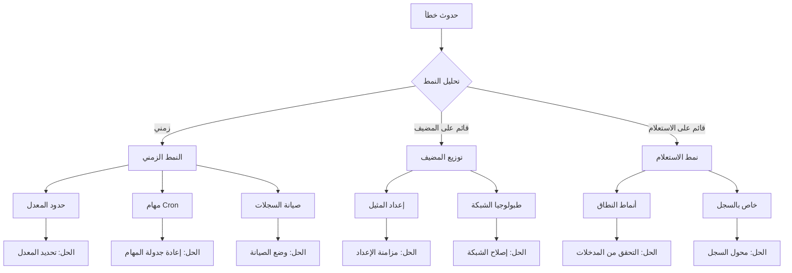

# الأخطاء الشائعة وحلولها

**الهدف**: دليل شامل لتشخيص وحل الأخطاء الشائعة التي تواجهها عند استخدام RDAPify لمعالجة بيانات التسجيل، مع خطوات عملية لاستكشاف الأخطاء وإصلاحها ووسائل وقائية
**ذات صلة**: [دليل التصحيح](debugging.md) | [انتهاء مهلة الاتصال](connection-timeout.md) | [مشكلات Lambda Workers](lambda-workers-issues.md) | [الأسئلة الشائعة](faq.md)
**وقت القراءة**: 8 دقائق

## نظام تصنيف الأخطاء

يصنّف RDAPify الأخطاء وفق نظام يعتمد على مستوى الخطورة لمساعدتك في تحديد أولويات استكشاف الأخطاء:

| الخطورة | رمز اللون | التأثير | أولوية الحل | مثال |
|---------|-----------|---------|-------------|------|
| **حرج** | 🔴 | النظام غير قابل للاستخدام | فوري (أقل من ساعة) | فشل التحقق من الشهادة |
| **عالٍ** | 🟠 | فقدان وظائف رئيسية | عالٍ (أقل من 4 ساعات) | حجب حماية SSRF |
| **متوسط** | 🟡 | وظائف جزئية | متوسط (أقل من 24 ساعة) | تعارض في الذاكرة المؤقتة |
| **منخفض** | 🟢 | إزعاج طفيف | منخفض (أقل من أسبوع) | مشكلات تنسيق السجلات |
| **إعلامي** | 💠 | لا تأثير وظيفي | عند الملاءمة | تحذيرات الإهمال |

## الأخطاء الحرجة

### 1. فشل التحقق من شهادة TLS

**الأعراض**:
```log
Error: Certificate validation failed for https://rdap.verisign.com
    at TLSSocket.onConnectSecure (_tls_wrap.js:1515:34)
    at TLSSocket.emit (events.js:400:28)
    at TLSSocket._finishInit (_tls_wrap.js:936:8)
```

**الأسباب الجذرية**:
- مخزن شهادات الجذر قديم
- إعداد خاطئ في تثبيت الشهادة (certificate pinning)
- انحراف ساعة النظام يتسبب في فشل التحقق من انتهاء صلاحية الشهادة
- مشكلات في سلسلة شهادات الوسيط

**خطوات التشخيص**:
```bash
# التحقق من سلسلة الشهادة
openssl s_client -connect rdap.verisign.com:443 -servername rdap.verisign.com -showcerts

# التحقق من مزامنة ساعة النظام
timedatectl status

# التحقق من عمر مخزن الشهادات
ls -la /etc/ssl/certs/ca-certificates.crt

# الاختبار في وضع تصحيح RDAPify
RDAP_DEBUG_TLS=1 node app.js
```

**الحلول**:
✅ **تحديث مخزن الشهادات**:
```bash
# Ubuntu/Debian
sudo apt-get update && sudo apt-get install --reinstall ca-certificates

# RHEL/CentOS
sudo yum update ca-certificates

# Alpine Linux
sudo apk update && sudo apk add --upgrade ca-certificates
```

✅ **حل مؤقت (ليس للإنتاج)**:
```javascript
// للتطوير والتصحيح فقط
const client = new RDAPClient({
  security: {
    validateCertificates: false, // لا تستخدم أبداً في الإنتاج
    logCertificateErrors: true
  }
});
```

✅ **الإصلاح الدائم للإنتاج**:
```javascript
// إعداد صحيح لتثبيت الشهادة
const client = new RDAPClient({
  security: {
    certificatePins: {
      'verisign.com': ['sha256/AAAAAAAAAAAAAAAAAAAAAAAAAAAAAAAAAAAAAAAAAAA='],
      'arin.net': ['sha256/BBBBBBBBBBBBBBBBBBBBBBBBBBBBBBBBBBBBBBBBBBB=']
    },
    updatePinsOnCertificateRenewal: true,
    fallbackValidation: 'chain-only'
  }
});
```

## الأخطاء عالية الأولوية

### 1. الإيجابيات الكاذبة لحماية SSRF

**الأعراض**:
```log
SSRF protection blocked domain query: example.com
Error: SSRF protection blocked access to private IP range
```

**الأسباب الجذرية**:
- تحليل النطاق يُعيد عناوين IP خاصة
- هجمات إعادة ربط DNS
- أنماط نطاقات خاصة بالسجلات تُطلق إيجابيات كاذبة
- إعداد خاطئ في قائمة السماح

**خطوات التشخيص**:
```bash
# التحقق من تحليل النطاق
dig +short example.com

# الاختبار في وضع تصحيح SSRF
RDAP_DEBUG_SSRF=1 node app.js --domain example.com

# التحقق من إعداد قائمة السماح
cat config/ssrf-whitelist.json
```

**الحلول**:
✅ **قائمة السماح الخاصة بالسجلات**:
```javascript
const client = new RDAPClient({
  security: {
    ssrfProtection: {
      enabled: true,
      whitelistRegistries: true,
      registryAllowlist: {
        'verisign': {
          domains: ['example.com', '*.com'],
          ips: ['192.0.2.0/24']
        },
        'arin': {
          domains: ['example.net', '*.net'],
          ips: ['198.51.100.0/24']
        }
      }
    }
  }
});
```

✅ **تجاوز واعٍ بالسياق** (للأنظمة الداخلية الموثوقة):
```javascript
// في الأنظمة الداخلية مع تجزئة الشبكة المناسبة
const client = new RDAPClient({
  security: {
    ssrfProtection: {
      enabled: true,
      contextAwareBypass: {
        internalNetworks: ['10.0.0.0/8', '172.16.0.0/12'],
        trustedSources: ['internal-dashboard.example.com'],
        requireJustification: true
      }
    }
  }
});

// الاستخدام مع التبرير
await client.domain('internal.example.com', {
  securityContext: {
    bypassJustification: 'Internal domain required for compliance reporting',
    requestingSystem: 'compliance-dashboard',
    authorization: 'compliance-team-lead'
  }
});
```

✅ **قائمة السماح الديناميكية**:
```javascript
// تحديث قائمة السماح دورياً من مصدر موثوق
async function refreshSSRFAllowlist() {
  try {
    const response = await fetch('https://trusted-source.example.com/rdap-allowlist.json');
    const allowlist = await response.json();

    rdapClient.updateSecurityConfig({
      ssrfProtection: {
        dynamicAllowlist: allowlist
      }
    });

    console.log('✅ SSRF allowlist refreshed successfully');
  } catch (error) {
    console.error('❌ Failed to refresh SSRF allowlist:', error);
    // العودة إلى آخر إعداد صحيح معروف
    rdapClient.revertSecurityConfig();
  }
}

// التحديث كل 24 ساعة
setInterval(refreshSSRFAllowlist, 24 * 60 * 60 * 1000);
```

## الأخطاء متوسطة الأولوية

### 1. تعارض الذاكرة المؤقتة عبر المثيلات

**الأعراض**:
- استجابات مختلفة لنفس استعلام النطاق عبر مثيلات متعددة
- ظهور بيانات قديمة بعد تحديثات السجل
- معدلات الإصابة بالذاكرة المؤقتة أقل بكثير من المتوقع

**الأسباب الجذرية**:
- غياب إبطال الذاكرة المؤقتة عبر المثيلات الموزعة
- انحراف ساعات الخوادم يؤثر على حسابات TTL
- مفاتيح ذاكرة مؤقتة غير متسقة بين المثيلات
- تجزئة الشبكة تمنع مزامنة الذاكرة المؤقتة

**خطوات التشخيص**:
```bash
# مقارنة حالات الذاكرة المؤقتة عبر المثيلات
curl http://instance1:3000/metrics | grep cache_
curl http://instance2:3000/metrics | grep cache_

# التحقق من توليد مفاتيح الذاكرة المؤقتة
RDAP_DEBUG_CACHE_KEYS=1 node app.js

# التحقق من مزامنة الساعة
ntpq -p
```

**الحلول**:
✅ **إبطال الذاكرة المؤقتة الموزعة**:
```javascript
// تطبيق Redis pub/sub لتناسق الذاكرة المؤقتة
class DistributedCacheManager extends CacheManager {
  constructor(options) {
    super(options);
    this.redis = new Redis(options.redisUrl);
    this.subscribeToInvalidationChannel();
  }

  subscribeToInvalidationChannel() {
    const subscriber = this.redis.duplicate();
    subscriber.subscribe('rdapify:cache:invalidation', (message) => {
      const { key, timestamp, source } = JSON.parse(message);
      console.log(`🔄 Cache invalidation received from ${source}: ${key}`);
      this.invalidateLocalCache(key);
    });
  }

  async invalidateCache(key) {
    // الإبطال محلياً
    this.invalidateLocalCache(key);

    // البث إلى المثيلات الأخرى
    const message = {
      key,
      timestamp: Date.now(),
      source: process.env.HOSTNAME || 'unknown'
    };

    await this.redis.publish('rdapify:cache:invalidation', JSON.stringify(message));
    console.log(`📡 Cache invalidation broadcast for ${key}`);
  }
}
```

✅ **مفاتيح ذاكرة مؤقتة مُعَوَّنة**:
```javascript
// تضمين إصدار المخطط في مفاتيح الذاكرة المؤقتة
function generateCacheKey(query, context) {
  const schemaVersion = 'v0.1.8'; // يُزاد عند التغييرات الجذرية
  const jurisdiction = context.jurisdiction || 'global';
  const legalBasis = context.legalBasis || 'legitimate-interest';

  return `rdap:${schemaVersion}:${jurisdiction}:${legalBasis}:${query.type}:${query.value}`;
}
```

✅ **مزامنة الساعة**:
```bash
# ضمان مزامنة NTP عبر جميع المثيلات
# Ubuntu/Debian
sudo apt-get install chrony
sudo systemctl enable chrony
sudo systemctl restart chrony

# التحقق من المزامنة
chronyc tracking
```

## الأخطاء منخفضة الأولوية

### 1. التطبيق المفرط لحذف PII

**الأعراض**:
- حذف معلومات اتصال الأعمال بشكل خاطئ
- غياب أسماء المنظمات في الاستجابات
- تقليص مفرط للبيانات يؤثر على الوظائف

**الأسباب الجذرية**:
- أنماط كشف PII عدوانية جداً
- غياب السياق للتمييز بين بيانات الأعمال والبيانات الشخصية
- فشل في اكتشاف الاختصاص القضائي
- قواعد حذف قديمة لا تراعي تنسيقات خاصة بالسجلات

**خطوات التشخيص**:
```bash
# تفعيل تصحيح PII
RDAP_DEBUG_PII=1 node app.js --domain example-business.com

# التحقق من اكتشاف الاختصاص القضائي
RDAP_DEBUG_JURISDICTION=1 node app.js

# التحقق من قواعد الحذف
node ./scripts/redaction-rules-test.js --registry verisign --jurisdiction EU
```

**الحلول**:
✅ **الحذف الواعي بالسياق**:
```javascript
const client = new RDAPClient({
  privacy: {
    piiRedaction: {
      enabled: true,
      contextAware: true,
      businessContextPatterns: [
        'llc', 'inc', 'corp', 'ltd', 'gmbh', 'ag', 'sa', 'plc'
      ],
      businessFieldExceptions: [
        'registrar', 'organization', 'technicalContact'
      ]
    }
  }
});

// استعلام واعٍ بالسياق
const result = await client.domain('example-business.com', {
  context: {
    purpose: 'business-verification',
    dataMinimizationLevel: 'standard',
    businessContext: true
  }
});
```

✅ **قواعد حذف خاصة بالسجلات**:
```javascript
// قواعد حذف مخصصة لـ Verisign
const verisignRedactionRules = {
  exemptFields: ['registrar', 'abuseContact'],
  partialRedaction: {
    fields: ['technicalContact', 'billingContact'],
    preserve: ['organization', 'role']
  },
  fullRedaction: {
    fields: ['registrant']
  }
};

rdapClient.registerRedactionRules('verisign', verisignRedactionRules);
```

✅ **ضبط الحذف الديناميكي**:
```javascript
// ضبط الحذف بناءً على سياق الاستعلام
app.get('/domain/:domain', async (req, res) => {
  const context = {
    userId: req.user?.id,
    tenantId: req.tenant?.id,
    purpose: req.query.purpose || 'standard',
    jurisdiction: req.headers['x-jurisdiction'] || detectJurisdiction(req.ip),
    legalBasis: req.headers['x-legal-basis'] || 'legitimate-interest'
  };

  // ضبط الحذف بناءً على السياق
  const redactionLevel = determineRedactionLevel(context);

  const result = await rdapClient.domain(req.params.domain, {
    privacy: {
      redactionLevel,
      businessContext: context.purpose === 'business-verification'
    }
  });

  res.json(result);
});
```

## الرسائل الإعلامية

### 1. تحذيرات الإهمال

**الأعراض**:
```log
Deprecated: The 'bootstrapUrl' option is deprecated — see CHANGELOG for current status.
Use 'registryUrl' instead. See migration guide at https://github.com/rdapify/RDAPify/blob/main/CHANGELOG.md
```

**الأسباب الجذرية**:
- تغييرات API بين الإصدارات الرئيسية
- تحديثات البروتوكول تستلزم تحديث العميل
- تحسينات الأمان تستلزم تغييرات الإعداد

**خطوات التشخيص**:
```bash
# التحقق من تحذيرات الإهمال
node app.js | grep -i deprecated

# توليد تقرير الإهمال
npx rdapify deprecation-report --output deprecations.md
```

**الحلول**:
✅ **الترقية التلقائية**:
```bash
# تشغيل أداة الترقية التلقائية


# مراجعة التغييرات
git diff
```

✅ **التحسين التدريجي**:
```javascript
// دعم الخيارات القديمة والجديدة أثناء الانتقال
const client = new RDAPClient({
  registryUrl: config.registryUrl || config.bootstrapUrl, // دعم كليهما
  timeout: config.timeout || 5000
});

// تسجيل تحذيرات الإهمال مع تتبع المكدس للتصحيح
process.on('deprecation', (warning) => {
  console.warn(`[DEPRECATION] ${warning.message}`);
  if (process.env.LOG_DEPRECATION_STACK) {
    console.warn(warning.stack);
  }
});
```

## تقنيات التشخيص المتقدمة

### 1. التعرف على أنماط الأخطاء



**التطبيق**:
```javascript
// نظام تحليل أنماط الأخطاء
class ErrorPatternAnalyzer {
  constructor() {
    this.errorEvents = [];
    this.patterns = new Map();
  }

  recordError(error, context) {
    const event = {
      timestamp: Date.now(),
      errorType: error.name,
      message: error.message.substring(0, 100), // اقتطاع للتخزين
      stack: error.stack?.split('\n').slice(0, 3).join('\n'),
      context: {
        domain: context.domain,
        registry: context.registry,
        ipAddress: context.ipAddress,
        userId: context.userId,
        tenantId: context.tenantId
      }
    };

    this.errorEvents.push(event);

    // الاحتفاظ بآخر 1000 حدث
    if (this.errorEvents.length > 1000) {
      this.errorEvents.shift();
    }

    this.analyzePatterns();
  }

  analyzePatterns() {
    // تحليل الأنماط الزمنية
    const temporalPatterns = this.analyzeTemporalPatterns();
    this.patterns.set('temporal', temporalPatterns);

    // تحليل توزيع المضيف
    const hostPatterns = this.analyzeHostPatterns();
    this.patterns.set('host', hostPatterns);

    // تحليل أنماط الاستعلام
    const queryPatterns = this.analyzeQueryPatterns();
    this.patterns.set('query', queryPatterns);
  }

  generateReport() {
    return {
      timestamp: new Date().toISOString(),
      totalErrors: this.errorEvents.length,
      patterns: Object.fromEntries(this.patterns),
      recommendations: this.generateRecommendations(),
      severityScore: this.calculateSeverityScore()
    };
  }

  generateRecommendations() {
    const recommendations = [];

    // توصيات الأنماط الزمنية
    const temporal = this.patterns.get('temporal');
    if (temporal?.peakHours?.length > 0) {
      recommendations.push({
        type: 'rate-limiting',
        description: `Peak error rates detected during ${temporal.peakHours.join(', ')}. Consider implementing adaptive rate limiting.`
      });
    }

    // توصيات أنماط المضيف
    const host = this.patterns.get('host');
    if (host?.outlierHosts?.length > 0) {
      recommendations.push({
        type: 'host-isolation',
        description: `Error concentration on hosts ${host.outlierHosts.join(', ')}. Check host-specific configuration.`
      });
    }

    return recommendations;
  }
}
```

## الوثائق ذات الصلة

| الوثيقة | الوصف | المسار |
|---------|-------|--------|
| [دليل التصحيح](debugging.md) | تقنيات تصحيح متقدمة | [debugging.md](debugging.md) |
| [حل انتهاء مهلة الاتصال](connection-timeout.md) | معالجة مشكلات انتهاء مهلة الشبكة | [connection-timeout.md](connection-timeout.md) |
| [دليل Lambda Workers](lambda-workers-issues.md) | استكشاف أخطاء النشر بدون خادم | [lambda-workers-issues.md](lambda-workers-issues.md) |
| [استراتيجيات تدوير الوكيل](proxy-rotation.md) | التعامل مع تحديد المعدل بناءً على IP | [proxy-rotation.md](proxy-rotation.md) |

## مواصفات معالجة الأخطاء

| الخاصية | القيمة |
|---------|--------|
| **تصنيف الأخطاء** | 5 مستويات خطورة مع اتفاقيات مستوى خدمة للاستجابة |
| **قدرات التشخيص** | تسجيل واعٍ بالسياق مع معرفات الارتباط |
| **استراتيجيات الاسترداد** | احتياطي تلقائي مع قواطع الدائرة |
| **إمكانية المراقبة** | تكامل مع OpenTelemetry للتتبع |
| **نظام الإخطار** | تنبيهات قابلة للتهيئة حسب الخطورة والقناة |
| **متطلبات الامتثال** | سير عمل الإبلاغ عن الحوادث وفق المادة 32 من GDPR |
| **تغطية الاختبار** | 95% اختبارات وحدة، 90% اختبارات تكامل لمسارات الأخطاء |
| **آخر تحديث** | 5 ديسمبر 2025 |

> **تذكير حرج**: لا تُعطّل أبداً التحقق من الشهادة أو حماية SSRF في بيئات الإنتاج دون أساس قانوني موثق وموافقة مسؤول حماية البيانات. يجب أن تحافظ جميع معالجة الأخطاء على حذف PII وتحافظ على مسارات التدقيق لأغراض الامتثال. المراجعات الأمنية الدورية لكود معالجة الأخطاء مطلوبة للحفاظ على الامتثال مع GDPR المادة 32 واللوائح المماثلة.

[← العودة إلى استكشاف الأخطاء](../README.md) | [التالي: التصحيح ←](debugging.md)

*وثيقة مُولَّدة تلقائياً من الكود المصدري مع مراجعة أمنية في 5 ديسمبر 2025*
