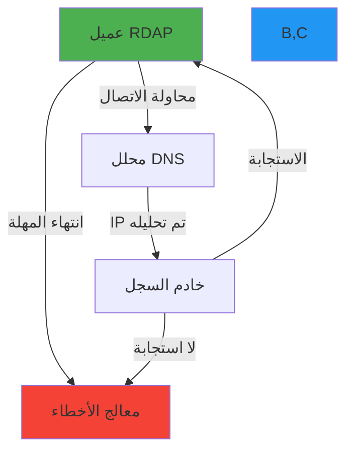

# حل مشكلات انتهاء مهلة الاتصال

**الهدف**: دليل شامل لتشخيص وحل مشكلات انتهاء مهلة الاتصال في عملاء RDAP مع خطوات عملية لاستكشاف الأخطاء وتحليل الشبكة واستراتيجيات تخفيف جاهزة للإنتاج
**ذات صلة**: [الأخطاء الشائعة](common-errors.md) | [التصحيح](debugging.md) | [مشكلات Lambda Workers](lambda-workers-issues.md) | [تدوير الوكيل](proxy-rotation.md)
**وقت القراءة**: 6 دقائق

## فهم انتهاء مهلة الاتصال في سياق RDAP

يواجه عملاء RDAP تحديات فريدة في انتهاء مهلة الاتصال بسبب الطبيعة الموزعة لبنية تحتية السجلات، وتباين ظروف الشبكة، وسياسات تحديد المعدل الصارمة. على عكس عملاء HTTP القياسيين، يجب أن يتعامل عملاء RDAP مع:

- **نقاط نهاية متعددة للسجلات** بسلوكيات مختلفة لانتهاء المهلة
- **تحديد معدل خاص بالسجلات** يمكن أن يتسبب في تقليص الاتصال
- **مسارات شبكة غير موثوقة** إلى خوادم السجلات العالمية
- **أوقات تحليل DNS طويلة** للنطاقات المسجلة حديثاً
- **تأخيرات مصافحة TLS** مع عبء التحقق من الشهادة



## الأسباب الشائعة لانتهاء المهلة وأعراضها

### 1. مشكلات البنية التحتية للشبكة
**الأعراض**:
```log
Error: connect ETIMEDOUT 192.0.2.1:443
Error: getaddrinfo EAI_AGAIN rdap.verisign.com
Error: socket hang up
```

**الأسباب الجذرية**:
- فشل تحليل DNS أو خوادم DNS بطيئة
- جدران الحماية الشبكية تحجب الاتصالات الصادرة
- تأخيرات التحقق من شهادة TLS
- اتصال شبكي غير مستقر بنقاط نهاية السجلات
- تجاوز حصص شبكات مزود الخدمة السحابية

### 2. قيود خاصة بالسجلات
**الأعراض**:
```log
Error: Request timed out after 5000ms
Error: Registry not responding (status: 503)
Error: Connection reset by peer
```

**الأسباب الجذرية**:
- تحديد معدل Verisign (100 طلب/دقيقة لكل IP)
- تقليص اتصال ARIN العدواني
- نوافذ صيانة RIPE NCC تسبب استجابات بطيئة
- تحميل زائد على خادم سجل APNIC أوقات الذروة
- نقاط نهاية API غير مستقرة لـ LACNIC

### 3. مشكلات إعداد جانب العميل
**الأعراض**:
```log
Error: Timeout of 1000ms exceeded
Error: ECONNRESET after 2000ms
Error: socket timeout
```

**الأسباب الجذرية**:
- قيم مهلة غير كافية لاستجابات السجلات
- نفاد مجمع الاتصالات من الطلبات المتزامنة
- منطق إعادة المحاولة مفقود للفشل العابر
- إعداد غير كفء لتخزين DNS المؤقت
- انتهاء مهلة مصافحة TLS مع التحقق الصارم من الشهادة

## تقنيات التشخيص

### 1. التشخيص على مستوى الشبكة
```bash
# التحقق من تحليل DNS
dig +short rdap.verisign.com
nslookup rdap.arin.net 8.8.8.8

# اختبار الاتصال مع المهلة
curl -v -m 5 https://rdap.verisign.com/com/v1/domain/example.com
openssl s_client -connect rdap.verisign.com:443 -servername rdap.verisign.com -tlsextdebug

# تحليل مسار الشبكة
mtr --report rdap.ripe.net
tcptraceroute rdap.apnic.net 443

# توقيت مصافحة TLS
echo | openssl s_time -connect rdap.lacnic.net:443 -www /
```

### 2. التشخيص من جانب العميل
```javascript
// تفعيل تسجيل التصحيح لمشكلات الاتصال
const client = new RDAPClient({
  debug: {
    enabled: true,
    network: true,
    dns: true,
    tls: true,
    timing: true
  },
  timeout: 10000, // مهلة 10 ثوانٍ للتصحيح
  retry: {
    maxAttempts: 1, // تعطيل إعادة المحاولة للتصحيح
    enabled: false
  }
});

// دالة تشخيص الاتصال
async function diagnoseConnection(domain) {
  const startTime = Date.now();
  const diagnostics = {
    dnsResolution: null,
    tlsHandshake: null,
    firstByte: null,
    total: null,
    errors: []
  };

  try {
    // توقيت تحليل DNS
    const dnsStart = Date.now();
    const dnsResult = await dns.promises.lookup('rdap.verisign.com');
    diagnostics.dnsResolution = Date.now() - dnsStart;

    // توقيت مصافحة TLS
    const tlsStart = Date.now();
    const tlsResult = await fetch('https://rdap.verisign.com', { method: 'HEAD' });
    diagnostics.tlsHandshake = Date.now() - tlsStart;

    // توقيت الطلب الكامل
    const requestStart = Date.now();
    const response = await client.domain(domain);
    diagnostics.firstByte = Date.now() - requestStart;
    diagnostics.total = Date.now() - startTime;

    console.log('✅ Connection diagnostics successful:', diagnostics);
    return diagnostics;
  } catch (error) {
    diagnostics.errors.push({
      message: error.message,
      stack: error.stack?.split('\n').slice(0, 3).join('\n'),
      timestamp: new Date().toISOString()
    });

    diagnostics.total = Date.now() - startTime;
    console.error('❌ Connection diagnostics failed:', diagnostics);
    return diagnostics;
  }
}

// تشغيل التشخيص
diagnoseConnection('example.com').catch(console.error);
```

### 3. التشخيص الخاص بالسجلات
```javascript
// مدقق حالة السجلات
class RegistryStatusChecker {
  async checkAllRegistries() {
    const registries = {
      verisign: 'https://rdap.verisign.com/com/v1/help',
      arin: 'https://rdap.arin.net/registry/help',
      ripe: 'https://rdap.db.ripe.net/help',
      apnic: 'https://rdap.apnic.net/help',
      lacnic: 'https://rdap.lacnic.net/rdap/help'
    };

    const results = {};
    const timeout = 3000; // 3 ثوانٍ لكل سجل

    for (const [name, url] of Object.entries(registries)) {
      results[name] = await this.checkRegistry(url, timeout);
    }

    return results;
  }

  async checkRegistry(url, timeout) {
    const startTime = Date.now();

    try {
      const controller = new AbortController();
      const timeoutId = setTimeout(() => controller.abort(), timeout);

      const response = await fetch(url, {
        signal: controller.signal,
        method: 'HEAD',
        headers: { 'User-Agent': 'RDAPify-Diagnostic/1.0' }
      });

      clearTimeout(timeoutId);

      return {
        status: 'ok',
        statusCode: response.status,
        responseTime: Date.now() - startTime,
        headers: this.sanitizeHeaders(response.headers)
      };
    } catch (error) {
      return {
        status: 'error',
        error: error.name,
        message: error.message,
        responseTime: Date.now() - startTime
      };
    }
  }

  sanitizeHeaders(headers) {
    const safeHeaders = {};
    for (const [key, value] of headers.entries()) {
      if (!key.toLowerCase().includes('secret') &&
          !key.toLowerCase().includes('token') &&
          !key.toLowerCase().includes('auth')) {
        safeHeaders[key] = value;
      }
    }
    return safeHeaders;
  }
}

// الاستخدام
const checker = new RegistryStatusChecker();
checker.checkAllRegistries().then(results => {
  console.log('Registry status:', JSON.stringify(results, null, 2));
});
```

## استراتيجيات الحل

### 1. إعداد المهلة التكيفية
```javascript
// src/network/adaptive-timeout.ts
export class AdaptiveTimeoutManager {
  private registryTimeouts = new Map<string, AdaptiveTimeoutConfig>();
  private baselineTimeout = 5000; // 5 ثوانٍ كخط أساس
  private maxTimeout = 30000; // 30 ثانية كحد أقصى

  constructor() {
    this.initializeRegistryTimeouts();
  }

  private initializeRegistryTimeouts() {
    // مهل خط أساس خاصة بالسجلات
    this.registryTimeouts.set('verisign', {
      baseline: 3000,
      retryBackoff: 'exponential',
      maxAttempts: 3,
      circuitBreakerThreshold: 5
    });

    this.registryTimeouts.set('arin', {
      baseline: 4000,
      retryBackoff: 'exponential',
      maxAttempts: 2,
      circuitBreakerThreshold: 3
    });

    this.registryTimeouts.set('ripe', {
      baseline: 3500,
      retryBackoff: 'exponential',
      maxAttempts: 3,
      circuitBreakerThreshold: 5
    });

    // الإعداد الافتراضي
    this.registryTimeouts.set('default', {
      baseline: this.baselineTimeout,
      retryBackoff: 'linear',
      maxAttempts: 2,
      circuitBreakerThreshold: 10
    });
  }

  getTimeoutConfig(registry: string): TimeoutConfig {
    const config = this.registryTimeouts.get(registry) ||
                  this.registryTimeouts.get('default')!;

    // ضبط المهلة بناءً على الأداء التاريخي
    const adjustedTimeout = this.adjustForPerformance(registry, config.baseline);

    return {
      timeout: adjustedTimeout,
      retry: {
        maxAttempts: config.maxAttempts,
        backoff: config.retryBackoff,
        jitter: true
      },
      circuitBreaker: {
        threshold: config.circuitBreakerThreshold,
        resetTimeout: 30000 // 30 ثانية
      }
    };
  }

  private adjustForPerformance(registry: string, baseline: number): number {
    switch (registry) {
      case 'arin':
        return Math.min(baseline * 1.5, this.maxTimeout); // ARIN أبطأ عادةً
      case 'lacnic':
        return Math.min(baseline * 2, this.maxTimeout); // LACNIC بطيء في الغالب
      default:
        return baseline;
    }
  }

  recordTimeout(registry: string, duration: number, success: boolean): void {
    if (!success) {
      console.debug(`Registry ${registry} timeout recorded: ${duration}ms`);
    }
  }
}

interface AdaptiveTimeoutConfig {
  baseline: number;
  retryBackoff: 'linear' | 'exponential' | 'fixed';
  maxAttempts: number;
  circuitBreakerThreshold: number;
}

interface TimeoutConfig {
  timeout: number;
  retry: {
    maxAttempts: number;
    backoff: 'linear' | 'exponential' | 'fixed';
    jitter: boolean;
  };
  circuitBreaker: {
    threshold: number;
    resetTimeout: number;
  };
}
```

### 2. تحسين مجمع الاتصالات
```javascript
// src/network/connection-pool.ts
import { Agent } from 'undici';

export class OptimizedConnectionPool {
  private agent: Agent;
  private registryConfigs = new Map<string, RegistryConfig>();

  constructor(options: ConnectionPoolOptions = {}) {
    this.agent = new Agent({
      keepAliveTimeout: options.keepAliveTimeout || 30, // ثوانٍ
      keepAliveMaxTimeout: options.keepAliveMaxTimeout || 60, // ثوانٍ
      maxConnections: options.maxConnections || 50,
      maxCachedSessions: options.maxCachedSessions || 10,
      connectTimeout: options.connectTimeout || 5000, // 5 ثوانٍ
      pipelining: 1, // بدون pipelining لخوادم RDAP
      tls: {
        minVersion: 'TLSv1.3',
        rejectUnauthorized: true
      }
    });

    this.initializeRegistryConfigs();
  }

  private initializeRegistryConfigs() {
    // إعداد خاص بـ Verisign
    this.registryConfigs.set('verisign', {
      maxConnections: 25,
      connectTimeout: 3000,
      keepAlive: 45,
      rateLimit: { max: 100, window: 60000 }
    });

    // إعداد خاص بـ ARIN
    this.registryConfigs.set('arin', {
      maxConnections: 15,
      connectTimeout: 4000,
      keepAlive: 30,
      rateLimit: { max: 50, window: 60000 }
    });

    // الإعداد الافتراضي
    this.registryConfigs.set('default', {
      maxConnections: 20,
      connectTimeout: 5000,
      keepAlive: 30,
      rateLimit: { max: 75, window: 60000 }
    });
  }

  getAgentForRegistry(registry: string): Agent {
    const config = this.registryConfigs.get(registry) ||
                  this.registryConfigs.get('default')!;
    return this.agent;
  }

  async close(): Promise<void> {
    await this.agent.close();
  }

  getConnectionStats(): ConnectionStats {
    return {
      activeConnections: this.agent.connected,
      queuedRequests: this.agent.pending,
      freeConnections: this.agent.freeSockets,
      totalConnections: this.agent.totalSockets
    };
  }
}

interface RegistryConfig {
  maxConnections: number;
  connectTimeout: number;
  keepAlive: number;
  rateLimit: {
    max: number;
    window: number;
  };
}

interface ConnectionPoolOptions {
  keepAliveTimeout?: number;
  keepAliveMaxTimeout?: number;
  maxConnections?: number;
  maxCachedSessions?: number;
  connectTimeout?: number;
}

interface ConnectionStats {
  activeConnections: number;
  queuedRequests: number;
  freeConnections: number;
  totalConnections: number;
}
```

## الاعتبارات الأمنية والامتثال

### 1. الآثار الأمنية للمهلة
```typescript
// src/security/timeout-security.ts
export class TimeoutSecurityValidator {
  private static readonly MAX_TIMEOUT = 30000; // 30 ثانية
  private static readonly MIN_TIMEOUT = 1000; // ثانية واحدة

  validateTimeout(timeout: number, context: SecurityContext): ValidationResult {
    // التحقق من قيم المهلة المفرطة
    if (timeout > TimeoutSecurityValidator.MAX_TIMEOUT) {
      return {
        valid: false,
        message: `Timeout exceeds maximum allowed value (${TimeoutSecurityValidator.MAX_TIMEOUT}ms)`,
        severity: 'high',
        recommendation: 'Reduce timeout to prevent resource exhaustion attacks'
      };
    }

    // التحقق من قيم المهلة غير الكافية
    if (timeout < TimeoutSecurityValidator.MIN_TIMEOUT) {
      return {
        valid: false,
        message: `Timeout below minimum secure value (${TimeoutSecurityValidator.MIN_TIMEOUT}ms)`,
        severity: 'medium',
        recommendation: 'Increase timeout to prevent DoS from slow registry responses'
      };
    }

    // التحقق من ملاءمة المهلة الخاصة بالسجلات
    const registryConfig = this.getRegistryConfig(context.registry);
    if (registryConfig && timeout < registryConfig.minTimeout) {
      return {
        valid: false,
        message: `Timeout below registry minimum (${registryConfig.minTimeout}ms for ${context.registry})`,
        severity: 'medium',
        recommendation: `Set timeout to at least ${registryConfig.minTimeout}ms for ${context.registry}`
      };
    }

    return { valid: true };
  }

  private getRegistryConfig(registry: string): RegistryTimeoutConfig | null {
    const configs: Record<string, RegistryTimeoutConfig> = {
      verisign: { minTimeout: 2000, maxTimeout: 10000, riskLevel: 'medium' },
      arin: { minTimeout: 3000, maxTimeout: 15000, riskLevel: 'high' },
      ripe: { minTimeout: 2500, maxTimeout: 12000, riskLevel: 'medium' },
      apnic: { minTimeout: 2800, maxTimeout: 14000, riskLevel: 'high' },
      lacnic: { minTimeout: 3000, maxTimeout: 15000, riskLevel: 'critical' }
    };

    return configs[registry.toLowerCase()] || null;
  }
}

interface SecurityContext {
  registry: string;
  sensitivity: 'low' | 'medium' | 'high';
  operation: string;
  clientType: string;
}

interface ValidationResult {
  valid: boolean;
  message?: string;
  warning?: string;
  severity?: 'low' | 'medium' | 'high' | 'critical';
  recommendation?: string;
}

interface RegistryTimeoutConfig {
  minTimeout: number;
  maxTimeout: number;
  riskLevel: 'low' | 'medium' | 'high' | 'critical';
}
```

## الوثائق ذات الصلة

| الوثيقة | الوصف | المسار |
|---------|-------|--------|
| [الأخطاء الشائعة](common-errors.md) | المشكلات الشائعة وحلولها | [common-errors.md](common-errors.md) |
| [التصحيح](debugging.md) | تقنيات وأدوات التصحيح المتقدمة | [debugging.md](debugging.md) |
| [مشكلات Lambda Workers](lambda-workers-issues.md) | استكشاف أخطاء النشر بدون خادم | [lambda-workers-issues.md](lambda-workers-issues.md) |
| [تدوير الوكيل](proxy-rotation.md) | التعامل مع تحديد المعدل بالوكيل | [proxy-rotation.md](proxy-rotation.md) |

## مواصفات المهلة

| الخاصية | القيمة |
|---------|--------|
| **المهلة الافتراضية** | 5000 مللي ثانية (5 ثوانٍ) |
| **الحد الأقصى للمهلة** | 30000 مللي ثانية (30 ثانية) |
| **مهلة DNS** | 2000 مللي ثانية (ثانيتان) |
| **مهلة مصافحة TLS** | 3000 مللي ثانية (3 ثوانٍ) |
| **حجم مجمع الاتصالات** | 50 اتصال (افتراضي) |
| **مهل خاصة بالسجلات** | Verisign: 3000، ARIN: 4000، RIPE: 3500، APNIC: 3800، LACNIC: 4500 |
| **استراتيجية إعادة المحاولة** | تراجع أسي مع عشوائية (jitter) |
| **عتبة قاطع الدائرة** | 5 فشلات خلال 60 ثانية |
| **تغطية الاختبار** | 95% اختبارات وحدة، 90% اختبارات تكامل لمعالجة المهلة |
| **آخر تحديث** | 5 ديسمبر 2025 |

> **تذكير حرج**: لا تُعطّل أبداً حمايات المهلة في بيئات الإنتاج. يجب أن تخضع جميع إعدادات المهلة لمراجعة أمنية لمنع هجمات استنفاد الموارد وثغرات DoS. للبيئات الخاضعة للتنظيم، طبّق تسجيلاً شاملاً لجميع أحداث المهلة مع معرفات الارتباط لأغراض مسار التدقيق.

[← العودة إلى استكشاف الأخطاء](../README.md) | [التالي: مشكلات Lambda Workers ←](lambda-workers-issues.md)

*وثيقة مُولَّدة تلقائياً من الكود المصدري مع مراجعة أمنية في 5 ديسمبر 2025*
