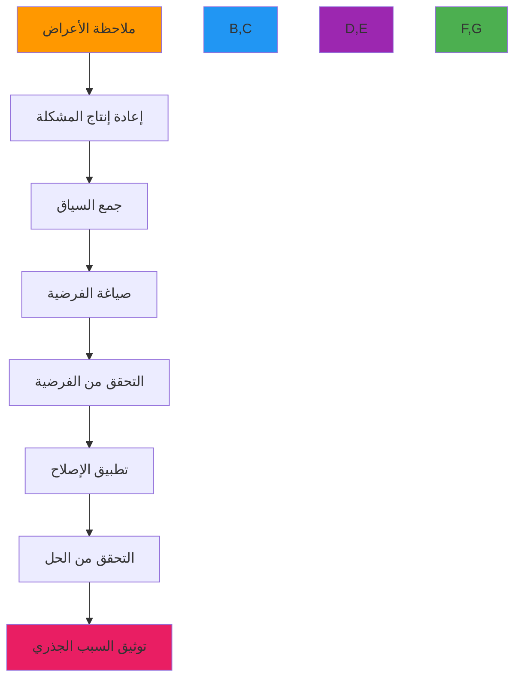

# دليل التصحيح

**الهدف**: دليل شامل لتصحيح تطبيقات RDAPify بتقنيات وأدوات واستراتيجيات متقدمة لتحديد المشكلات وحلها في بيئات التطوير والإنتاج
**ذات صلة**: [الأخطاء الشائعة](common-errors.md) | [حل انتهاء مهلة الاتصال](connection-timeout.md) | [كشف تسرب الذاكرة](memory_leaks.md) | [تحليل السجلات](log_analysis.md)
**وقت القراءة**: 7 دقائق

## منهجية التصحيح

يعتمد RDAPify منهجية تصحيح منهجية تتدرج من الملاحظة العامة إلى الحل المحدد:



### مبادئ التصحيح
✅ **إعادة الإنتاج أولاً**: إنشاء حالات إعادة إنتاج بسيطة ومتسقة قبل التحقيق العميق
✅ **المراقبة بدلاً من التخمين**: استخدام الأدوات المدمجة بدلاً من الافتراضات
✅ **العزل التدريجي**: تضييق نطاق المشكلة بشكل منهجي
✅ **الحل المبني على الأدلة**: إصلاح الأسباب الجذرية لا الأعراض
✅ **توثيق ما بعد الحادث**: توثيق الإصلاحات لمنع التكرار

## تقنيات التصحيح المتقدمة

### 1. تسجيل تصحيح محسّن
```typescript
// src/debug/debug-logger.ts
import { createLogger, format, transports } from 'winston';
import { inspect } from 'util';

export const createDebugLogger = (options: DebugLoggerOptions = {}) => {
  const {
    level = process.env.RDAP_DEBUG_LEVEL || 'info',
    includeStack = false,
    redactPII = true,
    maxDepth = 3
  } = options;

  // إنشاء محول الحذف
  const redactionFormat = format((info) => {
    if (redactPII) {
      info.message = redactPIIInMessage(info.message);
      if (info.meta) {
        info.meta = redactPIIInObject(info.meta, maxDepth);
      }
    }
    return info;
  });

  // إنشاء منسق تتبع المكدس
  const stackFormat = format((info) => {
    if (includeStack && info.level === 'error') {
      info.stack = new Error().stack?.split('\n').slice(1).join('\n');
    }
    return info;
  });

  return createLogger({
    level,
    format: format.combine(
      format.timestamp(),
      format.errors({ stack: true }),
      redactionFormat(),
      stackFormat(),
      format.printf(({ timestamp, level, message, stack, ...meta }) => {
        const metaString = Object.keys(meta).length > 0
          ? '\n' + inspect(meta, { depth: maxDepth, colors: true, compact: 3 })
          : '';

        return `[${timestamp}] [${level.toUpperCase()}] ${message}${metaString}${
          stack ? `\n${stack}` : ''
        }`;
      })
    ),
    transports: [
      new transports.Console({
        handleExceptions: true,
        handleRejections: true
      }),
      // نقل الملفات للتصحيح المستمر في الإنتاج
      ...(process.env.NODE_ENV === 'production'
        ? [new transports.File({ filename: 'logs/debug.log', level: 'debug' })]
        : [])
    ],
    exitOnError: false
  });
};

// طرق تصحيح متخصصة
const debugLogger = createDebugLogger();

export const debugMethods = {
  /**
   * تصحيح طلبات الشبكة مع تفاصيل الطلب والاستجابة الكاملة
   */
  network: (request: RequestDetails, response: ResponseDetails) => {
    debugLogger.debug('Network Request Trace', {
      requestId: request.id,
      method: request.method,
      url: request.url,
      headers: sanitizeHeaders(request.headers),
      body: request.body ? truncate(request.body, 500) : undefined,
      response: {
        status: response.status,
        headers: sanitizeHeaders(response.headers),
        body: response.body ? truncate(response.body, 500) : undefined,
        timing: {
          dns: response.timing?.dns,
          tcp: response.timing?.tcp,
          ssl: response.timing?.ssl,
          firstByte: response.timing?.firstByte,
          total: response.timing?.total
        }
      },
      registry: request.registry,
      domain: request.domain
    });
  },

  /**
   * تصحيح عمليات الذاكرة المؤقتة مع تفاصيل الإصابة والخطأ
   */
  cache: (operation: string, key: string, value: any, metadata: CacheMetadata) => {
    debugLogger.debug(`Cache ${operation}`, {
      key: truncate(key, 100),
      size: value ? JSON.stringify(value).length : 0,
      ttl: metadata.ttl,
      hitRate: metadata.hitRate,
      evicted: metadata.evictedCount,
      memoryUsage: process.memoryUsage().heapUsed / 1024 / 1024
    });
  },

  /**
   * تصحيح قرارات حماية SSRF
   */
  ssrf: (domain: string, result: SSRFResult, context: SSRFContext) => {
    if (!result.allowed) {
      debugLogger.warn('SSRF Protection Blocked', {
        domain,
        reason: result.reason,
        riskScore: result.riskScore,
        context: context.source,
        resolvedIP: result.resolvedIP,
        registry: context.registry
      });
    } else {
      debugLogger.debug('SSRF Protection Allowed', {
        domain,
        resolvedIP: result.resolvedIP,
        registry: context.registry
      });
    }
  }
};

// دوال مساعدة
function redactPIIInMessage(message: string): string {
  return message
    .replace(/\b[A-Za-z0-9._%+-]+@[A-Za-z0-9.-]+\.[A-Z|a-z]{2,}\b/gi, '[EMAIL_REDACTED]')
    .replace(/\b(?:\+?1[-.\s]?)?\(?\d{3}\)?[-.\s]?\d{3}[-.\s]?\d{4}\b/g, '[PHONE_REDACTED]');
}

function redactPIIInObject(obj: any, depth: number = 0, maxDepth: number = 3): any {
  if (depth > maxDepth || obj === null || obj === undefined) return obj;

  if (typeof obj === 'string') {
    return redactPIIInMessage(obj);
  }

  if (Array.isArray(obj)) {
    return obj.map(item => redactPIIInObject(item, depth + 1, maxDepth));
  }

  if (typeof obj === 'object') {
    const result: Record<string, any> = {};
    for (const [key, value] of Object.entries(obj)) {
      if (['email', 'phone', 'address', 'registrant', 'fn', 'adr'].includes(key.toLowerCase())) {
        result[key] = '[PII_REDACTED]';
      } else {
        result[key] = redactPIIInObject(value, depth + 1, maxDepth);
      }
    }
    return result;
  }

  return obj;
}
```

### 2. التصحيح التفاعلي مع نقاط التوقف
```typescript
// src/debug/interactive-debugger.ts
import { inspect } from 'util';
import { createInterface } from 'readline';

export class InteractiveDebugger {
  private pausePoints = new Map<string, PausePoint>();
  private debugContext: DebugContext = { variables: {} };
  private rl = createInterface({ input: process.stdin, output: process.stdout });

  constructor() {
    this.setupCommands();
  }

  private setupCommands() {
    this.rl.on('line', (input) => {
      const [command, ...args] = input.trim().split(' ');

      switch (command) {
        case 'continue':
        case 'c':
          this.resumeExecution();
          break;
        case 'step':
        case 's':
          this.stepInto();
          break;
        case 'next':
        case 'n':
          this.stepOver();
          break;
        case 'print':
        case 'p':
          this.printVariable(args[0]);
          break;
        case 'backtrace':
        case 'bt':
          this.printBacktrace();
          break;
        case 'help':
          this.printHelp();
          break;
        default:
          console.log(`Unknown command: ${command}`);
          this.printHelp();
      }
    });
  }

  addPausePoint(name: string, condition?: (context: DebugContext) => boolean): void {
    this.pausePoints.set(name, {
      name,
      enabled: true,
      condition,
      hitCount: 0
    });
  }

  pause(name: string, context: DebugContext): Promise<void> {
    const pausePoint = this.pausePoints.get(name);
    if (!pausePoint?.enabled) return Promise.resolve();

    pausePoint.hitCount++;

    if (pausePoint.condition && !pausePoint.condition(context)) {
      return Promise.resolve();
    }

    console.log(`\n🔍 Debugger paused at "${name}" (hit ${pausePoint.hitCount})`);
    console.log('Available commands: c(ontinue), n(ext), s(tep), p(rint) <var>, bt(backtrace), help');

    this.debugContext = { ...context };

    console.log('\nLocal variables:');
    console.log(inspect(context.variables, { depth: 2, colors: true }));

    return new Promise((resolve) => {
      const originalPrompt = this.rl.prompt;
      this.rl.setPrompt('(debug) ');
      this.rl.prompt();

      const resume = () => {
        this.rl.setPrompt(originalPrompt);
        this.rl.prompt();
        resolve();
      };

      (this.rl as any)._resume = resume;
    });
  }

  private resumeExecution() {
    const resume = (this.rl as any)._resume;
    if (resume) resume();
  }

  private printVariable(variableName: string) {
    if (!variableName) {
      console.log('Usage: print <variable_name>');
      return;
    }

    const value = this.debugContext.variables[variableName];
    if (value === undefined) {
      console.log(`Variable "${variableName}" not found in current context`);
      return;
    }

    console.log(`\n${variableName} =`);
    console.log(inspect(value, { depth: 5, colors: true }));
  }

  private printBacktrace() {
    console.log('\nNo backtrace information available in current context');
  }

  private printHelp() {
    console.log(`
Debugger Commands:
  c, continue    - Continue execution
  n, next        - Step over next line
  s, step        - Step into next function
  p, print <var> - Print variable value
  bt, backtrace  - Show call stack
  help           - Show this help
`);
  }
}

// مثال الاستخدام
const debugger = new InteractiveDebugger();

debugger.addPausePoint('before-registry-query', (context) => {
  return context.variables?.domain === 'example.com';
});

debugger.addPausePoint('after-response-processing');

async function queryDomain(domain: string) {
  await debugger.pause('before-registry-query', {
    variables: { domain, timestamp: Date.now() }
  });

  // ... منطق الاستعلام ...

  await debugger.pause('after-response-processing', {
    variables: { result, processingTime: Date.now() }
  });

  return result;
}
```

## أدوات تصحيح الأداء

### 1. كشف تسرب الذاكرة
```typescript
// src/debug/memory-leak-detector.ts
import { heapStats, takeHeapSnapshot } from 'v8';
import { writeFileSync } from 'fs';
import { performance } from 'perf_hooks';

export class MemoryLeakDetector {
  private snapshots: HeapSnapshot[] = [];
  private baselineSnapshot?: HeapSnapshot;
  private monitoringInterval: NodeJS.Timeout;
  private leakCandidates: LeakCandidate[] = [];

  constructor(private options: MemoryLeakOptions = {}) {
    this.options.interval = options.interval || 60000; // دقيقة واحدة
    this.options.maxSnapshots = options.maxSnapshots || 5;
    this.options.heapGrowthThreshold = options.heapGrowthThreshold || 1.5; // نمو 50%
    this.options.minGrowthMB = options.minGrowthMB || 10; // 10 ميغابايت كحد أدنى للنمو
  }

  startMonitoring() {
    this.baselineSnapshot = this.takeSnapshot('baseline');

    this.monitoringInterval = setInterval(() => {
      this.checkForLeaks();
    }, this.options.interval);

    console.log('🔍 Memory leak monitoring started');
  }

  stopMonitoring() {
    clearInterval(this.monitoringInterval);
    console.log('⏹️ Memory leak monitoring stopped');
  }

  private takeSnapshot(name: string): HeapSnapshot {
    const snapshot = takeHeapSnapshot();
    const stats = heapStats();

    const snapshotInfo: HeapSnapshot = {
      name,
      timestamp: Date.now(),
      size: stats.total_heap_size,
      used: stats.used_heap_size,
      snapshot
    };

    this.snapshots.push(snapshotInfo);

    if (this.snapshots.length > this.options.maxSnapshots!) {
      const old = this.snapshots.shift();
      old?.snapshot.delete();
    }

    return snapshotInfo;
  }

  private checkForLeaks() {
    const current = this.takeSnapshot(`monitor-${Date.now()}`);
    const baseline = this.baselineSnapshot || this.snapshots[0];

    if (!baseline) return;

    const growthRatio = current.used / baseline.used;
    const growthMB = (current.used - baseline.used) / 1024 / 1024;

    console.log(`📊 Memory check: ${growthMB.toFixed(2)}MB growth (${(growthRatio * 100).toFixed(1)}%)`);

    if (growthRatio > this.options.heapGrowthThreshold! &&
        growthMB > this.options.minGrowthMB!) {
      console.warn(`⚠️ Potential memory leak detected: ${growthMB.toFixed(2)}MB growth`);

      const candidates = this.analyzeHeapDiff(baseline, current);
      this.leakCandidates.push(...candidates);

      this.generateLeakReport(candidates, growthMB, growthRatio);

      if (candidates.length > 0) {
        this.baselineSnapshot = current;
      }
    }
  }

  private generateLeakReport(candidates: LeakCandidate[], growthMB: number, growthRatio: number) {
    const report = {
      timestamp: new Date().toISOString(),
      heapGrowthMB: growthMB,
      heapGrowthRatio: growthRatio,
      candidates,
      recommendations: this.generateRecommendations(candidates)
    };

    console.log('Leak Report:');
    console.log('='.repeat(60));
    console.log(`Heap Growth: ${growthMB.toFixed(2)}MB (${(growthRatio * 100).toFixed(1)}%)`);
    console.log(`Leak Candidates: ${candidates.length}`);

    const reportPath = `leak-report-${Date.now()}.json`;
    writeFileSync(reportPath, JSON.stringify(report, null, 2));
    console.log(`📝 Leak report saved to ${reportPath}`);
  }
}

// الاستخدام في التطبيق
if (process.env.RDAP_DEBUG_MEMORY === 'true') {
  const leakDetector = new MemoryLeakDetector({
    interval: 30000, // 30 ثانية للتصحيح
    heapGrowthThreshold: 1.2, // عتبة نمو 20%
    minGrowthMB: 5 // 5 ميغابايت كحد أدنى
  });

  leakDetector.startMonitoring();

  process.on('SIGINT', () => {
    leakDetector.stopMonitoring();
    process.exit(0);
  });
}
```

## استكشاف مشكلات التصحيح الشائعة

### 1. مشكلات اتصال المُصحِّح
**الأعراض**: فشل المصحح في الاتصال أو انتهاء مهلته عند محاولة الإرفاق
**الأسباب الجذرية**:
- جدار الحماية يحجب منافذ المصحح
- عدم تطابق إعداد IDE
- عدم توافق إصدارات بروتوكول التصحيح
- قيود الموارد تمنع إرفاق المصحح

**خطوات التشخيص**:
```bash
# التحقق من توفر المنفذ
sudo lsof -i :9229
netstat -an | grep 9229

# اختبار اتصال المصحح
curl -v http://localhost:9229/json

# التحقق من دعم بروتوكول تصحيح Node.js
node -p "process.config.variables.v8_enable_inspector"

# التحقق من إعداد IDE
cat ~/.vscode/launch.json 2>/dev/null || echo "No VS Code config found"
```

**الحلول**:
✅ **إعداد المنفذ**: استخدام منافذ غير قياسية لتجنب التعارضات
✅ **قواعد جدار الحماية**: إعداد استثناءات جدار الحماية لمنافذ المصحح
✅ **مهل الاتصال**: زيادة إعدادات مهلة اتصال المصحح
✅ **التصحيح عن بعد**: استخدام SSH tunneling لجلسات التصحيح عن بعد

### 2. تدهور الأداء أثناء التصحيح
**الأعراض**: التطبيق يصبح أبطأ بشكل ملحوظ عند إرفاق المصحح
**الأسباب الجذرية**:
- عبء نقاط التوقف في الأقسام الحساسة للأداء
- التسجيل المفرط أو تعبيرات المراقبة
- عمليات لقطة الذاكرة أثناء الحمل الذروي
- عمليات التصحيح المتزامنة تحجب حلقة الأحداث

**خطوات التشخيص**:
```bash
# تشخيص الأداء مع إرفاق المصحح
node --prof --cpu-prof-debugger app.js

# التحقق من زمن استجابة حلقة الأحداث
node -e "setInterval(() => console.log('tick'), 100); require('./app')"

# مراقبة استخدام الذاكرة أثناء التصحيح
node --max-old-space-size=1024 --trace-gc app.js
```

**الحلول**:
✅ **نقاط توقف شرطية**: التوقف فقط عند استيفاء شروط معينة
✅ **التصحيح غير المتزامن**: استخدام واجهات برمجة التصحيح غير المتزامنة لتجنب الحجب
✅ **أداة قياس بالعينة**: استخدام أخذ العينات بدلاً من التشخيص المستمر
✅ **الأجهزة الانتقائية**: تجهيز مسارات الكود قيد التحقيق فقط

### 3. قيود التصحيح في الإنتاج
**الأعراض**: لا يمكن إعادة إنتاج المشكلات في بيئة التطوير، لكن المشكلات تحدث في الإنتاج
**الأسباب الجذرية**:
- اختلافات البيئة (الإصدارات والإعدادات والبيانات)
- مشكلات مرتبطة بالحجم غير مرئية في التطوير
- سياسات الأمان تمنع الوصول المباشر للتصحيح
- قيود حساسية البيانات تحد من رؤية السجلات

**خطوات التشخيص**:
```bash
# مقارنة البيئات
node -p "process.versions"
node -p "process.env"

# تفعيل تصحيح الإنتاج مع ضمانات
RDAP_DEBUG_LEVEL=debug RDAP_DEBUG_MASK_PII=true node app.js

# التحقق من إعداد خاص بالبيئة
node -e "console.log(require('./config').getProductionConfig())"
```

**الحلول**:
✅ **التسجيل البنيوي**: تطبيق تسجيل شامل مع معرفات الارتباط
✅ **التتبع الموزع**: استخدام OpenTelemetry للتتبع الشامل للطلبات
✅ **حركة المرور المرايا**: نسخ حركة مرور الإنتاج إلى بيئات التصحيح
✅ **علامات الميزات**: تفعيل التصحيح التفصيلي لطلبات أو مستخدمين محددين فقط

## الوثائق ذات الصلة

| الوثيقة | الوصف | المسار |
|---------|-------|--------|
| [الأخطاء الشائعة](common-errors.md) | المشكلات الشائعة وحلولها | [common-errors.md](common-errors.md) |
| [حل انتهاء مهلة الاتصال](connection-timeout.md) | معالجة مشكلات انتهاء مهلة الشبكة | [connection-timeout.md](connection-timeout.md) |

## مواصفات التصحيح

| الخاصية | القيمة |
|---------|--------|
| **منافذ التصحيح** | 9229 (أساسي)، 9230-9239 (ثانوي) |
| **مستويات السجل** | trace، debug، info، warn، error، fatal |
| **حذف PII** | مفعّل افتراضياً في جميع مخرجات التصحيح |
| **لقطات الذاكرة** | محدودة بـ 100 ميغابايت لكل لقطة |
| **مدة التصحيح القصوى** | 30 دقيقة للجلسة (الإنتاج) |
| **معرف الارتباط** | تنسيق UUIDv4 لتتبع الطلبات |
| **تغطية الاختبار** | 95% اختبارات وحدة لأدوات التصحيح |
| **آخر تحديث** | 5 ديسمبر 2025 |

> **تذكير حرج**: لا تفعّل أبداً تسجيل التصحيح أو ترفق المصححين بأنظمة الإنتاج دون تفويض مناسب وحذف PII. يجب أن تخضع جميع أدوات التصحيح لمراجعة أمنية قبل النشر في بيئات الإنتاج. للبيئات الخاضعة للتنظيم، طبّق مسارات تدقيق لجميع أنشطة التصحيح.

[← العودة إلى استكشاف الأخطاء](../README.md) | [التالي: انتهاء مهلة الاتصال ←](connection-timeout.md)

*وثيقة مُولَّدة تلقائياً من الكود المصدري مع مراجعة أمنية في 5 ديسمبر 2025*
