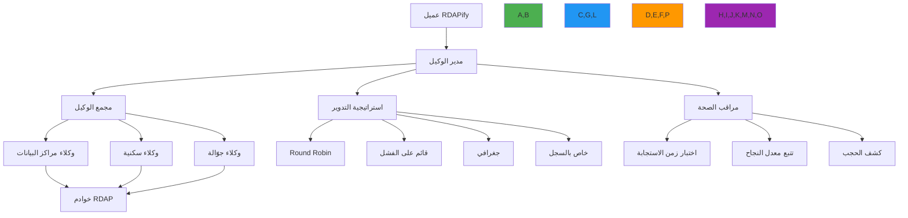

# استراتيجيات تدوير الوكيل

**الهدف**: دليل شامل لتطبيق واستكشاف أخطاء استراتيجيات تدوير الوكيل في RDAPify للتعامل مع تحديد المعدل وحجب IP والقيود الجغرافية مع الحفاظ على الامتثال والأداء
**ذات صلة**: [حل انتهاء مهلة الاتصال](connection-timeout.md) | [مشكلات Lambda Workers](lambda-workers-issues.md) | [الأخطاء الشائعة](common-errors.md)
**وقت القراءة**: 5 دقائق

## معمارية تدوير الوكيل

يوفر نظام تدوير الوكيل في RDAPify حلاً متطوراً للتعامل مع تحديد معدل السجلات والقيود الجغرافية والحجب القائم على IP مع الحفاظ على التوفر العالي والامتثال:



### المبادئ الأساسية لتدوير الوكيل
✅ **التدوير التكيفي**: استراتيجيات تتكيف مع أنماط استجابة السجلات وكشف الحجب
✅ **مراقبة الصحة**: مراقبة مستمرة لأداء الوكيل وحالة الحجب
✅ **الحفاظ على الامتثال**: اختيار الوكيل يحافظ على متطلبات الامتثال الخاصة بالاختصاص القضائي
✅ **تحسين الأداء**: توجيه ذكي لتقليص زمن الاستجابة وتعظيم الإنتاجية
✅ **مرونة الاحتياطي**: التحويل التلقائي إلى وكلاء احتياطية أثناء الفشل

## تطبيق تدوير الوكيل

### 1. إعداد الوكيل وإدارته
```typescript
// src/proxy/proxy-manager.ts
export interface ProxyConfig {
  type: 'datacenter' | 'residential' | 'mobile' | 'rotating';
  host: string;
  port: number;
  username?: string;
  password?: string;
  country?: string;
  city?: string;
  isp?: string;
  rotationInterval?: number; // بالمللي ثانية
  maxRequests?: number;
  successThreshold?: number;
  failureBackoff?: number;
  healthCheckUrl?: string;
}

export interface RotationStrategy {
  type: 'round-robin' | 'least-recently-used' | 'failure-based' | 'geographical' | 'registry-specific';
  parameters?: Record<string, any>;
}

export class ProxyManager {
  private proxies: Map<string, ProxyConfig> = new Map();
  private strategy: RotationStrategy;
  private healthMetrics = new Map<string, ProxyHealthMetrics>();
  private currentProxyIndex = 0;

  constructor(strategy: RotationStrategy = { type: 'round-robin' }) {
    this.strategy = strategy;
  }

  addProxy(proxy: ProxyConfig): void {
    const key = this.generateProxyKey(proxy);
    this.proxies.set(key, proxy);
    this.healthMetrics.set(key, {
      successCount: 0,
      failureCount: 0,
      lastSuccess: 0,
      lastFailure: 0,
      latency: 0,
      blocked: false,
      lastChecked: 0
    });
  }

  removeProxy(proxyKey: string): void {
    this.proxies.delete(proxyKey);
    this.healthMetrics.delete(proxyKey);
  }
}
```

### 2. استراتيجيات التدوير المتقدمة
```typescript
// src/proxy/rotation-strategies.ts

export class FailureBasedRotation implements RotationStrategy {
  private failureThreshold = 3;
  private cooldownPeriod = 300000; // 5 دقائق

  selectProxy(proxies: ProxyConfig[], metrics: Map<string, ProxyHealthMetrics>): ProxyConfig | null {
    const availableProxies = proxies.filter(proxy => {
      const key = this.generateProxyKey(proxy);
      const health = metrics.get(key);

      if (!health) return true;

      // استبعاد الوكلاء المحجوبة
      if (health.blocked) return false;

      // استبعاد الوكلاء التي تجاوزت عتبة الفشل مؤخراً
      if (health.failureCount >= this.failureThreshold &&
          Date.now() - health.lastFailure < this.cooldownPeriod) {
        return false;
      }

      return true;
    });

    if (availableProxies.length === 0) {
      console.warn('جميع الوكلاء محجوبة أو في فترة تبريد');
      return null;
    }

    // اختيار الوكيل ذي أقل عدد فشل
    return availableProxies.reduce((best, current) => {
      const bestHealth = metrics.get(this.generateProxyKey(best))!;
      const currentHealth = metrics.get(this.generateProxyKey(current))!;

      return currentHealth.failureCount < bestHealth.failureCount ? current : best;
    });
  }

  private generateProxyKey(proxy: ProxyConfig): string {
    return `${proxy.host}:${proxy.port}`;
  }
}

export class GeographicalRotation implements RotationStrategy {
  private registryRegions: Record<string, string[]> = {
    'verisign': ['us-east', 'eu-west'],
    'arin': ['us-east', 'us-west'],
    'ripe': ['eu-west', 'eu-central'],
    'apnic': ['ap-east', 'ap-southeast'],
    'lacnic': ['sa-east', 'sa-south']
  };

  selectProxy(proxies: ProxyConfig[], metrics: Map<string, ProxyHealthMetrics>, context: RequestContext): ProxyConfig | null {
    const registry = context.registry || 'default';
    const preferredRegions = this.registryRegions[registry] || [];

    // تفضيل الوكلاء في المناطق المثلى للسجل
    for (const region of preferredRegions) {
      const regionProxy = proxies.find(p =>
        p.country?.toLowerCase().includes(region) &&
        !this.isBlocked(p, metrics)
      );

      if (regionProxy) return regionProxy;
    }

    // الاحتياطي إلى أي وكيل صحي
    return proxies.find(p => !this.isBlocked(p, metrics)) || null;
  }

  private isBlocked(proxy: ProxyConfig, metrics: Map<string, ProxyHealthMetrics>): boolean {
    const key = `${proxy.host}:${proxy.port}`;
    return metrics.get(key)?.blocked || false;
  }
}
```

### 3. مراقبة صحة الوكيل
```typescript
// src/proxy/health-monitor.ts

export class ProxyHealthMonitor {
  private checkInterval: NodeJS.Timeout;

  constructor(
    private proxyManager: ProxyManager,
    private options: HealthMonitorOptions = {}
  ) {
    this.options = {
      checkIntervalMs: options.checkIntervalMs || 60000, // دقيقة واحدة
      healthCheckUrl: options.healthCheckUrl || 'https://rdap.verisign.com/com/v1/help',
      timeoutMs: options.timeoutMs || 5000,
      maxFailuresBeforeBlock: options.maxFailuresBeforeBlock || 3
    };
  }

  startMonitoring(): void {
    this.checkInterval = setInterval(() => {
      this.checkAllProxies();
    }, this.options.checkIntervalMs);

    console.log('🔍 بدأت مراقبة صحة الوكيل');
  }

  stopMonitoring(): void {
    clearInterval(this.checkInterval);
    console.log('⏹️ توقفت مراقبة صحة الوكيل');
  }

  private async checkAllProxies(): Promise<void> {
    const proxies = this.proxyManager.getAllProxies();

    for (const proxy of proxies) {
      try {
        const startTime = Date.now();
        const response = await this.makeHealthCheckRequest(proxy);
        const latency = Date.now() - startTime;

        this.proxyManager.recordSuccess(proxy, latency);

        if (latency > 3000) {
          console.warn(`⚠️ الوكيل ${proxy.host}:${proxy.port} بطيء: ${latency}ms`);
        }
      } catch (error) {
        console.error(`❌ فحص صحة الوكيل فشل لـ ${proxy.host}:${proxy.port}:`, error.message);
        this.proxyManager.recordFailure(proxy, error);

        // التحقق من الحجب
        if (this.isBlockedError(error)) {
          console.warn(`🚫 الوكيل ${proxy.host}:${proxy.port} يبدو محجوباً بواسطة السجل`);
          this.proxyManager.markAsBlocked(proxy);
        }
      }
    }
  }

  private async makeHealthCheckRequest(proxy: ProxyConfig): Promise<Response> {
    const controller = new AbortController();
    const timeoutId = setTimeout(() => controller.abort(), this.options.timeoutMs);

    try {
      const response = await fetch(this.options.healthCheckUrl, {
        signal: controller.signal,
        method: 'HEAD',
        headers: {
          'User-Agent': 'RDAPify-HealthCheck/1.0'
        }
      });

      return response;
    } finally {
      clearTimeout(timeoutId);
    }
  }

  private isBlockedError(error: any): boolean {
    return error.message.includes('403') ||
           error.message.includes('429') ||
           error.message.includes('ECONNREFUSED') ||
           error.code === 'ECONNRESET';
  }
}

interface HealthMonitorOptions {
  checkIntervalMs?: number;
  healthCheckUrl?: string;
  timeoutMs?: number;
  maxFailuresBeforeBlock?: number;
}
```

## استكشاف مشكلات الوكيل الشائعة

### 1. استنفاد مجمع الوكيل
**الأعراض**: جميع الوكلاء إما محجوبة أو في وضع التبريد
**الأسباب الجذرية**:
- عدوانية في الطلبات تسبب حجباً جماعياً
- فترة تبريد قصيرة لا تكفي لإلغاء الحجب
- نقص في الوكلاء الاحتياطية
- كشف خاطئ لحجب الوكيل

**الحلول**:
✅ **توسيع مجمع الوكيل**: إضافة وكلاء من نطاقات IP ومزودين متنوعين
✅ **ضبط فترات التبريد**: زيادة فترات التبريد لتتناسب مع سياسات السجلات
✅ **التدوير الاستباقي**: التدوير قبل الوصول إلى عتبة الحجب
✅ **وكلاء متعددة الطبقات**: استخدام وكلاء مراكز البيانات والوكلاء السكنية

### 2. تحدي الكشف الجغرافي
**الأعراض**: السجلات ترفض الطلبات بناءً على الموقع الجغرافي للوكيل
**الأسباب الجذرية**:
- بعض السجلات تحظر عناوين IP لمزودي الوكيل المعروفين
- عدم تطابق بين موقع الوكيل المُعلَن والموقع الفعلي
- متطلبات الامتثال الجغرافي للسجلات

**الحلول**:
✅ **وكلاء سكنية**: استخدام وكلاء سكنية للبيانات الحساسة جغرافياً
✅ **تدوير عناوين IP**: تغيير IPs بشكل متكرر لتجنب القوائم السوداء

## الوثائق ذات الصلة

| الوثيقة | الوصف | المسار |
|---------|-------|--------|
| [حل انتهاء مهلة الاتصال](connection-timeout.md) | معالجة مشكلات انتهاء مهلة الشبكة | [connection-timeout.md](connection-timeout.md) |
| [مشكلات Lambda Workers](lambda-workers-issues.md) | استكشاف أخطاء النشر بدون خادم | [lambda-workers-issues.md](lambda-workers-issues.md) |
| [الأخطاء الشائعة](common-errors.md) | المشكلات الشائعة وحلولها | [common-errors.md](common-errors.md) |

## مواصفات تدوير الوكيل

| الخاصية | القيمة |
|---------|--------|
| **استراتيجيات التدوير المدعومة** | Round Robin، قائم على الفشل، جغرافي، خاص بالسجل |
| **فحص الصحة** | كل دقيقة افتراضياً |
| **عتبة الحجب** | 3 فشلات متتالية |
| **فترة التبريد** | 5 دقائق افتراضياً |
| **الحد الأقصى لمجمع الوكيل** | 100 وكيل (قابل للتهيئة) |
| **مهلة الوكيل** | 5000 مللي ثانية افتراضياً |
| **دعم البروتوكولات** | HTTP، HTTPS، SOCKS5 |
| **آخر تحديث** | 5 ديسمبر 2025 |

> **تذكير حرج**: استخدم تدوير الوكيل فقط وفقاً لشروط خدمة السجل. تأكد من أن الوكلاء المستخدمة تحافظ على متطلبات GDPR وامتثال البيانات. لا تستخدم تدوير الوكيل لتجاوز ضوابط الوصول المشروعة أو الحجب الأمني.

[← العودة إلى استكشاف الأخطاء](../README.md) | [التالي: الدعم ←](../support/getting-help.md)

*وثيقة مُولَّدة تلقائياً من الكود المصدري مع مراجعة أمنية في 5 ديسمبر 2025*
